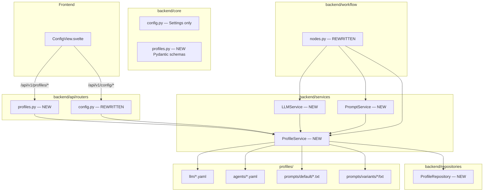

# Sprint 3: Configuration & Profile Management

## Goal

Replace the existing `ConfigManager` (YAML-based, untyped) with a structured profile system using Pydantic schemas, a dedicated `ProfileService`, and versioned YAML profile files. The system must be fully configurable without code changes.

## Architecture Overview



## What Gets Replaced

| Existing | Replacement | Reason |
|----------|-------------|--------|
| `src/core/config_manager.py` | `backend/services/profile_service.py` | Typed Pydantic schemas instead of raw dicts |
| `backend/api/routers/config.py` | `backend/api/routers/config.py` + `profiles.py` | Split: settings vs profile CRUD |
| `config/llm_profiles.yaml` | `profiles/llm/*.yaml` | One file per LLM profile |
| `config/settings.yaml` agent_profiles section | `profiles/agents/*.yaml` | One file per agent persona |
| `config/prompt_variants.yaml` | `profiles/prompts/` directory | Directory-based variants |
| Dummy workflow nodes | Real LLM calls via `litellm` | Sprint 3 goal |

## What Stays

- `backend/core/config.py` — `Settings` class (env vars, server config, DB path)
- `src/core/prompt_manager.py` — Keep as reference, but `PromptService` will replace it
- `config/settings.yaml` — Still used for non-profile settings (search, privacy, DMS, UI)

## Directory Structure (New)

```
backend/
├── core/
│   ├── config.py              # Settings only (unchanged)
│   └── profiles.py            # NEW: Pydantic profile schemas
├── services/
│   ├── __init__.py
│   ├── llm_service.py         # NEW: Profile-based LLM calls via litellm
│   ├── profile_service.py     # NEW: Profile CRUD + YAML loading
│   └── prompt_service.py      # NEW: Prompt variant management
├── repositories/
│   ├── __init__.py
│   └── profile_repo.py        # NEW: SQLite CRUD for active profiles
├── api/routers/
│   ├── config.py              # REWRITTEN: Settings + language only
│   ├── profiles.py            # NEW: LLM/Agent/Prompt profile CRUD
│   └── ...                    # (unchanged)
├── workflow/
│   └── nodes.py               # REWRITTEN: Real LLM calls
└── models/
    └── schemas.py             # EXTENDED: Profile response models

profiles/                      # NEW: Versioned YAML profiles
├── llm/
│   ├── openrouter-claude.yaml
│   ├── openrouter-gpt4.yaml
│   └── local-qwen.yaml
├── agents/
│   ├── strategist-default.yaml
│   ├── strategist-german-law.yaml
│   ├── critic-default.yaml
│   └── critic-stoic.yaml
└── prompts/
    ├── default/
    │   ├── strategist.md
    │   ├── critic.md
    │   ├── optimizer.md
    │   └── moderator.md
    └── variants/
        ├── kantian/
        │   └── strategist.md
        └── steiner/
            └── strategist.md
```

## Pydantic Schemas

### `backend/core/profiles.py`

```python
from pydantic import BaseModel, Field, field_validator
from typing import Literal, Optional, Dict, List
from enum import Enum

class LLMProvider(str, Enum):
    OPENROUTER = "openrouter"
    OPENAI = "openai"
    ANTHROPIC = "anthropic"
    LOCAL = "local"

class LLMProfile(BaseModel):
    id: str = Field(..., pattern=r"^[a-z0-9-]+$")
    name: str
    provider: LLMProvider
    model: str
    api_base: Optional[str] = None
    api_key_env: str = "OPENROUTER_API_KEY"
    max_tokens: int = 4096
    temperature: float = 0.7
    timeout: int = 120
    cost_per_1k_input: Optional[float] = None
    cost_per_1k_output: Optional[float] = None

    @field_validator("temperature")
    @classmethod
    def validate_temp(cls, v: float) -> float:
        if not 0 <= v <= 2:
            raise ValueError("Temperature must be 0-2")
        return v

class AgentPersona(BaseModel):
    id: str = Field(..., pattern=r"^[a-z0-9-]+$")
    name: str
    role: Literal["strategist", "critic", "optimizer", "moderator"]
    system_prompt: str
    llm_profile_id: str
    max_rounds: int = 5
    consensus_threshold: float = 0.9
    description: Optional[str] = None
    tags: List[str] = []

class PromptVariant(BaseModel):
    id: str = Field(..., pattern=r"^[a-z0-9-]+$")
    name: str
    base_path: str
    overrides: Dict[str, str] = {}
    description: Optional[str] = None
    parent_variant: Optional[str] = None

class ActiveConfiguration(BaseModel):
    debate_id: str
    llm_profile_id: str
    agent_personas: Dict[str, str]  # role → persona_id
    prompt_variant_id: str
    created_at: str
    estimated_cost: Optional[float] = None
    actual_cost: Optional[float] = None
```

## API Endpoints

### `backend/api/routers/profiles.py` (NEW)

| Method | Path | Description |
|--------|------|-------------|
| GET | `/api/v1/profiles/llm` | List all LLM profiles |
| GET | `/api/v1/profiles/llm/{profile_id}` | Get specific LLM profile |
| POST | `/api/v1/profiles/llm` | Create LLM profile |
| PUT | `/api/v1/profiles/llm/{profile_id}` | Update LLM profile |
| DELETE | `/api/v1/profiles/llm/{profile_id}` | Delete LLM profile |
| GET | `/api/v1/profiles/agents` | List agent personas (optional `?role=` filter) |
| GET | `/api/v1/profiles/agents/{persona_id}` | Get specific persona |
| POST | `/api/v1/profiles/agents` | Create agent persona |
| PUT | `/api/v1/profiles/agents/{persona_id}` | Update agent persona |
| DELETE | `/api/v1/profiles/agents/{persona_id}` | Delete agent persona |
| GET | `/api/v1/profiles/prompts` | List prompt variants |
| GET | `/api/v1/profiles/prompts/{variant_id}/preview` | Preview prompt for agent role |
| POST | `/api/v1/profiles/prompts` | Create prompt variant |
| DELETE | `/api/v1/profiles/prompts/{variant_id}` | Delete prompt variant |

### `backend/api/routers/config.py` (REWRITTEN — settings only)

| Method | Path | Description |
|--------|------|-------------|
| GET | `/api/v1/config/settings` | Get application settings |
| PUT | `/api/v1/config/settings` | Update settings |
| GET | `/api/v1/config/language` | Get UI language |
| PUT | `/api/v1/config/language` | Set UI language |

## Implementation Steps

### Phase 1: Foundation — Schemas & Profile Files

1. **Create `backend/core/profiles.py`** — Pydantic schemas for LLMProfile, AgentPersona, PromptVariant, ActiveConfiguration
2. **Create `profiles/` directory** with YAML files:
   - `profiles/llm/openrouter-claude.yaml`
   - `profiles/llm/openrouter-gpt4.yaml`
   - `profiles/llm/local-qwen.yaml`
   - `profiles/agents/strategist-default.yaml`
   - `profiles/agents/critic-default.yaml`
   - `profiles/agents/optimizer-default.yaml`
   - `profiles/agents/moderator-default.yaml`
   - `profiles/agents/strategist-german-law.yaml`
   - `profiles/agents/critic-stoic.yaml`
3. **Copy existing prompts** from `config/prompts/` to `profiles/prompts/default/`
4. **Create variant prompts** in `profiles/prompts/variants/kantian/` and `profiles/prompts/variants/steiner/`

### Phase 2: Services Layer

5. **Create `backend/services/__init__.py`**
6. **Create `backend/services/profile_service.py`** — Loads YAML profiles, validates with Pydantic, provides CRUD. Replaces `ConfigManager`.
7. **Create `backend/repositories/__init__.py`**
8. **Create `backend/repositories/profile_repo.py`** — SQLite storage for active configurations and profile history
9. **Create `backend/services/prompt_service.py`** — Prompt variant management with hot-reload. Replaces `PromptManager`.
10. **Create `backend/services/llm_service.py`** — Profile-based LLM calls via `litellm`. Reads API keys from env vars.

### Phase 3: API Layer

11. **Create `backend/api/routers/profiles.py`** — New router with all profile CRUD endpoints
12. **Rewrite `backend/api/routers/config.py`** — Strip profile endpoints, keep only settings + language
13. **Register profiles router** in `backend/main.py` at `/api/v1/profiles`
14. **Extend `backend/models/schemas.py`** — Add profile response models

### Phase 4: Workflow Integration

15. **Rewrite `backend/workflow/nodes.py`** — Replace dummy stubs with real LLM calls:
    - `run_agent_node` → loads persona via ProfileService, generates via LLMService
    - `check_consensus_node` → real consensus evaluation (LLM-based or heuristic)
    - `initialize_node` → loads active configuration
16. **Update `backend/workflow/state.py`** — Add `active_config` field to DebateState
17. **Update `backend/api/routers/debate.py`** — Pass profile config when creating/starting debates

### Phase 5: Frontend

18. **Rewrite `frontend/src/views/ConfigView.svelte`** — Replace placeholders with functional UI:
    - LLM profile selector with details panel
    - Agent persona selectors per role
    - Prompt variant selector with preview
    - Save configuration button
19. **Add API functions** to `frontend/src/lib/api.js` for profile endpoints

### Phase 6: Dependencies & Tests

20. **Add `litellm` to `pyproject.toml`** dependencies
21. **Write tests** in `tests/backend/test_profiles.py`:
    - Profile schema validation (temperature range, ID format)
    - ProfileService loads YAML defaults
    - Prompt preview with fallback
    - API contract tests for all profile endpoints
22. **Write tests** in `tests/backend/test_llm_service.py`:
    - LLMService with mock profile
    - Cost estimation
23. **Update existing tests** — workflow tests should use real node signatures

### Phase 7: Cleanup

24. **Delete `src/core/config_manager.py`** — replaced by ProfileService
25. **Delete `config/llm_profiles.yaml`** — replaced by `profiles/llm/*.yaml`
26. **Delete `config/prompt_variants.yaml`** — replaced by `profiles/prompts/`
27. **Update `config/settings.yaml`** — remove agent_profiles section (now in `profiles/agents/`)
28. **Update `README.md`** — document new profile system
29. **Git commit & push**

## YAML Profile Examples

### `profiles/llm/openrouter-claude.yaml`
```yaml
id: openrouter-claude
name: Claude 3.5 Sonnet via OpenRouter
provider: openrouter
model: anthropic/claude-3.5-sonnet
api_base: https://openrouter.ai/api/v1
api_key_env: OPENROUTER_API_KEY
max_tokens: 4096
temperature: 0.7
timeout: 120
cost_per_1k_input: 0.003
cost_per_1k_output: 0.015
```

### `profiles/agents/strategist-default.yaml`
```yaml
id: strategist-default
name: Default Strategist
role: strategist
system_prompt: |
  You are the Strategist agent in a multi-agent debate.
  Your role is to analyze the case and develop a comprehensive strategy.
  Provide structured, well-reasoned arguments.
llm_profile_id: openrouter-claude
max_rounds: 5
consensus_threshold: 0.9
description: Standard strategist with balanced analysis approach
tags: [default, balanced]
```

## Risk Mitigation

| Risk | Mitigation |
|------|------------|
| Breaking existing config endpoints | Rewrite config.py in place, keep same URL paths for settings |
| YAML files not found at runtime | ProfileService falls back to embedded defaults |
| litellm API key missing | LLMService raises clear error with env var name |
| Frontend ConfigView breaks | Keep existing i18n keys, add new ones |
| Existing tests break | Update test fixtures to use new service layer |
