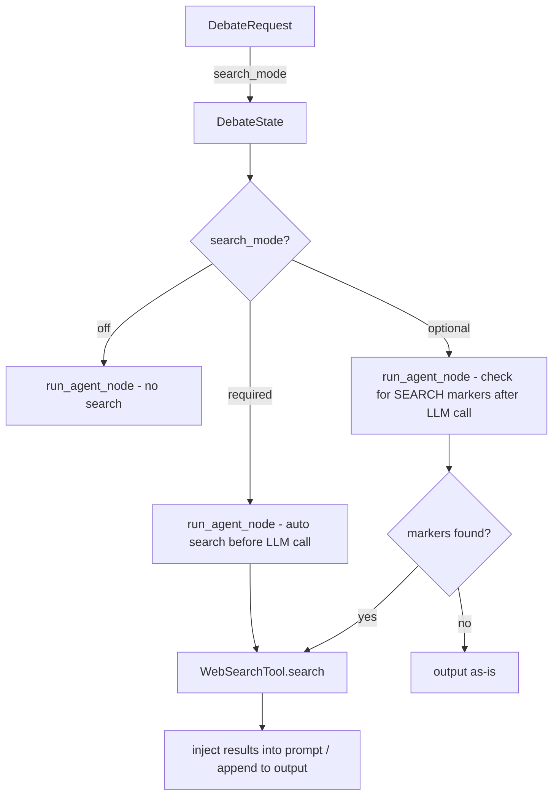

# Web Search Integration Plan

## Goal

Re-integrate web search capabilities into the Danwa debate engine. Agents should be able to research the internet during debates, with two distinct modes:

- **Required mode** (`required`): Agents automatically receive web search results before generating their response. Used for topics involving current events, factual claims, or time-sensitive information.
- **Optional mode** (`optional`): Agents can request a web search during their response by emitting a `[SEARCH: query]` marker. The system fulfills the search and appends results to the agent's output.

The default is **off** (no web search), preserving current behavior.

---

## Architecture Overview



### Key Design Decisions

1. **No graph structure change** — Search logic lives inside `run_agent_node`, not as a separate LangGraph node. This avoids conditional graph compilation and keeps the workflow simple.

2. **SearXNG as primary backend** — Port the archived `WebSearchTool` from [`src/tools/web_search.py`](src/tools/web_search.py). DuckDuckGo remains available as fallback (already in `pyproject.toml` as `duckduckgo-search>=6.0.0`).

3. **`enable_fact_check` → `search_mode`** — Replace the unused boolean with a three-value enum. Backward-compatible: `enable_fact_check: true` maps to `search_mode: "required"`.

4. **Search results are part of the debate record** — They appear in agent outputs and are visible in the timeline.

---

## Data Model Changes

### New Enum: `SearchMode`

```python
class SearchMode(StrEnum):
    OFF = "off"          # No web search (default)
    OPTIONAL = "optional"  # Agent can request search
    REQUIRED = "required"  # Automatic search before each agent
```

### Schema Changes ([`backend/models/schemas.py`](backend/models/schemas.py))

- Add `SearchMode` enum
- Add `search_mode: SearchMode = SearchMode.OFF` to `DebateRequest`
- Keep `enable_fact_check` for backward compat (deprecated, maps to `search_mode`)

### State Changes ([`backend/workflow/state.py`](backend/workflow/state.py))

- Add `search_mode: str` to `DebateState`
- Add `search_results: list[dict]` to `DebateState` (accumulated search results per round)

### Config Changes ([`backend/core/config.py`](backend/core/config.py))

- Add `searxng_url: str = "http://localhost:8080"`
- Add `searxng_max_results: int = 5`
- Add `searxng_region: str = "de-de"`

---

## Backend Implementation

### Step 1: Port WebSearchTool

Create [`backend/services/web_search.py`](backend/services/web_search.py) based on archived [`src/tools/web_search.py`](src/tools/web_search.py):

```python
class WebSearchResult(TypedDict):
    title: str
    url: str
    snippet: str
    engine: str
    date: str

class WebSearchTool:
    def __init__(self, url: str, max_results: int = 5, region: str = "de-de"):
        ...

    async def search(self, query: str) -> list[WebSearchResult]:
        """Search via SearXNG JSON API."""
        ...

    async def close(self):
        ...
```

- Use `httpx.AsyncClient` with 8s timeout (same as archived version)
- Return typed results
- Add health check method: `async def is_available(self) -> bool`

### Step 2: Add Search Logic to `run_agent_node`

Modify [`backend/workflow/nodes.py`](backend/workflow/nodes.py) `run_agent_node()`:

**Required mode** (before LLM call):
```python
if search_mode == "required":
    queries = _extract_search_queries(state, role, language)
    search_results = await _perform_searches(queries)
    # Inject into user prompt
    user_prompt += _format_search_results(search_results, language)
```

**Optional mode** (after LLM call):
```python
if search_mode == "optional":
    markers = _extract_search_markers(content)
    if markers:
        search_results = await _perform_searches(markers)
        content += _format_search_results(search_results, language)
```

### Step 3: Search Query Extraction

For **required mode**, extract search queries automatically:

```python
def _extract_search_queries(state: DebateState, role: str, language: str) -> list[str]:
    """Extract 1-3 search queries from the case context and current draft."""
    # Use the case text as the primary query
    # For moderator: also search key claims from the draft
    # Limit to 3 queries to avoid excessive API calls
```

- Strategist/Critic/Optimizer: Search the case topic (1 query)
- Moderator: Search key claims from the draft (2-3 queries)
- Use simple keyword extraction (first sentence, proper nouns) — no LLM call needed for query extraction

### Step 4: Search Marker Parsing

For **optional mode**, parse `[SEARCH: query]` markers from agent output:

```python
def _extract_search_markers(content: str) -> list[str]:
    """Extract [SEARCH: query] markers from agent output."""
    import re
    return re.findall(r'\[SEARCH:\s*(.+?)\]', content)
```

### Step 5: SSE Events

Add new SSE event type `web_search` in [`backend/workflow/nodes.py`](backend/workflow/nodes.py):

```python
await publish_async(session_id, "web_search", {
    "round": state["current_round"],
    "role": role,
    "query": query,
    "result_count": len(results),
    "results": results,  # [{title, url, snippet}]
})
```

### Step 6: Prompt Modifications

Add search instructions to system prompts based on mode:

**Required mode** — append to system prompt:
```
IMPORTANT: You have access to current web search results which are provided 
in the user message under "Web Research". You MUST incorporate and reference 
this external information in your analysis. Cite sources where possible.
```

**Optional mode** — append to system prompt:
```
You have access to web search. If you need to verify facts, find current 
information, or research specific claims, include [SEARCH: your search query] 
in your response. Each [SEARCH: ...] marker will be fulfilled and the results 
appended to your output. Use this capability sparingly and only when factual 
verification is needed.
```

These instructions are appended by `_resolve_system_prompt()` or `_append_language_instruction()` based on `search_mode`.

### Step 7: Router Integration

Modify [`backend/api/routers/debate.py`](backend/api/routers/debate.py) `_run_debate_workflow()`:

- Extract `search_mode` from request (with backward compat for `enable_fact_check`)
- Pass `search_mode` to initial state
- Initialize `WebSearchTool` instance and pass to graph (via state or dependency injection)

### Step 8: WebSearchTool Lifecycle

The `WebSearchTool` needs to be available during graph execution. Options:

- **Option A**: Store in `DebateState` as a non-serializable field (LangGraph supports this)
- **Option B**: Create a module-level singleton
- **Option C**: Create per-debate in `run_agent_node` (lazy init)

**Chosen: Option A** — Add `search_tool` to `DebateState` (TypedDict with `total=False` allows extra fields). Initialize in `_run_debate_workflow()` before graph invocation.

---

## Frontend Implementation

### Step 9: UI — Search Mode Selector

Add to the debate creation form in [`frontend/src/views/DebateView.svelte`](frontend/src/views/DebateView.svelte):

```svelte
<!-- Search mode selector -->
<div>
  <label for="search-mode" class="block text-sm font-medium text-gray-700 dark:text-gray-300 mb-1">
    {t('debate.searchMode')}
  </label>
  <select id="search-mode" bind:value={searchMode}
    class="w-full px-3 py-2 border border-gray-300 dark:border-gray-600 rounded-lg
           bg-white dark:bg-gray-700 text-gray-900 dark:text-white ...">
    <option value="off">{t('debate.searchOff')}</option>
    <option value="optional">{t('debate.searchOptional')}</option>
    <option value="required">{t('debate.searchRequired')}</option>
  </select>
  <p class="mt-1 text-xs text-gray-500 dark:text-gray-400">
    {t(`debate.searchModeHint.${searchMode}`)}
  </p>
</div>
```

Place it in the grid alongside max rounds and consensus threshold.

### Step 10: API Client Update

Update [`frontend/src/lib/api.js`](frontend/src/lib/api.js) `createDebate()`:

```javascript
export function createDebate(caseText, options = {}) {
  return request('/api/v1/debate', {
    method: 'POST',
    body: JSON.stringify({
      case: { text: caseText },
      search_mode: options.search_mode || 'off',
      ...options,
    }),
  });
}
```

### Step 11: SSE Event Handling

Add `web_search` event handler in `handleSSEEvent()`:

```javascript
// web_search — search activity feedback
if (event.query && event.result_count !== undefined) {
  liveOutputs = [...liveOutputs, {
    round: event.round,
    role: event.role,
    content: '',  // search result, not agent output
    isSearchResult: true,
    query: event.query,
    results: event.results,
    timestamp: new Date(),
  }];
}
```

### Step 12: Search Results Display

In the live timeline, render search results as a distinct card:

```svelte
{#if output.isSearchResult}
  <div class="border-l-4 border-cyan-400 bg-cyan-50 dark:bg-cyan-900/20 ...">
    <div class="flex items-center gap-2 mb-2">
      <span>🔍</span>
      <span class="text-sm font-medium">{t('search.resultsFor')}</span>
      <code class="text-xs">{output.query}</code>
    </div>
    <ul class="space-y-1">
      {#each output.results as result}
        <li class="text-xs">
          <a href={result.url} target="_blank" class="text-cyan-600 dark:text-cyan-400 hover:underline">
            {result.title}
          </a>
          <span class="text-gray-500 ml-1">{result.snippet?.substring(0, 100)}...</span>
        </li>
      {/each}
    </ul>
  </div>
{/if}
```

### Step 13: i18n Keys

Add to [`frontend/src/lib/i18n/loaders/de.js`](frontend/src/lib/i18n/loaders/de.js) and [`frontend/src/lib/i18n/loaders/en.js`](frontend/src/lib/i18n/loaders/en.js):

```javascript
// Search mode
'debate.searchMode': 'Web-Suche',           // 'Web Search'
'debate.searchOff': 'Deaktiviert',           // 'Disabled'
'debate.searchOptional': 'Optional',         // 'Optional'
'debate.searchRequired': 'Obligatorisch',    // 'Required'
'debate.searchModeHint.off': 'Keine Websuche während der Debatte.',
'debate.searchModeHint.optional': 'Agenten können bei Bedarf eine Websuche anfordern.',
'debate.searchModeHint.required': 'Agenten erhalten automatisch Websuchergebnisse vor jeder Analyse.',

// Search results display
'search.resultsFor': 'Suchergebnisse für',
'search.noResults': 'Keine Ergebnisse gefunden',
'search.source': 'Quelle',
'search.webResearch': 'Web-Recherche',
```

---

## Prompt Template Changes

### Step 14: Update Prompt Templates

Modify all prompt templates in [`profiles/prompts/default/`](profiles/prompts/default/):

**For required mode** — append to each `{role}.md` and `{role}-en.md`:
```markdown
## Web Research
You have access to current web search results provided in the user message.
You MUST incorporate and reference this external information in your analysis.
Cite sources where possible. If search results contradict your analysis, 
address the discrepancy explicitly.
```

**For optional mode** — append to each template:
```markdown
## Web Search Capability
You have access to web search. If you need to verify facts, find current 
information, or research specific claims, include [SEARCH: your search query] 
in your response. Use this sparingly — only when factual verification adds value.
```

Alternatively, these instructions can be injected programmatically by `_resolve_system_prompt()` to avoid modifying every template file. This is the preferred approach.

---

## Testing

### Step 15: Backend Tests

Create [`tests/backend/test_web_search.py`](tests/backend/test_web_search.py):

1. **Unit tests for WebSearchTool:**
   - `test_search_searxng_success` — mock httpx, verify result parsing
   - `test_search_searxng_timeout` — verify graceful failure
   - `test_search_searxng_unavailable` — verify empty result on connection error
   - `test_is_available` — health check

2. **Unit tests for search logic in nodes:**
   - `test_extract_search_queries` — verify query extraction from case text
   - `test_extract_search_markers` — verify `[SEARCH: ...]` parsing
   - `test_format_search_results` — verify prompt injection format

3. **Integration tests:**
   - `test_required_mode_injects_search_results` — mock WebSearchTool, verify results appear in agent prompt
   - `test_optional_mode_parses_markers` — mock agent output with markers, verify search triggered
   - `test_off_mode_no_search` — verify no search calls when mode is off

4. **Schema tests:**
   - `test_search_mode_enum_values`
   - `test_debate_request_search_mode_default`
   - `test_backward_compat_enable_fact_check`

### Step 16: Update Existing Tests

- Update [`tests/backend/test_workflow.py`](tests/backend/test_workflow.py) `_make_state()` to include `search_mode: "off"`
- Update [`tests/backend/test_debate_api.py`](tests/backend/test_debate_api.py) if request body changes

---

## Files to Modify

| File | Change |
|------|--------|
| [`backend/services/web_search.py`](backend/services/web_search.py) | **NEW** — Ported WebSearchTool |
| [`backend/models/schemas.py`](backend/models/schemas.py) | Add `SearchMode` enum, `search_mode` field |
| [`backend/workflow/state.py`](backend/workflow/state.py) | Add `search_mode`, `search_results` fields |
| [`backend/workflow/nodes.py`](backend/workflow/nodes.py) | Add search logic to `run_agent_node`, search helpers |
| [`backend/core/config.py`](backend/core/config.py) | Add SearXNG settings |
| [`backend/api/routers/debate.py`](backend/api/routers/debate.py) | Extract `search_mode`, init WebSearchTool |
| [`frontend/src/views/DebateView.svelte`](frontend/src/views/DebateView.svelte) | Search mode selector, search result display |
| [`frontend/src/lib/api.js`](frontend/src/lib/api.js) | Pass `search_mode` in createDebate |
| [`frontend/src/lib/i18n/loaders/de.js`](frontend/src/lib/i18n/loaders/de.js) | Search i18n keys |
| [`frontend/src/lib/i18n/loaders/en.js`](frontend/src/lib/i18n/loaders/en.js) | Search i18n keys |
| [`tests/backend/test_web_search.py`](tests/backend/test_web_search.py) | **NEW** — Search tests |
| [`tests/backend/test_workflow.py`](tests/backend/test_workflow.py) | Update state fixtures |
| [`scripts/setup_searxng.sh`](scripts/setup_searxng.sh) | Already exists, no changes needed |

---

## UX Flow

### Creating a Debate with Web Search

1. User opens Debate view
2. Fills in case description
3. Selects search mode from dropdown:
   - **Off** — Default, no icon, hint: "No web search during debate"
   - **Optional** — Globe icon, hint: "Agents can request web search if needed"
   - **Required** — Search icon, hint: "Agents automatically receive web research"
4. Creates debate → `search_mode` is sent to backend
5. Starts debate

### During Debate (Required Mode)

1. Activity Strip shows: "🔍 Recherche läuft…" (search in progress)
2. SSE `web_search` event arrives with query and results
3. Timeline shows a cyan-bordered search result card
4. Agent starts processing with search context
5. Agent output references search results

### During Debate (Optional Mode)

1. Agent generates response normally
2. If agent emits `[SEARCH: query]`, system detects it
3. Activity Strip shows: "🔍 Suche: 'query'…"
4. Search results appended to agent's output in timeline
5. Next agent sees the research in the debate context

### Archive Mode

- Search results are stored in the debate record
- When viewing archived debates, search result cards are visible in the timeline
- The `search_mode` badge is shown in the debate meta information

---

## Implementation Order

1. **Backend: WebSearchTool** — Port and adapt the search service
2. **Backend: Config** — Add SearXNG settings
3. **Backend: Schema + State** — Add SearchMode enum and fields
4. **Backend: Search logic in nodes** — Required + optional mode
5. **Backend: Router** — Wire search_mode through
6. **Backend: SSE events** — Publish web_search events
7. **Backend: Tests** — Unit + integration tests
8. **Frontend: i18n** — Add search-related translation keys
9. **Frontend: API client** — Pass search_mode
10. **Frontend: UI** — Search mode selector + result display
11. **Frontend: SSE handling** — Handle web_search events
12. **Integration test** — Full flow with mocked SearXNG
13. **Build + test + commit + push**

---

## Risk Mitigation

| Risk | Mitigation |
|------|------------|
| SearXNG not running | `WebSearchTool.is_available()` check; graceful fallback with warning SSE event |
| Search adds latency | Max 3 queries per agent; 8s timeout per query; results cached per round |
| LLM ignores search results | Explicit instructions in system prompt; results formatted prominently |
| `[SEARCH: ...]` marker in normal text | Use distinctive marker format; only parse in optional mode |
| Backward compatibility | `enable_fact_check: true` → `search_mode: "required"` mapping |
| Privacy concerns | SearXNG is self-hosted; no data leaves the network; respect `strict_mode` |
