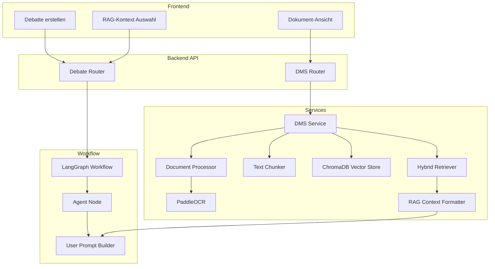
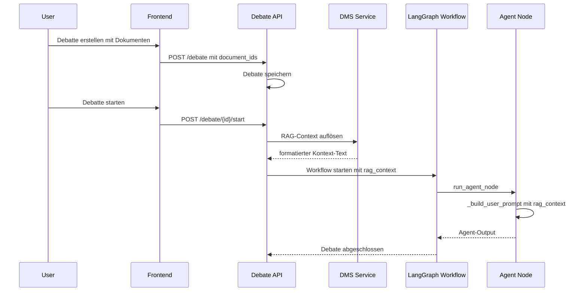
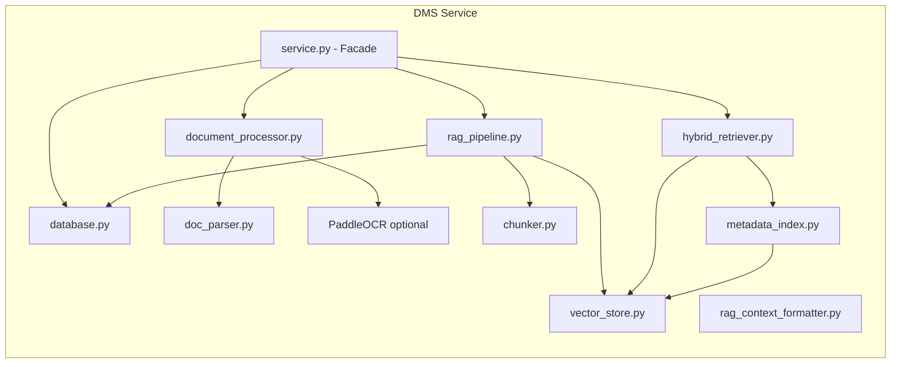

# DMS / OCR / RAG — Migration Plan

## Ziel

Migration der bestehenden DMS-, OCR- (PaddleOCR) und RAG-Komponenten aus dem Legacy-Code (`src/`) in die aktuelle Backend-Struktur (`backend/`). Alle Komponenten werden projekt-scoped betrieben. Dokumente aus dem DMS können Agenten als Ausgangsbasis/Zusatzinformationen übergeben werden. RAG-Daten stehen Agenten während einer Debatte zur Verfügung.

## Ist-Analyse

### Legacy-Komponenten (`src/dms/`)

| Datei | Klasse | Funktion | Migrieren? |
|---|---|---|---|
| `database.py` | `DMSDB` | SQLite: projects, documents, document_chunks, rag_context | ✅ → `backend/services/dms/database.py` |
| `dms.py` | `DMS` | Facade: orchestriert alle DMS-Operationen | ✅ → `backend/services/dms/service.py` |
| `document_processor.py` | `DocumentProcessor` | Datei-Verarbeitung + PaddleOCR | ✅ → `backend/services/dms/document_processor.py` |
| `chunker.py` | `TextChunker` | Token-basiertes Chunking (tiktoken) | ✅ → `backend/services/dms/chunker.py` |
| `vector_store.py` | `DMSVectorStore` | ChromaDB Vektorspeicher | ✅ → `backend/services/dms/vector_store.py` |
| `hybrid_retriever.py` | `HybridRetriever` | BM25 + Vektor-Suche + CrossEncoder Re-Ranking | ✅ → `backend/services/dms/hybrid_retriever.py` |
| `metadata_index.py` | `MetadataIndex` | ChromaDB Metadaten-Queries | ✅ → `backend/services/dms/metadata_index.py` |
| `rag_pipeline.py` | `RAGPipeline` | Document → Chunk → VectorStore Pipeline | ✅ → `backend/services/dms/rag_pipeline.py` |
| `rag_context_formatter.py` | `RAGContextFormatter` | Formatiert RAG-Chunks für LLM-Prompts | ✅ → `backend/services/dms/rag_context_formatter.py` |
| `dms_memory.py` | `DMSMemory` | High-Level RAG-Context Wrapper | ❌ Redundant — wird durch Service-Integration ersetzt |
| `project_manager.py` | `ProjectManager` | DMS-eigenes Projekt-Management | ❌ Redundant — `backend/persistence/project_store.py` existiert |
| `config.py` | — | DMS-Konfiguration Defaults | ✅ → `backend/services/dms/config.py` |
| `context_formatter.py` | — | Stub (leer) | ❌ Entfernen |

| Datei | Klasse | Funktion | Migrieren? |
|---|---|---|---|
| `src/tools/doc_parser.py` | `DocumentParser` | PDF/DOCX/ODT/Text-Parsing | ✅ → `backend/services/doc_parser.py` |

### Aktueller Backend-Stand

- **`backend/api/routers/dms.py`**: Bereits implementiert — importiert `src.dms.dms.DMS`, erstellt projekt-scoped DMS-Instanzen, Endpunkte für Upload/Delete/RAG-Add/RAG-Remove/RAG-Search funktionieren
- **`backend/workflow/state.py`**: `DebateState` hat bereits `rag_context: str` Feld
- **`backend/workflow/nodes.py`**: `_build_user_prompt()` prüft bereits `state["rag_context"]` — aber es wird immer `""` gesetzt
- **`backend/api/routers/debate.py`**: `_run_debate_workflow()` setzt `"rag_context": ""` (hardcoded)
- **`frontend/src/components/DocumentUploader.svelte`**: Placeholder — keine echte Funktion

### Kernlücke

Die DMS-API funktioniert bereits, aber es gibt **keine Verbindung zwischen DMS und dem Debate-Workflow**:
1. Kein Mechanismus um Dokumente für eine Debatte auszuwählen
2. Kein Auto-Retrieval von RAG-Context basierend auf dem Falltext
3. `rag_context` wird immer als leerer String an den Workflow übergeben
4. Frontend hat keine UI für Dokument-Management oder RAG-Kontext-Auswahl

## Ziel-Architektur



## Migrationsphasen

### Phase 1: Backend-Services migrieren

**Ziel**: Legacy-Code unter `backend/services/dms/` etablieren, saubere Imports, keine Funktionsänderungen.

#### Schritt 1.1: Verzeichnisstruktur erstellen

```
backend/services/dms/
    __init__.py
    config.py
    database.py
    service.py          ← DMS Facade (aus dms.py)
    document_processor.py
    chunker.py
    vector_store.py
    hybrid_retriever.py
    metadata_index.py
    rag_pipeline.py
    rag_context_formatter.py
```

#### Schritt 1.2: `doc_parser.py` migrieren

- `src/tools/doc_parser.py` → `backend/services/doc_parser.py`
- Imports anpassen: keine Änderung nötig (nur Standardbibliothek)

#### Schritt 1.3: DMS-Komponenten migrieren

Für jede Datei:
1. Inhalt aus `src/dms/` nach `backend/services/dms/` kopieren
2. Relative Imports (`from .database import DMSDB`) beibehalten — funktioniert innerhalb des Pakets
3. Absolute Imports (`from src.dms.xxx import ...`) → relative Imports ändern
4. `from src.tools.doc_parser import DocumentParser` → `from backend.services.doc_parser import DocumentParser`
5. `ProjectManager`-Referenzen entfernen — DMS-Service erhält `project_id` direkt
6. `DMSDB` bekommt `db_path` als Parameter (bereits in Legacy-Code vorhanden)

#### Schritt 1.4: DMS-Service-Facade anpassen

`backend/services/dms/service.py` (ehemals `dms.py`):
- Konstruktor akzeptiert `db_path` und `chroma_path` (bereits vorhanden)
- `ProjectManager`-Abhängigkeit entfernen — Projekt-Validierung übernimmt der Router
- `create_project()`, `delete_project()`, `list_projects()` entfernen (redundant)
- Alle anderen Methoden beibehalten

#### Schritt 1.5: DMS-Router aktualisieren

`backend/api/routers/dms.py`:
- Import ändern: `from src.dms.dms import DMS` → `from backend.services.dms.service import DMS`
- Rest bleibt gleich (bereits projekt-scoped)

#### Schritt 1.6: Alten Code markieren

- `src/dms/` und `src/tools/doc_parser.py` als deprecated markieren
- Noch nicht löschen — alte Tests referenzieren diesen Code

---

### Phase 2: RAG-Integration in den Debate-Workflow

**Ziel**: Agenten erhalten RAG-Kontext aus dem DMS während einer Debatte. Dokumente können bei Erstellung ODER nachträglich (vor Start) ausgewählt werden.

#### Schritt 2.1: `DebateRequest` erweitern

`backend/models/schemas.py`:
```python
class DebateRequest(BaseModel):
    # ... existing fields ...
    
    # --- DMS / RAG context ---
    document_ids: list[str] = Field(
        default_factory=list,
        description="Document IDs to include as RAG context for this debate",
    )
    rag_auto_retrieve: bool = Field(
        default=False,
        description="Auto-retrieve relevant RAG context based on case text",
    )
```

#### Schritt 2.2: Neuer Endpoint — Dokumente nachträglich zuweisen

`backend/api/routers/debate.py` — neuer Endpoint:
```python
@router.put("/{debate_id}/documents")
async def update_debate_documents(
    debate_id: str,
    body: DebateDocumentsUpdate,  # { document_ids: list[str], rag_auto_retrieve: bool }
    project_id: str = Depends(get_project_id),
) -> DebateStatusResponse:
    """Update document selection for a pending debate (before start)."""
    store = get_debate_store_for_project(project_id)
    debate = store.get(debate_id)
    if not debate:
        raise HTTPException(status_code=404, detail="Debate not found")
    if debate["status"] != DebateStatus.PENDING:
        raise HTTPException(status_code=409, detail="Can only update documents for pending debates")
    
    # Store document_ids and rag_auto_retrieve in the debate
    req = debate["request"]
    if hasattr(req, 'document_ids'):
        req.document_ids = body.document_ids
        req.rag_auto_retrieve = body.rag_auto_retrieve
    elif isinstance(req, dict):
        req["document_ids"] = body.document_ids
        req["rag_auto_retrieve"] = body.rag_auto_retrieve
    store.put(debate_id, debate)
    return ...
```

#### Schritt 2.3: RAG-Context-Auflösung in `_run_debate_workflow()`

`backend/api/routers/debate.py` — in `_run_debate_workflow()`:

```python
# --- RAG context resolution ---
rag_context_text = ""
dms = _get_dms_for_project(project_id)

# 1. Manual RAG: explicit document_ids from request
document_ids = getattr(req, 'document_ids', []) or (req.get('document_ids', []) if isinstance(req, dict) else [])
if document_ids:
    from backend.services.dms.rag_context_formatter import RAGContextFormatter
    formatter = RAGContextFormatter()
    all_chunks = []
    for doc_id in document_ids:
        chunks = dms.metadata_index.get_chunks_by_document(doc_id)
        all_chunks.extend(chunks)
    rag_context_text = formatter.format(all_chunks)

# 2. Auto-retrieve: search RAG based on case text
rag_auto = getattr(req, 'rag_auto_retrieve', False) or (req.get('rag_auto_retrieve', False) if isinstance(req, dict) else False)
if rag_auto and case_text:
    from backend.services.dms.rag_context_formatter import RAGContextFormatter
    formatter = RAGContextFormatter()
    auto_chunks = dms.auto_retrieve_for_topic(case_text[:500], project_id=project_id, k=5)
    if auto_chunks:
        rag_context_text += "\n\n" + formatter.format(auto_chunks)

initial_state = {
    # ... existing fields ...
    "rag_context": rag_context_text,  # ← now populated
}
```

#### Schritt 2.4: `_build_user_prompt()` — bereits kompatibel

Die Funktion in `backend/workflow/nodes.py` (Zeile 552) prüft bereits:
```python
if state.get("rag_context"):
    parts.append(f"## Additional Context\n{state['rag_context']}")
```
Keine Änderung nötig — der RAG-Context wird automatisch in den User-Prompt eingefügt.

#### Schritt 2.5: DMS-Import in `debate.py` reparieren

Der DMS-Router importiert bereits `src.dms.dms.DMS`. Nach Phase 1 wird dies `backend.services.dms.service.DMS`. Die `_get_dms_for_project()` Funktion muss auch in `debate.py` verfügbar sein — entweder als Shared-Funktion oder als Import aus dem DMS-Router.

**Entscheidung**: `_get_dms_for_project()` nach `backend/services/dms/service.py` als Factory-Funktion verschieben, damit sie von beiden Routern genutzt werden kann.

---

### Phase 3: Frontend — Dokument-Management

**Ziel**: UI für Upload, Liste, Löschung und RAG-Kontext-Verwaltung von Dokumenten.

#### Schritt 3.1: API-Client erweitern

`frontend/src/lib/api.js` — neue Funktionen:
```javascript
// --- DMS ---
export function getDocuments() { ... }
export function uploadDocument(file) { ... }
export function deleteDocument(documentId) { ... }
export function addDocumentToRAG(documentId) { ... }
export function removeDocumentFromRAG(documentId) { ... }
export function listManualRAG() { ... }
export function searchRAG(query, k = 5) { ... }
```

#### Schritt 3.2: Dokument-Ansicht erstellen

Neue View: `frontend/src/views/DocumentsView.svelte`
- Tabelle mit Dokumentenliste (Name, Projekt, Upload-Datum, OCR-Status, RAG-Status)
- Upload-Bereich (Drag & Drop + File Picker)
- RAG-Toggle pro Dokument (ein/aus)
- Lösch-Button mit Bestätigung

#### Schritt 3.3: Navigation erweitern

`frontend/src/components/Sidebar.svelte`:
- Neuen Nav-Eintrag hinzufügen: `{ id: 'documents', label: t('nav.documents'), icon: '📄' }`

`frontend/src/App.svelte`:
- Route `documents` → `DocumentsView` hinzufügen

#### Schritt 3.4: i18n-Keys ergänzen

`frontend/src/lib/i18n/loaders/de.js` und `en.js`:
```javascript
'nav.documents': 'Dokumente' / 'Documents',
'docs.title': 'Dokumentenverwaltung' / 'Document Management',
'docs.upload': 'Hochladen' / 'Upload',
'docs.delete': 'Löschen' / 'Delete',
'docs.ragEnabled': 'RAG aktiv' / 'RAG enabled',
'docs.ocrUsed': 'OCR verwendet' / 'OCR used',
// ... weitere Keys
```

---

### Phase 4: Frontend — RAG-Kontext bei Debatte-Erstellung und -Verwaltung

**Ziel**: Dokumente können bei Erstellung einer Debatte UND nachträglich (vor Start) als Kontext ausgewählt werden. RAG-Context ist im UI sichtbar.

#### Schritt 4.1: Dashboard — Debatte-Erstellung erweitern

`frontend/src/views/Dashboard.svelte` (oder neue Komponente `DebateCreatePanel.svelte`):
- Nach Falltext-Eingabe: Dokument-Auswahl-Panel
- Liste der projekteigenen Dokumente mit Checkboxen
- Toggle: "Automatisch relevanten Kontext abrufen" (`rag_auto_retrieve`)
- Ausgewählte `document_ids` werden an `createDebate()` übergeben

#### Schritt 4.2: DebateView — Dokumente nachträglich zuweisen

`frontend/src/views/DebateView.svelte`:
- Bei `status === 'pending'`: Dokument-Auswahl-Panel anzeigen (gleiche Komponente wie bei Erstellung)
- Speichern-Button → `PUT /debate/{id}/documents`
- Nach Start: Panel wird ausgeblendet, nur noch Anzeige

#### Schritt 4.3: `createDebate()` API-Call erweitern

`frontend/src/lib/api.js`:
```javascript
export function createDebate(caseText, options = {}) {
    return request('/api/v1/debate', {
        method: 'POST',
        body: JSON.stringify({
            case: { text: caseText },
            document_ids: options.documentIds || [],
            rag_auto_retrieve: options.ragAutoRetrieve || false,
            // ... existing options
        }),
    });
}

export function updateDebateDocuments(debateId, documentIds, ragAutoRetrieve = false) {
    return request(`/api/v1/debate/${debateId}/documents`, {
        method: 'PUT',
        body: JSON.stringify({
            document_ids: documentIds,
            rag_auto_retrieve: ragAutoRetrieve,
        }),
    });
}
```

#### Schritt 4.4: DebateView — RAG-Indikator und Kontext-Anzeige

`frontend/src/views/DebateView.svelte`:
- Badge anzeigen wenn RAG-Kontext verwendet wird (z.B. "📄 3 Dokumente als Kontext")
- Expandierbare Sektion: "Verwendeter Dokumenten-Kontext" mit den RAG-Chunk-Inhalten
- In der Debate-Status-Response muss sichtbar sein, ob RAG verwendet wurde

---

### Phase 5: Schema-Erweiterungen und RAG-Context-Limits

#### Schritt 5.1: `DebateStatusResponse` erweitern

`backend/models/schemas.py`:
```python
class DebateStatusResponse(BaseModel):
    # ... existing fields ...
    rag_document_count: int = 0
    rag_enabled: bool = False
    rag_context_preview: str = ""  # Gekürzte Vorschau des verwendeten RAG-Contexts
```

#### Schritt 5.2: Debate-Store aktualisieren

Nach Workflow-Start: `rag_document_count`, `rag_enabled` und `rag_context_preview` im Debate-Store speichern, damit sie in der Status-Response zurückgegeben werden können.

#### Schritt 5.3: RAG-Context-Limits anpassen

`backend/services/dms/rag_context_formatter.py` — `max_chars` Parameter anpassen:

**Aktuell**: `max_chars=4000` (~1.000 Tokens) — viel zu klein.

**Neu**: `max_chars=50000` als Default (~12.500 Tokens). Begründung:
- Kleinste Context-Window in den LLM-Profilen: 32.768 Tokens (lokale Modelle)
- Typisch: 128K–262K Tokens
- System-Prompt + User-Prompt + Agent-Output: ~2.000–4.000 Tokens
- RAG-Context mit 12.500 Tokens nutzt ~38% des kleinsten Context-Windows — ausreichend für mehrere Dokumente, lässt aber genug Platz
- Für größere Context-Windows (200K+) ist der Anteil vernachlässigbar

**Konfigurierbar**: `max_chars` wird aus der Projekt-Konfiguration gelesen (`ProjectConfig.rag_max_chars`), Fallback auf 50.000.

```python
class RAGContextFormatter:
    DEFAULT_MAX_CHARS = 50_000  # ~12.500 Tokens
    
    def format(self, chunks: list[dict], max_chars: int | None = None) -> str:
        effective_max = max_chars or self.DEFAULT_MAX_CHARS
        # ... existing logic with effective_max ...
```

---

### Phase 6: Testing

#### Schritt 6.1: Backend-Tests für DMS-Service

`tests/backend/test_dms_service.py`:
- DMS-Instanz-Erstellung mit Custom-Pfad
- Dokument-Upload → DB-Eintrag + Chunking + VectorStore
- Dokument-Löschung → DB + VectorStore Cleanup
- RAG-Suche mit Project-Scoping
- PaddleOCR Fallback (wenn nicht installiert)

#### Schritt 6.2: Backend-Tests für RAG-Integration

`tests/backend/test_rag_integration.py`:
- Debate-Erstellung mit `document_ids` → `rag_context` wird befüllt
- Debate-Erstellung mit `rag_auto_retrieve=True` → Auto-Retrieval
- Debate-Erstellung ohne DMS → `rag_context` bleibt leer (kein Fehler)
- RAG-Context erscheint im User-Prompt der Agenten

#### Schritt 6.3: Bestehende Tests anpassen

- Import-Pfade in alten Tests (`tests/test_dms_*.py`) müssen nicht geändert werden (Legacy-Code bleibt bestehen)
- Neue Tests unter `tests/backend/` für die migrierten Komponenten

---

## Dateisystem-Struktur nach Migration

```
backend/
    services/
        dms/
            __init__.py
            config.py              ← DMS-Konfiguration
            database.py            ← SQLite: documents, chunks
            service.py             ← DMS Facade
            document_processor.py  ← Datei-Verarbeitung + OCR
            chunker.py             ← Text-Chunking
            vector_store.py        ← ChromaDB
            hybrid_retriever.py    ← BM25 + Vektor + Re-Ranking
            metadata_index.py      ← Metadaten-Queries
            rag_pipeline.py        ← Processing Pipeline
            rag_context_formatter.py ← Formatierung für Prompts
        doc_parser.py              ← PDF/DOCX/ODT Parsing
    api/
        routers/
            dms.py                 ← geändert: Import-Pfad
            debate.py              ← geändert: RAG-Context-Auflösung
    models/
        schemas.py                 ← geändert: document_ids, rag_auto_retrieve
    workflow/
        nodes.py                   ← unverändert (bereits kompatibel)
        state.py                   ← unverändert (bereits rag_context)

frontend/
    src/
        views/
            DocumentsView.svelte   ← NEU
            Dashboard.svelte       ← geändert: Dokument-Auswahl
            DebateView.svelte      ← geändert: RAG-Indikator
        components/
            DocumentUploader.svelte ← geändert: echte Upload-Funktion
        lib/
            api.js                 ← geändert: DMS-API-Funktionen
            i18n/loaders/
                de.js              ← geändert: docs.* Keys
                en.js              ← geändert: docs.* Keys
```

## Mermaid: Datenfluss — Debatte mit RAG-Kontext



## Mermaid: DMS-Service-Architektur



## Risiken und Gegenmaßnahmen

| Risiko | Gegenmaßnahme |
|---|---|
| PaddleOCR nicht installiert | Optional-Dependency in `pyproject.toml` bereits definiert. `DocumentProcessor` hat Fallback zu `DocumentParser` |
| ChromaDB Performance bei vielen Chunks | Project-Scoping begrenzt Suchraum. Lazy-Loading der DMS-Instanzen |
| RAG-Context zu groß für LLM-Prompt | `RAGContextFormatter` Default `max_chars=50.000` (~12.500 Tokens). Konfigurierbar über `ProjectConfig.rag_max_chars` |
| Alte Tests brechen | Legacy-Code in `src/` bleibt bestehen bis alle Tests migriert sind |
| DMS-Cache wächst unbounded | `_dms_cache` im Router — später durch LRU-Cache oder Singleton ersetzen |

## Bestätigte Entscheidungen

| Frage | Entscheidung |
|---|---|
| Dokument-Auswahl pro Debatte | Bei Erstellung UND nachträglich (vor Start) — `PUT /debate/{id}/documents` Endpoint |
| Auto-Retrieve | Optional auswählbar — Toggle in der UI, Default `False` |
| RAG-Context Sichtbarkeit | Ja — Badge + expandierbare Sektion in DebateView mit den verwendeten RAG-Chunk-Inhalten |
| Maximale Context-Größe | `max_chars=50.000` Default (~12.500 Tokens). Konfigurierbar über `ProjectConfig.rag_max_chars`. Altes 4.000-Zeichen-Limit war viel zu klein |
