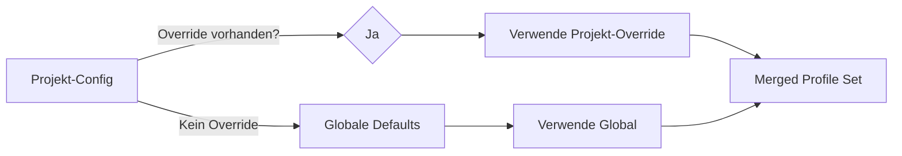

# Projekt-Isolation — Architektur-Plan

## Ziel

Einführung einer Projektverwaltung, die alle Danwa-Komponenten (Debatten, Profile, Config, DMS, Audit) projekt-spezifisch isoliert. Projekte sind die zentrale Organisationseinheit — jeder Debatten-Lauf, jedes Dokument, jede Konfiguration gehört zu genau einem Projekt.

---

## Architektur-Entscheidungen

| Entscheidung | Wahl | Begründung |
|---|---|---|
| Projekt-ID-Format | UUID v4 | Zukunftssicher, keine Kollisionen, URL-safe |
| Ohne Projekt-Kontext | Selektor erzwingen | User muss Projekt wählen/erstellen bevor er interagiert |
| Profil-Isolation | Merge: Projekt ergänzt globale, gleiche IDs → Projekt gewinnt | Flexibel, erlaubt Projekt-Overrides ohne globale Profile zu kopieren |
| DMS-Integration | DMS `ProjectManager` als Grundlage übernehmen | Vorhandene CRUD-Logik wiederverwenden |
| Config-Speicher | JSON-Datei im Projektverzeichnis | Einfach, versionierbar, menschenlesbar |
| Default-Projekt | Spezielles System-Projekt (nicht löschbar) | Migration alter Daten, Fallback |

---

## Bestandsaufnahme: Was ist aktuell global?

### Komponenten und aktueller Status

| Komponente | Aktuell | Projekt-Scoping |
|---|---|---|
| **DebateStore** | `data/debates/*.json` — global | → `data/projects/{id}/debates/*.json` |
| **AuditService** | `data/audit.db` — global, debate_id Index | → `project_id` Spalte + Composite Index |
| **ProfileRepository** | `data/profiles.db` — global | → `project_id` Spalte in active_configurations |
| **ProfileService** | `profiles/` — global YAML-Dateien | → Global + Projekt-Override Merge |
| **PromptService** | `profiles/prompts/` — global | → Global + Projekt-Override Merge |
| **Config (settings.yaml)** | `config/settings.yaml` — global | → `data/projects/{id}/config.json` |
| **SSE Event Bus** | In-Memory `dict[debate_id, queues]` | Keine Änderung nötig (debate_id ist bereits unique) |
| **WebSearchTool** | Stateless, nutzt Settings | Keine Änderung nötig (Settings aus Config) |
| **LLMService** | Stateless, nutzt ProfileService | Indirekt über ProfileService-Scoping |
| **DMS** | `memory/dms.db`, `memory/chroma_db` | → `data/projects/{id}/dms/` |
| **LangGraph Workflow** | Stateless, nutzt State | Indirekt über DebateStore-Scoping |

### Was bleibt global (shared)?

- `profiles/llm/*.yaml` — Globale LLM-Profile (Basis-Defaults)
- `profiles/agents/*.yaml` — Globale Agent-Personas (Basis-Defaults)
- `profiles/prompts/default/` — Globale Default-Prompts
- `profiles/prompts/variants/` — Globale Prompt-Varianten
- `.env` / Umgebungsvariablen — API-Keys, SearXNG-URL etc.
- `backend/core/config.py` Settings — App-weite Defaults

---

## Datenmodell

### Projekt-Entity

```python
# backend/models/project.py

class Project(BaseModel):
    id: str                          # UUID v4
    name: str                        # Anzeigename
    description: str = ""            # Optionale Beschreibung
    is_system: bool = False          # True für Default-Projekt (nicht löschbar)
    created_at: datetime
    updated_at: datetime
    config: ProjectConfig = ProjectConfig()  # Projekt-spezifische Settings
```

### Projekt-Konfiguration

```python
class ProjectConfig(BaseModel):
    """Projekt-spezifische Settings mit Fallback auf globale Defaults."""
    language: str | None = None              # None → globaler Default
    default_max_rounds: int | None = None
    default_consensus_threshold: float | None = None
    search_mode: str | None = None           # off/optional/required
    searxng_url: str | None = None           # Projekt-eigene SearXNG-Instanz
    # LLM-Profile Override (ID → LLMProfile)
    llm_profiles: dict[str, LLMProfile] = {}
    # Agent-Personas Override (ID → AgentPersona)
    agent_personas: dict[str, AgentPersona] = {}
    # Prompt-Varianten Override (Variant-ID → PromptVariant)
    prompt_variants: dict[str, PromptVariant] = {}
```

### Fallback-Kaskade

```
Projekt-Config → Globale Defaults → Runtime-Default
```

Beispiel: `project.config.language` → `settings.language` → `"de"`

Für Profile (Merge-Strategie):
```
1. Lade globale Profile aus profiles/
2. Lade Projekt-Overrides aus data/projects/{id}/config.json
3. Bei gleicher ID: Projekt gewinnt
4. Ergebnis: Kombiniertes Set aus global + projekt-spezifisch
```

---

## Dateisystem-Struktur

```
data/
├── projects/
│   ├── _default/                    # System-Projekt (Migration)
│   │   ├── project.json             # Projekt-Metadaten + Config
│   │   ├── debates/
│   │   │   ├── {debate-id}.json
│   │   │   └── ...
│   │   └── dms/
│   │       ├── dms.db
│   │       └── chroma_db/
│   ├── {project-uuid-1}/
│   │   ├── project.json
│   │   ├── debates/
│   │   │   └── ...
│   │   └── dms/
│   │       ├── dms.db
│   │       └── chroma_db/
│   └── {project-uuid-2}/
│       └── ...
├── audit.db                         # Bleibt global, bekommt project_id Spalte
└── profiles.db                      # Bleibt global, bekommt project_id Spalte

profiles/                            # Bleibt global (shared)
├── llm/
├── agents/
└── prompts/
    ├── default/
    └── variants/
```

---

## Kontext-Propagation

### Backend: FastAPI Dependency Injection

```python
# backend/api/deps.py

from fastapi import Header, HTTPException

async def get_project_id(
    x_project_id: str = Header(..., description="Active project UUID"),
) -> str:
    """Extract and validate project_id from request header."""
    store = get_project_store()
    project = store.get(x_project_id)
    if not project:
        raise HTTPException(status_code=404, detail="Project not found")
    return x_project_id
```

Alle Router-Endpunkte, die projekt-spezifisch sind, nehmen `project_id: str = Depends(get_project_id)` als Parameter.

### Frontend: Store-basiert

```javascript
// frontend/src/lib/stores.js
export const activeProject = persisted('danwa.activeProject', null);
// Speichert { id, name } des aktiven Projekts
```

Der `activeProject`-Store wird in jedem API-Call als `X-Project-Id` Header mitgesendet.

### API-Client Anpassung

```javascript
// frontend/src/lib/api.js
async function request(endpoint, options = {}) {
    const projectId = get(activeProject)?.id;
    const headers = {
        ...DEFAULT_HEADERS,
        ...(projectId ? { 'X-Project-Id': projectId } : {}),
        ...options.headers,
    };
    // ...
}
```

---

## API-Änderungen

### Neue Endpunkte

```
POST   /api/v1/projects              # Projekt erstellen
GET    /api/v1/projects              # Alle Projekte auflisten
GET    /api/v1/projects/{id}         # Projekt-Details + Config
PUT    /api/v1/projects/{id}         # Projekt aktualisieren
DELETE /api/v1/projects/{id}         # Projekt löschen (nicht _default)
GET    /api/v1/projects/{id}/config  # Projekt-Config abrufen
PUT    /api/v1/projects/{id}/config  # Projekt-Config setzen
```

### Bestehende Endpunkte — Header-basiert

Alle bestehenden Endpunkte bleiben URL-kompatibel, bekommen aber einen neuen Required-Header:

```
X-Project-Id: {uuid}
```

Ausnahmen (bleiben global):
- `GET /health`
- `GET /api/v1/system/*`
- `GET /api/v1/profiles/llm` — Listet globale Profile
- `GET /api/v1/profiles/agents` — Listet globale Personas
- `GET /api/v1/profiles/prompts` — Listet globale Varianten

### Projekt-spezifische Profile-Endpunkte

```
GET    /api/v1/projects/{id}/profiles/llm      # Globale + Projekt-Overrides (merged)
POST   /api/v1/projects/{id}/profiles/llm      # Projekt-Override erstellen
PUT    /api/v1/projects/{id}/profiles/llm/{pid} # Projekt-Override ändern
DELETE /api/v1/projects/{id}/profiles/llm/{pid} # Projekt-Override löschen
# Analog für agents und prompts
```

---

## Service-Layer Änderungen

### ProjectStore (neu)

```python
# backend/persistence/project_store.py

class ProjectStore:
    """JSON-basierter Projekt-Speicher."""

    def __init__(self, base_dir: Path = Path("data/projects")):
        self._base_dir = base_dir

    def create(self, name, description="") -> Project
    def get(self, project_id) -> Project | None
    def list_all(self) -> list[Project]
    def update(self, project_id, **kwargs) -> Project
    def delete(self, project_id) -> bool  # Verweigert für _default
    def get_or_create_default(self) -> Project  # Migration
```

### DebateStore — Projekt-Scoping

```python
class DebateStore:
    def __init__(self, project_dir: Path):
        # project_dir = data/projects/{id}/debates/
        self._data_dir = project_dir / "debates"
```

Statt eines globalen `DebateStore`-Singletons wird pro Projekt ein eigener Store instanziiert. Der `deps.py` Dependency-Injection-Mechanismus liefert den richtigen Store basierend auf `project_id`.

### AuditService — project_id Spalte

```sql
ALTER TABLE audit_events ADD COLUMN project_id TEXT NOT NULL DEFAULT '_default';
CREATE INDEX idx_audit_project ON audit_events (project_id);
CREATE INDEX idx_audit_project_debate ON audit_events (project_id, debate_id);
```

### ProfileService — Merge-Logik

```python
class ProfileService:
    def __init__(self, profile_dir: Path, project_config: ProjectConfig | None = None):
        self._global_dir = profile_dir
        self._project_config = project_config

    def get_llm_profile(self, profile_id: str) -> LLMProfile | None:
        # 1. Check project overrides first
        if self._project_config and profile_id in self._project_config.llm_profiles:
            return self._project_config.llm_profiles[profile_id]
        # 2. Fall back to global
        return self._global_cache.get(profile_id)
```

### PromptService — Projekt-Override

```python
class PromptService:
    def get_prompt(self, variant, role, language="de", project_dir=None):
        # 1. Check project-specific prompts
        if project_dir:
            project_path = project_dir / "prompts" / variant / f"{role}.md"
            if project_path.exists():
                return self._load(project_path)
        # 2. Fall back to global
        return self._load_global(variant, role, language)
```

---

## Frontend-Änderungen

### Neue Komponenten

| Komponente | Beschreibung |
|---|---|
| `ProjectSelector.svelte` | Dropdown in Sidebar — wählt aktives Projekt |
| `ProjectsView.svelte` | Neue View: Projekt-CRUD, Liste, Config |
| `ProjectSettings.svelte` | Projekt-spezifische Einstellungen (Profile, Config) |

### Geänderte Komponenten

| Komponente | Änderung |
|---|---|
| `Sidebar.svelte` | Projekt-Selector oben, "Projekte"-Nav-Item |
| `App.svelte` | Neue Route `#/projects`, `#/projects/:id/settings` |
| `Dashboard.svelte` | Zeigt nur Debatten des aktiven Projekts |
| `DebateView.svelte` | Debatten werden im aktiven Projekt erstellt |
| `ArchiveView.svelte` | Filtert nach aktivem Projekt |
| `AuditView.svelte` | Filtert nach aktivem Projekt |
| `ConfigView.svelte` | Zeigt Projekt-Config mit globalem Fallback |
| `api.js` | `X-Project-Id` Header in allen Requests |

### Routing

```
#/dashboard                    # Dashboard (projekt-gefiltert)
#/debate                       # Neue Debatte (im aktiven Projekt)
#/debate/:id                   # Debatte anzeigen
#/archive                      # Archiv (projekt-gefiltert)
#/audit                        # Audit (projekt-gefiltert)
#/config                       # Globale Config
#/projects                     # Projekt-Verwaltung (NEU)
#/projects/:id/settings        # Projekt-Settings (NEU)
```

### Onboarding

Wenn keine Projekte existieren (Fresh Install):
1. Automatisch ein `_default`-Projekt erstellen
2. User wird direkt zur Projekt-Verwaltung weitergeleitet
3. Hinweis: "Erstellen Sie Ihr erstes Projekt um zu beginnen"

Wenn Projekte existieren aber keines ausgewählt:
1. Projekt-Selektor wird hervorgehoben
2. User muss Projekt wählen bevor er interagieren kann

---

## Migration

### Schritt 1: Default-Projekt erstellen

```python
def migrate_to_projects():
    """Erstellt das _default-Projekt und verschiebt bestehende Daten."""
    store = ProjectStore()
    default = store.get_or_create_default()

    # Bestehende Debatten verschieben
    old_debates = Path("data/debates")
    new_debates = Path(f"data/projects/{default.id}/debates")
    if old_debates.exists():
        shutil.move(str(old_debates), str(new_debates))

    # Audit DB: project_id Spalte hinzufügen
    # (SQLite ALTER TABLE, idempotent)
```

### Schritt 2: Audit DB Migration

```sql
-- Idempotent: prüft ob Spalte existiert
ALTER TABLE audit_events ADD COLUMN project_id TEXT NOT NULL DEFAULT '_default';
CREATE INDEX IF NOT EXISTS idx_audit_project ON audit_events (project_id);
```

### Schritt 3: Profile Repository Migration

```sql
ALTER TABLE active_configurations ADD COLUMN project_id TEXT NOT NULL DEFAULT '_default';
ALTER TABLE configuration_history ADD COLUMN project_id TEXT NOT NULL DEFAULT '_default';
```

### Schritt 4: Alte Pfade bereinigen

Nach erfolgreicher Migration:
- `data/debates/` → leer, kann entfernt werden
- `config/settings.yaml` → wird durch Projekt-Config ersetzt

---

## Implementierungs-Reihenfolge

### Phase 1: Backend-Fundament

1. `Project`-Modell in `backend/models/project.py`
2. `ProjectStore` in `backend/persistence/project_store.py`
3. `ProjectConfig` mit Merge-Logik
4. API-Router `backend/api/routers/projects.py`
5. `get_project_id` Dependency in `backend/api/deps.py`
6. Migration-Skript für bestehende Daten

### Phase 2: Service-Layer Scoping

7. `DebateStore` — projekt-spezifische Instanziierung
8. `AuditService` — `project_id` Spalte + Filter
9. `ProfileService` — Merge-Logik (global + Projekt-Override)
10. `PromptService` — Projekt-Override-Support
11. `ProfileRepository` — `project_id` Spalte

### Phase 3: Workflow & API Integration

12. Debate-Router — `X-Project-Id` Header Required
13. Audit-Router — Projekt-Filter
14. Config-Router — Projekt-spezifische Settings
15. DMS-Router — Projekt-spezifische DMS-Instanz
16. Workflow-Nodes — Projekt-Config für Profile/Prompts

### Phase 4: Frontend

17. `activeProject` Store + API-Client Header
18. `ProjectSelector.svelte` in Sidebar
19. `ProjectsView.svelte` — CRUD-Interface
20. `ProjectSettings.svelte` — Projekt-Config
21. Dashboard/Archive/Audit — Projekt-Filterung
22. Onboarding-Flow

### Phase 5: Testing & Migration

23. Unit-Tests für ProjectStore, Merge-Logik
24. API-Tests für Projekt-Endpunkte
25. Isolationstests (Projekt A sieht Projekt B nicht)
26. Migration-Tests
27. E2E-Tests

---

## Mermaid: System-Architektur nach Projekt-Isolation

```mermaid
graph TB
    subgraph Frontend
        PS[ProjectSelector]
        PV[ProjectsView]
        API[api.js mit X-Project-Id Header]
    end

    subgraph Backend
        MW[Project Middleware]
        subgraph Routers
            PR[projects.py]
            DR[debate.py]
            AR[audit.py]
            CR[config.py]
            DMSR[dms.py]
        end
        subgraph Services
            PSvc[ProfileService mit Merge]
            PrSvc[PromptService mit Override]
        end
        subgraph Persistence
            PStore[ProjectStore]
            DStore[DebateStore pro Projekt]
            ASvc[AuditService mit project_id]
        end
    end

    subgraph Storage
        PD[data/projects/{id}/]
        GD[profiles/ global]
        DB[audit.db mit project_id]
    end

    PS --> API
    PV --> API
    API --> MW
    MW --> PR
    MW --> DR
    MW --> AR
    MW --> CR
    MW --> DMSR
    PR --> PStore
    DR --> DStore
    AR --> ASvc
    DR --> PSvc
    DR --> PrSvc
    PSvc --> GD
    PSvc --> PD
    PrSvc --> GD
    PrSvc --> PD
    PStore --> PD
    DStore --> PD
    ASvc --> DB
```

---

## Mermaid: Fallback-Kaskade für Profile



---

## Risiken und Gegenmaßnahmen

| Risiko | Gegenmaßnahme |
|---|---|
| Performance: Projekt-Store pro Request instanziieren | Caching: `lru_cache` pro project_id, Lazy-Init |
| Datenverlust bei Migration | Backup vor Migration, idempotente Migration-Skripte |
| Breaking Change: X-Project-Id Header Required | Feature-Flag: Header optional machen bis Frontend ready |
| Komplexität: Merge-Logik für Profile | Umfassende Unit-Tests, klare Dokumentation |
| DMS-Integration: Altes src/dms/ Modul | DMS wird in Phase 3+ migriert, nicht sofort |

---

## Dateien die erstellt/geändert werden müssen

### Neu erstellen

- `backend/models/project.py` — Project, ProjectConfig Modelle
- `backend/persistence/project_store.py` — ProjectStore
- `backend/api/routers/projects.py` — Projekt API
- `backend/migrations/migrate_projects.py` — Migration-Skript
- `frontend/src/components/ProjectSelector.svelte`
- `frontend/src/views/ProjectsView.svelte`
- `frontend/src/components/ProjectSettings.svelte`
- `tests/backend/test_projects.py`
- `tests/backend/test_project_isolation.py`

### Ändern

- `backend/api/deps.py` — get_project_id Dependency
- `backend/api/routers/debate.py` — X-Project-Id Header
- `backend/api/routers/audit.py` — project_id Filter
- `backend/api/routers/config.py` — Projekt-spezifische Settings
- `backend/api/routers/dms.py` — Projekt-spezifische DMS
- `backend/api/routers/profiles.py` — Projekt-Override Endpunkte
- `backend/persistence/debate_store.py` — Projekt-Scoping
- `backend/persistence/audit.py` — project_id Spalte
- `backend/services/profile_service.py` — Merge-Logik
- `backend/services/prompt_service.py` — Projekt-Override
- `backend/repositories/profile_repo.py` — project_id Spalte
- `backend/main.py` — Migration bei Startup
- `frontend/src/lib/stores.js` — activeProject Store
- `frontend/src/lib/api.js` — X-Project-Id Header
- `frontend/src/App.svelte` — Neue Routes
- `frontend/src/components/Sidebar.svelte` — ProjectSelector + Nav
- `frontend/src/views/Dashboard.svelte` — Projekt-Filter
- `frontend/src/views/ArchiveView.svelte` — Projekt-Filter
- `frontend/src/views/AuditView.svelte` — Projekt-Filter
- `frontend/src/views/ConfigView.svelte` — Projekt-Config
- `frontend/src/lib/i18n/loaders/de.js` — Projekt i18n Keys
- `frontend/src/lib/i18n/loaders/en.js` — Projekt i18n Keys
