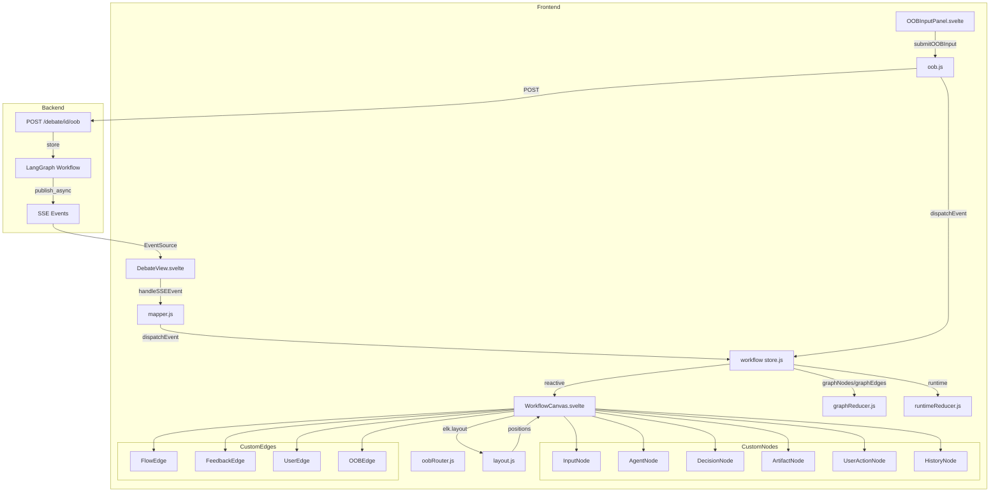
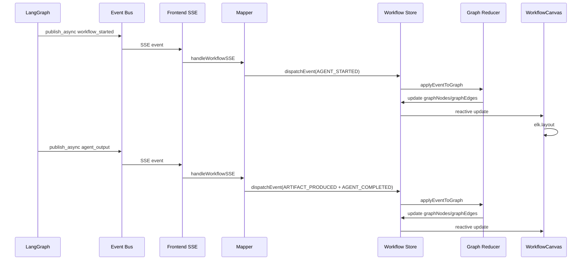
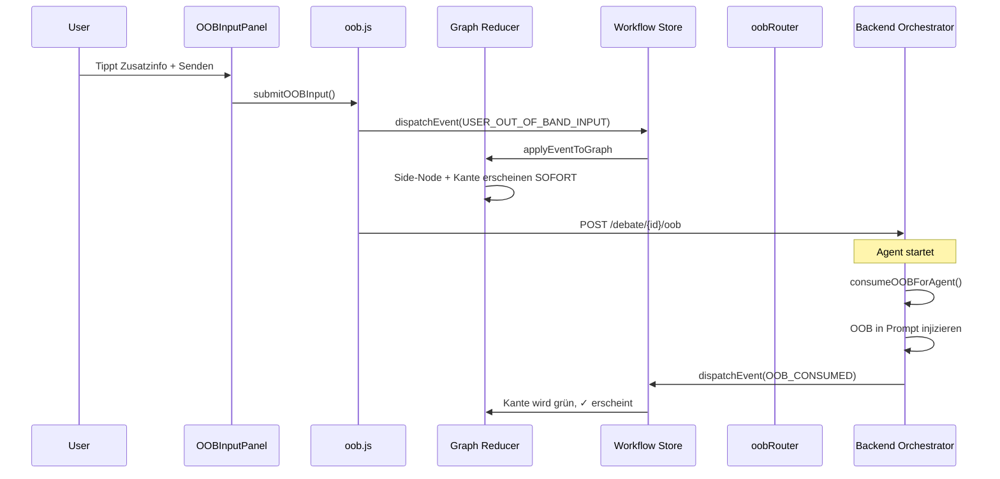

# Workflow Visualization — Implementation Plan

## Ziel

Interaktive, animierte Workflow-Visualisierung für laufende und abgeschlossene Debatten.
Zeigt den LangGraph-Workflow als gerichteten Graphen mit Echtzeit-Animation der Knoten- und Kanten-Zustände.
Inklusive Out-of-Band (OOB) Input-Handler für nicht-lineare Benutzer-Interaktionen.

## Tech Stack

| Komponente | Technologie | Begründung |
|---|---|---|
| Graph-Renderer | `@xyflow/svelte` (Svelte Flow) | Svelte-Port von React Flow — konsistent mit bestehendem Svelte 4 Frontend |
| Layout-Engine | `elkjs` + `@xyflow/svelte` elk integration | ELK.js berechnet automatische Knotenpositionierung für nicht-lineare Workflows |
| State Management | Svelte Stores (existing) | Kein zustand nötig — Svelte Stores sind bereits das State-Management des Projekts |
| Animation | CSS Transitions + Svelte reactivity | Knoten/Kanten-Statuswechsel via CSS-Klassen, Svelte reaktiv aktualisiert den Graph |

## Bestehende Architektur — Ausgangspunkt

### LangGraph Workflow (backend/workflow/debate_graph.py)

```
initialize → run_agent ⟲ (next_agent / check_consensus)
                        → check_consensus ⟲ (next_round / complete)
                        → complete → END
```

### SSE Events (bereits vorhanden)

| Event | Daten | Trigger |
|---|---|---|
| `workflow_started` | `{type, message, debate_id}` | Workflow-Engine startet |
| `agent_preparing` | `{type, phase, role, round, agent_index, agent_total}` | Agent löst Profile/Prompts auf |
| `llm_call_started` | `{type, role, model, provider, round, agent_index, agent_total}` | LLM-API-Call beginnt |
| `agent_started` | `{role, round, profile, model, provider, agent_index, agent_total}` | Agent-Ausführung startet |
| `agent_output` | `{role, round, content, tokens, tokens_in, tokens_out, duration_ms, model, profile}` | Agent-Ausgabe fertig |
| `round_update` | `{round, consensus, total_tokens}` | Runde abgeschlossen |
| `web_search` | `{round, role, query, results}` | Web-Suche durchgeführt |
| `status_change` | `{status: completed\|failed}` | Debatte beendet |

### Frontend-Architektur

- **Framework**: Svelte 4 + Vite + Tailwind CSS
- **Routing**: Hash-basiert in [`App.svelte`](frontend/src/App.svelte)
- **State**: Svelte Stores in [`stores.js`](frontend/src/lib/stores.js)
- **SSE**: [`sse.js`](frontend/src/lib/sse.js) — EventSource mit Reconnect
- **Aktuelle Workflow-Platzhalter**: [`WorkflowGraph.svelte`](frontend/src/components/WorkflowGraph.svelte) — nur Placeholder

---

## A) State Management für die Workflow-Engine

### Architektur-Überblick

```
┌─────────────────────────────────────────────────────────────┐
│                    Workflow Engine (Orchestrator)             │
│  ┌─────────┐  ┌─────────┐  ┌─────────┐  ┌─────────────┐    │
│  │ Input   │→ │Strategist│→ │ Critic  │→ │  Optimizer  │→   │
│  │ Handler │  │ Agent   │  │ Agent   │  │   Agent     │    │
│  └─────────┘  └────┬────┘  └────┬────┘  └──────┬──────┘    │
│                    └────────────┴───────────────┘            │
│                                 ↓                           │
│                         ┌─────────────┐                     │
│                         │  Moderator  │                     │
│                         └─────────────┘                     │
│                                 ↓                           │
│                    ┌─────────────────────┐                  │
│                    │   Event Emitter     │                  │
│                    │  (Graph-Mutationen)  │                  │
│                    └─────────────────────┘                  │
└─────────────────────────────────────────────────────────────┘
                              │
                              ▼
┌─────────────────────────────────────────────────────────────┐
│              Workflow Store (Svelte Stores)                   │
│  ┌──────────────┐  ┌──────────────┐  ┌──────────────────┐  │
│  │  Graph State │  │ Active State │  │  History Stack   │  │
│  │ (Nodes/Edges)│  │(Wer ist aktiv)│  │ (Runden-Snapshots)│ │
│  └──────────────┘  └──────────────┘  └──────────────────┘  │
└─────────────────────────────────────────────────────────────┘
                              │
                              ▼
┌─────────────────────────────────────────────────────────────┐
│              Workflow Visualization (Svelte Flow)             │
│         ┌─────────────┐        ┌──────────────┐             │
│         │  ELK Layout │  ←──→  │  Svelte Flow │             │
│         │  Calculator │        │   Renderer   │             │
│         └─────────────┘        └──────────────┘             │
└─────────────────────────────────────────────────────────────┘
```

### 1. Event-System (Die Sprache zwischen Engine und Viz)

Jede Zustandsänderung im Workflow wird als typisiertes Event emittiert. Die Visualisierung subscribed auf diese Events und mutiert den Graphen entsprechend.

**Datei**: [`frontend/src/lib/workflow/events.js`](frontend/src/lib/workflow/events.js)

```javascript
// Event-Typen (JSDoc statt TypeScript)
/**
 * @typedef {'AGENT_STARTED'|'AGENT_COMPLETED'|'ARTIFACT_PRODUCED'|
 *   'USER_CLARIFICATION_REQUESTED'|'USER_CLARIFICATION_RECEIVED'|
 *   'FEEDBACK_LOOP_INITIATED'|'USER_OUT_OF_BAND_INPUT'|
 *   'ROUND_COMPLETED'|'WORKFLOW_COMPLETED'|'OOB_CONSUMED'} WorkflowEventType
 */

/**
 * @typedef {Object} AgentStartedEvent
 * @property {'AGENT_STARTED'} type
 * @property {{ agentId: string, role: string, round: number,
 *   inputArtifactIds: string[], timestamp: number }} payload
 */

/**
 * @typedef {Object} AgentCompletedEvent
 * @property {'AGENT_COMPLETED'} type
 * @property {{ agentId: string, role: string, round: number,
 *   outputArtifactId: string, durationMs: number,
 *   nextAgentId?: string, decision?: 'proceed'|'retry'|'request_clarification' }} payload
 */

/**
 * @typedef {Object} ArtifactProducedEvent
 * @property {'ARTIFACT_PRODUCED'} type
 * @property {{ artifactId: string, type: 'strategy'|'critique'|'synthesis'|'consensus',
 *   producerAgentId: string, round: number, summary: string, tokenCount: number }} payload
 */

/**
 * @typedef {Object} UserClarificationRequestedEvent
 * @property {'USER_CLARIFICATION_REQUESTED'} type
 * @property {{ requestId: string, requestingAgentId: string,
 *   requestingAgentRole: string, question: string,
 *   blocking: boolean, round: number }} payload
 */

/**
 * @typedef {Object} UserClarificationReceivedEvent
 * @property {'USER_CLARIFICATION_RECEIVED'} type
 * @property {{ requestId: string, response: string,
 *   respondingToAgentId: string, round: number }} payload
 */

/**
 * @typedef {Object} FeedbackLoopInitiatedEvent
 * @property {'FEEDBACK_LOOP_INITIATED'} type
 * @property {{ loopId: string, fromAgentId: string, toAgentId: string,
 *   reason: string, round: number, iteration: number }} payload
 */

/**
 * @typedef {Object} UserOutOfBandInputEvent
 * @property {'USER_OUT_OF_BAND_INPUT'} type
 * @property {{ inputId: string, targetAgentId: string,
 *   content: string, round: number }} payload
 */

/**
 * @typedef {Object} RoundCompletedEvent
 * @property {'ROUND_COMPLETED'} type
 * @property {{ round: number, finalArtifactId: string,
 *   pathTaken: string[] }} payload
 */

/**
 * @typedef {Object} WorkflowCompletedEvent
 * @property {'WORKFLOW_COMPLETED'} type
 * @property {{ finalConsensusId: string, totalRounds: number,
 *   totalDurationMs: number }} payload
 */

/**
 * @typedef {Object} OOBConsumedEvent
 * @property {'OOB_CONSUMED'} type
 * @property {{ oobIds: string[], byAgentId: string }} payload
 */

/**
 * @typedef {AgentStartedEvent|AgentCompletedEvent|ArtifactProducedEvent|
 *   UserClarificationRequestedEvent|UserClarificationReceivedEvent|
 *   FeedbackLoopInitiatedEvent|UserOutOfBandInputEvent|
 *   RoundCompletedEvent|WorkflowCompletedEvent|OOBConsumedEvent} WorkflowEvent
 */
```

### 2. Workflow Store (Svelte Stores)

Der Store hält drei Ebenen von State: Graph (Topologie), Runtime (wer ist aktiv), History (Snapshots).

**Datei**: [`frontend/src/lib/workflow/store.js`](frontend/src/lib/workflow/store.js)

```javascript
import { writable, derived, get } from 'svelte/store';

// ─── Ebene 1: Die Topologie (wer ist mit wem verbunden) ───
export const graphNodes = writable(new Map()); // Map<nodeId, WorkflowNode>
export const graphEdges = writable(new Map()); // Map<edgeId, WorkflowEdge>

// ─── Ebene 2: Die Laufzeit (wer ist gerade aktiv) ───
export const runtime = writable({
  status: 'idle', // 'idle' | 'running' | 'waiting_for_user' | 'completed'
  currentRound: 0,
  activeNodeId: null,
  activeEdgeId: null,
  blockingUserRequestId: null,
  executionPath: [], // Chronologische Node-IDs
});

// ─── Ebene 3: Die Historie (für Zeitstrahl & Audit) ───
export const roundSnapshots = writable([]); // RoundSnapshot[]
export const eventLog = writable([]); // WorkflowEvent[] — Vollständiges Audit-Log

// ─── OOB Queue ───
export const oobQueue = writable({
  items: [], // OOBInput[]
  indexByTarget: new Map(), // Map<targetKey, OOBInput[]>
});

// ─── View Mode ───
export const viewMode = writable('current'); // 'current' | 'timeline'

// ─── Abgeleitete Stores ───

/** Svelte Flow kompatible Nodes mit Runtime-Overlay */
export const flowNodes = derived(
  [graphNodes, runtime],
  ([$nodes, $runtime]) => {
    return Array.from($nodes.values()).map(node => ({
      id: node.id,
      type: node.type,
      data: {
        ...node.data,
        isActive: $runtime.activeNodeId === node.id,
      },
      position: node.position || { x: 0, y: 0 },
      className: getNodeClassName(
        $runtime.activeNodeId === node.id ? 'active' : node.data.status
      ),
    }));
  }
);

/** Svelte Flow kompatible Edges mit Runtime-Overlay */
export const flowEdges = derived(
  [graphEdges, runtime],
  ([$edges, $runtime]) => {
    return Array.from($edges.values()).map(edge => ({
      id: edge.id,
      source: edge.source,
      target: edge.target,
      type: edge.type || 'default',
      animated: $runtime.activeEdgeId === edge.id || edge.data?.isActive,
      className: getEdgeClassName(
        $runtime.activeEdgeId === edge.id ? 'active' : edge.data?.status
      ),
      data: edge.data,
    }));
  }
);

/** Anzahl pending OOB Inputs */
export const pendingOOBCount = derived(oobQueue, ($oob) =>
  $oob.items.filter(o => o.status === 'pending').length
);

// ─── Actions ───

/**
 * Dispatch a workflow event — updates graph, runtime, and history.
 * This is the single entry point for all state mutations.
 * @param {import('./events.js').WorkflowEvent} event
 */
export function dispatchEvent(event) {
  // 1. Event ins Audit-Log
  eventLog.update(log => [...log, event]);

  // 2. Graph-Mutation
  applyEventToGraph(event);

  // 3. Runtime-Update
  applyEventToRuntime(event);

  // 4. Bei Round-Completion: Snapshot erstellen
  if (event.type === 'ROUND_COMPLETED') {
    createRoundSnapshot(event.payload.round);
  }
}

/** Reset all workflow state */
export function resetWorkflow() {
  graphNodes.set(new Map());
  graphEdges.set(new Map());
  runtime.set({
    status: 'idle', currentRound: 0, activeNodeId: null,
    activeEdgeId: null, blockingUserRequestId: null, executionPath: [],
  });
  roundSnapshots.set([]);
  eventLog.set([]);
  oobQueue.set({ items: [], indexByTarget: new Map() });
}

// ─── Helper ───

function getNodeClassName(status) {
  const map = {
    idle: 'node-idle',
    active: 'node-active',
    completed: 'node-completed',
    error: 'node-error',
    waiting: 'node-waiting',
    draft: 'node-draft',
    final: 'node-final',
    resolved: 'node-resolved',
  };
  return map[status] || 'node-idle';
}

function getEdgeClassName(status) {
  const map = {
    idle: 'edge-idle',
    active: 'edge-active',
    completed: 'edge-completed',
  };
  return map[status] || 'edge-idle';
}
```

### 3. Graph-Reducer (Event → Graph-Mutation)

Das Herzstück. Jeder Event-Typ weiß genau, wie er den Graphen verändert.

**Datei**: [`frontend/src/lib/workflow/graphReducer.js`](frontend/src/lib/workflow/graphReducer.js)

```javascript
import { graphNodes, graphEdges } from './store.js';

/**
 * Apply a workflow event to the graph state.
 * @param {import('./events.js').WorkflowEvent} event
 */
export function applyEventToGraph(event) {
  switch (event.type) {

    // ═══════════════════════════════════════════
    // AGENT_STARTED
    // ═══════════════════════════════════════════
    case 'AGENT_STARTED': {
      const { agentId, role, round, inputArtifactIds } = event.payload;

      graphNodes.update(nodes => {
        if (!nodes.has(agentId)) {
          nodes.set(agentId, {
            id: agentId,
            type: 'agent',
            data: {
              role,
              label: `${role} (Runde ${round})`,
              status: 'active',
              round,
              isActive: true,
              hasFeedbackLoop: false,
            },
          });
        } else {
          // Node existiert schon (Retry/Loop) → Status auf active
          const node = nodes.get(agentId);
          node.data.status = 'active';
          node.data.isActive = true;
          node.data.round = round;
        }
        return nodes;
      });

      // Kanten von Input-Artifacts zu diesem Agenten erstellen
      graphEdges.update(edges => {
        inputArtifactIds.forEach((artifactId, idx) => {
          const edgeId = `${artifactId}->${agentId}_${idx}`;
          edges.set(edgeId, {
            id: edgeId,
            source: artifactId,
            target: agentId,
            type: 'flow',
            data: { type: 'flow', isActive: true },
          });
        });
        return edges;
      });
      break;
    }

    // ═══════════════════════════════════════════
    // AGENT_COMPLETED
    // ═══════════════════════════════════════════
    case 'AGENT_COMPLETED': {
      const { agentId, decision } = event.payload;

      graphNodes.update(nodes => {
        const node = nodes.get(agentId);
        if (node) {
          node.data.status = 'completed';
          node.data.isActive = false;
        }
        return nodes;
      });

      // Aktive Kanten deaktivieren
      graphEdges.update(edges => {
        edges.forEach((edge) => {
          if (edge.target === agentId && edge.data?.isActive) {
            edge.data.isActive = false;
          }
        });
        return edges;
      });
      break;
    }

    // ═══════════════════════════════════════════
    // ARTIFACT_PRODUCED
    // ═══════════════════════════════════════════
    case 'ARTIFACT_PRODUCED': {
      const { artifactId, type, producerAgentId, round, summary, tokenCount } = event.payload;

      graphNodes.update(nodes => {
        nodes.set(artifactId, {
          id: artifactId,
          type: 'artifact',
          data: { artifactType: type, summary, tokenCount, status: 'draft' },
        });
        return nodes;
      });

      graphEdges.update(edges => {
        const edgeId = `${producerAgentId}->${artifactId}`;
        edges.set(edgeId, {
          id: edgeId,
          source: producerAgentId,
          target: artifactId,
          type: 'flow',
          data: { type: 'flow', isActive: false },
        });
        return edges;
      });
      break;
    }

    // ═══════════════════════════════════════════
    // USER_CLARIFICATION_REQUESTED  ←── Nichtlinear!
    // ═══════════════════════════════════════════
    case 'USER_CLARIFICATION_REQUESTED': {
      const { requestId, requestingAgentId, requestingAgentRole, question, round } = event.payload;
      const userNodeId = `user_action_${requestId}`;

      graphNodes.update(nodes => {
        nodes.set(userNodeId, {
          id: userNodeId,
          type: 'user_action',
          data: {
            actionType: 'clarify',
            label: question,
            status: 'waiting',
            requestedBy: requestingAgentRole,
            isBlocking: true,
          },
        });
        return nodes;
      });

      graphEdges.update(edges => {
        // Kante: Agent → User (gestrichelt, orange)
        const requestEdgeId = `${requestingAgentId}->${userNodeId}`;
        edges.set(requestEdgeId, {
          id: requestEdgeId,
          source: requestingAgentId,
          target: userNodeId,
          type: 'user_request',
          data: { type: 'user_request', isActive: true, label: 'Rückfrage' },
        });

        // Kante: User → Agent (vorbereitet, noch inaktiv)
        const responseEdgeId = `${userNodeId}->${requestingAgentId}`;
        edges.set(responseEdgeId, {
          id: responseEdgeId,
          source: userNodeId,
          target: requestingAgentId,
          type: 'user_response',
          data: { type: 'user_response', isActive: false, label: 'Antwort' },
        });
        return edges;
      });
      break;
    }

    // ═══════════════════════════════════════════
    // USER_CLARIFICATION_RECEIVED
    // ═══════════════════════════════════════════
    case 'USER_CLARIFICATION_RECEIVED': {
      const { requestId, respondingToAgentId } = event.payload;
      const userNodeId = `user_action_${requestId}`;

      graphNodes.update(nodes => {
        const userNode = nodes.get(userNodeId);
        if (userNode) userNode.data.status = 'resolved';
        return nodes;
      });

      graphEdges.update(edges => {
        // Request-Kante deaktivieren
        const requestEdgeId = `${respondingToAgentId}->${userNodeId}`;
        const requestEdge = edges.get(requestEdgeId);
        if (requestEdge) requestEdge.data.isActive = false;

        // Response-Kante aktivieren (kurz, für Animation)
        const responseEdgeId = `${userNodeId}->${respondingToAgentId}`;
        const responseEdge = edges.get(responseEdgeId);
        if (responseEdge) {
          responseEdge.data.isActive = true;
          setTimeout(() => { responseEdge.data.isActive = false; }, 2000);
        }
        return edges;
      });
      break;
    }

    // ═══════════════════════════════════════════
    // FEEDBACK_LOOP_INITIATED  ←── Nichtlinear!
    // ═══════════════════════════════════════════
    case 'FEEDBACK_LOOP_INITIATED': {
      const { loopId, fromAgentId, toAgentId, reason, iteration } = event.payload;

      graphEdges.update(edges => {
        const edgeId = `feedback_${loopId}_${iteration}`;
        edges.set(edgeId, {
          id: edgeId,
          source: fromAgentId,
          target: toAgentId,
          type: 'feedback',
          data: { type: 'feedback', isActive: true, label: `${reason} (Retry ${iteration})` },
        });
        return edges;
      });

      graphNodes.update(nodes => {
        const targetNode = nodes.get(toAgentId);
        if (targetNode && targetNode.type === 'agent') {
          targetNode.data.hasFeedbackLoop = true;
        }
        return nodes;
      });
      break;
    }

    // ═══════════════════════════════════════════
    // USER_OUT_OF_BAND_INPUT  ←── Nichtlinear!
    // ═══════════════════════════════════════════
    case 'USER_OUT_OF_BAND_INPUT': {
      const { inputId, targetAgentId, content, round } = event.payload;
      const sideNodeId = `side_input_${inputId}`;

      graphNodes.update(nodes => {
        // Side-Input-Node (klein, am Rand)
        nodes.set(sideNodeId, {
          id: sideNodeId,
          type: 'user_action',
          data: {
            actionType: 'provide_context',
            label: content.length > 40 ? content.substring(0, 40) + '...' : content,
            fullContent: content,
            status: 'resolved',
            requestedBy: 'user',
            isBlocking: false,
            isOOB: true,
          },
        });

        // Wenn Ziel-Agent noch nicht existiert → Placeholder
        if (!nodes.has(targetAgentId)) {
          nodes.set(`pending_target_${targetAgentId}`, {
            id: `pending_target_${targetAgentId}`,
            type: 'placeholder',
            data: { label: 'Wartet auf Agent...', role: targetAgentId.split('_')[0] },
          });
        }
        return nodes;
      });

      graphEdges.update(edges => {
        const actualTargetId = get(graphNodes).has(targetAgentId)
          ? targetAgentId
          : `pending_target_${targetAgentId}`;

        const edgeId = `${sideNodeId}->${actualTargetId}`;
        edges.set(edgeId, {
          id: edgeId,
          source: sideNodeId,
          target: actualTargetId,
          type: 'user_response',
          data: { type: 'user_response', isActive: true, label: 'Zusatzinfo', isOOB: true },
        });
        return edges;
      });
      break;
    }

    // ═══════════════════════════════════════════
    // OOB_CONSUMED
    // ═══════════════════════════════════════════
    case 'OOB_CONSUMED': {
      const { oobIds, byAgentId } = event.payload;

      graphEdges.update(edges => {
        edges.forEach((edge) => {
          if (edge.data?.isOOB && oobIds.some(id => edge.source.includes(id))) {
            edge.data.isActive = false;
            edge.data.isConsumed = true;
          }
        });
        return edges;
      });
      break;
    }

    // ═══════════════════════════════════════════
    // ROUND_COMPLETED
    // ═══════════════════════════════════════════
    case 'ROUND_COMPLETED': {
      const { round } = event.payload;

      graphNodes.update(nodes => {
        nodes.forEach((node) => {
          if (node.data?.round === round && node.type === 'artifact') {
            node.data.status = 'final';
          }
        });
        return nodes;
      });
      break;
    }

    default:
      break;
  }
}
```

### 4. Runtime-Reducer (Wer ist gerade aktiv?)

**Datei**: [`frontend/src/lib/workflow/runtimeReducer.js`](frontend/src/lib/workflow/runtimeReducer.js)

```javascript
import { runtime } from './store.js';

/**
 * Apply a workflow event to the runtime state.
 * @param {import('./events.js').WorkflowEvent} event
 */
export function applyEventToRuntime(event) {
  switch (event.type) {

    case 'AGENT_STARTED': {
      runtime.update(r => ({
        ...r,
        status: 'running',
        activeNodeId: event.payload.agentId,
        activeEdgeId: null,
        executionPath: [...r.executionPath, event.payload.agentId],
      }));
      break;
    }

    case 'AGENT_COMPLETED': {
      runtime.update(r => ({
        ...r,
        activeNodeId: null,
      }));
      break;
    }

    case 'USER_CLARIFICATION_REQUESTED': {
      runtime.update(r => ({
        ...r,
        status: 'waiting_for_user',
        blockingUserRequestId: event.payload.requestId,
        activeNodeId: `user_action_${event.payload.requestId}`,
      }));
      break;
    }

    case 'USER_CLARIFICATION_RECEIVED': {
      runtime.update(r => ({
        ...r,
        status: 'running',
        blockingUserRequestId: null,
        activeNodeId: null,
      }));
      break;
    }

    case 'ROUND_COMPLETED': {
      runtime.update(r => ({
        ...r,
        currentRound: event.payload.round + 1,
        activeNodeId: null,
        activeEdgeId: null,
      }));
      break;
    }

    case 'WORKFLOW_COMPLETED': {
      runtime.update(r => ({
        ...r,
        status: 'completed',
        activeNodeId: null,
        activeEdgeId: null,
      }));
      break;
    }
  }
}
```

### 5. Snapshot-System (Historie für Zeitstrahl)

**Datei**: [`frontend/src/lib/workflow/snapshot.js`](frontend/src/lib/workflow/snapshot.js)

```javascript
import { get } from 'svelte/store';
import { graphNodes, graphEdges, runtime, roundSnapshots } from './store.js';

/**
 * Create a deep-copy snapshot of the current graph state for a round.
 * Used for timeline view and audit trail.
 * @param {number} roundNumber
 */
export function createRoundSnapshot(roundNumber) {
  const nodes = get(graphNodes);
  const edges = get(graphEdges);
  const rt = get(runtime);

  const nodesSnapshot = Array.from(nodes.values()).map(n => ({
    ...n,
    data: { ...n.data, isActive: false, status: 'completed' },
  }));

  const edgesSnapshot = Array.from(edges.values()).map(e => ({
    ...e,
    data: { ...e.data, isActive: false },
  }));

  const snapshot = {
    round: roundNumber,
    title: `Runde ${roundNumber}`,
    nodes: nodesSnapshot,
    edges: edgesSnapshot,
    executionPath: [...rt.executionPath],
    completedAt: Date.now(),
  };

  roundSnapshots.update(snaps => [...snaps, snapshot]);

  // Execution Path für neue Runde zurücksetzen
  runtime.update(r => ({ ...r, executionPath: [] }));
}
```

### 6. Bridge: Store → Svelte Flow (Synchronisation)

Der Viz-Layer subscribed auf den Store und konvertiert die Map-Struktur in Svelte-Flow-kompatible Arrays.

**Datei**: [`frontend/src/lib/workflow/useWorkflowGraph.js`](frontend/src/lib/workflow/useWorkflowGraph.js)

```javascript
import { derived } from 'svelte/store';
import { flowNodes, flowEdges, runtime, dispatchEvent } from './store.js';
import { applyLayout } from './layout.js';

/**
 * Derived store that provides everything needed by WorkflowCanvas.
 * Automatically triggers ELK layout when topology changes.
 */
export const workflowGraph = derived(
  [flowNodes, flowEdges, runtime],
  ([$nodes, $edges, $runtime]) => {
    // Trigger layout recalculation when node/edge count changes
    // (debounced inside applyLayout)
    applyLayout($nodes, $edges);

    return {
      nodes: $nodes,
      edges: $edges,
      status: $runtime.status,
      currentRound: $runtime.currentRound,
      dispatchEvent,
    };
  }
);
```

### 7. Beispiel: Ein kompletter nichtlinearer Durchlauf

```
Timeline der Events:
─────────────────────────────────────────────────────────
T0  USER_INPUT          → Input-Node erstellt
T1  AGENT_STARTED       → Strategist leuchtet auf
T2  ARTIFACT_PRODUCED   → Strategy-Node erscheint
T3  AGENT_STARTED       → Critic leuchtet auf
T4  ARTIFACT_PRODUCED   → Critique-Node erscheint
T5  AGENT_COMPLETED     → Critic: decision = "request_clarification"
T6  USER_CLARIFICATION_REQUESTED → User-Action-Node + orange Kante
    [Workflow pausiert – runtime.status = 'waiting_for_user']

    ←── User gibt Antwort im UI ──→

T7  USER_CLARIFICATION_RECEIVED → User-Node resolved, grüne Kante blinkt
T8  AGENT_STARTED       → Critic (wieder) leuchtet auf
T9  AGENT_COMPLETED     → Critic: decision = "proceed"
T10 AGENT_STARTED       → Optimizer leuchtet auf
...
```

### 8. SSE → Event Mapping

**Datei**: [`frontend/src/lib/workflow/mapper.js`](frontend/src/lib/workflow/mapper.js)

```javascript
import { dispatchEvent } from './store.js';

/**
 * Map incoming SSE events to workflow events and dispatch them.
 * Called from DebateView's handleSSEEvent().
 *
 * @param {Object} sseEvent - Raw SSE event from backend
 */
export function handleWorkflowSSE(sseEvent) {
  switch (sseEvent.type) {

    case 'workflow_started':
      // Initialize graph with input node
      dispatchEvent({
        type: 'AGENT_STARTED',
        payload: {
          agentId: 'input',
          role: 'input',
          round: 0,
          inputArtifactIds: [],
          timestamp: Date.now(),
        },
      });
      break;

    case 'agent_preparing':
      // Agent is resolving profile/prompts — show as active
      dispatchEvent({
        type: 'AGENT_STARTED',
        payload: {
          agentId: `${sseEvent.role}_r${sseEvent.round}`,
          role: sseEvent.role,
          round: sseEvent.round,
          inputArtifactIds: getInputArtifacts(sseEvent.role, sseEvent.round),
          timestamp: Date.now(),
        },
      });
      break;

    case 'agent_output':
      // Agent completed — produce artifact
      const artifactId = `${sseEvent.role}_output_r${sseEvent.round}`;
      dispatchEvent({
        type: 'ARTIFACT_PRODUCED',
        payload: {
          artifactId,
          type: mapRoleToArtifactType(sseEvent.role),
          producerAgentId: `${sseEvent.role}_r${sseEvent.round}`,
          round: sseEvent.round,
          summary: sseEvent.content?.substring(0, 100) || '',
          tokenCount: sseEvent.tokens || 0,
        },
      });
      dispatchEvent({
        type: 'AGENT_COMPLETED',
        payload: {
          agentId: `${sseEvent.role}_r${sseEvent.round}`,
          role: sseEvent.role,
          round: sseEvent.round,
          outputArtifactId: artifactId,
          durationMs: sseEvent.duration_ms || 0,
        },
      });
      break;

    case 'round_update':
      dispatchEvent({
        type: 'ROUND_COMPLETED',
        payload: {
          round: sseEvent.round,
          finalArtifactId: `moderator_output_r${sseEvent.round}`,
          pathTaken: [], // Will be filled from executionPath
        },
      });
      break;

    case 'status_change':
      if (sseEvent.status === 'completed' || sseEvent.status === 'failed') {
        dispatchEvent({
          type: 'WORKFLOW_COMPLETED',
          payload: {
            finalConsensusId: 'final',
            totalRounds: sseEvent.round || 0,
            totalDurationMs: 0,
          },
        });
      }
      break;
  }
}

function getInputArtifacts(role, round) {
  if (round === 1 && role === 'strategist') return ['input'];
  // For subsequent agents in same round, use previous agent's output
  const roles = ['strategist', 'critic', 'optimizer', 'moderator'];
  const idx = roles.indexOf(role);
  if (idx > 0) return [`${roles[idx - 1]}_output_r${round}`];
  // For first agent of new round, use previous round's moderator output
  return [`moderator_output_r${round - 1}`];
}

function mapRoleToArtifactType(role) {
  const map = {
    strategist: 'strategy',
    critic: 'critique',
    optimizer: 'synthesis',
    moderator: 'consensus',
  };
  return map[role] || 'synthesis';
}
```

---

## B) Out-of-Band (OOB) Input-Handler

Das Feature, das Danwa von einem rein sequenziellen System zu einem echten interaktiven Debate-System macht.

### Problem

Der User liest während der Ausführung die Zwischenergebnisse (z.B. die Strategy) und denkt: "Ich habe vergessen, dass wir Compliance-Regel X beachten müssen."

### Anforderungen

- Input soll sofort abgesetzt werden können (nicht warten bis der Agent fertig ist)
- Der laufende Agent soll nicht unterbrochen werden
- Die Info soll an einen bestimmten Ziel-Agenten (oder alle) geroutet werden
- Wenn der Ziel-Agent schon fertig ist, soll die Info in der nächsten Runde oder an den Nachfolger weitergegeben werden
- In der Visualisierung muss das als "Side-Injection" erscheinen

### Architektur: Der OOB-Bus

```
┌─────────────────────────────────────────────────────────────┐
│                         User UI                              │
│  ┌─────────────────┐      ┌─────────────────────────────┐  │
│  │  Chat-Interface │      │  "Zusatzinfo einfügen"       │  │
│  │  (zeigt Logs)   │      │  [Textarea]                  │  │
│  └─────────────────┘      │  [An: ▼ Strategist] [Senden] │  │
│                           └─────────────────────────────┘  │
└─────────────────────────────────────────────────────────────┘
                              │
                              ▼
┌─────────────────────────────────────────────────────────────┐
│                    OOB Input Bus (Queue)                     │
│  ┌─────────────────────────────────────────────────────┐    │
│  │  Queue: [{targetAgent, content, timestamp, urgency}] │    │
│  │  • Non-blocking                                      │    │
│  │  • Thread-safe (Agenten laufen async)                │    │
│  └─────────────────────────────────────────────────────┘    │
└─────────────────────────────────────────────────────────────┘
                              │
              ┌───────────────┼───────────────┐
              ▼               ▼               ▼
        ┌──────────┐   ┌──────────┐   ┌──────────┐
        │Strategist│   │ Critic   │   │ Optimizer│
        │(arbeitet)│   │(wartet)  │   │(wartet)  │
        └──────────┘   └──────────┘   └──────────┘
                              │
                              ▼
┌─────────────────────────────────────────────────────────────┐
│              Orchestrator (OOB-Consumer)                     │
│  Vor jedem Agenten-Start: "Gibt es OOB-Input für mich?"    │
└─────────────────────────────────────────────────────────────┘
```

### 1. OOB-Datenmodell & Queue

**Datei**: [`frontend/src/lib/workflow/oob.js`](frontend/src/lib/workflow/oob.js)

```javascript
import { get } from 'svelte/store';
import { oobQueue, graphNodes, runtime, dispatchEvent } from './store.js';

/**
 * @typedef {'append'|'inject_now'|'override_context'} OOBUrgency
 *
 * @typedef {Object} OOBTarget
 * @property {'specific_agent'|'next_agent'|'all_future'|'current_active'} type
 * @property {string} [agentRole] - For specific_agent
 * @property {number} [round] - For specific_agent
 * @property {string} [currentAgentRole] - For next_agent
 * @property {number} [fromRound] - For all_future
 *
 * @typedef {Object} OOBInput
 * @property {string} id
 * @property {string} content
 * @property {OOBTarget} target
 * @property {number} timestamp
 * @property {OOBUrgency} urgency
 * @property {'pending'|'consumed'|'stale'} status
 * @property {string} [consumedBy]
 * @property {number} [consumedAt]
 */

/**
 * Submit an OOB input to the queue.
 * Immediately emits USER_OUT_OF_BAND_INPUT event for visualization.
 * @param {Omit<OOBInput, 'id'|'timestamp'|'status'>} input
 * @returns {string} The OOB input ID
 */
export function submitOOBInput(input) {
  const id = `oob_${Date.now()}_${Math.random().toString(36).substr(2, 9)}`;
  const newOOB = {
    ...input,
    id,
    timestamp: Date.now(),
    status: 'pending',
  };

  oobQueue.update(q => {
    q.items.push(newOOB);

    // Index aktualisieren für schnelles Lookup
    const key = getOOBIndexKey(newOOB.target);
    if (!q.indexByTarget.has(key)) {
      q.indexByTarget.set(key, []);
    }
    q.indexByTarget.get(key).push(newOOB);

    return q;
  });

  // Sofort Event emittieren für die Visualisierung
  dispatchEvent({
    type: 'USER_OUT_OF_BAND_INPUT',
    payload: {
      inputId: id,
      targetAgentId: resolveTargetAgentId(input.target),
      content: input.content,
      round: get(runtime).currentRound,
    },
  });

  return id;
}

/**
 * Consume all pending OOB inputs for a specific agent at a given round.
 * @param {string} agentRole
 * @param {number} round
 * @returns {OOBInput[]}
 */
export function consumeOOBForAgent(agentRole, round) {
  const q = get(oobQueue);
  const relevant = [];

  // 1. Spezifisch für diesen Agenten in dieser Runde
  const specificKey = `specific:${agentRole}:${round}`;
  relevant.push(...(q.indexByTarget.get(specificKey) || []));

  // 2. "Next agent" – wenn der vorherige Agent diesen als Ziel hatte
  const prevRole = getPreviousRole(agentRole);
  const nextKey = `next:${prevRole}`;
  relevant.push(...(q.indexByTarget.get(nextKey) || []));

  // 3. "All future" ab dieser Runde
  q.items.forEach((item) => {
    if (item.target.type === 'all_future'
        && item.target.fromRound <= round
        && item.status === 'pending') {
      relevant.push(item);
    }
  });

  // 4. "Current active"
  const currentKey = 'current:any';
  relevant.push(...(q.indexByTarget.get(currentKey) || []));

  // Duplikate entfernen und nur Pending
  const unique = Array.from(new Map(relevant.map(o => [o.id, o])).values())
    .filter(o => o.status === 'pending');

  return unique;
}

/**
 * Mark an OOB input as consumed by a specific agent.
 * @param {string} oobId
 * @param {string} agentId
 */
export function markOOBConsumed(oobId, agentId) {
  oobQueue.update(q => {
    const oob = q.items.find(o => o.id === oobId);
    if (oob) {
      oob.status = 'consumed';
      oob.consumedBy = agentId;
      oob.consumedAt = Date.now();
    }
    return q;
  });
}

/**
 * Get count of pending OOB inputs.
 * @returns {number}
 */
export function getPendingOOBCount() {
  return get(oobQueue).items.filter(o => o.status === 'pending').length;
}

/**
 * Mark stale OOB inputs (older than threshold).
 * @param {number} olderThanMs
 */
export function clearStaleOOB(olderThanMs) {
  const cutoff = Date.now() - olderThanMs;
  oobQueue.update(q => {
    q.items.forEach(o => {
      if (o.status === 'pending' && o.timestamp < cutoff) {
        o.status = 'stale';
      }
    });
    return q;
  });
}

// ─── Helpers ───

function getOOBIndexKey(target) {
  switch (target.type) {
    case 'specific_agent': return `specific:${target.agentRole}:${target.round || 'any'}`;
    case 'next_agent': return `next:${target.currentAgentRole}`;
    case 'all_future': return `future:${target.fromRound}`;
    case 'current_active': return 'current:any';
    default: return 'unknown';
  }
}

function resolveTargetAgentId(target) {
  const nodes = get(graphNodes);
  if (target.type === 'specific_agent') {
    const found = Array.from(nodes.values())
      .filter(n => n.type === 'agent' && n.data.role === target.agentRole)
      .sort((a, b) => b.data.round - a.data.round);
    return found[0]?.id || `pending_${target.agentRole}`;
  }
  return 'pending_dynamic';
}

function getPreviousRole(role) {
  const order = ['strategist', 'critic', 'optimizer', 'moderator'];
  const idx = order.indexOf(role);
  return idx > 0 ? order[idx - 1] : 'input';
}
```

### 2. OOB Router (Race-Condition-Handling)

**Datei**: [`frontend/src/lib/workflow/oobRouter.js`](frontend/src/lib/workflow/oobRouter.js)

```javascript
import { get } from 'svelte/store';
import { graphNodes, runtime } from './store.js';

/**
 * Route an OOB input to the correct target, handling race conditions.
 *
 * | Szenario                          | Verhalten                                          |
 * | --------------------------------- | -------------------------------------------------- |
 * | OOB kommt vor Agent-Start         | Input wird gequeued und beim Start injiziert        |
 * | OOB kommt während Agent läuft     | Input wird gequeued; Agent bekommt es beim nächsten Check |
 * | OOB kommt nach Agent-Fertig       | Input wird an den nächsten Agenten weitergeleitet   |
 * | OOB für Agent, der nie kommt      | Nach Timeout als "stale" markiert                   |
 *
 * @param {import('./oob.js').OOBInput} oob
 * @returns {import('./oob.js').OOBTarget} Resolved target
 */
export function routeOOB(oob) {
  const rt = get(runtime);
  const nodes = get(graphNodes);

  switch (oob.target.type) {
    case 'specific_agent': {
      const targetRole = oob.target.agentRole;
      const targetRound = oob.target.round || rt.currentRound;
      const agentNodeId = `${targetRole}_r${targetRound}`;
      const agentNode = nodes.get(agentNodeId);

      if (!agentNode) {
        // Agent existiert noch nicht → Queue für später
        return oob.target;
      }

      if (agentNode.data.status === 'completed') {
        // Agent ist schon fertig → Weiterleiten an Nachfolger
        return { type: 'next_agent', currentAgentRole: targetRole };
      }

      // Agent läuft oder wartet → Direkte Zustellung
      return oob.target;
    }

    case 'current_active': {
      if (rt.activeNodeId && rt.status === 'running') {
        const role = extractRoleFromId(rt.activeNodeId);
        return {
          type: 'specific_agent',
          agentRole: role,
          round: rt.currentRound,
        };
      }
      // Niemand aktiv → an den nächsten in der Pipeline
      return { type: 'next_agent', currentAgentRole: 'input' };
    }

    default:
      return oob.target;
  }
}

function extractRoleFromId(nodeId) {
  // e.g. "strategist_r2" → "strategist"
  const match = nodeId.match(/^(\w+)_r\d+$/);
  return match ? match[1] : nodeId;
}
```

### 3. Orchestrator-Integration (OOB-Consumer)

Die Backend-Orchestrator-Logik prüft vor jedem Agenten-Start auf pending OOB-Inputs.

**Backend-Integration** (in [`backend/workflow/nodes.py`](backend/workflow/nodes.py)):

```python
# In run_agent_node(), vor dem LLM-Call:

# 1. OOB-Input für diesen Agenten sammeln (via SSE → Frontend → API)
#    → Frontend submitOOBInput() → POST /api/v1/debate/{id}/oob
#    → Backend speichert in debate store
#    → run_agent_node liest OOB-Queue vor dem LLM-Call

# 2. Kontext anreichern
oob_inputs = get_oob_for_agent(state, role, round)
if oob_inputs:
    enriched_context = base_context + "\n\n--- ZUSÄTZLICHER KONTEXT (User) ---\n"
    enriched_context += "\n".join(f"- {oob['content']}" for oob in oob_inputs)
```

**Neuer Backend-Endpoint** (in [`backend/api/routers/debate.py`](backend/api/routers/debate.py)):

```python
@router.post("/{debate_id}/oob")
async def submit_oob_input(debate_id: str, body: OOBInputBody):
    """Submit an out-of-band input for a running debate."""
    # Store OOB input in debate's OOB queue
    # Emit SSE event for visualization
    # Return confirmation
```

### 4. UI-Komponente für OOB-Input

**Datei**: [`frontend/src/components/workflow/OOBInputPanel.svelte`](frontend/src/components/workflow/OOBInputPanel.svelte)

```svelte
<script>
  import { runtime, pendingOOBCount } from '../../lib/workflow/store.js';
  import { submitOOBInput } from '../../lib/workflow/oob.js';

  let content = '';
  let targetRole = 'next';
  let urgency = 'append';

  const roles = [
    { value: 'next', label: 'An nächsten Agenten' },
    { value: 'strategist', label: 'Strategist' },
    { value: 'critic', label: 'Critic' },
    { value: 'optimizer', label: 'Optimizer' },
    { value: 'moderator', label: 'Moderator' },
    { value: 'current_active', label: 'Wer gerade arbeitet' },
  ];

  function handleSubmit() {
    if (!content.trim()) return;

    const target = targetRole === 'next'
      ? { type: 'next_agent', currentAgentRole: getCurrentRole() }
      : { type: 'specific_agent', agentRole: targetRole, round: $runtime.currentRound };

    submitOOBInput({ content, target, urgency });
    content = '';
  }

  function getCurrentRole() {
    if (!$runtime.activeNodeId) return 'input';
    const match = $runtime.activeNodeId.match(/^(\w+)_r\d+$/);
    return match ? match[1] : 'input';
  }

  $: isVisible = $runtime.status === 'running' || $runtime.status === 'waiting_for_user';
</script>

{#if isVisible}
  <div class="fixed bottom-5 right-5 w-80 bg-white dark:bg-gray-800 rounded-xl
              shadow-lg border border-gray-200 dark:border-gray-700 p-4 z-50">
    <div class="flex items-center gap-2 mb-3">
      <span class="text-lg">💬</span>
      <span class="font-semibold text-sm">Zusatzinfo einfügen</span>
      {#if $pendingOOBCount > 0}
        <span class="ml-auto bg-amber-500 text-white text-xs px-2 py-0.5 rounded-full">
          {$pendingOOBCount} pending
        </span>
      {/if}
    </div>

    <textarea
      bind:value={content}
      placeholder="Zusätzlicher Kontext, der sofort berücksichtigt werden soll..."
      class="w-full min-h-[80px] p-2.5 rounded-lg border border-gray-300 dark:border-gray-600
             text-sm resize-y mb-2.5 bg-white dark:bg-gray-700 dark:text-gray-100"
    ></textarea>

    <div class="flex gap-2 mb-2.5">
      <select bind:value={targetRole}
              class="flex-1 p-1.5 rounded-md text-sm border border-gray-300 dark:border-gray-600
                     bg-white dark:bg-gray-700 dark:text-gray-100">
        {#each roles as role}
          <option value={role.value}>{role.label}</option>
        {/each}
      </select>

      <select bind:value={urgency}
              class="flex-1 p-1.5 rounded-md text-sm border border-gray-300 dark:border-gray-600
                     bg-white dark:bg-gray-700 dark:text-gray-100">
        <option value="append">Anhängen</option>
        <option value="inject_now">Sofort einfügen</option>
      </select>
    </div>

    <button
      on:click={handleSubmit}
      disabled={!content.trim()}
      class="w-full py-2.5 rounded-lg font-semibold text-white transition-colors
             {content.trim() ? 'bg-blue-500 hover:bg-blue-600' : 'bg-gray-300 cursor-not-allowed'}"
    >
      In Workflow einfügen
    </button>

    {#if $runtime.status === 'waiting_for_user'}
      <div class="mt-2.5 p-2 bg-orange-50 dark:bg-orange-900/20 rounded-md text-xs text-orange-700 dark:text-orange-300">
        ⚠️ Workflow wartet auf deine Antwort. Zusatzinfo wird nach der Antwort verarbeitet.
      </div>
    {/if}
  </div>
{/if}
```

### 5. Visualisierung: OOB-Edge Styling

**Datei**: [`frontend/src/components/workflow/edges/OOBEdge.svelte`](frontend/src/components/workflow/edges/OOBEdge.svelte)

```svelte
<script>
  import { getBezierPath } from '@xyflow/svelte';

  export let id;
  export let sourceX;
  export let sourceY;
  export let targetX;
  export let targetY;
  export let data = {};

  $: isConsumed = data?.isConsumed;
  $: isStale = data?.isStale;
  $: [path] = getBezierPath({ sourceX, sourceY, targetX, targetY });
  $: strokeColor = isStale ? '#9ca3af' : isConsumed ? '#10b981' : '#f59e0b';
</script>

<g>
  <!-- Haupt-Pfad -->
  <path
    d={path}
    fill="none"
    stroke={strokeColor}
    stroke-width={isConsumed ? 2 : 3}
    stroke-dasharray={isConsumed ? 'none' : '8 4'}
    opacity={isStale ? 0.4 : 1}
  />

  <!-- Animation für Pending -->
  {#if !isConsumed && !isStale}
    <path
      d={path}
      fill="none"
      stroke="#f59e0b"
      stroke-width={3}
      stroke-dasharray="12 8"
      class="animate-oob-flow"
    />
  {/if}

  <!-- Label -->
  {#if data?.label}
    <text
      x={(sourceX + targetX) / 2}
      y={(sourceY + targetY) / 2 - 10}
      text-anchor="middle"
      class="text-[11px] font-semibold"
      fill={isStale ? '#9ca3af' : '#d97706'}
    >
      {data.label}{isConsumed ? ' ✓' : ''}
    </text>
  {/if}
</g>

<style>
  @keyframes oob-flow {
    from { stroke-dashoffset: 20; }
    to { stroke-dashoffset: 0; }
  }
  .animate-oob-flow {
    animation: oob-flow 1.5s linear infinite;
  }
</style>
```

### 6. Edge Cases & Lösungen

| Edge Case | Lösung |
|---|---|
| User schickt 5 OOBs in 2 Sekunden | Queue sammelt alle; Agent bekommt alle auf einmal als Bullet-List |
| OOB für Agent in Runde 1, wir sind in Runde 3 | Router leitet an aktuelle Runde weiter oder markiert als "stale" |
| OOB während Blocking (User muss erst antworten) | Input wird gequeued; nach User-Antwort wird OOB verarbeitet |
| OOB mit "inject_now" aber Agent unterstützt kein Streaming | Fallback auf "append" für nächsten Durchlauf |
| Netzwerk-Lag: OOB kommt verspätet an | Timestamp prüfen; wenn Agent schon fertig → an Nachfolger |

---

## Graph-Datenmodell

### Knotentypen

| Typ | ID-Pattern | Beschreibung | Farbe |
|---|---|---|---|
| `input` | `input` | Eingabe-Knoten — Debatte-Text / Case | Blau |
| `agent` | `agent-{role}-{round}` | Agent-Ausführung (strategist, critic, optimizer, moderator) | Grün |
| `user_action` | `user-{action}` | Benutzer-Aktion (start, cancel, clarify, provide_context) | Gelb |
| `decision` | `decision-{round}` | Konsens-Prüfung nach jeder Runde | Orange |
| `artifact` | `artifact-{round}` | Runden-Ergebnis / Draft | Lila |
| `history` | `history-{round}` | Abgeschlossene Runde (Timeline-Ansicht) | Grau |
| `round_container` | `round-{n}` | ELK-Container für Runde n (Gruppierung) | Transparent |
| `placeholder` | `pending_target-{role}` | Temporärer Platzhalter für OOB-Ziele | Grau gestrichelt |

### Kantentypen

| Typ | Beschreibung | Style |
|---|---|---|
| `flow` | Normaler Workflow-Fluss | Durchgezogen, Pfeil |
| `feedback` | Konsens-Schleife — nächste Runde | Gestrichelt, Pfeil |
| `user_request` | Benutzer startet Aktion / Agent fragt User | Gestrichelt, orange |
| `user_response` | Benutzer antwortet / OOB-Input | Gestrichelt, grün/blau |
| `loopback` | Agent → Decision → nächster Agent | Gebogen, Pfeil |

### ELK.js Layout-Konfiguration

```javascript
const elkOptions = {
  'elk.algorithm': 'layered',
  'elk.direction': 'RIGHT',
  'elk.layered.spacing.nodeNodeBetweenLayers': '80',
  'elk.spacing.nodeNode': '40',
  'elk.layered.nodePlacement.strategy': 'BRANDES_KOEPF',
  'elk.layered.crossingMinimization.strategy': 'LAYER_SWEEP',
  'elk.partitioning.activate': 'true',  // für round_container
};
```

### ELK-Hierarchie

```
root
├── input-node
├── round-container-1
│   ├── agent-strategist-1
│   ├── agent-critic-1
│   ├── agent-optimizer-1
│   ├── agent-moderator-1
│   └── decision-1
├── round-container-2
│   ├── agent-strategist-2
│   ├── ...
│   └── decision-2
└── complete-node
```

---

## Implementierungs-Schritte

### Phase 1: Dependencies & Projektstruktur

- [ ] 1.1: `@xyflow/svelte` und `elkjs` in `frontend/package.json` installieren
- [ ] 1.2: Verzeichnisstruktur erstellen:
  ```
  frontend/src/lib/workflow/
  ├── events.js         # Event-Typ-Definitionen (JSDoc)
  ├── store.js          # Workflow State Store (Svelte Stores)
  ├── graphReducer.js   # Event → Graph-Mutation
  ├── runtimeReducer.js # Event → Runtime-Update
  ├── snapshot.js       # Runden-Snapshots für Timeline
  ├── mapper.js         # SSE-Event → Workflow-Event Mapping
  ├── layout.js         # ELK.js Layout-Engine
  ├── oob.js            # OOB Input Queue & Actions
  ├── oobRouter.js      # OOB Race-Condition Router
  └── useWorkflowGraph.js # Bridge: Store → Svelte Flow
  frontend/src/components/workflow/
  ├── WorkflowCanvas.svelte      # Hauptkomponente — Svelte Flow Container
  ├── OOBInputPanel.svelte       # OOB Input UI
  ├── nodes/
  │   ├── InputNode.svelte       # Eingabe-Knoten
  │   ├── AgentNode.svelte       # Agent-Ausführung
  │   ├── DecisionNode.svelte    # Konsens-Prüfung
  │   ├── ArtifactNode.svelte    # Runden-Ergebnis
  │   ├── UserActionNode.svelte  # Benutzer-Aktion
  │   └── HistoryNode.svelte     # Abgeschlossene Runde
  ├── edges/
  │   ├── FlowEdge.svelte        # Normaler Fluss
  │   ├── FeedbackEdge.svelte    # Schleifen-Kante
  │   ├── UserEdge.svelte        # Benutzer-Interaktion
  │   └── OOBEdge.svelte         # OOB Side-Injection
  └── panels/
      ├── NodeDetailPanel.svelte # Detail-Ansicht bei Klick
      └── TimelinePanel.svelte   # Runden-Timeline
  ```

### Phase 2: Event-System & Workflow Store

- [ ] 2.1: [`events.js`](frontend/src/lib/workflow/events.js) — Event-Typ-Definitionen mit JSDoc
- [ ] 2.2: [`store.js`](frontend/src/lib/workflow/store.js) — Svelte Stores für Graph, Runtime, History, OOB
- [ ] 2.3: [`graphReducer.js`](frontend/src/lib/workflow/graphReducer.js) — Event → Node/Edge Mutationen
- [ ] 2.4: [`runtimeReducer.js`](frontend/src/lib/workflow/runtimeReducer.js) — Event → Runtime-Status
- [ ] 2.5: [`snapshot.js`](frontend/src/lib/workflow/snapshot.js) — Runden-Snapshots

### Phase 3: SSE → Workflow Mapping

- [ ] 3.1: [`mapper.js`](frontend/src/lib/workflow/mapper.js) — SSE-Event → Workflow-Event Mapping
- [ ] 3.2: [`useWorkflowGraph.js`](frontend/src/lib/workflow/useWorkflowGraph.js) — Bridge Store → Svelte Flow

### Phase 4: ELK.js Layout-Engine

- [ ] 4.1: [`layout.js`](frontend/src/lib/workflow/layout.js) — ELK.js Wrapper
- [ ] 4.2: Graph-Hierarchie aufbauen (round_container als ELK-Parent-Nodes)
- [ ] 4.3: Layout-Berechnung mit `elk.layout()` — gibt Positionen zurück
- [ ] 4.4: Positionen in Svelte Flow Nodes übertragen

### Phase 5: Custom Nodes

- [ ] 5.1: [`InputNode.svelte`](frontend/src/components/workflow/nodes/InputNode.svelte) — Case-Text Eingabe
- [ ] 5.2: [`AgentNode.svelte`](frontend/src/components/workflow/nodes/AgentNode.svelte) — Agent mit Rolle, Profil, Status-Animation
- [ ] 5.3: [`DecisionNode.svelte`](frontend/src/components/workflow/nodes/DecisionNode.svelte) — Konsens-Score, Threshold-Indikator
- [ ] 5.4: [`ArtifactNode.svelte`](frontend/src/components/workflow/nodes/ArtifactNode.svelte) — Runden-Draft, Token-Zähler
- [ ] 5.5: [`UserActionNode.svelte`](frontend/src/components/workflow/nodes/UserActionNode.svelte) — Benutzer-Interaktion
- [ ] 5.6: [`HistoryNode.svelte`](frontend/src/components/workflow/nodes/HistoryNode.svelte) — Kompakte Darstellung abgeschlossener Runden

### Phase 6: Custom Edges

- [ ] 6.1: [`FlowEdge.svelte`](frontend/src/components/workflow/edges/FlowEdge.svelte) — Standard-Kante mit Animation
- [ ] 6.2: [`FeedbackEdge.svelte`](frontend/src/components/workflow/edges/FeedbackEdge.svelte) — Gestrichelte Schleifen-Kante
- [ ] 6.3: [`UserEdge.svelte`](frontend/src/components/workflow/edges/UserEdge.svelte) — Benutzer-Interaktions-Kante
- [ ] 6.4: [`OOBEdge.svelte`](frontend/src/components/workflow/edges/OOBEdge.svelte) — OOB Side-Injection Kante

### Phase 7: Hauptkomponente — WorkflowCanvas

- [ ] 7.1: [`WorkflowCanvas.svelte`](frontend/src/components/workflow/WorkflowCanvas.svelte) erstellen
  - Svelte Flow Container mit `@xyflow/svelte`
  - Custom Node/Edge Types registrieren
  - Store-Subscriptions für reaktive Updates
  - ELK-Layout bei Strukturänderung neu berechnen
  - FitView nach Layout-Berechnung
- [ ] 7.2: [`NodeDetailPanel.svelte`](frontend/src/components/workflow/panels/NodeDetailPanel.svelte) — Detail-Ansicht bei Knoten-Klick
- [ ] 7.3: [`TimelinePanel.svelte`](frontend/src/components/workflow/panels/TimelinePanel.svelte) — Runden-Timeline

### Phase 8: OOB Input Handler

- [ ] 8.1: [`oob.js`](frontend/src/lib/workflow/oob.js) — OOB Queue, Submit, Consume, Mark
- [ ] 8.2: [`oobRouter.js`](frontend/src/lib/workflow/oobRouter.js) — Race-Condition Router
- [ ] 8.3: [`OOBInputPanel.svelte`](frontend/src/components/workflow/OOBInputPanel.svelte) — OOB Input UI
- [ ] 8.4: Backend-Endpoint `POST /debate/{id}/oob` für OOB-Input
- [ ] 8.5: Backend-Integration in `run_agent_node()` — OOB-Queue vor LLM-Call prüfen

### Phase 9: Integration in DebateView

- [ ] 9.1: [`WorkflowGraph.svelte`](frontend/src/components/WorkflowGraph.svelte) ersetzen — Wrapper um WorkflowCanvas
- [ ] 9.2: SSE-Event-Handler in [`DebateView.svelte`](frontend/src/views/DebateView.svelte) erweitern — Events an mapper.js weiterleiten
- [ ] 9.3: Graph-Initialisierung bei Debate-Start (Knoten erstellen, Layout berechnen)
- [ ] 9.4: Graph-Reset bei neuem Debate-Start
- [ ] 9.5: Archiv-Modus — abgeschlossene Debate im read-only Modus anzeigen
- [ ] 9.6: OOBInputPanel in DebateView einbinden

### Phase 10: Styling & Animation

- [ ] 10.1: CSS-Animationen für Knoten-Status-Übergänge (idle → active → completed)
- [ ] 10.2: Kanten-Animation (animated dash für aktive Kanten)
- [ ] 10.3: Dark Mode Support (Tailwind dark: Klassen)
- [ ] 10.4: Responsive Layout — Mindestbreite, Zoom-Controls
- [ ] 10.5: OOB-Edge Animation (oobFlow keyframes)

### Phase 11: i18n

- [ ] 11.1: Neue i18n-Keys für Workflow-UI in [`en.js`](frontend/src/lib/i18n/loaders/en.js) und [`de.js`](frontend/src/lib/i18n/loaders/de.js)
- [ ] 11.2: Knoten-Beschriftungen, Status-Texte, Tooltips, OOB-Panel

### Phase 12: Testing

- [ ] 12.1: Unit-Tests für Workflow Store (graphReducer, runtimeReducer)
- [ ] 12.2: Unit-Tests für OOB Queue & Router
- [ ] 12.3: Unit-Tests für ELK Layout Engine
- [ ] 12.4: Unit-Tests für SSE → Store Mapper
- [ ] 12.5: E2E-Tests — Workflow-Graph sichtbar bei laufender Debate
- [ ] 12.6: E2E-Tests — OOB Input wird in Graph angezeigt
- [ ] 12.7: Visual Regression Tests für Knoten-/Kanten-Rendering

---

## Mermaid: Komponenten-Architektur



## Mermaid: SSE-Event-Flow



## Mermaid: OOB-Flow



## Performance-Überlegungen

- **ELK-Layout**: Nur bei Strukturänderung neu berechnen (neue Runde, neuer Agent), nicht bei Status-Updates
- **Svelte Reactivity**: Nur betroffene Knoten/Kanten aktualisieren, nicht gesamten Graph neu rendern
- **Debounce**: ELK-Layout-Berechnung debouncen wenn mehrere Events schnell hintereinander kommen
- **Virtualisierung**: Bei > 5 Runden: History-Nodes zu kompakten Timeline-Items zusammenfassen
- **requestAnimationFrame**: Animation-Updates über rAF schedulen
- **OOB Queue**: Index-Map für O(1) Lookup statt O(n) Filter bei jedem Agenten-Start

## Offene Fragen

- [ ] Soll der Graph auch für abgeschlossene Debatten im Archiv-Modus interaktiv sein (Zoom, Pan, Klick)?
- [ ] Maximale Rundenanzahl bevor Graph-Performance leidet?
- [ ] Soll der Graph exportierbar sein (PNG, SVG)?
- [ ] Backend OOB-Endpoint: Soll OOB-Input in der Debate-Persistenz gespeichert werden?
