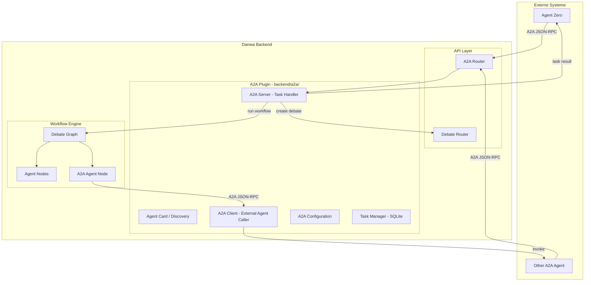

# A2A Protocol Integration — Implementation Plan

## Status: Ready for Implementation

## Key Design Decisions
- **Transport**: httpx-basierte JSON-RPC 2.0 Implementierung (kein `a2a-sdk`)
- **Task Manager**: SQLite-persistent (nach AuditService-Pattern: `sqlite3`, `CREATE TABLE IF NOT EXISTS`, thread-safe)
- **Streaming**: Nur Request-Response + Polling initial (kein SSE-Streaming für A2A)
- **Auth**: Keine Authentifizierung (lokales Netzwerk)
- **Frontend**: Phase 7 optional/deferred

## Architecture



## Module Structure

```
backend/a2a/
├── __init__.py              # Plugin-Modul
├── agent_card.py            # Agent Card Definition & Discovery
├── server.py                # A2A Server - Task Handler
├── client.py                # A2A Client - External Agent Caller
├── schemas.py               # A2A-spezifische Pydantic Models
├── config.py                # A2A-Konfiguration (enabled, external agents)
├── router.py                # FastAPI Router für A2A Endpoints
├── task_manager.py          # Task State Management (SQLite-persistent)
└── node.py                  # LangGraph Node für A2A Agent als Debattenteilnehmer
```

## Integration Points in Existing Code

| File | Change |
|------|--------|
| `backend/main.py` | Register A2A router |
| `backend/models/schemas.py` | Add A2AAgentConfig, extend DebateRequest |
| `backend/workflow/state.py` | Add a2a_config to DebateState |
| `backend/workflow/debate_graph.py` | Add build_graph_with_a2a() |
| `backend/api/routers/debate.py` | Extend _run_debate_workflow() |

## Phases

### Phase 1: Project Structure & Dependencies
- 1.1 Create `backend/a2a/` module directory with `__init__.py`
- 1.2 Create `config/a2a.json` default configuration file
- 1.3 Verify httpx is already in dependencies

### Phase 2: A2A Schemas & Config
- 2.1 Implement `backend/a2a/schemas.py`
- 2.2 Implement `backend/a2a/config.py`
- 2.3 Implement `backend/a2a/agent_card.py`

### Phase 3: Task Manager (SQLite-persistent)
- 3.1 Implement `backend/a2a/task_manager.py` — SQLite-backed, following AuditService pattern
- 3.2 Write tests: `tests/backend/test_a2a_task_manager.py`

### Phase 4: A2A Server (Funktion 1)
- 4.1 Implement `backend/a2a/server.py`
- 4.2 Implement `backend/a2a/router.py`
- 4.3 Register router in `backend/main.py`
- 4.4 Write tests: `tests/backend/test_a2a_server.py`

### Phase 5: A2A Client (Funktion 2)
- 5.1 Implement `backend/a2a/client.py`
- 5.2 Write tests: `tests/backend/test_a2a_client.py`

### Phase 6: LangGraph Node & Workflow Integration
- 6.1 Implement `backend/a2a/node.py`
- 6.2 Extend `backend/models/schemas.py`
- 6.3 Extend `backend/workflow/state.py`
- 6.4 Extend `backend/workflow/debate_graph.py`
- 6.5 Extend `backend/api/routers/debate.py`
- 6.6 Write integration tests: `tests/backend/test_a2a_workflow.py`

### Phase 7: Frontend (Optional / Deferred)
- 7.1 Extend debate form with A2A config
- 7.2 A2A node visualization

### Phase 8: E2E Testing
- 8.1 External agent → Danwa debate → result
- 8.2 Danwa debate with A2A participant
- 8.3 A2A protocol compliance validation

### Phase 9: Documentation
- 9.1 README update
- 9.2 config/a2a.json documentation
