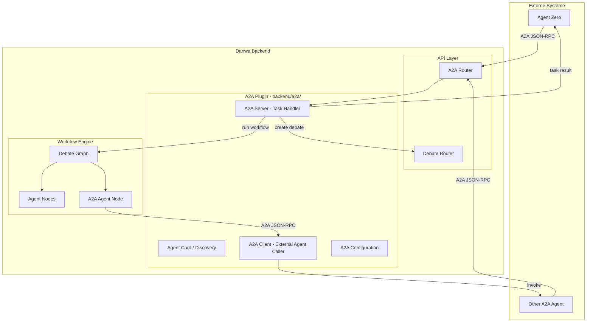
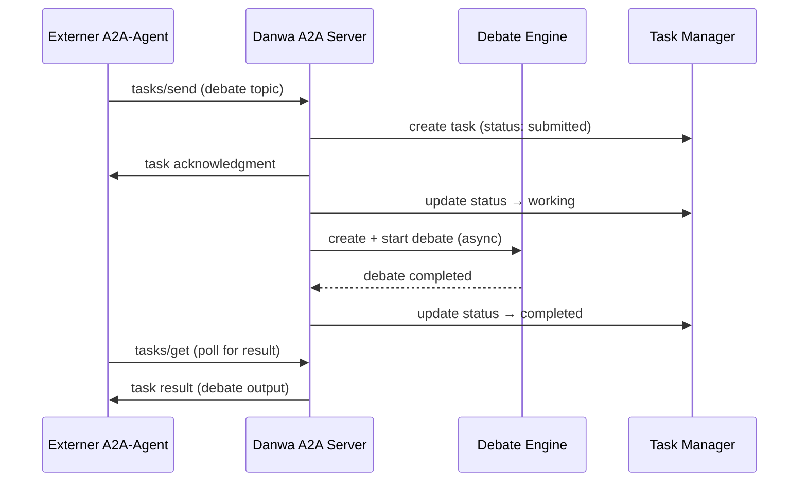
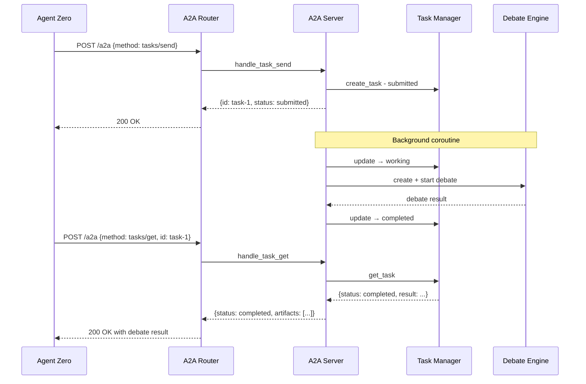
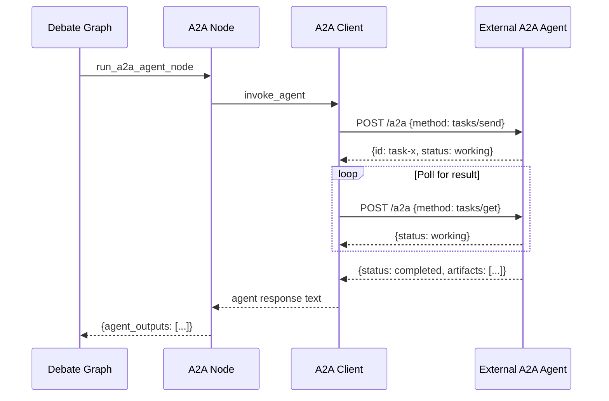

# A2A Protocol Integration for Danwa

## Ziel

Integration des Agent2Agent (A2A) Protokolls in Danwa als **zusätzlichen Eingabe-/Ausgabekanal**. Danwa wird sowohl als **A2A Server** (externe Agenten können Danwa-Debatten starten) als auch als **A2A Client** (Danwa kann externe A2A-Agenten als zusätzliche Debattenteilnehmer einbinden) implementiert.

## Funktionen

### Funktion 1: A2A als Debatten-Initiator (Danwa = A2A Server)

Externe A2A-Agenten (z.B. Agent Zero) können Danwa-Debatten starten und die Ergebnisse als langlaufende Aufgabe empfangen.

```
Externer A2A-Agent → A2A Server [Danwa] → LangGraph Workflow → Ergebnis zurück
```

### Funktion 2: A2A als Debatten-Teilnehmer (Danwa = A2A Client)

Danwa bindet externe A2A-Agenten als zusätzliche Schritte in der Debatten-Pipeline ein.

```
Input → [Initialize] → [Strategist] → [Critic] → [Optimizer] → [A2A Agent] → [Moderator] → ...
```

## Tech Stack

- **A2A SDK**: `a2a-sdk` (Python, via `uv add a2a-sdk`)
- **Transport**: JSON-RPC 2.0 over HTTP (A2A Standard)
- **Discovery**: Agent Card (`.well-known/agent.json`)
- **Lang-Running Tasks**: A2A Task mit `submitted` → `working` → `completed` Status
- **Integration**: Plugin-Modul in `backend/a2a/`

## Architektur-Überblick



## A2A Protokoll-Kernkonzepte

### Agent Card (Discovery)

Jeder A2A-Server暴露 ein `.well-known/agent.json` mit:
- `name`, `description`, `url`
- `capabilities` (streaming, pushNotifications)
- `skills` (was der Agent kann)
- `defaultInputModes`, `defaultOutputModes`

### Task Lifecycle

```
submitted → working → input-required → completed / failed / canceled
```

### Nachrichten-Format

```json
{
  "jsonrpc": "2.0",
  "method": "tasks/send",
  "params": {
    "id": "task-uuid",
    "message": {
      "role": "user",
      "parts": [
        {"type": "text", "text": "Debate this topic: ..."}
      ]
    }
  }
}
```

---

## Modul-Architektur: `backend/a2a/`

```
backend/a2a/
├── __init__.py              # Plugin-Modul
├── agent_card.py            # Agent Card Definition & Discovery
├── server.py                # A2A Server - Task Handler
├── client.py                # A2A Client - External Agent Caller
├── schemas.py               # A2A-spezifische Pydantic Models
├── config.py                # A2A-Konfiguration (enabled, external agents)
├── router.py                # FastAPI Router für A2A Endpoints
├── task_manager.py          # Task State Management (submitted/working/completed)
└── node.py                  # LangGraph Node für A2A Agent als Debattenteilnehmer
```

---

## 1. Agent Card & Discovery

**Datei**: `backend/a2a/agent_card.py`

```python
"""A2A Agent Card — exposes Danwa's debate capabilities."""

AGENT_CARD = {
    "name": "Danwa Debate Engine",
    "description": "Multi-agent debate system that analyzes topics from multiple perspectives using AI agents (Strategist, Critic, Optimizer, Moderator).",
    "url": "",  # Set dynamically from config
    "version": "2.0.0",
    "capabilities": {
        "streaming": True,
        "pushNotifications": False,
    },
    "skills": [
        {
            "id": "debate",
            "name": "Multi-Agent Debate",
            "description": "Run a structured multi-agent debate on any topic. Returns consensus analysis with multiple perspectives.",
            "tags": ["debate", "analysis", "multi-agent"],
            "examples": [
                "Analyze the pros and cons of remote work",
                "Debate the ethical implications of AI in healthcare",
            ],
        }
    ],
    "defaultInputModes": ["text"],
    "defaultOutputModes": ["text"],
}
```

---

## 2. A2A Server (Funktion 1)

**Datei**: `backend/a2a/server.py`

Der A2A Server empfängt Tasks von externen Agenten und startet Danwa-Debatten.

### Task Flow



### Implementation

```python
"""A2A Server — handles incoming A2A tasks from external agents."""

import uuid
import logging
from datetime import datetime, UTC

from backend.a2a.task_manager import TaskManager, TaskStatus
from backend.a2a.schemas import A2ATask, A2AMessage, A2ATextPart

logger = logging.getLogger(__name__)


class A2AServer:
    """Processes A2A tasks by creating and running Danwa debates."""

    def __init__(self, debate_store, audit_service, project_id: str = "default"):
        self.task_manager = TaskManager()
        self.debate_store = debate_store
        self.audit = audit_service
        self.project_id = project_id

    async def handle_task_send(self, task: A2ATask) -> dict:
        """Handle tasks/send — create and run a debate."""
        task_id = task.id or str(uuid.uuid4())

        # Extract debate topic from message
        topic = self._extract_topic(task.message)
        if not topic:
            return self._error_response(task_id, "No text content in message")

        # Create task record
        self.task_manager.create_task(task_id, status=TaskStatus.SUBMITTED)

        # Start debate asynchronously
        import asyncio
        asyncio.create_task(self._run_debate(task_id, topic))

        return {
            "id": task_id,
            "status": {"state": TaskStatus.SUBMITTED.value},
        }

    async def handle_task_get(self, task_id: str) -> dict:
        """Handle tasks/get — return current task status and result."""
        task = self.task_manager.get_task(task_id)
        if not task:
            return self._error_response(task_id, "Task not found")

        result = {
            "id": task_id,
            "status": {"state": task["status"].value},
        }

        if task["status"] == TaskStatus.COMPLETED:
            result["artifacts"] = [{
                "parts": [{"type": "text", "text": task["result"]}],
            }]
        elif task["status"] == TaskStatus.FAILED:
            result["status"]["message"] = task.get("error", "Unknown error")

        return result

    async def handle_task_cancel(self, task_id: str) -> dict:
        """Handle tasks/cancel — cancel a running debate."""
        task = self.task_manager.get_task(task_id)
        if not task:
            return self._error_response(task_id, "Task not found")

        # Cancel the debate if it's still running
        if task.get("debate_id"):
            from backend.api.routers.debate import cancel_debate
            # Trigger cancellation

        self.task_manager.update_task(task_id, status=TaskStatus.CANCELED)
        return {"id": task_id, "status": {"state": "canceled"}}

    async def _run_debate(self, task_id: str, topic: str):
        """Run a debate for an A2A task (background coroutine)."""
        try:
            self.task_manager.update_task(task_id, status=TaskStatus.WORKING)

            # Create debate via internal API
            from backend.models.schemas import DebateRequest, CaseInput
            from backend.api.routers.debate import create_debate, start_debate

            request = DebateRequest(
                case=CaseInput(text=topic),
                language="de",
            )

            # Create and start debate
            debate = await self._create_and_start_debate(request)
            debate_id = debate["id"]
            self.task_manager.update_task(task_id, debate_id=debate_id)

            # Poll for completion
            result = await self._wait_for_completion(debate_id)

            # Format result as A2A response
            output_text = self._format_debate_result(result)
            self.task_manager.update_task(
                task_id,
                status=TaskStatus.COMPLETED,
                result=output_text,
            )

        except Exception as exc:
            logger.error("A2A debate failed for task %s: %s", task_id, exc)
            self.task_manager.update_task(
                task_id,
                status=TaskStatus.FAILED,
                error=str(exc),
            )

    def _extract_topic(self, message: A2AMessage | None) -> str | None:
        """Extract text topic from A2A message."""
        if not message or not message.parts:
            return None
        for part in message.parts:
            if part.type == "text" and part.text:
                return part.text
        return None

    def _format_debate_result(self, result: dict) -> str:
        """Format debate result as human-readable text."""
        parts = []
        parts.append(f"## Debate Result")
        parts.append(f"Consensus: {result.get('final_consensus', 0):.1%}")
        parts.append(f"Rounds: {result.get('current_round', 0)}")
        parts.append("")
        parts.append(result.get("output", "No output generated."))

        # Include agent outputs
        for ao in result.get("agent_outputs", []):
            parts.append(f"\n### {ao['role'].title()}")
            parts.append(ao["content"][:500])

        return "\n".join(parts)
```

---

## 3. A2A Client (Funktion 2)

**Datei**: `backend/a2a/client.py`

Der A2A Client ruft externe A2A-Agenten auf, um sie als zusätzliche Debattenteilnehmer einzubinden.

### Implementation

```python
"""A2A Client — calls external A2A agents as debate participants."""

import httpx
import logging
import uuid

logger = logging.getLogger(__name__)


class A2AClient:
    """Invokes external A2A agents for debate participation."""

    def __init__(self, agent_url: str, timeout: float = 120.0):
        self.agent_url = agent_url.rstrip("/")
        self.timeout = timeout
        self._agent_card: dict | None = None

    async def discover(self) -> dict:
        """Fetch the external agent's Agent Card for capability discovery."""
        async with httpx.AsyncClient(timeout=self.timeout) as client:
            resp = await client.get(f"{self.agent_url}/.well-known/agent.json")
            resp.raise_for_status()
            self._agent_card = resp.json()
            return self._agent_card

    async def send_task(
        self,
        message: str,
        task_id: str | None = None,
        metadata: dict | None = None,
    ) -> dict:
        """Send a task to the external A2A agent and wait for completion."""
        task_id = task_id or str(uuid.uuid4())

        payload = {
            "jsonrpc": "2.0",
            "id": 1,
            "method": "tasks/send",
            "params": {
                "id": task_id,
                "message": {
                    "role": "user",
                    "parts": [{"type": "text", "text": message}],
                },
                "metadata": metadata or {},
            },
        }

        async with httpx.AsyncClient(timeout=self.timeout) as client:
            resp = await client.post(
                self.agent_url,
                json=payload,
                headers={"Content-Type": "application/json"},
            )
            resp.raise_for_status()
            result = resp.json()

        return result.get("result", {})

    async def get_task(self, task_id: str) -> dict:
        """Poll for task status/result."""
        payload = {
            "jsonrpc": "2.0",
            "id": 1,
            "method": "tasks/get",
            "params": {"id": task_id},
        }

        async with httpx.AsyncClient(timeout=30) as client:
            resp = await client.post(
                self.agent_url,
                json=payload,
                headers={"Content-Type": "application/json"},
            )
            resp.raise_for_status()
            result = resp.json()

        return result.get("result", {})

    async def invoke_agent(
        self,
        context: str,
        role: str,
        round_num: int,
        previous_outputs: list[dict],
    ) -> str:
        """High-level: invoke external agent as a debate participant.

        Builds a structured prompt from the debate context and sends it
        to the external agent. Returns the agent's text response.
        """
        # Build structured prompt
        prompt_parts = [
            f"You are participating in a multi-agent debate as the '{role}' in round {round_num}.",
            f"",
            f"## Debate Topic",
            context,
            "",
            "## Previous Agent Outputs",
        ]
        for ao in previous_outputs:
            prompt_parts.append(f"### {ao['role'].title()}")
            prompt_parts.append(ao["content"][:1000])
            prompt_parts.append("")

        prompt_parts.append(
            f"Please provide your {role} analysis. Be thorough and specific."
        )

        message = "\n".join(prompt_parts)

        # Send task and get result
        result = await self.send_task(message)

        # Extract text from response
        status = result.get("status", {}).get("state", "")
        if status == "completed":
            artifacts = result.get("artifacts", [])
            if artifacts:
                parts = artifacts[0].get("parts", [])
                for part in parts:
                    if part.get("type") == "text":
                        return part["text"]

        # If task is async, poll for completion
        task_id = result.get("id")
        if task_id and status in ("submitted", "working"):
            return await self._poll_for_result(task_id)

        return f"[A2A Agent {role}] No response received."

    async def _poll_for_result(self, task_id: str, max_attempts: int = 60) -> str:
        """Poll for task completion with backoff."""
        import asyncio

        for attempt in range(max_attempts):
            result = await self.get_task(task_id)
            status = result.get("status", {}).get("state", "")

            if status == "completed":
                artifacts = result.get("artifacts", [])
                if artifacts:
                    parts = artifacts[0].get("parts", [])
                    for part in parts:
                        if part.get("type") == "text":
                            return part["text"]
                return "[A2A Agent] Completed but no text output."

            if status in ("failed", "canceled"):
                error = result.get("status", {}).get("message", "Unknown error")
                return f"[A2A Agent] Task {status}: {error}"

            # Exponential backoff: 1s, 2s, 4s, ... capped at 10s
            wait = min(2 ** attempt, 10)
            await asyncio.sleep(wait)

        return "[A2A Agent] Timeout waiting for response."
```

---

## 4. LangGraph Node für A2A Agent

**Datei**: `backend/a2a/node.py`

Ein LangGraph-Node, der einen externen A2A-Agenten als zusätzlichen Debattenschritt aufruft.

```python
"""LangGraph node for A2A agent participation in debates."""

import logging
from backend.api.events import publish_async
from backend.a2a.client import A2AClient
from backend.a2a.config import get_a2a_config

logger = logging.getLogger(__name__)


async def run_a2a_agent_node(state: dict) -> dict:
    """Run an external A2A agent as a debate participant.

    This node is inserted into the agent pipeline when an A2A agent
    is configured for the debate. It calls the external agent via
    the A2A protocol and returns the result as an agent output.
    """
    config = get_a2a_config()
    if not config or not config.get("enabled"):
        # A2A not configured — skip
        return {"current_agent_index": state["current_agent_index"] + 1}

    agent_url = config["agent_url"]
    role = config.get("role", "a2a_agent")
    session_id = state.get("session_id", "")
    round_num = state.get("current_round", 1)

    # Publish: A2A agent starting
    await publish_async(
        session_id,
        "agent_preparing",
        {
            "type": "agent_preparing",
            "round": round_num,
            "role": role,
            "agent_index": state["current_agent_index"],
            "agent_total": len(state["agent_profile"]) + 1,
            "phase": "a2a_invocation",
        },
    )

    try:
        client = A2AClient(agent_url)

        # Discover agent capabilities
        card = await client.discover()
        logger.info(
            "A2A agent discovered: %s — %s",
            card.get("name", "unknown"),
            card.get("description", "")[:100],
        )

        # Invoke agent
        response = await client.invoke_agent(
            context=state["context"],
            role=role,
            round_num=round_num,
            previous_outputs=state.get("agent_outputs", []),
        )

        # Publish: A2A agent completed
        await publish_async(
            session_id,
            "agent_output",
            {
                "round": round_num,
                "role": role,
                "content": response,
                "tokens_used": len(response.split()),
                "tokens_in": 0,
                "tokens_out": len(response.split()),
                "duration_ms": 0,
                "model": f"a2a:{agent_url}",
            },
        )

        # Return as agent output
        return {
            "agent_outputs": [{
                "role": role,
                "content": response,
                "tokens_used": len(response.split()),
            }],
            "current_agent_index": state["current_agent_index"] + 1,
            "current_draft": state.get("current_draft", "") + "\n" + response,
        }

    except Exception as exc:
        logger.error("A2A agent invocation failed: %s", exc, exc_info=True)

        await publish_async(
            session_id,
            "agent_output",
            {
                "round": round_num,
                "role": role,
                "content": f"[A2A Error] {exc}",
                "tokens_used": 0,
                "tokens_in": 0,
                "tokens_out": 0,
                "duration_ms": 0,
                "model": f"a2a:{agent_url}",
            },
        )

        return {
            "agent_outputs": [{
                "role": role,
                "content": f"[A2A Agent Error] {exc}",
                "tokens_used": 0,
            }],
            "current_agent_index": state["current_agent_index"] + 1,
            "anomalies": [f"A2A agent {role} failed: {exc}"],
        }
```

---

## 5. Task Manager

**Datei**: `backend/a2a/task_manager.py`

```python
"""A2A Task State Management — tracks task lifecycle."""

from enum import Enum
from datetime import datetime, UTC
import threading


class TaskStatus(Enum):
    SUBMITTED = "submitted"
    WORKING = "working"
    INPUT_REQUIRED = "input-required"
    COMPLETED = "completed"
    FAILED = "failed"
    CANCELED = "canceled"


class TaskManager:
    """In-memory task state store for A2A tasks.

    Thread-safe for concurrent access from async debate coroutines.
    """

    def __init__(self):
        self._tasks: dict[str, dict] = {}
        self._lock = threading.Lock()

    def create_task(self, task_id: str, status: TaskStatus = TaskStatus.SUBMITTED) -> dict:
        with self._lock:
            task = {
                "id": task_id,
                "status": status,
                "created_at": datetime.now(UTC).isoformat(),
                "updated_at": datetime.now(UTC).isoformat(),
                "debate_id": None,
                "result": None,
                "error": None,
            }
            self._tasks[task_id] = task
            return task

    def get_task(self, task_id: str) -> dict | None:
        with self._lock:
            return self._tasks.get(task_id)

    def update_task(self, task_id: str, **kwargs) -> dict | None:
        with self._lock:
            task = self._tasks.get(task_id)
            if not task:
                return None
            for key, value in kwargs.items():
                task[key] = value
            task["updated_at"] = datetime.now(UTC).isoformat()
            return task

    def list_tasks(self) -> list[dict]:
        with self._lock:
            return list(self._tasks.values())

    def cleanup_old_tasks(self, max_age_hours: int = 24):
        """Remove tasks older than max_age_hours."""
        cutoff = datetime.now(UTC).timestamp() - (max_age_hours * 3600)
        with self._lock:
            to_remove = [
                tid for tid, t in self._tasks.items()
                if datetime.fromisoformat(t["created_at"]).timestamp() < cutoff
            ]
            for tid in to_remove:
                del self._tasks[tid]
```

---

## 6. A2A Configuration

**Datei**: `backend/a2a/config.py`

```python
"""A2A Configuration — manages A2A settings."""

import json
import logging
from pathlib import Path

logger = logging.getLogger(__name__)

_CONFIG_PATH = Path(__file__).resolve().parent.parent.parent / "config" / "a2a.json"

_DEFAULT_CONFIG = {
    "enabled": False,
    "server": {
        "enabled": True,
        "path": "/a2a",
    },
    "external_agents": [],
}


def get_a2a_config() -> dict:
    """Load A2A configuration from config/a2a.json."""
    if _CONFIG_PATH.exists():
        try:
            return json.loads(_CONFIG_PATH.read_text())
        except Exception as exc:
            logger.warning("Failed to load A2A config: %s", exc)
    return _DEFAULT_CONFIG


def get_external_agents() -> list[dict]:
    """Get configured external A2A agents."""
    config = get_a2a_config()
    return config.get("external_agents", [])


def get_agent_for_role(role: str) -> dict | None:
    """Find an external A2A agent configured for a specific role."""
    for agent in get_external_agents():
        if agent.get("role") == role:
            return agent
    return None
```

### Config-Datei: `config/a2a.json`

```json
{
  "enabled": true,
  "server": {
    "enabled": true,
    "path": "/a2a"
  },
  "external_agents": [
    {
      "name": "Agent Zero",
      "url": "http://localhost:8080",
      "role": "a2a_analyst",
      "description": "External AI agent from Agent Zero",
      "enabled": true
    }
  ]
}
```

---

## 7. FastAPI Router

**Datei**: `backend/a2a/router.py`

```python
"""A2A FastAPI Router — JSON-RPC endpoints for A2A protocol."""

from fastapi import APIRouter, Request
from fastapi.responses import JSONResponse

from backend.a2a.agent_card import AGENT_CARD
from backend.a2a.server import A2AServer
from backend.a2a.config import get_a2a_config

router = APIRouter()

# Lazy-initialized server instance
_server: A2AServer | None = None


def _get_server() -> A2AServer:
    global _server
    if _server is None:
        from backend.api.deps import get_debate_store, get_audit_service
        _server = A2AServer(
            debate_store=get_debate_store(),
            audit_service=get_audit_service(),
        )
    return _server


@router.get("/.well-known/agent.json")
async def get_agent_card():
    """A2A Agent Card — discovery endpoint."""
    config = get_a2a_config()
    card = {**AGENT_CARD}
    return JSONResponse(content=card)


@router.post("/a2a")
async def handle_a2a_request(request: Request):
    """A2A JSON-RPC endpoint — handles all A2A methods."""
    body = await request.json()
    method = body.get("method", "")
    params = body.get("params", {})
    req_id = body.get("id")

    server = _get_server()

    try:
        if method == "tasks/send":
            from backend.a2a.schemas import A2ATask, A2AMessage, A2ATextPart
            message = None
            if "message" in params:
                parts = [
                    A2ATextPart(type=p.get("type", "text"), text=p.get("text", ""))
                    for p in params["message"].get("parts", [])
                ]
                message = A2AMessage(role=params["message"].get("role", "user"), parts=parts)

            task = A2ATask(id=params.get("id"), message=message)
            result = await server.handle_task_send(task)

        elif method == "tasks/get":
            result = await server.handle_task_get(params.get("id", ""))

        elif method == "tasks/cancel":
            result = await server.handle_task_cancel(params.get("id", ""))

        else:
            return JSONResponse(
                content={"jsonrpc": "2.0", "id": req_id, "error": {"code": -32601, "message": f"Unknown method: {method}"}},
                status_code=400,
            )

        return JSONResponse(content={"jsonrpc": "2.0", "id": req_id, "result": result})

    except Exception as exc:
        return JSONResponse(
            content={"jsonrpc": "2.0", "id": req_id, "error": {"code": -32603, "message": str(exc)}},
            status_code=500,
        )
```

---

## 8. A2A Schemas

**Datei**: `backend/a2a/schemas.py`

```python
"""A2A Pydantic schemas — request/response models for A2A protocol."""

from pydantic import BaseModel, Field


class A2ATextPart(BaseModel):
    type: str = "text"
    text: str = ""


class A2AMessage(BaseModel):
    role: str = "user"
    parts: list[A2ATextPart] = Field(default_factory=list)


class A2ATask(BaseModel):
    id: str | None = None
    message: A2AMessage | None = None
    metadata: dict = Field(default_factory=dict)


class A2ATaskStatus(BaseModel):
    state: str = "submitted"
    message: str | None = None


class A2AResponse(BaseModel):
    jsonrpc: str = "2.0"
    id: int | str | None = None
    result: dict | None = None
    error: dict | None = None
```

---

## 9. Integration in DebateRequest

Erweiterung des `DebateRequest` Schemas um A2A-Konfiguration:

**Datei**: `backend/models/schemas.py` (Ergänzung)

```python
class A2AAgentConfig(BaseModel):
    """Configuration for an A2A agent participating in the debate."""
    url: str = Field(description="A2A agent URL")
    role: str = Field(default="a2a_agent", description="Role name for the A2A agent")
    position: str = Field(
        default="after_all",
        description="Where to insert: 'after_all', 'after:critic', 'before:moderator', etc."
    )


class DebateRequest(BaseModel):
    # ... existing fields ...

    # --- A2A Integration ---
    a2a_agents: list[A2AAgentConfig] = Field(
        default_factory=list,
        description="External A2A agents to include as debate participants",
    )
```

---

## 10. Workflow-Graph Erweiterung

Erweiterung des LangGraph-Workflows um den A2A-Node:

**Datei**: `backend/workflow/debate_graph.py` (Ergänzung)

```python
def build_graph_with_a2a(a2a_agents: list[dict] | None = None) -> StateGraph:
    """Build debate graph with optional A2A agent nodes."""
    graph = StateGraph(DebateState)

    # Standard nodes
    graph.add_node("initialize", initialize_node)
    graph.add_node("run_agent", run_agent_node)
    graph.add_node("check_consensus", check_consensus_node)
    graph.add_node("complete", complete_node)

    # A2A node (if configured)
    if a2a_agents:
        from backend.a2a.node import run_a2a_agent_node
        graph.add_node("run_a2a_agent", run_a2a_agent_node)

    # Edges
    graph.set_entry_point("initialize")
    graph.add_edge("initialize", "run_agent")

    if a2a_agents:
        # After all built-in agents, run A2A agent before consensus check
        graph.add_conditional_edges(
            "run_agent",
            should_continue_agents_or_a2a,
            {
                "next_agent": "run_agent",
                "run_a2a": "run_a2a_agent",
                "check_consensus": "check_consensus",
            },
        )
        graph.add_edge("run_a2a_agent", "check_consensus")
    else:
        graph.add_conditional_edges(
            "run_agent",
            should_continue_agents,
            {
                "next_agent": "run_agent",
                "check_consensus": "check_consensus",
            },
        )

    graph.add_conditional_edges(
        "check_consensus",
        should_continue_rounds,
        {
            "next_round": "run_agent",
            "complete": "complete",
        },
    )

    graph.add_edge("complete", END)
    return graph.compile()


def should_continue_agents_or_a2a(state: DebateState) -> str:
    """Check if more agents need to run, or if A2A agent should run."""
    if state["current_agent_index"] < len(state["agent_profile"]):
        return "next_agent"
    # Check if A2A agent hasn't run yet this round
    a2a_config = state.get("a2a_config")
    if a2a_config and not state.get(f"_a2a_done_r{state['current_round']}"):
        return "run_a2a"
    return "check_consensus"
```

---

## 11. Frontend: A2A-Konfiguration in DebateForm

Erweiterung des DebateFormulars um A2A-Agent-Konfiguration:

- Neues Feld `a2a_agents` im DebateRequest
- Optionaler Abschnitt "External Agents" im UI
- Felder: URL, Role, Position (Dropdown)

---

## Mermaid: A2A Server Flow



## Mermaid: A2A Client Flow



---

## Implementierungs-Schritte

### Phase 1: A2A SDK & Projektstruktur
- `uv add a2a-sdk` (oder httpx-basierte Implementierung falls SDK zu schwer)
- Erstelle `backend/a2a/` Modul-Struktur
- Erstelle `config/a2a.json` Konfigurationsdatei

### Phase 2: A2A Schemas & Config
- Implementiere `backend/a2a/schemas.py`
- Implementiere `backend/a2a/config.py`
- Implementiere `backend/a2a/agent_card.py`

### Phase 3: Task Manager
- Implementiere `backend/a2a/task_manager.py`
- Tests für Task-Lifecycle

### Phase 4: A2A Server (Funktion 1)
- Implementiere `backend/a2a/server.py`
- Implementiere `backend/a2a/router.py`
- Registriere Router in `backend/main.py`
- Tests: A2A-Task erstellen → Debate starten → Ergebnis abrufen

### Phase 5: A2A Client (Funktion 2)
- Implementiere `backend/a2a/client.py`
- Implementiere `backend/a2a/node.py`
- Tests: Externen Agent aufrufen → Antwort erhalten

### Phase 6: Workflow-Integration
- Erweitere `DebateRequest` um `a2a_agents` Feld
- Erweitere `debate_graph.py` um A2A-Node
- Erweitere `_run_debate_workflow` um A2A-Konfiguration
- Tests: Debate mit A2A-Teilnehmer

### Phase 7: Frontend
- Erweitere DebateForm um A2A-Konfiguration
- Workflow Visualization: A2A-Node als eigener Node-Typ

### Phase 8: Testing & Agent Zero Integration
- End-to-End-Test mit Agent Zero
- A2A Protocol Inspector validieren

---

## Offene Fragen

1. **A2A SDK vs. httpx**: Das offizielle `a2a-sdk` ist noch jung. Für den Anfang können wir die JSON-RPC-Endpunkte direkt mit httpx implementieren (wie oben gezeigt). Das SDK kann später integriert werden.

2. **Streaming**: A2A unterstützt Streaming via SSE. Für den Anfang implementieren wir nur Request-Response (tasks/send + tasks/get polling). Streaming kann später ergänzt werden.

3. **Authentifizierung**: A2A spezifiziert OAuth 2.0 / API Keys. Für den Anfang implementieren wir ohne Auth (lokales Netzwerk). Auth kann als Phase 9 ergänzt werden.

4. **Mehrere A2A-Agenten**: Das Design unterstützt bereits mehrere externe Agenten (Liste in `a2a_agents`). Jeder kann eine andere Position in der Pipeline haben.
