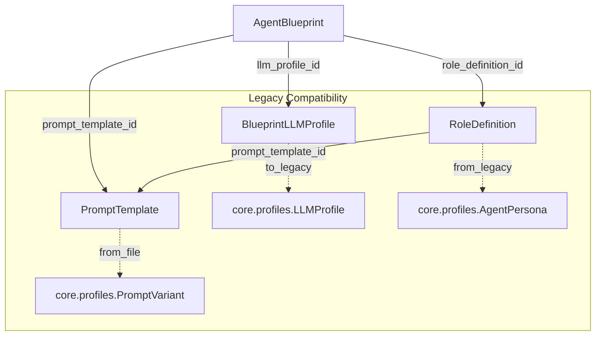

# Blueprint Canvas — Phase 1: Domain Models & Data Migration

> **Decisions integrated**: Simplified custom layout format, no auto-assembly during import, archive config included, full prompt content inline in SQLite.

## 1. Overview

Phase 1 establishes the foundational data layer for the Blueprint Canvas feature. It introduces four new Pydantic-V2 domain models, an idempotent importer for existing YAML/MD configuration files, and a SQLite schema for persistent storage of blueprints and canvas layouts.

### Goals
- Define typed, validated domain models for the Blueprint system
- Migrate existing `profiles/agents/*.yaml`, `profiles/llm/*.yaml`, and `profiles/prompts/**/*.md` into the new model structure
- Provide a SQLite-backed catalog for blueprints and canvas layouts
- Ensure backward compatibility — existing `ProfileService` and `PromptService` continue to work unchanged

---

## 2. Domain Models

All models live in a new package: `backend/blueprints/`

### 2.1 Package Structure

```
backend/blueprints/
├── __init__.py          # Public API exports
├── models.py            # Pydantic-V2 domain models
├── repository.py        # SQLite repository for blueprints + canvas layouts
├── importer.py          # Idempotent YAML/MD importer
└── migrations.py        # SQLite schema creation + migrations
```

### 2.2 Model: `LLMProfile` (Blueprint variant)

**File**: `backend/blueprints/models.py`

Extends the concept of the existing [`LLMProfile`](backend/core/profiles.py:28) with blueprint-specific metadata. Does NOT replace the existing model — it is a new, richer model used by the Blueprint system.

```python
class BlueprintLLMProfile(BaseModel):
    """LLM configuration for use in Agent Blueprints."""
    id: str = Field(..., pattern=r"^[a-z0-9][a-z0-9._-]*$")
    name: str
    provider: Literal["openrouter", "openai", "anthropic", "local", "ollama",
                       "opencode-zen", "opencode-go", "xiaomi"]
    model: str
    api_base: str | None = None
    api_key_env: str = "OPENROUTER_API_KEY"
    max_tokens: int = 4096
    context_window: int | None = None
    temperature: float = 0.7
    timeout: int = 600
    cost_per_1k_input: float | None = None
    cost_per_1k_output: float | None = None
    # Blueprint-specific
    description: str = ""
    tags: list[str] = Field(default_factory=list)
    created_at: datetime = Field(default_factory=lambda: datetime.now(UTC))
    updated_at: datetime = Field(default_factory=lambda: datetime.now(UTC))
```

**Relationship to existing**: Can be converted to/from [`backend.core.profiles.LLMProfile`](backend/core/profiles.py:28) via `to_legacy()` / `from_legacy()` methods.

### 2.3 Model: `PromptTemplate`

**File**: `backend/blueprints/models.py`

Wraps prompt file content with metadata. Replaces the file-path-only approach of [`PromptVariant`](backend/core/profiles.py:86).

```python
class PromptTemplate(BaseModel):
    """A named prompt template with content and metadata."""
    id: str = Field(..., pattern=r"^[a-z0-9][a-z0-9._-]*$")
    name: str
    role: Literal["strategist", "critic", "optimizer", "moderator"]
    content: str  # The actual prompt text (stored inline, not as file path)
    language: str = "de"
    variant: str = "default"  # e.g. "default", "kantian", "steiner"
    description: str = ""
    tags: list[str] = Field(default_factory=list)
    source_path: str | None = None  # Original file path (for traceability)
    content_hash: str = ""  # SHA-256[:16] of content for change detection
    created_at: datetime = Field(default_factory=lambda: datetime.now(UTC))
    updated_at: datetime = Field(default_factory=lambda: datetime.now(UTC))

    @field_validator("content")
    @classmethod
    def validate_content_not_empty(cls, v: str) -> str:
        if not v.strip():
            raise ValueError("Prompt content must not be empty")
        return v
```

**Relationship to existing**: Replaces the file-path-based [`PromptVariant`](backend/core/profiles.py:86) approach. Content is stored inline in the database rather than referencing files.

### 2.4 Model: `RoleDefinition`

**File**: `backend/blueprints/models.py`

Extends [`AgentPersona`](backend/core/profiles.py:61) with richer metadata and decoupled prompt reference.

```python
class RoleDefinition(BaseModel):
    """Defines an agent role with behavior constraints and prompt reference."""
    id: str = Field(..., pattern=r"^[a-z0-9][a-z0-9._-]*$")
    name: str
    role: Literal["strategist", "critic", "optimizer", "moderator"]
    description: str = ""
    # Prompt reference (by ID, not inline text)
    prompt_template_id: str | None = None  # References PromptTemplate.id
    # Behavior constraints
    max_rounds: int = 5
    consensus_threshold: float = 0.9
    # Metadata
    tags: list[str] = Field(default_factory=list)
    created_at: datetime = Field(default_factory=lambda: datetime.now(UTC))
    updated_at: datetime = Field(default_factory=lambda: datetime.now(UTC))

    @field_validator("consensus_threshold")
    @classmethod
    def validate_threshold(cls, v: float) -> float:
        if not 0 <= v <= 1:
            raise ValueError("consensus_threshold must be between 0 and 1")
        return v
```

**Relationship to existing**: Replaces [`AgentPersona`](backend/core/profiles.py:61). The `system_prompt` field is removed — prompt content is now referenced via `prompt_template_id`.

### 2.5 Model: `AgentBlueprint`

**File**: `backend/blueprints/models.py`

The composite model — ties together an LLM profile, a role definition, and optionally a prompt template into a reusable debate agent configuration.

```python
class AgentBlueprint(BaseModel):
    """A reusable agent configuration combining LLM, role, and prompt."""
    id: str = Field(..., pattern=r"^[a-z0-9][a-z0-9._-]*$")
    name: str
    description: str = ""
    # References
    llm_profile_id: str  # References BlueprintLLMProfile.id
    role_definition_id: str  # References RoleDefinition.id
    prompt_template_id: str | None = None  # Optional override; RoleDefinition default used if None
    # Metadata
    tags: list[str] = Field(default_factory=list)
    is_active: bool = True
    created_at: datetime = Field(default_factory=lambda: datetime.now(UTC))
    updated_at: datetime = Field(default_factory=lambda: datetime.now(UTC))
```

**Relationship to existing**: Replaces the composite of `AgentPersona` + `LLMProfile` that was assembled at runtime in [`ProfileService`](backend/services/profile_service.py:28). Now the composition is explicit and stored.

### 2.6 Model Relationships



---

## 3. SQLite Schema

**File**: `backend/blueprints/migrations.py`

Uses the same pattern as [`DMSDB`](backend/services/dms/database.py:16) and [`ProfileRepository`](backend/repositories/profile_repo.py:18) — SQLite with `CREATE TABLE IF NOT EXISTS`.

### 3.1 Database Location

`data/blueprints.db` — separate from the existing `data/profiles.db` and `memory/dms.db` to avoid coupling.

### 3.2 Table: `blueprint_llm_profiles`

```sql
CREATE TABLE IF NOT EXISTS blueprint_llm_profiles (
    id TEXT PRIMARY KEY,
    name TEXT NOT NULL,
    provider TEXT NOT NULL,
    model TEXT NOT NULL,
    api_base TEXT,
    api_key_env TEXT DEFAULT 'OPENROUTER_API_KEY',
    max_tokens INTEGER DEFAULT 4096,
    context_window INTEGER,
    temperature REAL DEFAULT 0.7,
    timeout INTEGER DEFAULT 600,
    cost_per_1k_input REAL,
    cost_per_1k_output REAL,
    description TEXT DEFAULT '',
    tags_json TEXT DEFAULT '[]',
    created_at TEXT NOT NULL,
    updated_at TEXT NOT NULL
);
```

### 3.3 Table: `prompt_templates`

```sql
CREATE TABLE IF NOT EXISTS prompt_templates (
    id TEXT PRIMARY KEY,
    name TEXT NOT NULL,
    role TEXT NOT NULL,
    content TEXT NOT NULL,
    language TEXT DEFAULT 'de',
    variant TEXT DEFAULT 'default',
    description TEXT DEFAULT '',
    tags_json TEXT DEFAULT '[]',
    source_path TEXT,
    content_hash TEXT,
    created_at TEXT NOT NULL,
    updated_at TEXT NOT NULL
);
CREATE INDEX IF NOT EXISTS idx_prompt_templates_role ON prompt_templates (role);
CREATE INDEX IF NOT EXISTS idx_prompt_templates_variant ON prompt_templates (variant);
```

### 3.4 Table: `role_definitions`

```sql
CREATE TABLE IF NOT EXISTS role_definitions (
    id TEXT PRIMARY KEY,
    name TEXT NOT NULL,
    role TEXT NOT NULL,
    description TEXT DEFAULT '',
    prompt_template_id TEXT,
    max_rounds INTEGER DEFAULT 5,
    consensus_threshold REAL DEFAULT 0.9,
    tags_json TEXT DEFAULT '[]',
    created_at TEXT NOT NULL,
    updated_at TEXT NOT NULL,
    FOREIGN KEY (prompt_template_id) REFERENCES prompt_templates(id) ON DELETE SET NULL
);
CREATE INDEX IF NOT EXISTS idx_role_definitions_role ON role_definitions (role);
```

### 3.5 Table: `agent_blueprints`

```sql
CREATE TABLE IF NOT EXISTS agent_blueprints (
    id TEXT PRIMARY KEY,
    name TEXT NOT NULL,
    description TEXT DEFAULT '',
    llm_profile_id TEXT NOT NULL,
    role_definition_id TEXT NOT NULL,
    prompt_template_id TEXT,
    tags_json TEXT DEFAULT '[]',
    is_active INTEGER DEFAULT 1,
    created_at TEXT NOT NULL,
    updated_at TEXT NOT NULL,
    FOREIGN KEY (llm_profile_id) REFERENCES blueprint_llm_profiles(id) ON DELETE CASCADE,
    FOREIGN KEY (role_definition_id) REFERENCES role_definitions(id) ON DELETE CASCADE,
    FOREIGN KEY (prompt_template_id) REFERENCES prompt_templates(id) ON DELETE SET NULL
);
CREATE INDEX IF NOT EXISTS idx_agent_blueprints_llm ON agent_blueprints (llm_profile_id);
CREATE INDEX IF NOT EXISTS idx_agent_blueprints_role ON agent_blueprints (role_definition_id);
```

### 3.6 Table: `canvas_layouts`

```sql
CREATE TABLE IF NOT EXISTS canvas_layouts (
    id TEXT PRIMARY KEY,
    name TEXT NOT NULL,
    description TEXT DEFAULT '',
    project_id TEXT,
    layout_json TEXT NOT NULL DEFAULT '{}',
    -- Simplified custom format (NOT raw React Flow JSON):
    -- {
    --   nodes: [{id, type, x, y, blueprint_id}],
    --   edges: [{id, source, target, type}],
    --   viewport: {x, y, zoom}  (optional)
    -- }
    -- Translation to full Svelte Flow format happens in frontend on load.
    created_at TEXT NOT NULL,
    updated_at TEXT NOT NULL
);
CREATE INDEX IF NOT EXISTS idx_canvas_layouts_project ON canvas_layouts (project_id);
```

---

## 4. Repository

**File**: `backend/blueprints/repository.py`

Follows the pattern of [`ProfileRepository`](backend/repositories/profile_repo.py:18) — SQLite connection per operation, `row_factory = sqlite3.Row`.

### 4.1 Class: `BlueprintRepository`

```python
class BlueprintRepository:
    """SQLite-backed storage for Agent Blueprints and Canvas Layouts."""

    def __init__(self, db_path: Path | str = Path("data/blueprints.db")): ...

    # --- LLM Profiles ---
    def save_llm_profile(self, profile: BlueprintLLMProfile) -> None: ...
    def get_llm_profile(self, profile_id: str) -> BlueprintLLMProfile | None: ...
    def list_llm_profiles(self) -> list[BlueprintLLMProfile]: ...
    def delete_llm_profile(self, profile_id: str) -> bool: ...

    # --- Prompt Templates ---
    def save_prompt_template(self, template: PromptTemplate) -> None: ...
    def get_prompt_template(self, template_id: str) -> PromptTemplate | None: ...
    def list_prompt_templates(self, role: str | None = None, variant: str | None = None) -> list[PromptTemplate]: ...
    def delete_prompt_template(self, template_id: str) -> bool: ...

    # --- Role Definitions ---
    def save_role_definition(self, role_def: RoleDefinition) -> None: ...
    def get_role_definition(self, role_id: str) -> RoleDefinition | None: ...
    def list_role_definitions(self, role: str | None = None) -> list[RoleDefinition]: ...
    def delete_role_definition(self, role_id: str) -> bool: ...

    # --- Agent Blueprints ---
    def save_blueprint(self, blueprint: AgentBlueprint) -> None: ...
    def get_blueprint(self, blueprint_id: str) -> AgentBlueprint | None: ...
    def list_blueprints(self, active_only: bool = True) -> list[AgentBlueprint]: ...
    def delete_blueprint(self, blueprint_id: str) -> bool: ...

    # --- Canvas Layouts ---
    def save_layout(self, layout: CanvasLayout) -> None: ...
    def get_layout(self, layout_id: str) -> CanvasLayout | None: ...
    def list_layouts(self, project_id: str | None = None) -> list[CanvasLayout]: ...
    def delete_layout(self, layout_id: str) -> bool: ...
```

### 4.2 Model: `CanvasLayout` (API/response helper)

```python
class CanvasLayoutNode(BaseModel):
    """A node in the simplified canvas layout format."""
    id: str
    type: str  # e.g. "agent-blueprint", "llm-profile"
    x: float
    y: float
    blueprint_id: str | None = None  # References AgentBlueprint.id

class CanvasLayoutEdge(BaseModel):
    """An edge in the simplified canvas layout format."""
    id: str
    source: str  # Node ID
    target: str  # Node ID
    type: str  # e.g. "uses_llm", "implements_role"

class CanvasLayoutViewport(BaseModel):
    """Viewport state for the canvas."""
    x: float = 0
    y: float = 0
    zoom: float = 1

class CanvasLayoutData(BaseModel):
    """Simplified canvas layout data — NOT raw React Flow JSON."""
    nodes: list[CanvasLayoutNode] = Field(default_factory=list)
    edges: list[CanvasLayoutEdge] = Field(default_factory=list)
    viewport: CanvasLayoutViewport = Field(default_factory=CanvasLayoutViewport)

class CanvasLayout(BaseModel):
    """A saved canvas arrangement of agent blueprints."""
    id: str = Field(default_factory=lambda: str(uuid.uuid4())[:8])
    name: str
    description: str = ""
    project_id: str | None = None
    layout_data: CanvasLayoutData = Field(default_factory=CanvasLayoutData)
    created_at: datetime = Field(default_factory=lambda: datetime.now(UTC))
    updated_at: datetime = Field(default_factory=lambda: datetime.now(UTC))
```

---

## 5. Importer

**File**: `backend/blueprints/importer.py`

Idempotent importer that reads existing YAML/MD files and creates Blueprint domain model instances.

### 5.1 Import Sources

| Source | Target Model | Source Location |
|--------|-------------|-----------------|
| LLM profiles YAML (new format) | `BlueprintLLMProfile` | `profiles/llm/*.yaml` |
| LLM profiles YAML (legacy format) | `BlueprintLLMProfile` | `archive/config/llm_profiles.yaml` — nested `profiles:` key parsed and mapped to flat model |
| Agent persona YAML | `RoleDefinition` | `profiles/agents/*.yaml` |
| Prompt MD files | `PromptTemplate` | `profiles/prompts/default/*.md`, `profiles/prompts/variants/*/*.md`, `archive/config/prompts/*.md` |

**Note**: No auto-assembly of `AgentBlueprint` during import. The importer creates exactly what each YAML/MD file describes. Visual composition of Role + LLM + Prompt into an `AgentBlueprint` is a deliberate user interaction in Phase 3 Canvas.

### 5.2 Import Logic

```python
class BlueprintImporter:
    """Imports existing YAML/MD configs into the Blueprint system."""

    def __init__(self, repo: BlueprintRepository, profile_dir: Path = Path("profiles")): ...

    def import_all(self, dry_run: bool = False) -> ImportResult:
        """Run full import. Returns counts of imported/skipped/error items."""
        ...

    def import_llm_profiles(self, dry_run: bool = False) -> list[BlueprintLLMProfile]:
        """Import from profiles/llm/*.yaml (new format) and archive/config/llm_profiles.yaml (legacy).

        Legacy format: nested ``profiles:`` key with ``model``, ``base_url``,
        ``api_key_env``, ``params`` fields. Mapped to flat BlueprintLLMProfile.
        Unmapped fields logged as warnings and discarded.
        """
        ...

    def import_agent_personas(self, dry_run: bool = False) -> list[RoleDefinition]:
        """Import from profiles/agents/*.yaml"""
        ...

    def import_prompt_templates(self, dry_run: bool = False) -> list[PromptTemplate]:
        """Import from profiles/prompts/**/*.md and archive/config/prompts/*.md.

        Full .md content stored inline in PromptTemplate.content.
        """
        ...
```

### 5.3 Idempotency Strategy

- Each import checks if an item with the same `id` already exists in the repository
- If exists and content unchanged (via `content_hash` for prompts, field comparison for models) → skip
- If exists and content changed → update (with `updated_at` bump)
- If not exists → create
- `ImportResult` tracks: `created`, `updated`, `skipped`, `errors`

### 5.4 Legacy Conversion

```python
# In models.py
class BlueprintLLMProfile(BaseModel):
    ...
    @classmethod
    def from_legacy(cls, legacy: LLMProfile) -> BlueprintLLMProfile:
        """Convert from backend.core.profiles.LLMProfile"""
        ...

    def to_legacy(self) -> LLMProfile:
        """Convert to backend.core.profiles.LLMProfile for backward compat"""
        ...

class RoleDefinition(BaseModel):
    ...
    @classmethod
    def from_legacy(cls, legacy: AgentPersona, prompt_template_id: str | None = None) -> RoleDefinition:
        """Convert from backend.core.profiles.AgentPersona"""
        ...
```

---

## 6. Tests

**File**: `tests/backend/test_blueprints.py`

### 6.1 Test Structure

```python
# --- Model validation tests ---
class TestBlueprintLLMProfile:
    def test_valid_model_creation(self): ...
    def test_temperature_validation(self): ...
    def test_id_pattern_validation(self): ...
    def test_from_legacy_conversion(self): ...
    def test_to_legacy_conversion(self): ...

class TestPromptTemplate:
    def test_valid_creation(self): ...
    def test_empty_content_rejected(self): ...
    def test_content_hash_auto_generated(self): ...

class TestRoleDefinition:
    def test_valid_creation(self): ...
    def test_consensus_threshold_validation(self): ...
    def test_from_legacy_conversion(self): ...

class TestAgentBlueprint:
    def test_valid_creation(self): ...
    def test_optional_prompt_override(self): ...

# --- Repository tests ---
class TestBlueprintRepository:
    def test_save_and_get_llm_profile(self, tmp_path): ...
    def test_list_llm_profiles(self, tmp_path): ...
    def test_delete_llm_profile_cascades(self, tmp_path): ...
    def test_save_and_get_prompt_template(self, tmp_path): ...
    def test_list_prompt_templates_filtered(self, tmp_path): ...
    def test_save_and_get_role_definition(self, tmp_path): ...
    def test_save_and_get_blueprint(self, tmp_path): ...
    def test_save_and_get_canvas_layout(self, tmp_path): ...
    def test_foreign_key_integrity(self, tmp_path): ...

# --- Importer tests ---
class TestBlueprintImporter:
    def test_import_llm_profiles_from_yaml(self, tmp_path): ...
    def test_import_legacy_llm_profiles_from_archive(self, tmp_path): ...
    def test_import_agent_personas_from_yaml(self, tmp_path): ...
    def test_import_prompt_templates_from_md(self, tmp_path): ...
    def test_import_prompt_content_stored_inline(self, tmp_path): ...
    def test_import_idempotency(self, tmp_path): ...
    def test_import_dry_run_no_persistence(self, tmp_path): ...
    def test_import_result_counts(self, tmp_path): ...
    def test_import_no_auto_assembly(self, tmp_path): ...
```

### 6.2 Fixtures

```python
@pytest.fixture()
def blueprint_repo(tmp_path) -> BlueprintRepository:
    return BlueprintRepository(db_path=tmp_path / "test_blueprints.db")

@pytest.fixture()
def sample_profile_dir(tmp_path) -> Path:
    """Create a temporary profile directory with test YAML/MD files."""
    # ... similar to existing test_profiles.py fixture pattern
```

---

## 7. Implementation Order

| Step | Task | Files |
|------|------|-------|
| 1 | Create `backend/blueprints/` package with `__init__.py` | `backend/blueprints/__init__.py` |
| 2 | Define domain models | `backend/blueprints/models.py` |
| 3 | Implement SQLite migrations | `backend/blueprints/migrations.py` |
| 4 | Implement repository | `backend/blueprints/repository.py` |
| 5 | Implement importer | `backend/blueprints/importer.py` |
| 6 | Write model validation tests | `tests/backend/test_blueprints.py` |
| 7 | Write repository tests | `tests/backend/test_blueprints.py` |
| 8 | Write importer tests | `tests/backend/test_blueprints.py` |
| 9 | Run full test suite + ruff lint | Terminal |

---

## 8. Backward Compatibility

- Existing [`ProfileService`](backend/services/profile_service.py:28) and [`PromptService`](backend/services/prompt_service.py:19) remain **unchanged**
- Existing [`backend.core.profiles`](backend/core/profiles.py:1) models remain **unchanged**
- The new Blueprint system is **additive** — it runs alongside the existing system
- `to_legacy()` / `from_legacy()` methods enable bidirectional conversion
- Phase 2+ will wire the Blueprint system into the debate workflow; until then, the existing profile loading path is used

---

## 9. Resolved Decisions

| Question | Decision |
|----------|----------|
| Canvas Layout format | **Simplified custom format**: `{nodes: [{id, type, x, y, blueprint_id}], edges: [{id, source, target, type}], viewport: {x, y, zoom}}`. No raw React Flow JSON in DB. Frontend translates to full Svelte Flow format on load. |
| Blueprint assembly during import | **No auto-assembly**. Importer creates exactly what YAML/MD describes. Visual composition is a Phase 3 user interaction. |
| Archive config import | **Include** `archive/config/llm_profiles.yaml`. Parse old nested `profiles:` format and map to flat `BlueprintLLMProfile`. Unmapped fields → warning log + discard. |
| Prompt content storage | **Full inline** in SQLite. Complete `.md` content stored in `PromptTemplate.content`. Original files remain as read-only legacy source. SQLite catalog is Single Source of Truth. |
