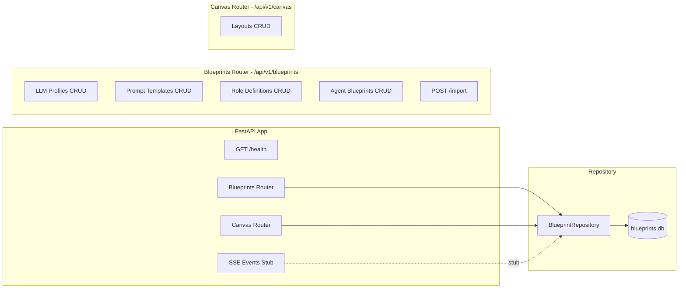

# Blueprint Canvas — Phase 2: FastAPI Backend API

## 1. Overview

Phase 2 exposes the Phase 1 domain models via a REST API with full CRUD operations, centralized error handling, and a prepared SSE infrastructure for future live updates.

### Goals
- CRUD endpoints for all 4 Blueprint entities + Canvas Layouts
- Reuse Phase 1 Pydantic models directly (no separate DTOs)
- Synchronous SQLite access via FastAPI dependency injection (consistent with existing [`ProfileRepository`](backend/repositories/profile_repo.py:18) pattern)
- Centralized error handling (422, 404, 409)
- SSE stub router for future canvas collaboration / debate status
- Comprehensive pytest tests

---

## 2. Architecture Decisions

### 2.1 Sync vs Async SQLite

**Decision: Synchronous `sqlite3`** — consistent with existing codebase:
- [`DMSDB`](backend/services/dms/database.py:16) uses sync `sqlite3`
- [`ProfileRepository`](backend/repositories/profile_repo.py:18) uses sync `sqlite3`
- [`AuditService`](backend/persistence/audit.py) uses sync `sqlite3`
- FastAPI runs sync functions in a threadpool automatically

No need for `aiosqlite` — it would introduce inconsistency.

### 2.2 Dependency Injection Pattern

Follow the existing pattern in [`backend/api/deps.py`](backend/api/deps.py:1):
- `@lru_cache` singleton for `BlueprintRepository`
- FastAPI `Depends()` for route injection
- Overridable in tests via `app.dependency_overrides`

### 2.3 Error Handling

Add a centralized exception handler in [`backend/main.py`](backend/main.py:120) rather than raising `HTTPException` in every route. Custom exceptions map to HTTP status codes.

### 2.4 Router Structure

One router file per entity group, following the [`profiles.py`](backend/api/routers/profiles.py:1) pattern:

```
backend/api/routers/
├── blueprints.py      # CRUD for LLMProfiles, PromptTemplates, RoleDefinitions, AgentBlueprints
├── canvas.py          # CRUD for CanvasLayouts
└── blueprint_events.py # SSE stub for future live updates
```

---

## 3. File Plan

### 3.1 New Files

| File | Purpose |
|------|---------|
| `backend/api/routers/blueprints.py` | CRUD router for 4 Blueprint entities |
| `backend/api/routers/canvas.py` | CRUD router for Canvas Layouts |
| `backend/api/routers/blueprint_events.py` | SSE stub router |
| `backend/api/errors.py` | Custom exceptions + centralized handlers |
| `tests/backend/test_blueprint_api.py` | API tests for all endpoints |

### 3.2 Modified Files

| File | Change |
|------|--------|
| `backend/api/deps.py` | Add `get_blueprint_repository()` dependency |
| `backend/main.py` | Register 3 new routers + error handlers |

---

## 4. Detailed Design

### 4.1 Custom Exceptions & Error Handlers

**File**: `backend/api/errors.py`

```python
class BlueprintNotFoundError(Exception):
    """Raised when a blueprint entity is not found."""
    def __init__(self, entity: str, entity_id: str):
        self.entity = entity
        self.entity_id = entity_id

class BlueprintConflictError(Exception):
    """Raised when creating an entity with a duplicate ID."""
    def __init__(self, entity: str, entity_id: str):
        self.entity = entity
        self.entity_id = entity_id

class BlueprintValidationError(Exception):
    """Raised for business logic validation errors."""
    def __init__(self, detail: str):
        self.detail = detail
```

Registered in `create_app()`:
```python
from backend.api.errors import (
    BlueprintNotFoundError,
    BlueprintConflictError,
    BlueprintValidationError,
    register_error_handlers,
)
register_error_handlers(app)
```

Handler mapping:
| Exception | HTTP Status | Response |
|-----------|-------------|----------|
| `BlueprintNotFoundError` | 404 | `{"detail": "LLMProfile 'xyz' not found"}` |
| `BlueprintConflictError` | 409 | `{"detail": "LLMProfile 'xyz' already exists"}` |
| `BlueprintValidationError` | 422 | `{"detail": "..."}` |
| Pydantic `ValidationError` | 422 | Standard FastAPI validation error format |

### 4.2 Dependency Injection

**File**: `backend/api/deps.py` (additions)

```python
from backend.blueprints.repository import BlueprintRepository

@lru_cache
def get_blueprint_repository() -> BlueprintRepository:
    return BlueprintRepository()
```

### 4.3 Blueprints Router

**File**: `backend/api/routers/blueprints.py`

Prefix: `/api/v1/blueprints`
Tags: `["blueprints"]`

#### Endpoints — LLM Profiles

| Method | Path | Request Body | Response | Status |
|--------|------|-------------|----------|--------|
| GET | `/llm-profiles` | — | `list[BlueprintLLMProfile]` | 200 |
| GET | `/llm-profiles/{id}` | — | `BlueprintLLMProfile` | 200 / 404 |
| POST | `/llm-profiles` | `BlueprintLLMProfile` | `BlueprintLLMProfile` | 201 / 409 |
| PUT | `/llm-profiles/{id}` | `BlueprintLLMProfile` | `BlueprintLLMProfile` | 200 / 404 |
| DELETE | `/llm-profiles/{id}` | — | `{"status": "ok", "deleted": id}` | 200 / 404 |

Query params for GET list:
- `limit: int = 50` (pagination)
- `offset: int = 0`

#### Endpoints — Prompt Templates

| Method | Path | Request Body | Response | Status |
|--------|------|-------------|----------|--------|
| GET | `/prompt-templates` | — | `list[PromptTemplate]` | 200 |
| GET | `/prompt-templates/{id}` | — | `PromptTemplate` | 200 / 404 |
| POST | `/prompt-templates` | `PromptTemplate` | `PromptTemplate` | 201 / 409 |
| PUT | `/prompt-templates/{id}` | `PromptTemplate` | `PromptTemplate` | 200 / 404 |
| DELETE | `/prompt-templates/{id}` | — | `{"status": "ok", "deleted": id}` | 200 / 404 |

Query params for GET list:
- `role: str | None` (filter by role)
- `variant: str | None` (filter by variant)
- `limit: int = 50`
- `offset: int = 0`

#### Endpoints — Role Definitions

| Method | Path | Request Body | Response | Status |
|--------|------|-------------|----------|--------|
| GET | `/role-definitions` | — | `list[RoleDefinition]` | 200 |
| GET | `/role-definitions/{id}` | — | `RoleDefinition` | 200 / 404 |
| POST | `/role-definitions` | `RoleDefinition` | `RoleDefinition` | 201 / 409 |
| PUT | `/role-definitions/{id}` | `RoleDefinition` | `RoleDefinition` | 200 / 404 |
| DELETE | `/role-definitions/{id}` | — | `{"status": "ok", "deleted": id}` | 200 / 404 |

Query params for GET list:
- `role: str | None` (filter by role)
- `limit: int = 50`
- `offset: int = 0`

#### Endpoints — Agent Blueprints

| Method | Path | Request Body | Response | Status |
|--------|------|-------------|----------|--------|
| GET | `/agent-blueprints` | — | `list[AgentBlueprint]` | 200 |
| GET | `/agent-blueprints/{id}` | — | `AgentBlueprint` | 200 / 404 |
| POST | `/agent-blueprints` | `AgentBlueprint` | `AgentBlueprint` | 201 / 409 |
| PUT | `/agent-blueprints/{id}` | `AgentBlueprint` | `AgentBlueprint` | 200 / 404 |
| DELETE | `/agent-blueprints/{id}` | — | `{"status": "ok", "deleted": id}` | 200 / 404 |

Query params for GET list:
- `active_only: bool = True`
- `limit: int = 50`
- `offset: int = 0`

#### Endpoint — Import

| Method | Path | Request Body | Response | Status |
|--------|------|-------------|----------|--------|
| POST | `/import` | `{"dry_run": bool}` | `ImportResult` | 200 |

Triggers [`BlueprintImporter.import_all()`](backend/blueprints/importer.py) and returns counts.

### 4.4 Canvas Router

**File**: `backend/api/routers/canvas.py`

Prefix: `/api/v1/canvas`
Tags: `["canvas"]`

| Method | Path | Request Body | Response | Status |
|--------|------|-------------|----------|--------|
| GET | `/layouts` | — | `list[CanvasLayout]` | 200 |
| GET | `/layouts/{id}` | — | `CanvasLayout` | 200 / 404 |
| POST | `/layouts` | `CanvasLayout` | `CanvasLayout` | 201 / 409 |
| PUT | `/layouts/{id}` | `CanvasLayout` | `CanvasLayout` | 200 / 404 |
| DELETE | `/layouts/{id}` | — | `{"status": "ok", "deleted": id}` | 200 / 404 |

Query params for GET list:
- `project_id: str | None` (filter by project)
- `limit: int = 50`
- `offset: int = 0`

**Key constraint**: `layout_json` stores only `blueprint_id` references in nodes, never full blueprint data. The frontend resolves blueprint details via separate GET calls.

### 4.5 SSE Stub Router

**File**: `backend/api/routers/blueprint_events.py`

Prefix: `/api/v1/blueprints/events`
Tags: `["blueprint-events"]`

```python
@router.get("/stream")
async def stream_blueprint_events():
    """SSE endpoint for real-time blueprint/canvas updates.

    Stub implementation — returns a keep-alive stream.
    Will be extended in Phase 3+ for canvas collaboration.
    """
    async def event_generator():
        while True:
            yield {"event": "ping", "data": "{}"}
            await asyncio.sleep(30)

    return EventSourceResponse(event_generator())
```

### 4.6 Repository Pagination Support

**File**: `backend/blueprints/repository.py` (additions)

Add `limit`/`offset` parameters to all `list_*` methods:

```python
def list_llm_profiles(self, limit: int = 50, offset: int = 0) -> list[BlueprintLLMProfile]:
    with self._connect() as conn:
        rows = conn.execute(
            "SELECT * FROM blueprint_llm_profiles ORDER BY created_at DESC LIMIT ? OFFSET ?",
            (limit, offset),
        ).fetchall()
    return [self._row_to_llm_profile(row) for row in rows]
```

Same pattern for `list_prompt_templates`, `list_role_definitions`, `list_blueprints`, `list_layouts`.

---

## 5. Router Registration

**File**: `backend/main.py` (additions in `create_app()`)

```python
from backend.api.routers import blueprints, canvas, blueprint_events
from backend.api.errors import register_error_handlers

# After existing routers:
app.include_router(blueprints.router, prefix="/api/v1/blueprints", tags=["blueprints"])
app.include_router(canvas.router, prefix="/api/v1/canvas", tags=["canvas"])
app.include_router(blueprint_events.router, prefix="/api/v1/blueprints/events", tags=["blueprint-events"])

# Error handlers (after router registration)
register_error_handlers(app)
```

---

## 6. Tests

**File**: `tests/backend/test_blueprint_api.py`

### 6.1 Test Structure

```python
# --- Fixtures ---
@pytest.fixture()
def blueprint_repo(tmp_path) -> BlueprintRepository:
    """Isolated BlueprintRepository with temp database."""
    return BlueprintRepository(db_path=tmp_path / "test_blueprints.db")

@pytest.fixture()
def app(blueprint_repo):
    """FastAPI app with overridden blueprint repository."""
    application = create_app()
    application.dependency_overrides[get_blueprint_repository] = lambda: blueprint_repo
    return application

@pytest.fixture()
def client(app) -> TestClient:
    return TestClient(app)

# --- LLM Profile CRUD ---
class TestLLMProfileAPI:
    def test_list_empty(self, client): ...
    def test_create(self, client): ...
    def test_create_duplicate_returns_409(self, client): ...
    def test_get_by_id(self, client): ...
    def test_get_nonexistent_returns_404(self, client): ...
    def test_update(self, client): ...
    def test_update_nonexistent_returns_404(self, client): ...
    def test_delete(self, client): ...
    def test_delete_nonexistent_returns_404(self, client): ...
    def test_list_with_pagination(self, client): ...

# --- Prompt Template CRUD ---
class TestPromptTemplateAPI:
    def test_list_empty(self, client): ...
    def test_create(self, client): ...
    def test_create_duplicate_returns_409(self, client): ...
    def test_get_by_id(self, client): ...
    def test_get_nonexistent_returns_404(self, client): ...
    def test_update(self, client): ...
    def test_delete(self, client): ...
    def test_list_filtered_by_role(self, client): ...
    def test_list_filtered_by_variant(self, client): ...

# --- Role Definition CRUD ---
class TestRoleDefinitionAPI:
    def test_list_empty(self, client): ...
    def test_create(self, client): ...
    def test_create_duplicate_returns_409(self, client): ...
    def test_get_by_id(self, client): ...
    def test_update(self, client): ...
    def test_delete(self, client): ...
    def test_list_filtered_by_role(self, client): ...

# --- Agent Blueprint CRUD ---
class TestAgentBlueprintAPI:
    def test_list_empty(self, client): ...
    def test_create(self, client): ...
    def test_create_duplicate_returns_409(self, client): ...
    def test_get_by_id(self, client): ...
    def test_update(self, client): ...
    def test_delete(self, client): ...
    def test_list_active_only_filter(self, client): ...

# --- Canvas Layout CRUD ---
class TestCanvasLayoutAPI:
    def test_list_empty(self, client): ...
    def test_create(self, client): ...
    def test_create_duplicate_returns_409(self, client): ...
    def test_get_by_id(self, client): ...
    def test_update(self, client): ...
    def test_delete(self, client): ...
    def test_list_filtered_by_project(self, client): ...
    def test_layout_roundtrip_with_blueprint_refs(self, client): ...
    # ^ Creates blueprints first, then a layout referencing them, verifies refs preserved

# --- Import Endpoint ---
class TestImportAPI:
    def test_import_dry_run(self, client): ...
    def test_import_creates_entities(self, client, blueprint_repo): ...

# --- Error Handling ---
class TestErrorHandling:
    def test_validation_error_returns_422(self, client): ...
    def test_not_found_returns_404_with_detail(self, client): ...
    def test_conflict_returns_409_with_detail(self, client): ...

# --- Health ---
class TestBlueprintHealth:
    def test_health_endpoint(self, client): ...
```

### 6.2 Validation Error Test

```python
def test_validation_error_returns_422(self, client):
    """Sending invalid data returns structured Pydantic error."""
    response = client.post("/api/v1/blueprints/llm-profiles", json={
        "id": "INVALID ID!",  # violates pattern
        "name": "Test",
        "provider": "openrouter",
        "model": "test/model",
    })
    assert response.status_code == 422
    body = response.json()
    assert "detail" in body
```

### 6.3 Canvas Layout Roundtrip Test

```python
def test_layout_roundtrip_with_blueprint_refs(self, client):
    """Create blueprints, then a layout referencing them, verify roundtrip."""
    # 1. Create LLM profile
    client.post("/api/v1/blueprints/llm-profiles", json={...})
    # 2. Create role definition
    client.post("/api/v1/blueprints/role-definitions", json={...})
    # 3. Create agent blueprint referencing them
    client.post("/api/v1/blueprints/agent-blueprints", json={...})
    # 4. Create canvas layout with node referencing blueprint_id
    layout = {
        "name": "Test Layout",
        "layout_json": {
            "nodes": [{"id": "n1", "blueprint_id": "bp-1", "position": {"x": 100, "y": 200}}],
            "edges": [{"id": "e1", "source": "n1", "target": "n2"}],
        },
    }
    resp = client.post("/api/v1/canvas/layouts", json=layout)
    assert resp.status_code == 201
    layout_id = resp.json()["id"]
    # 5. Retrieve and verify blueprint_id refs preserved (not expanded)
    resp = client.get(f"/api/v1/canvas/layouts/{layout_id}")
    assert resp.status_code == 200
    nodes = resp.json()["layout_json"]["nodes"]
    assert nodes[0]["blueprint_id"] == "bp-1"
```

---

## 7. Implementation Order

| Step | Task | Files |
|------|------|-------|
| 1 | Create custom exceptions + error handlers | `backend/api/errors.py` |
| 2 | Add `get_blueprint_repository()` to deps | `backend/api/deps.py` |
| 3 | Add pagination to repository `list_*` methods | `backend/blueprints/repository.py` |
| 4 | Create blueprints CRUD router | `backend/api/routers/blueprints.py` |
| 5 | Create canvas CRUD router | `backend/api/routers/canvas.py` |
| 6 | Create SSE stub router | `backend/api/routers/blueprint_events.py` |
| 7 | Register routers + error handlers in `create_app()` | `backend/main.py` |
| 8 | Write API tests | `tests/backend/test_blueprint_api.py` |
| 9 | Run full test suite + ruff lint | Terminal |

---

## 8. API Overview Diagram



---

## 9. Acceptance Criteria Mapping

| Criterion | Implementation |
|-----------|---------------|
| All CRUD via HTTP, documented at `/docs` | FastAPI auto-generates OpenAPI from router definitions |
| Canvas layouts store only blueprint_id refs | `layout_json` validated in router; no data expansion |
| pytest runs green | `tests/backend/test_blueprint_api.py` covers all endpoints |
| Invalid requests return structured Pydantic errors | `register_error_handlers()` + 422 handler |
