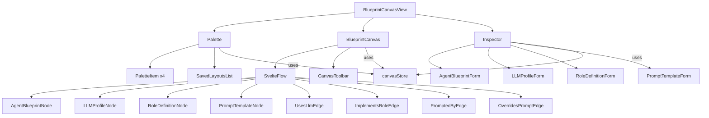

# Blueprint Canvas — Phase 3: Svelte Flow Blueprint Canvas

## 1. Overview

Phase 3 implements the interactive three-column editor (Palette, Canvas, Inspector) for visually modeling Agent Blueprints, LLM Profiles, Role Definitions, and Prompt Templates using Svelte Flow.

### Goals
- Three-column layout: Palette (left), Canvas (center), Inspector (right)
- Four custom node types with Tailwind styling and semantic handles
- Four semantic edge types with distinct visual styling
- Drag & Drop from palette to canvas with coordinate transformation
- Context-sensitive Inspector with form editing and API persistence
- Canvas layout save/load via Phase 2 API
- ELK.js auto-layout
- Full i18n (DE/EN)
- `data-testid` attributes on all interactive elements

---

## 2. Architecture Decisions

### 2.1 State Management

**Decision: Svelte 5 Runes** — consistent with requirement #12 and existing [`WorkflowCanvas.svelte`](frontend/src/components/workflow/WorkflowCanvas.svelte:1) pattern.

Canvas state lives in a dedicated store module (`frontend/src/lib/blueprint/store.svelte.js`) using `$state` runes exported from a class-based store (Svelte 5 pattern for shared reactive state).

### 2.2 Routing

Add `blueprint` route to existing hash-based router in [`App.svelte`](frontend/src/App.svelte:1):
```
#/blueprint           → BlueprintCanvasView (new layout)
#/blueprint/{layoutId} → BlueprintCanvasView with loaded layout
```

### 2.3 Existing Dependencies

Already installed in [`package.json`](frontend/package.json:1):
- `@xyflow/svelte: ^1.5.2` — Svelte Flow
- `elkjs: ^0.11.1` — ELK.js auto-layout
- `tailwindcss: ^3.4.0` — Styling

No new npm dependencies needed.

### 2.4 API Client

Extend existing [`frontend/src/lib/api.js`](frontend/src/lib/api.js:1) with blueprint API functions, following the same `request()` pattern.

---

## 3. File Plan

### 3.1 New Files

```
frontend/src/
├── views/
│   └── BlueprintCanvasView.svelte          # Main three-column view
├── components/blueprint/
│   ├── Palette.svelte                       # Left column — draggable node types
│   ├── Inspector.svelte                     # Right column — context-sensitive form
│   ├── BlueprintCanvas.svelte               # Center — SvelteFlow instance
│   ├── nodes/
│   │   ├── AgentBlueprintNode.svelte        # Custom node
│   │   ├── LLMProfileNode.svelte            # Custom node
│   │   ├── RoleDefinitionNode.svelte        # Custom node
│   │   └── PromptTemplateNode.svelte        # Custom node
│   ├── edges/
│   │   ├── UsesLlmEdge.svelte               # uses_llm edge
│   │   ├── ImplementsRoleEdge.svelte        # implements_role edge
│   │   ├── PromptedByEdge.svelte            # prompted_by edge
│   │   └── OverridesPromptEdge.svelte       # overrides_prompt edge
│   └── forms/
│       ├── AgentBlueprintForm.svelte        # Inspector form
│       ├── LLMProfileForm.svelte            # Inspector form
│       ├── RoleDefinitionForm.svelte        # Inspector form
│       └── PromptTemplateForm.svelte        # Inspector form
├── lib/blueprint/
│   ├── store.svelte.js                      # Canvas state (runes)
│   ├── api.js                               # Blueprint API client functions
│   ├── layout.js                            # ELK layout for blueprint canvas
│   ├── dnd.js                               # Drag & Drop utilities
│   └── validation.js                        # Edge connection validation
└── lib/i18n/loaders/
    └── (de.js, en.js)                       # Extended with blueprint translations
```

### 3.2 Modified Files

| File | Change |
|------|--------|
| `frontend/src/App.svelte` | Add `blueprint` route |
| `frontend/src/components/Sidebar.svelte` | Add Blueprint Canvas nav item |
| `frontend/src/lib/i18n/loaders/de.js` | Add blueprint translations |
| `frontend/src/lib/i18n/loaders/en.js` | Add blueprint translations |
| `frontend/src/lib/api.js` | Add blueprint API functions |
| `frontend/vite.config.js` | Add `/api/v1/blueprints` and `/api/v1/canvas` proxy rules |

---

## 4. Detailed Design

### 4.1 Three-Column Layout

**File**: `frontend/src/views/BlueprintCanvasView.svelte`

```svelte
<div class="flex h-[calc(100vh-4rem)]" data-testid="blueprint-canvas-view">
  <!-- Left: Palette (fixed 240px) -->
  <aside class="w-60 border-r border-gray-200 dark:border-gray-700 overflow-y-auto bg-gray-50 dark:bg-gray-900">
    <Palette />
  </aside>

  <!-- Center: Canvas (flex-1) -->
  <main class="flex-1 relative">
    <BlueprintCanvas />
  </main>

  <!-- Right: Inspector (fixed 320px, conditional) -->
  {#if selectedNode}
    <aside class="w-80 border-l border-gray-200 dark:border-gray-700 overflow-y-auto bg-white dark:bg-gray-800">
      <Inspector node={selectedNode} />
    </aside>
  {/if}
</div>
```

### 4.2 Palette

**File**: `frontend/src/components/blueprint/Palette.svelte`

Four draggable items grouped as "Assets":

```
┌─────────────────────────┐
│ 🧩 Assets               │
│                         │
│ ┌─────────────────────┐ │
│ │ 🤖 Agent Blueprint  │ │  ← draggable
│ └─────────────────────┘ │
│ ┌─────────────────────┐ │
│ │ 🧠 LLM Profile      │ │  ← draggable
│ └─────────────────────┘ │
│ ┌─────────────────────┐ │
│ │ 👤 Role Definition  │ │  ← draggable
│ └─────────────────────┘ │
│ ┌─────────────────────┐ │
│ │ 📝 Prompt Template  │ │  ← draggable
│ └─────────────────────┘ │
│                         │
│ ─── Saved Layouts ──── │
│ ┌─────────────────────┐ │
│ │ 📐 Layout Name      │ │  ← clickable to load
│ └─────────────────────┘ │
└─────────────────────────┘
```

Each palette item uses HTML5 Drag API (`draggable="true"`, `ondragstart` sets `dataTransfer` with node type).

### 4.3 Custom Nodes

All nodes follow the pattern of existing [`AgentNode.svelte`](frontend/src/components/workflow/nodes/AgentNode.svelte:1):
- Import `Handle, Position` from `@xyflow/svelte`
- Use `$props()` for data
- Use `$derived()` for reactive styling
- Tailwind classes + scoped `<style>` for node-specific styling
- `data-testid` on root element

#### 4.3.1 AgentBlueprintNode

```
┌──────────────────────────────┐
│ 🤖 Agent Blueprint           │
│ ──────────────────────────── │
│ Name: My Strategist          │
│ [Kantian] badge              │  ← Ascendency badge (color-coded)
│ ✓ LLM linked                │  ← green check if llm_profile_id set
│ ✓ Role linked               │  ← green check if role_definition_id set
│ ○ Prompt override           │  ← gray circle if no prompt override
└──────────────────────────────┘
  ↑ Handle (target, LEFT)          Handle (source, RIGHT) ↓
```

- Border color: based on `ascendency` tag (Kantian=violet, Hegelian=amber, Steiner=emerald, default=gray)
- `data-testid="node-agent-blueprint-{id}"`

#### 4.3.2 LLMProfileNode

```
┌──────────────────────────────┐
│ 🧠 LLM Profile               │
│ ──────────────────────────── │
│ [OpenRouter icon] Provider   │
│ anthropic/claude-3.5-sonnet  │
│ [A2A] badge if a2a_endpoint  │
└──────────────────────────────┘
  ↑ Handle (target, LEFT)          Handle (source, RIGHT) ↓
```

- Provider icon mapping: openrouter=🌐, openai=🟢, anthropic=🟠, local=💻, ollama=🦙
- `data-testid="node-llm-profile-{id}"`

#### 4.3.3 RoleDefinitionNode

```
┌──────────────────────────────┐
│ 👤 Role Definition            │
│ ──────────────────────────── │
│ Name: Kantian Strategist     │
│ [Kantian] badge              │
│ 3 capabilities               │
└──────────────────────────────┘
  ↑ Handle (target, LEFT)          Handle (source, RIGHT) ↓
```

- `data-testid="node-role-definition-{id}"`

#### 4.3.4 PromptTemplateNode

```
┌──────────────────────────────┐
│ 📝 Prompt Template            │
│ ──────────────────────────── │
│ Name: Strategist Default     │
│ "Du bist ein erfahrener..."  │  ← first 3 lines preview
│ 2 template variables         │
└──────────────────────────────┘
  ↑ Handle (target, LEFT)          Handle (source, RIGHT) ↓
```

- `data-testid="node-prompt-template-{id}"`

### 4.4 Semantic Edges

Four edge types with distinct styling:

| Edge Type | Color | Style | Direction |
|-----------|-------|-------|-----------|
| `uses_llm` | Blue `#3b82f6` | Solid, 2px | AgentBlueprint → LLMProfile |
| `implements_role` | Violet `#8b5cf6` | Solid, 2px | AgentBlueprint → RoleDefinition |
| `prompted_by` | Emerald `#10b981` | Dashed, 2px | RoleDefinition → PromptTemplate |
| `overrides_prompt` | Amber `#f59e0b` | Dotted, 2px | AgentBlueprint → PromptTemplate |

Each edge component extends the pattern from [`FlowEdge.svelte`](frontend/src/components/workflow/edges/FlowEdge.svelte:1):
```svelte
<script>
  import { BaseEdge, getBezierPath } from '@xyflow/svelte';
  let { id, sourceX, sourceY, targetX, targetY, data = {} } = $props();
  let path = $derived(getBezierPath({ sourceX, sourceY, targetX, targetY })[0]);
</script>
<BaseEdge {id} {path} class="blueprint-edge uses-llm-edge" />
```

### 4.5 Connection Validation

**File**: `frontend/src/lib/blueprint/validation.js`

Valid edge connections (source → target):

```javascript
const VALID_CONNECTIONS = {
  'agent-blueprint': ['llm-profile', 'role-definition', 'prompt-template'],
  'role-definition': ['prompt-template'],
  // llm-profile and prompt-template have no outgoing edges
};

const EDGE_TYPE_MAP = {
  'agent-blueprint→llm-profile': 'uses_llm',
  'agent-blueprint→role-definition': 'implements_role',
  'agent-blueprint→prompt-template': 'overrides_prompt',
  'role-definition→prompt-template': 'prompted_by',
};
```

Invalid connections are rejected in the `onconnect` handler — the edge is not created and a toast/notification is shown.

### 4.6 Drag & Drop

**File**: `frontend/src/lib/blueprint/dnd.js`

```javascript
/**
 * Convert screen coordinates to Svelte Flow coordinates.
 * Uses the viewport transform from the Svelte Flow instance.
 */
export function screenToFlowPosition(event, flowInstance) {
  const { clientX, clientY } = event;
  const { x, y, zoom } = flowInstance.getViewport();
  return {
    x: (clientX - x) / zoom,
    y: (clientY - y) / zoom,
  };
}

/**
 * Create a new draft node from a palette drop event.
 */
export function createDraftNode(nodeType, position) {
  return {
    id: `draft-${crypto.randomUUID().slice(0, 8)}`,
    type: nodeType,
    position,
    data: { isDraft: true, ...getDefaultData(nodeType) },
  };
}
```

Canvas component handles `ondragover` (prevent default) and `ondrop` (create draft node).

### 4.7 Inspector

**File**: `frontend/src/components/blueprint/Inspector.svelte`

Context-sensitive panel that renders the appropriate form based on selected node type:

```svelte
<script>
  let { node } = $props();
  let nodeType = $derived(node?.type);
</script>

{#if nodeType === 'agent-blueprint'}
  <AgentBlueprintForm {node} onsave={handleSave} />
{:else if nodeType === 'llm-profile'}
  <LLMProfileForm {node} onsave={handleSave} />
{:else if nodeType === 'role-definition'}
  <RoleDefinitionForm {node} onsave={handleSave} />
{:else if nodeType === 'prompt-template'}
  <PromptTemplateForm {node} onsave={handleSave} />
{/if}
```

Each form:
- Maps 1:1 to the Pydantic model fields from Phase 1
- Edits a local `$state` draft
- "Save" button: `POST` if `isDraft`, `PUT` if existing
- On success: updates node data, sets `isDraft: false`
- `data-testid` on all form fields

### 4.8 Canvas State Store

**File**: `frontend/src/lib/blueprint/store.svelte.js`

```javascript
/**
 * Blueprint Canvas state using Svelte 5 runes.
 * Single source of truth for nodes, edges, and selection.
 */
class BlueprintCanvasStore {
  nodes = $state([]);
  edges = $state([]);
  selectedNodeId = $state(null);
  currentLayoutId = $state(null);
  isDirty = $state(false);

  get selectedNode() {
    return this.nodes.find(n => n.id === this.selectedNodeId) || null;
  }

  addNode(node) { ... }
  removeNode(nodeId) { ... }
  updateNodeData(nodeId, data) { ... }
  addEdge(edge) { ... }
  removeEdge(edgeId) { ... }
  selectNode(nodeId) { ... }
  clearSelection() { ... }

  // Serialization for API
  toLayoutJson() {
    return {
      nodes: this.nodes.map(n => ({
        id: n.id,
        type: n.type,
        position: n.position,
        blueprint_id: n.data?.blueprint_id || n.id,
      })),
      edges: this.edges.map(e => ({
        id: e.id,
        source: e.source,
        target: e.target,
        type: e.type,
      })),
    };
  }

  loadFromLayout(layoutJson, blueprintData) { ... }
}

export const canvasStore = new BlueprintCanvasStore();
```

### 4.9 Canvas Persistence

Save flow:
1. User clicks "Save Layout" button in canvas toolbar
2. `canvasStore.toLayoutJson()` serializes nodes (with `blueprint_id`) and edges
3. `POST /api/v1/canvas/layouts` (new) or `PUT /api/v1/canvas/layouts/{id}` (existing)
4. `currentLayoutId` updated from response

Load flow:
1. User clicks a layout in the Palette sidebar, or navigates to `#/blueprint/{layoutId}`
2. `GET /api/v1/canvas/layouts/{layoutId}` → get `layout_json`
3. For each unique `blueprint_id` in nodes: `GET /api/v1/blueprints/{entity-type}/{id}`
4. Merge blueprint data into node `data` properties
5. `canvasStore.loadFromLayout(layoutJson, blueprintData)`

### 4.10 ELK Auto-Layout

**File**: `frontend/src/lib/blueprint/layout.js`

Follows the pattern of existing [`frontend/src/lib/workflow/layout.js`](frontend/src/lib/workflow/layout.js:1):

```javascript
import ELK from 'elkjs/lib/elk.bundled.js';

const elk = new ELK();
const elkOptions = {
  'elk.algorithm': 'layered',
  'elk.direction': 'RIGHT',
  'elk.layered.spacing.nodeNodeBetweenLayers': '100',
  'elk.spacing.nodeNode': '60',
  'elk.layered.nodePlacement.strategy': 'BRANDES_KOEPF',
};

export async function applyBlueprintLayout(nodes, edges) {
  const graph = {
    id: 'root',
    layoutOptions: elkOptions,
    children: nodes.map(n => ({
      id: n.id,
      width: 200,
      height: 100,
      ...n,
    })),
    edges: edges.map(e => ({
      id: e.id,
      sources: [e.source],
      targets: [e.target],
    })),
  };
  const layouted = await elk.layout(graph);
  // Apply positions back to store
  ...
}
```

"Auto-Layout" button in canvas toolbar triggers this.

### 4.11 i18n

Add to [`frontend/src/lib/i18n/loaders/de.js`](frontend/src/lib/i18n/loaders/de.js:4) and [`en.js`](frontend/src/lib/i18n/loaders/en.js:4):

```javascript
// Blueprint Canvas
'blueprint.title': 'Blueprint Canvas' / 'Blueprint Canvas',
'blueprint.palette.title': 'Bausteine' / 'Assets',
'blueprint.palette.agentBlueprint': 'Agent-Blueprint' / 'Agent Blueprint',
'blueprint.palette.llmProfile': 'LLM-Profil' / 'LLM Profile',
'blueprint.palette.roleDefinition': 'Rollen-Definition' / 'Role Definition',
'blueprint.palette.promptTemplate': 'Prompt-Vorlage' / 'Prompt Template',
'blueprint.palette.savedLayouts': 'Gespeicherte Layouts' / 'Saved Layouts',
'blueprint.canvas.saveLayout': 'Layout speichern' / 'Save Layout',
'blueprint.canvas.autoLayout': 'Auto-Layout' / 'Auto-Layout',
'blueprint.canvas.loadLayout': 'Layout laden' / 'Load Layout',
'blueprint.canvas.deleteLayout': 'Layout löschen' / 'Delete Layout',
'blueprint.inspector.save': 'Speichern' / 'Save',
'blueprint.inspector.cancel': 'Abbrechen' / 'Cancel',
'blueprint.inspector.delete': 'Löschen' / 'Delete',
'blueprint.inspector.draft': 'Entwurf' / 'Draft',
'blueprint.inspector.linked': 'Verknüpft' / 'Linked',
'blueprint.inspector.notLinked': 'Nicht verknüpft' / 'Not linked',
'blueprint.toast.invalidConnection': 'Ungültige Verbindung' / 'Invalid connection',
'blueprint.toast.saved': 'Gespeichert' / 'Saved',
'blueprint.toast.deleted': 'Gelöscht' / 'Deleted',
// Form field labels per entity type...
'blueprint.form.name': 'Name' / 'Name',
'blueprint.form.description': 'Beschreibung' / 'Description',
'blueprint.form.provider': 'Anbieter' / 'Provider',
'blueprint.form.model': 'Modell' / 'Model',
'blueprint.form.temperature': 'Temperatur' / 'Temperature',
'blueprint.form.maxTokens': 'Max. Tokens' / 'Max Tokens',
'blueprint.form.role': 'Rolle' / 'Role',
'blueprint.form.content': 'Inhalt' / 'Content',
'blueprint.form.language': 'Sprache' / 'Language',
'blueprint.form.variant': 'Variante' / 'Variant',
'blueprint.form.tags': 'Tags' / 'Tags',
'blueprint.form.llmProfile': 'LLM-Profil' / 'LLM Profile',
'blueprint.form.roleDefinition': 'Rollen-Definition' / 'Role Definition',
'blueprint.form.promptTemplate': 'Prompt-Vorlage' / 'Prompt Template',
'blueprint.form.consensusThreshold': 'Konsens-Schwellwert' / 'Consensus Threshold',
'blueprint.form.maxRounds': 'Max. Runden' / 'Max Rounds',
```

### 4.12 Navigation Integration

**`App.svelte`** — add route:
```svelte
{:else if $route === 'blueprint'}
  <BlueprintCanvasView layoutId={$routeParams[0] || null} {navigate} />
```

**`Sidebar.svelte`** — add nav item:
```javascript
{ id: 'blueprint', label: t('nav.blueprint'), icon: '🧩' },
```

---

## 5. Component Hierarchy



---

## 6. Implementation Order

| Step | Task | Files |
|------|------|-------|
| 1 | Create canvas state store | `frontend/src/lib/blueprint/store.svelte.js` |
| 2 | Create API client functions | `frontend/src/lib/blueprint/api.js` |
| 3 | Create connection validation | `frontend/src/lib/blueprint/validation.js` |
| 4 | Create DnD utilities | `frontend/src/lib/blueprint/dnd.js` |
| 5 | Create ELK layout module | `frontend/src/lib/blueprint/layout.js` |
| 6 | Implement 4 custom node components | `frontend/src/components/blueprint/nodes/*.svelte` |
| 7 | Implement 4 custom edge components | `frontend/src/components/blueprint/edges/*.svelte` |
| 8 | Implement Palette component | `frontend/src/components/blueprint/Palette.svelte` |
| 9 | Implement BlueprintCanvas component | `frontend/src/components/blueprint/BlueprintCanvas.svelte` |
| 10 | Implement 4 Inspector forms | `frontend/src/components/blueprint/forms/*.svelte` |
| 11 | Implement Inspector component | `frontend/src/components/blueprint/Inspector.svelte` |
| 12 | Implement main view | `frontend/src/views/BlueprintCanvasView.svelte` |
| 13 | Add route + nav item | `App.svelte`, `Sidebar.svelte` |
| 14 | Add i18n translations | `de.js`, `en.js` |
| 15 | Update Vite proxy | `vite.config.js` |

---

## 7. Acceptance Criteria Mapping

| Criterion | Implementation |
|-----------|---------------|
| All 4 node types via Drag & Drop | Palette items → `ondragstart` → Canvas `ondrop` → `createDraftNode()` |
| Semantic connections only | `validation.js` rejects invalid source→target combos |
| Inspector edits all Blueprint properties | 4 form components mapping 1:1 to Pydantic models |
| Canvas layouts persist and restore after reload | Save/Load via `/api/v1/canvas/layouts` API |
| Auto-Layout without corruption | ELK calculates positions; manual positions preserved on undo-free basis |
| Full DE/EN switching | All labels via `i18n.t()` with `blueprint.*` keys |
