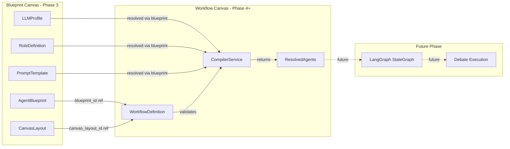

# Blueprint Canvas — Phase 4: Workflow-Builder Preparation

## 1. Overview

Phase 4 prepares the Blueprint Canvas for future evolution into a Workflow Builder (Strategist → Critic → Optimizer → Moderator). It introduces a central node registry, workflow-specific node types, a `WorkflowDefinition` backend model, a compiler service stub, and a mode switcher — all without breaking Phase 3 functionality.

### Goals
- Central, extensible `nodeRegistry` replacing hardcoded node type maps
- Palette categorized into "Assets" (Phase 3) and "Workflow Nodes" (new placeholders)
- `WorkflowNode` template with sequential I/O ports
- Backend `WorkflowDefinition` Pydantic model + SQLite table
- `CompilerService` stub for blueprint reference validation
- Frontend mode switcher: Blueprint Mode ↔ Workflow Mode
- Architecture documentation for Blueprint→Workflow interface

---

## 2. General Requirements (All Phasen)

These requirements from the user apply to **all phases** and are documented here once:

| Requirement | Enforcement |
|-------------|-------------|
| Modular, well-maintainable code with comments | Docstrings on all public functions/classes, inline comments for non-obvious logic |
| Python: Type hints everywhere | All function signatures fully typed; `from __future__ import annotations` |
| Python: Ruff-compliant | `ruff check` passes; line-length 100; select E, F, I, N, W, UP |
| Python: No code duplication | Shared utilities in common modules; DRY principle |
| Frontend: Svelte 5 Runes preferred | `$state`, `$derived`, `$effect` over `writable`/`derived` stores where possible |
| Frontend: Tailwind for all styles | No inline `style=""` attributes; scoped `<style>` only for Svelte Flow CSS overrides |
| Frontend: No `any` types without justification | JSDoc `@type` annotations; explicit types for all props |
| DB: Schema changes documented | `schema_version` table tracks migrations; each migration has a version number |
| Errors: No empty except blocks | All `except` blocks log or re-raise; minimum `logger.exception()` |
| Documentation: Phase README | `docs/blueprint-canvas-{phase}.md` per phase |

---

## 3. Architecture Decisions

### 3.1 Node Registry Pattern

**Decision: Central registry object** — replaces hardcoded `nodeTypes`/`edgeTypes` maps in [`WorkflowCanvas.svelte`](frontend/src/components/workflow/WorkflowCanvas.svelte:51).

```javascript
// frontend/src/lib/blueprint/registry.js
const registry = new Map();

export function registerNode(config) {
  registry.set(config.type, config);
}

export function getNodesByCategory(category) {
  return [...registry.values()].filter(n => n.category === category);
}

export function getNodeTypes() {
  // Returns { type: Component } map for SvelteFlow
}
```

Each registration:
```javascript
{
  type: 'agent-blueprint',
  component: AgentBlueprintNode,
  category: 'asset',        // 'asset' | 'workflow'
  schemaRef: 'AgentBlueprint',  // Pydantic model name
  icon: '🤖',
  labelKey: 'blueprint.palette.agentBlueprint',
  defaultData: { isDraft: true },
  active: true,             // false = grayed out placeholder
}
```

### 3.2 Edge Type Classification

All edges carry a mandatory `type` field that distinguishes:
- **`semantic`**: Asset relationships from Phase 3 (`uses_llm`, `implements_role`, `prompted_by`, `overrides_prompt`)
- **`control_flow`**: Workflow sequences (`sequential`, `conditional`, `interjection`)

### 3.3 Mode Switcher

Two modes in the canvas toolbar:
- **Blueprint Mode** (default): Phase 3 functionality unchanged. Only `asset` category nodes in palette. Only `semantic` edges allowed.
- **Workflow Mode**: Shows `workflow` category nodes. Allows `control_flow` edges. Palette shows both categories separated by headers.

### 3.4 SQLite Schema Versioning

New table in `blueprints.db`:
```sql
CREATE TABLE IF NOT EXISTS schema_version (
    version INTEGER PRIMARY KEY,
    description TEXT NOT NULL,
    applied_at TEXT NOT NULL
);
INSERT OR IGNORE INTO schema_version (version, description, applied_at)
VALUES (1, 'Initial blueprint schema', datetime('now'));
```

Phase 4 migration adds version 2.

---

## 4. File Plan

### 4.1 New Files

```
backend/
├── blueprints/
│   ├── compiler.py              # CompilerService stub
│   └── workflow_models.py       # WorkflowDefinition Pydantic model

frontend/src/
├── lib/blueprint/
│   ├── registry.js              # Central node registry
│   └── mode.js                  # Mode state (Blueprint ↔ Workflow)
├── components/blueprint/
│   ├── nodes/
│   │   └── WorkflowNode.svelte  # Template for workflow nodes
│   ├── ModeSwitcher.svelte      # Blueprint/Workflow toggle
│   └── PaletteCategory.svelte   # Reusable category section

docs/
└── blueprint-canvas-phase4.md   # Phase README
```

### 4.2 Modified Files

| File | Change |
|------|--------|
| `backend/blueprints/migrations.py` | Add schema_version table + v2 migration for workflow_definitions |
| `backend/blueprints/repository.py` | Add `save_workflow_definition()`, `get_workflow_definition()`, etc. |
| `backend/api/routers/blueprints.py` | Add WorkflowDefinition CRUD endpoints |
| `backend/api/routers/canvas.py` | Add compiler endpoint |
| `frontend/src/lib/blueprint/store.svelte.js` | Add `mode` state |
| `frontend/src/components/blueprint/Palette.svelte` | Use registry, show categories |
| `frontend/src/components/blueprint/BlueprintCanvas.svelte` | Mode-aware edge validation |
| `frontend/src/components/blueprint/Inspector.svelte` | Handle workflow node types |
| `frontend/src/lib/i18n/loaders/de.js` | Add workflow translations |
| `frontend/src/lib/i18n/loaders/en.js` | Add workflow translations |
| `tests/backend/test_blueprint_api.py` | Add WorkflowDefinition + compiler tests |

---

## 5. Detailed Design

### 5.1 Node Registry

**File**: `frontend/src/lib/blueprint/registry.js`

```javascript
/**
 * Central node type registry for the Blueprint Canvas.
 * Replaces hardcoded nodeTypes/edgeTypes maps.
 *
 * Each entry defines: type name, Svelte component, category,
 * backend schema reference, icon, i18n label key, and active state.
 */

/** @type {Map<string, NodeRegistration>} */
const nodes = new Map();

/** @type {Map<string, EdgeRegistration>} */
const edges = new Map();

/**
 * @typedef {Object} NodeRegistration
 * @property {string} type - Unique type identifier
 * @property {import('svelte').Component} component - Svelte component
 * @property {'asset'|'workflow'} category - Palette category
 * @property {string} schemaRef - Pydantic model name in backend
 * @property {string} icon - Emoji icon
 * @property {string} labelKey - i18n translation key
 * @property {Function} defaultData - Factory for default node data
 * @property {boolean} active - Whether the node type is usable
 */

export function registerNode(config) {
  nodes.set(config.type, config);
}

export function registerEdge(config) {
  edges.set(config.type, config);
}

export function getNodeRegistration(type) {
  return nodes.get(type);
}

export function getNodesByCategory(category) {
  return [...nodes.values()].filter(n => n.category === category);
}

export function getEdgeTypes() {
  return Object.fromEntries([...edges.entries()].map(([k, v]) => [k, v.component]));
}

export function getNodeTypes() {
  return Object.fromEntries([...nodes.entries()].map(([k, v]) => [k, v.component]));
}

export function getAllRegisteredNodes() {
  return [...nodes.values()];
}
```

Registration happens at app init:
```javascript
// frontend/src/lib/blueprint/registerAll.js
import { registerNode, registerEdge } from './registry.js';
import AgentBlueprintNode from '../../components/blueprint/nodes/AgentBlueprintNode.svelte';
// ... all imports

export function registerAllNodeTypes() {
  // --- Asset nodes (Phase 3) ---
  registerNode({
    type: 'agent-blueprint',
    component: AgentBlueprintNode,
    category: 'asset',
    schemaRef: 'AgentBlueprint',
    icon: '🤖',
    labelKey: 'blueprint.palette.agentBlueprint',
    defaultData: () => ({ isDraft: true, name: '', description: '', tags: [] }),
    active: true,
  });
  registerNode({
    type: 'llm-profile',
    component: LLMProfileNode,
    category: 'asset',
    schemaRef: 'BlueprintLLMProfile',
    icon: '🧠',
    labelKey: 'blueprint.palette.llmProfile',
    defaultData: () => ({ isDraft: true, name: '', provider: 'openrouter', model: '' }),
    active: true,
  });
  registerNode({
    type: 'role-definition',
    component: RoleDefinitionNode,
    category: 'asset',
    schemaRef: 'RoleDefinition',
    icon: '👤',
    labelKey: 'blueprint.palette.roleDefinition',
    defaultData: () => ({ isDraft: true, name: '', role: 'strategist' }),
    active: true,
  });
  registerNode({
    type: 'prompt-template',
    component: PromptTemplateNode,
    category: 'asset',
    schemaRef: 'PromptTemplate',
    icon: '📝',
    labelKey: 'blueprint.palette.promptTemplate',
    defaultData: () => ({ isDraft: true, name: '', content: '', role: 'strategist' }),
    active: true,
  });

  // --- Workflow nodes (Phase 4 — placeholders) ---
  registerNode({
    type: 'wf-strategist',
    component: WorkflowNode,
    category: 'workflow',
    schemaRef: 'WorkflowDefinition',
    icon: '🧠',
    labelKey: 'blueprint.palette.wfStrategist',
    defaultData: () => ({ isDraft: true, role: 'strategist', label: 'Strategist' }),
    active: false,  // Placeholder — grayed out in palette
  });
  registerNode({
    type: 'wf-critic',
    component: WorkflowNode,
    category: 'workflow',
    schemaRef: 'WorkflowDefinition',
    icon: '🔍',
    labelKey: 'blueprint.palette.wfCritic',
    defaultData: () => ({ isDraft: true, role: 'critic', label: 'Critic' }),
    active: false,
  });
  registerNode({
    type: 'wf-optimizer',
    component: WorkflowNode,
    category: 'workflow',
    schemaRef: 'WorkflowDefinition',
    icon: '⚡',
    labelKey: 'blueprint.palette.wfOptimizer',
    defaultData: () => ({ isDraft: true, role: 'optimizer', label: 'Optimizer' }),
    active: false,
  });
  registerNode({
    type: 'wf-moderator',
    component: WorkflowNode,
    category: 'workflow',
    schemaRef: 'WorkflowDefinition',
    icon: '🎯',
    labelKey: 'blueprint.palette.wfModerator',
    defaultData: () => ({ isDraft: true, role: 'moderator', label: 'Moderator' }),
    active: false,
  });
  registerNode({
    type: 'wf-user-input',
    component: WorkflowNode,
    category: 'workflow',
    schemaRef: 'WorkflowDefinition',
    icon: '👤',
    labelKey: 'blueprint.palette.wfUserInput',
    defaultData: () => ({ isDraft: true, role: 'user_input', label: 'User Input' }),
    active: false,
  });

  // --- Edge types ---
  registerEdge({ type: 'uses_llm', component: UsesLlmEdge, category: 'semantic' });
  registerEdge({ type: 'implements_role', component: ImplementsRoleEdge, category: 'semantic' });
  registerEdge({ type: 'prompted_by', component: PromptedByEdge, category: 'semantic' });
  registerEdge({ type: 'overrides_prompt', component: OverridesPromptEdge, category: 'semantic' });
  registerEdge({ type: 'sequential', component: SequentialEdge, category: 'control_flow' });
  registerEdge({ type: 'conditional', component: ConditionalEdge, category: 'control_flow' });
  registerEdge({ type: 'interjection', component: InterjectionEdge, category: 'control_flow' });
}
```

### 5.2 Palette with Categories

**File**: `frontend/src/components/blueprint/Palette.svelte` (modified)

```svelte
<script>
  import { getNodesByCategory } from '../../lib/blueprint/registry.js';
  import { canvasStore } from '../../lib/blueprint/store.svelte.js';
  import PaletteCategory from './PaletteCategory.svelte';

  let t = $derived(/* i18n */);

  let assetNodes = $derived(getNodesByCategory('asset'));
  let workflowNodes = $derived(getNodesByCategory('workflow'));
  let isWorkflowMode = $derived(canvasStore.mode === 'workflow');
</script>

<div class="palette" data-testid="blueprint-palette">
  <!-- Always visible: Assets -->
  <PaletteCategory
    title={t('blueprint.palette.assets')}
    nodes={assetNodes}
  />

  <!-- Only in Workflow Mode -->
  {#if isWorkflowMode}
    <PaletteCategory
      title={t('blueprint.palette.workflowNodes')}
      nodes={workflowNodes}
    />
  {/if}

  <!-- Saved Layouts -->
  <div class="mt-4 border-t border-gray-200 dark:border-gray-700 pt-4">
    <h3 class="text-xs font-semibold text-gray-500 uppercase px-3 mb-2">
      {t('blueprint.palette.savedLayouts')}
    </h3>
    <!-- Layout list... -->
  </div>
</div>
```

**`PaletteCategory.svelte`**: Reusable component rendering a list of draggable palette items. Inactive items (`active: false`) are rendered with `opacity-50 cursor-not-allowed` and `draggable="false"`.

### 5.3 WorkflowNode Template

**File**: `frontend/src/components/blueprint/nodes/WorkflowNode.svelte`

```svelte
<script>
  import { Handle, Position } from '@xyflow/svelte';

  /** @type {{ data: { role: string, label: string, isDraft: boolean, blueprintId?: string } }} */
  let { data } = $props();

  const roleColors = {
    strategist: { border: '#8b5cf6', bg: '#f5f3ff' },
    critic: { border: '#ef4444', bg: '#fef2f2' },
    optimizer: { border: '#f59e0b', bg: '#fffbeb' },
    moderator: { border: '#10b981', bg: '#ecfdf5' },
    user_input: { border: '#6366f1', bg: '#eef2ff' },
  };

  let colors = $derived(roleColors[data.role] || roleColors.strategist);
  let isLinked = $derived(!!data.blueprintId);
</script>

<div
  class="workflow-node rounded-xl border-2 p-3 min-w-[180px] shadow-sm transition-all"
  class:opacity-60={data.isDraft}
  style="border-color: {colors.border}; background: {colors.bg};"
  data-testid="node-workflow-{data.role}"
>
  <!-- Previous step input -->
  <Handle type="target" position={Position.LEFT} id="prev" />

  <div class="flex items-center gap-2 mb-1">
    <span class="text-lg">{data.icon || '⚙️'}</span>
    <span class="font-bold text-sm" style="color: {colors.border};">{data.label}</span>
  </div>

  <div class="text-xs text-gray-500">
    {#if isLinked}
      <span class="text-green-600">✓ {t('blueprint.inspector.linked')}</span>
    {:else}
      <span class="text-gray-400">○ {t('blueprint.inspector.notLinked')}</span>
    {/if}
  </div>

  <!-- Next step output -->
  <Handle type="source" position={Position.RIGHT} id="next" />

  <!-- Interjection input (for user_input / external input) -->
  {#if data.role === 'user_input'}
    <Handle type="target" position={Position.BOTTOM} id="interjection" />
  {/if}
</div>
```

### 5.4 Backend: WorkflowDefinition Model

**File**: `backend/blueprints/workflow_models.py`

```python
"""Workflow definition models for the Blueprint Canvas workflow builder."""

from __future__ import annotations

import uuid
from datetime import UTC, datetime
from typing import Literal

from pydantic import BaseModel, Field, field_validator


class ConditionalEdge(BaseModel):
    """An edge with a condition expression."""

    source_node_id: str
    target_node_id: str
    condition: str  # e.g. "consensus_reached", "round >= 3", "user_approved"
    description: str = ""


class InterjectionPoint(BaseModel):
    """A node that accepts external input during workflow execution."""

    node_id: str
    input_type: Literal["user_query", "oob_input", "external_event"] = "user_query"
    description: str = ""
    blocking: bool = True  # If True, workflow pauses until input received


class WorkflowDefinition(BaseModel):
    """Defines a complete debate workflow.

    References AgentBlueprints from the catalog by ID.
    Does NOT duplicate blueprint data.
    """

    id: str = Field(default_factory=lambda: str(uuid.uuid4())[:8])
    name: str = Field(..., min_length=1, max_length=200)
    description: str = ""

    # Layout reference
    canvas_layout_id: str | None = None  # References CanvasLayout.id

    # Execution order: ordered list of node IDs
    execution_order: list[str] = Field(default_factory=list)

    # Conditional edges (branching logic)
    conditional_edges: list[ConditionalEdge] = Field(default_factory=list)

    # Interjection points (external input nodes)
    interjection_points: list[InterjectionPoint] = Field(default_factory=list)

    # Referenced blueprints (node_id → blueprint_id mapping)
    node_blueprint_map: dict[str, str] = Field(default_factory=dict)

    # Metadata
    tags: list[str] = Field(default_factory=list)
    is_active: bool = True
    created_at: datetime = Field(default_factory=lambda: datetime.now(UTC))
    updated_at: datetime = Field(default_factory=lambda: datetime.now(UTC))

    @field_validator("execution_order")
    @classmethod
    def validate_execution_order(cls, v: list[str]) -> list[str]:
        if len(v) != len(set(v)):
            raise ValueError("execution_order contains duplicate node IDs")
        return v
```

### 5.5 Backend: SQLite Migration (v2)

**File**: `backend/blueprints/migrations.py` (additions)

```python
def _migrate_v2(conn: sqlite3.Connection) -> None:
    """Add schema_version table and workflow_definitions table."""
    # Schema version tracking
    conn.execute("""
        CREATE TABLE IF NOT EXISTS schema_version (
            version INTEGER PRIMARY KEY,
            description TEXT NOT NULL,
            applied_at TEXT NOT NULL
        )
    """)

    # Check if v2 already applied
    cursor = conn.execute("SELECT COUNT(*) FROM schema_version WHERE version = 2")
    if cursor.fetchone()[0] > 0:
        return

    # Workflow definitions table
    conn.execute("""
        CREATE TABLE IF NOT EXISTS workflow_definitions (
            id TEXT PRIMARY KEY,
            name TEXT NOT NULL,
            description TEXT DEFAULT '',
            canvas_layout_id TEXT,
            execution_order_json TEXT DEFAULT '[]',
            conditional_edges_json TEXT DEFAULT '[]',
            interjection_points_json TEXT DEFAULT '[]',
            node_blueprint_map_json TEXT DEFAULT '{}',
            tags_json TEXT DEFAULT '[]',
            is_active INTEGER DEFAULT 1,
            created_at TEXT NOT NULL,
            updated_at TEXT NOT NULL,
            FOREIGN KEY (canvas_layout_id) REFERENCES canvas_layouts(id) ON DELETE SET NULL
        )
    """)
    conn.execute("""
        CREATE INDEX IF NOT EXISTS idx_workflow_def_layout
        ON workflow_definitions (canvas_layout_id)
    """)

    # Record migration
    conn.execute(
        "INSERT INTO schema_version (version, description, applied_at) VALUES (?, ?, ?)",
        (2, "Add workflow_definitions table", datetime.now(UTC).isoformat()),
    )
    conn.commit()
```

### 5.6 Backend: CompilerService Stub

**File**: `backend/blueprints/compiler.py`

```python
"""Compiler service — validates WorkflowDefinitions against the Blueprint catalog.

Stub implementation: validates references only.
Full LangGraph compilation is a future phase.
"""

from __future__ import annotations

import logging
from dataclasses import dataclass

from backend.blueprints.repository import BlueprintRepository
from backend.blueprints.workflow_models import WorkflowDefinition

logger = logging.getLogger(__name__)


@dataclass
class ResolvedAgent:
    """A resolved agent reference from a WorkflowDefinition."""

    node_id: str
    blueprint_id: str
    blueprint_name: str
    llm_profile_id: str
    llm_model: str
    role_definition_id: str
    role: str
    prompt_template_id: str | None


@dataclass
class CompilationResult:
    """Result of compiling a WorkflowDefinition."""

    is_valid: bool
    resolved_agents: list[ResolvedAgent]
    errors: list[str]
    warnings: list[str]


class CompilerService:
    """Validates and compiles WorkflowDefinitions into executable form."""

    def __init__(self, repo: BlueprintRepository):
        self._repo = repo

    def compile(self, workflow: WorkflowDefinition) -> CompilationResult:
        """Validate blueprint references and resolve agent configurations.

        Does NOT generate a LangGraph StateGraph — that is a future phase.
        """
        errors: list[str] = []
        warnings: list[str] = []
        resolved: list[ResolvedAgent] = []

        # 1. Validate all referenced blueprints exist
        for node_id, blueprint_id in workflow.node_blueprint_map.items():
            blueprint = self._repo.get_blueprint(blueprint_id)
            if blueprint is None:
                errors.append(
                    f"Node '{node_id}': AgentBlueprint '{blueprint_id}' not found in catalog"
                )
                continue

            if not blueprint.is_active:
                warnings.append(
                    f"Node '{node_id}': AgentBlueprint '{blueprint_id}' is inactive"
                )

            # Resolve LLM profile
            llm_profile = self._repo.get_llm_profile(blueprint.llm_profile_id)
            if llm_profile is None:
                errors.append(
                    f"Node '{node_id}': LLMProfile '{blueprint.llm_profile_id}' not found"
                )
                continue

            # Resolve role definition
            role_def = self._repo.get_role_definition(blueprint.role_definition_id)
            if role_def is None:
                errors.append(
                    f"Node '{node_id}': RoleDefinition '{blueprint.role_definition_id}' not found"
                )
                continue

            resolved.append(ResolvedAgent(
                node_id=node_id,
                blueprint_id=blueprint.id,
                blueprint_name=blueprint.name,
                llm_profile_id=llm_profile.id,
                llm_model=llm_profile.model,
                role_definition_id=role_def.id,
                role=role_def.role,
                prompt_template_id=blueprint.prompt_template_id or role_def.prompt_template_id,
            ))

        # 2. Validate execution_order references valid node IDs
        all_node_ids = set(workflow.node_blueprint_map.keys())
        for node_id in workflow.execution_order:
            if node_id not in all_node_ids:
                errors.append(
                    f"execution_order references unknown node '{node_id}'"
                )

        # 3. Validate conditional edges reference valid nodes
        for edge in workflow.conditional_edges:
            if edge.source_node_id not in all_node_ids:
                errors.append(f"Conditional edge source '{edge.source_node_id}' not in node map")
            if edge.target_node_id not in all_node_ids:
                errors.append(f"Conditional edge target '{edge.target_node_id}' not in node map")

        # 4. Validate interjection points reference valid nodes
        for point in workflow.interjection_points:
            if point.node_id not in all_node_ids:
                errors.append(f"Interjection point '{point.node_id}' not in node map")

        # TODO: Future phase — translate to LangGraph StateGraph
        # graph = self._build_langgraph(workflow, resolved)

        return CompilationResult(
            is_valid=len(errors) == 0,
            resolved_agents=resolved,
            errors=errors,
            warnings=warnings,
        )
```

### 5.7 Backend: Repository Additions

**File**: `backend/blueprints/repository.py` (additions)

```python
def save_workflow_definition(self, wf: WorkflowDefinition) -> None:
    with self._connect() as conn:
        conn.execute(
            """INSERT OR REPLACE INTO workflow_definitions
            (id, name, description, canvas_layout_id, execution_order_json,
             conditional_edges_json, interjection_points_json, node_blueprint_map_json,
             tags_json, is_active, created_at, updated_at)
            VALUES (?, ?, ?, ?, ?, ?, ?, ?, ?, ?, ?, ?)""",
            (wf.id, wf.name, wf.description, wf.canvas_layout_id,
             json.dumps(wf.execution_order),
             json.dumps([e.model_dump() for e in wf.conditional_edges]),
             json.dumps([p.model_dump() for p in wf.interjection_points]),
             json.dumps(wf.node_blueprint_map),
             json.dumps(wf.tags),
             int(wf.is_active),
             wf.created_at.isoformat(),
             wf.updated_at.isoformat()),
        )

def get_workflow_definition(self, wf_id: str) -> WorkflowDefinition | None: ...
def list_workflow_definitions(self, limit: int = 50, offset: int = 0) -> list[WorkflowDefinition]: ...
def delete_workflow_definition(self, wf_id: str) -> bool: ...
```

### 5.8 Backend: API Endpoints

**File**: `backend/api/routers/blueprints.py` (additions)

```
GET    /api/v1/blueprints/workflows          → list[WorkflowDefinition]
GET    /api/v1/blueprints/workflows/{id}      → WorkflowDefinition
POST   /api/v1/blueprints/workflows           → WorkflowDefinition (201)
PUT    /api/v1/blueprints/workflows/{id}      → WorkflowDefinition
DELETE /api/v1/blueprints/workflows/{id}      → {"status": "ok"}
POST   /api/v1/blueprints/workflows/{id}/compile → CompilationResult
```

### 5.9 Frontend: Mode Switcher

**File**: `frontend/src/components/blueprint/ModeSwitcher.svelte`

```svelte
<script>
  import { canvasStore } from '../../lib/blueprint/store.svelte.js';

  let t = $derived(/* i18n */);
  let mode = $derived(canvasStore.mode);
</script>

<div class="flex items-center gap-1 bg-gray-100 dark:bg-gray-700 rounded-lg p-1" data-testid="mode-switcher">
  <button
    class="px-3 py-1.5 text-xs font-medium rounded-md transition-colors
      {mode === 'blueprint'
        ? 'bg-white dark:bg-gray-600 text-blue-700 dark:text-blue-200 shadow-sm'
        : 'text-gray-500 hover:text-gray-700 dark:text-gray-400'}"
    onclick={() => canvasStore.setMode('blueprint')}
    data-testid="mode-blueprint"
  >
    🧩 {t('blueprint.mode.blueprint')}
  </button>
  <button
    class="px-3 py-1.5 text-xs font-medium rounded-md transition-colors
      {mode === 'workflow'
        ? 'bg-white dark:bg-gray-600 text-violet-700 dark:text-violet-200 shadow-sm'
        : 'text-gray-500 hover:text-gray-700 dark:text-gray-400'}"
    onclick={() => canvasStore.setMode('workflow')}
    data-testid="mode-workflow"
  >
    ⚙️ {t('blueprint.mode.workflow')}
  </button>
</div>
```

### 5.10 Frontend: Store Mode Addition

**File**: `frontend/src/lib/blueprint/store.svelte.js` (additions)

```javascript
class BlueprintCanvasStore {
  // ... existing from Phase 3 ...
  mode = $state('blueprint');  // 'blueprint' | 'workflow'

  setMode(newMode) {
    if (newMode === this.mode) return;
    this.mode = newMode;
    // When switching to blueprint mode, remove any workflow-only nodes
    if (newMode === 'blueprint') {
      this.nodes = this.nodes.filter(n => {
        const reg = getNodeRegistration(n.type);
        return reg?.category === 'asset';
      });
      this.edges = this.edges.filter(e => {
        const reg = getEdgeRegistration(e.type);
        return reg?.category === 'semantic';
      });
    }
  }
}
```

### 5.11 Frontend: Edge Type Classification

Connection validation updated:

```javascript
// frontend/src/lib/blueprint/validation.js

export function validateConnection(sourceType, targetType, currentMode) {
  const reg = getNodeRegistration(sourceType);
  if (!reg) return { valid: false, reason: 'unknown_source' };

  // In blueprint mode, only semantic edges allowed
  if (currentMode === 'blueprint') {
    return validateSemanticConnection(sourceType, targetType);
  }

  // In workflow mode, both semantic and control_flow allowed
  const semantic = validateSemanticConnection(sourceType, targetType);
  if (semantic.valid) return semantic;

  return validateControlFlowConnection(sourceType, targetType);
}

function validateControlFlowConnection(sourceType, targetType) {
  // Workflow nodes can connect sequentially
  const sourceReg = getNodeRegistration(sourceType);
  const targetReg = getNodeRegistration(targetType);
  if (sourceReg?.category === 'workflow' && targetReg?.category === 'workflow') {
    return { valid: true, edgeType: 'sequential' };
  }
  return { valid: false, reason: 'invalid_control_flow' };
}
```

### 5.12 New Control Flow Edge Components

Three new edge components following the [`FlowEdge.svelte`](frontend/src/components/workflow/edges/FlowEdge.svelte:1) pattern:

| Edge | Color | Style | Purpose |
|------|-------|-------|---------|
| `SequentialEdge` | Indigo `#6366f1` | Solid, 2.5px | Step A → Step B |
| `ConditionalEdge` | Amber `#f59e0b` | Dashed, 2px | Branch with condition label |
| `InterjectionEdge` | Rose `#f43f5e` | Dotted, 2px | External input point |

---

## 6. Implementation Order

| Step | Task | Files |
|------|------|-------|
| 1 | Add schema_version table + v2 migration | `backend/blueprints/migrations.py` |
| 2 | Add WorkflowDefinition model | `backend/blueprints/workflow_models.py` |
| 3 | Add repository methods for workflow definitions | `backend/blueprints/repository.py` |
| 4 | Add WorkflowDefinition CRUD endpoints | `backend/api/routers/blueprints.py` |
| 5 | Implement CompilerService stub | `backend/blueprints/compiler.py` |
| 6 | Add compiler endpoint | `backend/api/routers/canvas.py` |
| 7 | Create node registry | `frontend/src/lib/blueprint/registry.js` |
| 8 | Register all node + edge types | `frontend/src/lib/blueprint/registerAll.js` |
| 9 | Create WorkflowNode template | `frontend/src/components/blueprint/nodes/WorkflowNode.svelte` |
| 10 | Create 3 control flow edge components | `frontend/src/components/blueprint/edges/*.svelte` |
| 11 | Create PaletteCategory component | `frontend/src/components/blueprint/PaletteCategory.svelte` |
| 12 | Create ModeSwitcher component | `frontend/src/components/blueprint/ModeSwitcher.svelte` |
| 13 | Update Palette to use registry + categories | `frontend/src/components/blueprint/Palette.svelte` |
| 14 | Update store with mode state | `frontend/src/lib/blueprint/store.svelte.js` |
| 15 | Update connection validation for modes | `frontend/src/lib/blueprint/validation.js` |
| 16 | Update BlueprintCanvas for mode awareness | `frontend/src/components/blueprint/BlueprintCanvas.svelte` |
| 17 | Add i18n translations | `de.js`, `en.js` |
| 18 | Write backend tests | `tests/backend/test_blueprint_api.py` |
| 19 | Write phase README | `docs/blueprint-canvas-phase4.md` |

---

## 7. Architecture Documentation

**File**: `docs/blueprint-canvas-phase4.md`

Documents the interface between Blueprint Canvas and future Workflow Canvas:

### Data Flow: Blueprint → Workflow



### Interface Contract

| Data | From | To | Format |
|------|------|----|--------|
| AgentBlueprint IDs | CanvasLayout.node[].blueprint_id | WorkflowDefinition.node_blueprint_map | `dict[node_id, blueprint_id]` |
| LLMProfile IDs | AgentBlueprint.llm_profile_id | CompilerService resolution | String reference |
| RoleDefinition IDs | AgentBlueprint.role_definition_id | CompilerService resolution | String reference |
| PromptTemplate IDs | AgentBlueprint.prompt_template_id | CompilerService resolution | String reference (optional) |
| Execution order | CanvasLayout edges | WorkflowDefinition.execution_order | `list[node_id]` |
| Conditions | User input in Inspector | WorkflowDefinition.conditional_edges | `list[ConditionalEdge]` |
| Interjection points | User input in Inspector | WorkflowDefinition.interjection_points | `list[InterjectionPoint]` |

---

## 8. Acceptance Criteria Mapping

| Criterion | Implementation |
|-----------|---------------|
| Mode switcher toggles Blueprint/Workflow | `ModeSwitcher.svelte` + `canvasStore.setMode()` |
| Blueprint Mode unchanged from Phase 3 | Mode switch only affects palette visibility and edge validation |
| Backend accepts/validates WorkflowDefinition | Pydantic model + CRUD endpoints |
| CompilerService validates blueprint references | `CompilerService.compile()` checks all IDs exist |
| Workflow nodes registered and visible in Workflow Mode | `registry.js` + `PaletteCategory.svelte` with `active: false` placeholders |
