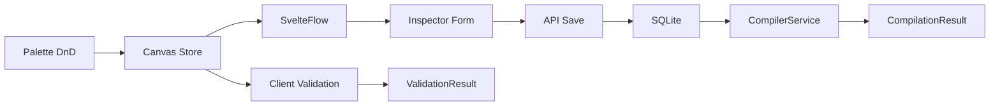
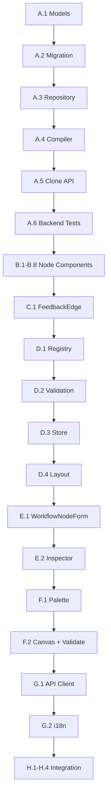

# Phase 1: Workflow Graph Builder — Implementation Plan

## 1. Overview

### Goals
- Activate Workflow Mode fully with 8 specialized debate node types
- Implement 4 semantically distinct edge types with visual differentiation
- Extend backend `WorkflowDefinition` model with structured nodes/edges/entry_point/termination
- Add backend validation (entry point, isolated nodes, blueprint refs, gate outputs, cycles)
- Add frontend DFS-based client-side validation via "Validate" button
- Add workflow duplication and versioning (`POST /api/v1/workflows/{id}/clone`)
- ELK.js auto-layout with `feedbackEdges: true` for feedback edge routing

### Current State
- Phase 4 created placeholder workflow nodes (`wf-strategist`, `wf-critic`, etc.) with `active: false`
- Generic [`WorkflowNode.svelte`](frontend/src/components/blueprint/nodes/WorkflowNode.svelte) template exists
- 3 control flow edge types exist: [`SequentialEdge`](frontend/src/components/blueprint/edges/SequentialEdge.svelte), [`ConditionalEdge`](frontend/src/components/blueprint/edges/ConditionalEdge.svelte), [`InterjectionEdge`](frontend/src/components/blueprint/edges/InterjectionEdge.svelte)
- Backend [`WorkflowDefinition`](backend/blueprints/workflow_models.py:37) has `execution_order`, `conditional_edges`, `interjection_points`, `node_blueprint_map`
- [`CompilerService`](backend/blueprints/compiler.py:42) validates blueprint references
- Schema at version 3 ([`migrations.py`](backend/blueprints/migrations.py:20))

---

## 2. Architecture

### 2.1 Node Type Taxonomy

| Type ID | Component | Role | Icon | Color | Handles |
|---------|-----------|------|------|-------|---------|
| `wf-input` | InputNode | Entry point — user case text | 📥 | #3b82f6 | RIGHT source |
| `wf-initialize` | InitializeNode | Setup/initialization step | 🚀 | #06b6d4 | LEFT target, RIGHT source |
| `wf-strategist` | StrategistNode | Strategic analysis agent | 🧠 | #8b5cf6 | LEFT target, RIGHT source |
| `wf-critic` | CriticNode | Critical review agent | 🔍 | #ef4444 | LEFT target, RIGHT source |
| `wf-optimizer` | OptimizerNode | Optimization agent | ⚡ | #f59e0b | LEFT target, RIGHT source |
| `wf-moderator` | ModeratorNode | Consensus/moderation agent | 🎯 | #10b981 | LEFT target, RIGHT source, BOTTOM feedback |
| `wf-user-injection` | UserInjectionNode | External user input point | 👤 | #6366f1 | LEFT target, RIGHT source, BOTTOM interjection |
| `wf-gate` | GateNode | Conditional branching | 🔀 | #f43f5e | LEFT target, RIGHT true, BOTTOM false |

### 2.2 Edge Type Taxonomy

| Type ID | Component | Visual | Color | Style | Label |
|---------|-----------|--------|-------|-------|-------|
| `sequential` | SequentialEdge | Solid line, arrow | #6366f1 | solid | — |
| `conditional` | ConditionalEdge | Dashed line, condition label | #f59e0b | dashed 8 4 | condition text |
| `interjection` | InterjectionEdge | Dotted line, rose | #f43f5e | dotted 4 4 | — |
| `feedback` | FeedbackEdge | Dash-dot line, curved back | #10b981 | dash-dot | "feedback" |

### 2.3 Data Flow



### 2.4 Backend Model Extension

The [`WorkflowDefinition`](backend/blueprints/workflow_models.py:37) model will be extended with:

```python
class WorkflowNode(BaseModel):
    id: str
    type: Literal["wf-input", "wf-initialize", "wf-strategist", "wf-critic",
                   "wf-optimizer", "wf-moderator", "wf-user-injection", "wf-gate"]
    label: str = ""
    agent_blueprint_id: str | None = None  # Required for agent nodes
    config: dict = Field(default_factory=dict)  # Node-specific config

class WorkflowEdge(BaseModel):
    id: str
    source: str  # node ID
    target: str  # node ID
    type: Literal["sequential", "conditional", "interjection", "feedback"]
    condition: str | None = None  # Required for conditional edges
    data: dict = Field(default_factory=dict)

class TerminationCondition(BaseModel):
    type: Literal["max_rounds", "consensus_reached", "gate_exit", "manual"]
    value: int | float | None = None
    description: str = ""

class WorkflowDefinition(BaseModel):
    # ... existing fields ...
    nodes: list[WorkflowNode] = Field(default_factory=list)
    edges: list[WorkflowEdge] = Field(default_factory=list)
    entry_point: str | None = None  # Node ID of the entry point
    termination_conditions: list[TerminationCondition] = Field(default_factory=list)
    version: int = 1
    is_locked: bool = False
```

---

## 3. Implementation Tasks

### Group A: Backend Model Extension

**A.1** Extend [`workflow_models.py`](backend/blueprints/workflow_models.py) with `WorkflowNode`, `WorkflowEdge`, `TerminationCondition` models
- Add `WorkflowNode` Pydantic model with type literal, agent_blueprint_id, config
- Add `WorkflowEdge` Pydantic model with type literal, condition
- Add `TerminationCondition` Pydantic model
- Extend `WorkflowDefinition` with `nodes`, `edges`, `entry_point`, `termination_conditions`, `version`, `is_locked` fields
- Add field validators: entry_point must reference a valid node ID, agent nodes must have agent_blueprint_id

**A.2** Add SQLite migration v4 for new columns on `workflow_definitions`
- Add `nodes_json TEXT DEFAULT '[]'`
- Add `edges_json TEXT DEFAULT '[]'`
- Add `entry_point TEXT`
- Add `termination_conditions_json TEXT DEFAULT '[]'`
- Add `version INTEGER DEFAULT 1`
- Add `is_locked INTEGER DEFAULT 0`
- Bump `SCHEMA_VERSION` to 4

**A.3** Update [`repository.py`](backend/blueprints/repository.py) `save_workflow_definition` and `_row_to_workflow_definition`
- Serialize/deserialize new fields (nodes_json, edges_json, entry_point, termination_conditions_json, version, is_locked)

**A.4** Extend [`compiler.py`](backend/blueprints/compiler.py) validation
- Validate entry_point references a valid node
- Validate all agent nodes have valid agent_blueprint_id references
- Validate gate nodes have at least 2 outgoing edges
- Validate no isolated nodes (every node must have at least one edge)
- Detect cycles (warning, not error — feedback edges create intentional cycles)
- Validate edge source/target reference valid node IDs

**A.5** Add clone endpoint to [`blueprints.py`](backend/api/routers/blueprints.py)
- `POST /api/v1/blueprints/workflows/{wf_id}/clone`
- Deep-copies the workflow with new ID, incremented version, `is_locked=False`
- Returns the cloned workflow

**A.6** Write backend tests for new models, migration, repository, API clone endpoint
- Test `WorkflowNode` model validation (agent nodes require blueprint_id)
- Test `WorkflowEdge` model validation (conditional edges require condition)
- Test `TerminationCondition` model
- Test extended `WorkflowDefinition` with nodes/edges/entry_point
- Test migration v4 applies cleanly
- Test repository roundtrip with new fields
- Test clone endpoint (creates new ID, increments version)
- Test compiler validation (missing entry_point, isolated nodes, invalid refs, gate outputs)

### Group B: Frontend Node Components

**B.1** Create [`InputNode.svelte`](frontend/src/components/blueprint/nodes/InputNode.svelte)
- Blue (#3b82f6) themed, 📥 icon
- RIGHT source handle only (no target — it's the entry point)
- Shows "Case Input" label, linked status
- data-testid="node-wf-input"

**B.2** Create [`InitializeNode.svelte`](frontend/src/components/blueprint/nodes/InitializeNode.svelte)
- Cyan (#06b6d4) themed, 🚀 icon
- LEFT target + RIGHT source handles
- Shows label, linked status
- data-testid="node-wf-initialize"

**B.3** Create [`StrategistNode.svelte`](frontend/src/components/blueprint/nodes/StrategistNode.svelte)
- Purple (#8b5cf6) themed, 🧠 icon
- LEFT target + RIGHT source handles
- Shows label, AgentBlueprint name if linked, linked status
- data-testid="node-wf-strategist"

**B.4** Create [`CriticNode.svelte`](frontend/src/components/blueprint/nodes/CriticNode.svelte)
- Red (#ef4444) themed, 🔍 icon
- LEFT target + RIGHT source handles
- Shows label, AgentBlueprint name if linked, linked status
- data-testid="node-wf-critic"

**B.5** Create [`OptimizerNode.svelte`](frontend/src/components/blueprint/nodes/OptimizerNode.svelte)
- Amber (#f59e0b) themed, ⚡ icon
- LEFT target + RIGHT source handles
- Shows label, AgentBlueprint name if linked, linked status
- data-testid="node-wf-optimizer"

**B.6** Create [`ModeratorNode.svelte`](frontend/src/components/blueprint/nodes/ModeratorNode.svelte)
- Green (#10b981) themed, 🎯 icon
- LEFT target + RIGHT source + BOTTOM feedback handles
- Shows label, AgentBlueprint name if linked, linked status
- data-testid="node-wf-moderator"

**B.7** Create [`UserInjectionNode.svelte`](frontend/src/components/blueprint/nodes/UserInjectionNode.svelte)
- Indigo (#6366f1) themed, 👤 icon
- LEFT target + RIGHT source + BOTTOM interjection handles
- Shows label, input_type indicator
- data-testid="node-wf-user-injection"

**B.8** Create [`GateNode.svelte`](frontend/src/components/blueprint/nodes/GateNode.svelte)
- Rose (#f43f5e) themed, 🔀 icon
- LEFT target + RIGHT true-branch + BOTTOM false-branch handles
- Shows label, condition summary
- data-testid="node-wf-gate"

### Group C: Frontend Edge Component

**C.1** Create [`FeedbackEdge.svelte`](frontend/src/components/blueprint/edges/FeedbackEdge.svelte)
- Green (#10b981) themed, dash-dot stroke pattern
- Uses `getBezierPath` with offset for visual feedback loop
- Shows "feedback" label via foreignObject
- data-testid="edge-feedback"

### Group D: Registry & Validation Updates

**D.1** Update [`registerAll.js`](frontend/src/lib/blueprint/registerAll.js)
- Remove 5 placeholder workflow node registrations (lines 127-200)
- Register 8 new specialized node types with `active: true`
- Register `feedback` edge type with `FeedbackEdge` component
- Import all new components

**D.2** Update [`validation.js`](frontend/src/lib/blueprint/validation.js)
- Add `WORKFLOW_CONNECTION_RULES` map defining allowed connections per node type
- `wf-input` → only outgoing (source), targets: any agent/gate/initialize
- `wf-initialize` → incoming from input, outgoing to agents
- Agent nodes → incoming from any, outgoing to any agent/gate/moderator
- `wf-moderator` → incoming from agents, outgoing to agents (feedback) or gate
- `wf-user-injection` → incoming from any, outgoing to any (interjection edge)
- `wf-gate` → incoming from any, outgoing conditional (true/false branches)
- Add `feedback` to `EDGE_STYLES`
- Update `validateControlFlowConnection()` with specific rules per node type
- Add `getWorkflowEdgeType(sourceType, targetType, data?)` function

**D.3** Update [`store.svelte.js`](frontend/src/lib/blueprint/store.svelte.js) `loadFromLayout()`
- Add new workflow node types to `nodeTypeMap`
- Handle `role-type` in the map

**D.4** Update [`layout.js`](frontend/src/lib/blueprint/layout.js)
- Add `NODE_DIMENSIONS` entries for all 8 workflow node types
- Add `feedbackEdges: true` to elkOptions
- Add `elk.layered.feedbackEdges: 'true'` option

### Group E: Inspector Forms

**E.1** Create [`WorkflowNodeForm.svelte`](frontend/src/components/blueprint/forms/WorkflowNodeForm.svelte)
- Generic form for all workflow node types
- Shows: label (editable), node type (read-only), linked AgentBlueprint
- For agent nodes: AgentBlueprint selector dropdown (fetched from API)
- For gate nodes: condition text input
- For user-injection nodes: input_type selector
- Save updates node data via `canvasStore.updateNodeData()`

**E.2** Update [`Inspector.svelte`](frontend/src/components/blueprint/Inspector.svelte)
- Add routing for all 8 workflow node types → `WorkflowNodeForm`
- Import `WorkflowNodeForm`

### Group F: Palette & Mode Updates

**F.1** Update [`Palette.svelte`](frontend/src/components/blueprint/Palette.svelte)
- In workflow mode: hide asset nodes section, show only workflow nodes
- Add "Workflow Definition" section with workflow-level controls (name, description)

**F.2** Update [`BlueprintCanvas.svelte`](frontend/src/components/blueprint/BlueprintCanvas.svelte)
- Add "Validate" button to toolbar (visible only in workflow mode)
- Implement DFS-based client-side validation:
  - Check entry point exists (node with no incoming sequential edges)
  - Check all nodes reachable from entry point
  - Check no isolated nodes
  - Check gate nodes have ≥2 outgoing edges
  - Check agent nodes have agent_blueprint_id set
  - Display validation results in a toast/panel
- Add "Clone Workflow" button
- Update MiniMap `nodeColor` function for new node types

### Group G: API Client & i18n

**G.1** Update [`api.js`](frontend/src/lib/blueprint/api.js)
- Add `cloneWorkflow(wfId)` function → `POST /api/v1/blueprints/workflows/${wfId}/clone`
- Add `validateWorkflow(wfId)` function (optional — if we add a backend validate endpoint)

**G.2** Update [`en.js`](frontend/src/lib/i18n/loaders/en.js) and [`de.js`](frontend/src/lib/i18n/loaders/de.js)
- Add palette labels/descriptions for all 8 workflow node types
- Add edge labels for `feedback`
- Add form labels for workflow node inspector
- Add validation result messages
- Add clone/validate button labels

### Group H: Integration & Testing

**H.1** Update [`dnd.js`](frontend/src/lib/blueprint/dnd.js) if needed
- Ensure `createDraftNode()` handles new workflow node types with correct default data

**H.2** Run all backend tests — verify 190+ tests pass
**H.3** Run frontend build — verify no compilation errors
**H.4** Manual smoke test: create workflow with all 8 node types, connect with all 4 edge types, validate, clone

---

## 4. Implementation Order



---

## 5. Acceptance Criteria

| # | Criterion | Task |
|---|-----------|------|
| AC1 | 8 workflow node types appear in palette when Workflow Mode active | D.1, F.1 |
| AC2 | Each node type renders with distinct color/icon | B.1-B.8 |
| AC3 | Agent nodes show AgentBlueprint selector in Inspector | E.1, E.2 |
| AC4 | 4 edge types render with distinct visual styles | C.1, D.1 |
| AC5 | ELK.js auto-layout works with feedbackEdges | D.4 |
| AC6 | Backend stores nodes/edges/entry_point/termination | A.1, A.2, A.3 |
| AC7 | Backend validates entry point, isolated nodes, refs, gates, cycles | A.4 |
| AC8 | Frontend "Validate" button runs DFS validation | F.2 |
| AC9 | Clone endpoint creates deep copy with new ID | A.5 |
| AC10 | All existing tests still pass | H.2 |
| AC11 | i18n for all new UI elements in en + de | G.2 |
