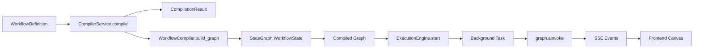
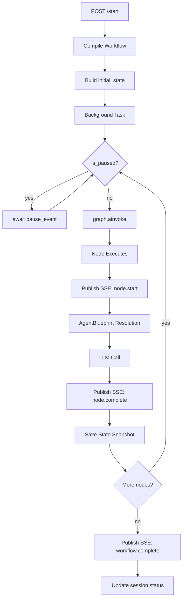

# Phase 2: LangGraph Compilation & Execution — Implementation Plan

## 1. Overview

### Goals
- Extend [`CompilerService`](backend/blueprints/compiler.py:42) to produce real LangGraph `StateGraph` objects from [`WorkflowDefinition`](backend/blueprints/workflow_models.py:37)
- Create a new `WorkflowState` TypedDict for workflow-based execution (parallel to existing [`DebateState`](backend/workflow/state.py:60))
- Implement node execution functions that resolve [`AgentBlueprint`](backend/blueprints/models.py) references at runtime and call LLMs via [`LLMService`](backend/services/llm_service.py:41)
- Build [`InterjectionService`](backend/workflow/interjection.py) for runtime document/question injection
- Create [`ExecutionEngine`](backend/api/routers/workflow_exec.py) as a FastAPI service (start, pause, resume, state query)
- Wire SSE streaming via the existing [event bus](backend/api/events.py:17) with workflow-specific event types
- Connect frontend canvas to backend execution via SSE (visual node status updates)
- Add SQLite state snapshots after each node execution for recovery and audit

### Current State
- [`CompilerService`](backend/blueprints/compiler.py:42) validates blueprint references only — does NOT generate LangGraph graphs
- Existing debate workflow uses [`build_graph()`](backend/workflow/debate_graph.py:22) with hardcoded `initialize → run_agent → check_consensus → complete` flow
- [`DebateState`](backend/workflow/state.py:60) TypedDict with `Annotated[list, operator.add]` accumulators
- [`run_agent_node()`](backend/workflow/nodes.py:122) resolves profiles, prompts, calls LLM, publishes SSE events
- In-memory [event bus](backend/api/events.py:17) with `subscribe/unsubscribe/publish_async` pattern
- [`_run_debate_workflow()`](backend/api/routers/debate.py:749) as background task with `graph.ainvoke(initial_state)`
- SSE streaming via [`_sse_events()`](backend/api/routers/debate.py:1035) generator
- [`blueprint_events.py`](backend/api/routers/blueprint_events.py:17) is a stub SSE endpoint
- Schema at version 3 ([`migrations.py`](backend/blueprints/migrations.py:20))
- Phase 1 plan defines 8 node types, 4 edge types, structured `WorkflowDefinition` with `nodes`, `edges`, `entry_point`, `termination_conditions`

### Dependencies
- Phase 1 must be completed first (structured `WorkflowDefinition` model with `nodes`, `edges`, `entry_point`, `termination_conditions`)
- The `WorkflowNode` model from Phase 1 provides `agent_blueprint_id` per node
- The `WorkflowEdge` model from Phase 1 provides `type` (sequential/conditional/interjection/feedback) and `condition`

---

## 2. Architecture

### 2.1 Compilation Pipeline



### 2.2 WorkflowState Model

A new TypedDict parallel to [`DebateState`](backend/workflow/state.py:60), tailored for workflow-based execution:

```python
class WorkflowNodeOutput(TypedDict):
    node_id: str
    node_type: str
    role: str
    content: str
    tokens_used: int
    duration_ms: int
    status: str  # 'pending' | 'running' | 'completed' | 'failed' | 'skipped'

class WorkflowState(TypedDict, total=False):
    # --- Input ---
    workflow_id: str
    session_id: str
    project_id: str
    context: str  # User case text
    language: str

    # --- Workflow structure (resolved at compile time) ---
    node_sequence: list[str]  # Ordered node IDs from topological sort
    node_configs: dict[str, dict]  # node_id → resolved config
    edge_map: dict[str, list[dict]]  # node_id → list of outgoing edges
    termination_conditions: list[dict]

    # --- Runtime ---
    current_node_id: str
    current_round: int
    max_rounds: int
    threshold: float

    # --- Accumulators ---
    node_outputs: Annotated[list[WorkflowNodeOutput], operator.add]
    messages: Annotated[list[dict], operator.add]  # Full message log
    current_draft: str

    # --- Interjection ---
    interjection_queue: list[dict]  # Pending interjections
    consumed_interjections: Annotated[list[str], operator.add]

    # --- Output ---
    final_consensus: float
    output: str
    status: str  # 'running' | 'paused' | 'completed' | 'failed'

    # --- Control ---
    is_paused: bool
    pause_event: Any  # asyncio.Event for pause/resume
```

### 2.3 Node Type → LangGraph Mapping

| Workflow Node Type | LangGraph Node Function | Behavior |
|---|---|---|
| `wf-input` | `input_node()` | Sets `context` in state, no LLM call |
| `wf-initialize` | `initialize_wf_node()` | Sets `current_round=1`, resets accumulators |
| `wf-strategist` | `agent_node_factory(role)` | Resolves blueprint → LLM call → output |
| `wf-critic` | `agent_node_factory(role)` | Resolves blueprint → LLM call → output |
| `wf-optimizer` | `agent_node_factory(role)` | Resolves blueprint → LLM call → output |
| `wf-moderator` | `agent_node_factory(role)` | Resolves blueprint → LLM call → consensus check |
| `wf-user-injection` | `interjection_node()` | Pauses, waits for user input via queue |
| `wf-gate` | `gate_node()` | Evaluates condition → routes to true/false branch |

### 2.4 Edge Type → LangGraph Mapping

| Edge Type | LangGraph API | Notes |
|---|---|---|
| `sequential` | `graph.add_edge(src, tgt)` | Direct edge |
| `conditional` | `graph.add_conditional_edges(src, router, mapping)` | Router function evaluates `condition` expression |
| `feedback` | `graph.add_conditional_edges(src, router, mapping)` | Back-edge with round/consensus guard |
| `interjection` | `graph.add_edge(src, interjection_node)` then `graph.add_edge(interjection_node, tgt)` | Inserts pause point |

### 2.5 Execution Engine Flow



### 2.6 SSE Event Types

| Event | Payload | Trigger |
|---|---|---|
| `workflow.started` | `{workflow_id, session_id}` | Execution begins |
| `node.start` | `{node_id, node_type, role, round}` | Node begins execution |
| `node.complete` | `{node_id, node_type, role, content, tokens_used, duration_ms}` | Node finishes |
| `node.error` | `{node_id, error_type, message}` | Node fails |
| `interjection.received` | `{node_id, content, source}` | User injects context |
| `consensus.reached` | `{score, threshold, round}` | Moderator evaluates consensus |
| `workflow.complete` | `{session_id, total_rounds, final_consensus}` | Workflow finishes |
| `workflow.paused` | `{session_id, current_node_id}` | Execution paused |
| `workflow.resumed` | `{session_id, current_node_id}` | Execution resumed |

### 2.7 SQLite State Snapshots

New table `workflow_state_snapshots` in the blueprints database:

```sql
CREATE TABLE IF NOT EXISTS workflow_state_snapshots (
    id INTEGER PRIMARY KEY AUTOINCREMENT,
    session_id TEXT NOT NULL,
    workflow_id TEXT NOT NULL,
    node_id TEXT NOT NULL,
    node_type TEXT NOT NULL,
    round INTEGER NOT NULL,
    state_json TEXT NOT NULL,
    created_at TEXT NOT NULL
);
CREATE INDEX IF NOT EXISTS idx_wf_snapshots_session ON workflow_state_snapshots (session_id);
CREATE INDEX IF NOT EXISTS idx_wf_snapshots_workflow ON workflow_state_snapshots (workflow_id);
```

---

## 3. Implementation Tasks

### Group A: WorkflowState & Compiler Extension

**A.1** Create [`backend/workflow/workflow_state.py`](backend/workflow/workflow_state.py)
- Define `WorkflowNodeOutput`, `WorkflowState` TypedDicts
- Use `Annotated[list, operator.add]` for `node_outputs`, `messages`, `consumed_interjections`
- Import `operator` and `TypedDict` from same pattern as [`state.py`](backend/workflow/state.py:1)

**A.2** Create [`backend/workflow/workflow_compiler.py`](backend/workflow/workflow_compiler.py)
- `WorkflowCompiler` class that takes `WorkflowDefinition` + `BlueprintRepository`
- `compile() → CompiledWorkflow` method:
  1. Validate all blueprint references (reuse existing [`CompilerService`](backend/blueprints/compiler.py:42) validation)
  2. Topological sort of nodes (respecting `entry_point`, sequential edges, conditional edges)
  3. Build `StateGraph(WorkflowState)`
  4. For each node: `graph.add_node(node_id, node_fn)` using factory functions
  5. For each edge: map to `add_edge` / `add_conditional_edges` based on type
  6. Set entry point from `workflow.entry_point`
  7. `graph.compile()` → return compiled graph
- `CompiledWorkflow` dataclass: `graph`, `resolved_agents`, `node_sequence`, `errors`, `warnings`
- Handle feedback edges as conditional back-edges with round guard
- Handle interjection edges by inserting `interjection_node` between source and target

**A.3** Create [`backend/workflow/node_functions.py`](backend/workflow/node_functions.py)
- `input_node(state) → dict` — extracts context, no LLM call
- `initialize_wf_node(state) → dict` — sets `current_round=1`, resets accumulators
- `agent_node_factory(node_id, resolved_agent) → Callable` — returns a closure that:
  1. Resolves system prompt from `resolved_agent.role_definition_id` + `prompt_template_id`
  2. Builds user prompt from `state.context` + `state.current_draft` + interjection queue
  3. Calls [`LLMService.generate()`](backend/services/llm_service.py:65)
  4. Publishes SSE events via [`publish_async()`](backend/api/events.py:60)
  5. Returns partial state update with `node_outputs`, `messages`, `current_draft`
- `gate_node_factory(node_id, condition_expr) → Callable` — evaluates condition, returns routing key
- `interjection_node(state) → dict` — checks `interjection_queue`, if empty sets `is_paused=True`
- `moderator_node_factory(node_id, resolved_agent, threshold) → Callable` — agent call + consensus evaluation
- `complete_wf_node(state) → dict` — final output assembly

**A.4** Create [`backend/workflow/workflow_routers.py`](backend/workflow/workflow_routers.py)
- Router functions for conditional edges:
  - `route_sequential(state) → str` — always returns next node
  - `route_conditional(state, conditions) → str` — evaluates condition expressions
  - `route_feedback(state, max_rounds) → str` — returns "continue" or "exit" based on round/consensus
  - `route_after_interjection(state) → str` — returns next node after interjection

**A.5** Extend [`backend/blueprints/compiler.py`](backend/blueprints/compiler.py:42)
- Add `compile_to_langgraph(workflow, repo) → CompiledWorkflow` method to existing `CompilerService`
- This delegates to `WorkflowCompiler` internally
- Keep existing `compile()` method for validation-only use
- Update [`POST /api/v1/blueprints/workflows/{id}/compile`](backend/api/routers/blueprints.py:437) to optionally return compiled graph metadata

### Group B: Interjection Service

**B.1** Create [`backend/workflow/interjection.py`](backend/workflow/interjection.py)
- `InterjectionService` class:
  - `submit(session_id, content, source, metadata) → str` — adds to queue, returns interjection_id
  - `consume(session_id, node_id) → list[dict]` — pops pending interjections for a node
  - `get_pending(session_id) → list[dict]` — lists pending interjections
  - `clear(session_id)` — removes all pending interjections
- In-memory queue per session (similar to [OOB pattern](backend/api/routers/debate.py:501))
- Thread-safe with `asyncio.Lock`

**B.2** Create interjection API endpoint
- `POST /api/v1/workflow-exec/{session_id}/interject`
- Request body: `{content: str, source: str = "user", metadata: dict = {}}`
- Calls `InterjectionService.submit()`
- Publishes SSE event `interjection.received`
- Returns `{interjection_id, status: "queued"}`

### Group C: Execution Engine

**C.1** Create [`backend/api/routers/workflow_exec.py`](backend/api/routers/workflow_exec.py)
- New FastAPI router with prefix `/api/v1/workflow-exec`
- Endpoints:
  - `POST /{workflow_id}/start` — starts workflow execution
    - Loads [`WorkflowDefinition`](backend/blueprints/workflow_models.py:37) from repository
    - Compiles via `WorkflowCompiler`
    - Builds initial `WorkflowState`
    - Launches `_run_workflow_background()` as `BackgroundTasks`
    - Returns `{session_id, status: "running"}`
  - `GET /{session_id}/state` — returns current execution state
    - Loads latest snapshot from SQLite
    - Returns `{session_id, status, current_node_id, current_round, node_outputs, ...}`
  - `POST /{session_id}/pause` — pauses execution
    - Sets `is_paused=True` in shared state
    - Returns `{status: "paused"}`
  - `POST /{session_id}/resume` — resumes execution
    - Sets `is_paused=False`, signals `pause_event`
    - Returns `{status: "running"}`
  - `POST /{session_id}/cancel` — cancels execution
    - Adds to `_cancelled_sessions` set (same pattern as [`_cancelled_debates`](backend/api/routers/debate.py:387))
    - Returns `{status: "cancelled"}`
  - `GET /{session_id}/stream` — SSE endpoint
    - Same pattern as [`_sse_events()`](backend/api/routers/debate.py:1035)
    - Subscribes to event bus, yields workflow-specific events

**C.2** Create [`backend/workflow/workflow_runner.py`](backend/workflow/workflow_runner.py)
- `run_workflow_background(session_id, workflow_id, project_id, initial_state, compiled_workflow, store)` async function
- Pattern: same as [`_run_debate_workflow()`](backend/api/routers/debate.py:749)
- Steps:
  1. Publish `workflow.started` SSE event
  2. Call `compiled_workflow.graph.ainvoke(initial_state)`
  3. Between each node: check `is_paused`, check `_cancelled_sessions`
  4. After each node: save state snapshot to SQLite
  5. On completion: publish `workflow.complete`, update session status
  6. On error: publish `node.error`, update session status to FAILED
- Pause/resume via shared `asyncio.Event` in state

**C.3** Create [`backend/workflow/state_snapshot.py`](backend/workflow/state_snapshot.py)
- `StateSnapshotStore` class:
  - `save(session_id, workflow_id, node_id, node_type, round, state_dict)` — INSERT into SQLite
  - `get_latest(session_id) → dict` — SELECT latest snapshot
  - `get_history(session_id) → list[dict]` — SELECT all snapshots ordered by round
  - `get_by_node(session_id, node_id) → dict` — SELECT snapshot for specific node
- Uses same SQLite connection pattern as [`BlueprintRepository`](backend/blueprints/repository.py:44)

### Group D: Migration & Registration

**D.1** Add migration v4 to [`backend/blueprints/migrations.py`](backend/blueprints/migrations.py:20)
- `workflow_state_snapshots` table (see schema in §2.7)
- `workflow_sessions` table:
  ```sql
  CREATE TABLE IF NOT EXISTS workflow_sessions (
      id TEXT PRIMARY KEY,
      workflow_id TEXT NOT NULL,
      project_id TEXT,
      status TEXT NOT NULL DEFAULT 'pending',
      current_node_id TEXT,
      current_round INTEGER DEFAULT 0,
      initial_state_json TEXT,
      result_json TEXT,
      created_at TEXT NOT NULL,
      updated_at TEXT NOT NULL,
      FOREIGN KEY (workflow_id) REFERENCES workflow_definitions(id) ON DELETE CASCADE
  );
  CREATE INDEX IF NOT EXISTS idx_wf_sessions_workflow ON workflow_sessions (workflow_id);
  ```
- Bump `SCHEMA_VERSION` to 4

**D.2** Register new router in [`backend/main.py`](backend/main.py:123)
- Import `workflow_exec` router
- `app.include_router(workflow_exec.router, prefix="/api/v1/workflow-exec", tags=["workflow-exec"])`

**D.3** Update [`backend/api/routers/blueprint_events.py`](backend/api/routers/blueprint_events.py:17)
- Replace stub with real SSE endpoint that subscribes to workflow event bus
- Accept `session_id` query parameter
- Subscribe to event bus for that session
- Yield events until workflow completes

### Group E: Frontend Integration

**E.1** Create [`frontend/src/lib/workflowExec.js`](frontend/src/lib/workflowExec.js)
- API client functions:
  - `startWorkflow(workflowId, context, options) → Promise`
  - `getWorkflowState(sessionId) → Promise`
  - `pauseWorkflow(sessionId) → Promise`
  - `resumeWorkflow(sessionId) → Promise`
  - `cancelWorkflow(sessionId) → Promise`
  - `submitInterjection(sessionId, content, source) → Promise`

**E.2** Create [`frontend/src/lib/workflowSSE.js`](frontend/src/lib/workflowSSE.js)
- `createWorkflowSSE(sessionId, handlers)` — SSE connection for workflow execution
- Same pattern as [`createSSE()`](frontend/src/lib/sse.js:24)
- Named events: `workflow.started`, `node.start`, `node.complete`, `node.error`, `interjection.received`, `consensus.reached`, `workflow.complete`, `workflow.paused`, `workflow.resumed`

**E.3** Update [`BlueprintCanvas.svelte`](frontend/src/components/blueprint/BlueprintCanvas.svelte)
- Add "Execute" button (visible in workflow mode when workflow is valid)
- On click: calls `startWorkflow()`, opens SSE connection
- On `node.start` event: set node visual to "running" state (pulsing animation)
- On `node.complete` event: set node visual to "completed" state (green checkmark)
- On `node.error` event: set node visual to "error" state (red border)
- On `workflow.complete`: show completion toast

**E.4** Update [`WorkflowNode.svelte`](frontend/src/components/blueprint/nodes/WorkflowNode.svelte)
- Add `executionStatus` prop: `'idle' | 'running' | 'completed' | 'failed' | 'paused'`
- Visual states:
  - `idle` — default styling
  - `running` — pulsing border animation, spinner icon
  - `completed` — green border, checkmark overlay
  - `failed` — red border, error icon
  - `paused` — yellow border, pause icon

**E.5** Add execution control panel
- Create [`frontend/src/components/blueprint/ExecutionPanel.svelte`](frontend/src/components/blueprint/ExecutionPanel.svelte)
- Shows: current node, round counter, consensus score, elapsed time
- Buttons: Pause/Resume, Cancel
- Interjection input: text field + submit button
- Node output log: scrollable list of completed node outputs

### Group F: i18n & API Client

**F.1** Update [`frontend/src/lib/i18n/loaders/en.js`](frontend/src/lib/i18n/loaders/en.js) and [`de.js`](frontend/src/lib/i18n/loaders/de.js)
- Add keys for:
  - `workflow.execution.start`, `.pause`, `.resume`, `.cancel`
  - `workflow.execution.running`, `.completed`, `.failed`, `.paused`
  - `workflow.execution.node.start`, `.complete`, `.error`
  - `workflow.execution.interjection.title`, `.placeholder`, `.submit`
  - `workflow.execution.panel.title`, `.currentNode`, `.round`, `.consensus`
  - `workflow.execution.toast.started`, `.completed`, `.failed`, `.paused`, `.resumed`

**F.2** Update [`frontend/src/lib/blueprint/api.js`](frontend/src/lib/blueprint/api.js)
- Add `startWorkflowExecution(workflowId, body)` function
- Add `getWorkflowExecutionState(sessionId)` function
- Add `pauseWorkflowExecution(sessionId)` function
- Add `resumeWorkflowExecution(sessionId)` function
- Add `cancelWorkflowExecution(sessionId)` function
- Add `submitWorkflowInterjection(sessionId, body)` function

### Group G: Tests

**G.1** Create [`tests/backend/test_workflow_compiler.py`](tests/backend/test_workflow_compiler.py)
- Test `WorkflowCompiler.compile()` with valid workflow → produces compiled graph
- Test compilation with missing blueprint → error
- Test compilation with invalid edge source → error
- Test compilation with feedback edge → conditional back-edge
- Test compilation with interjection edge → inserts interjection node
- Test compilation with gate node → conditional routing
- Test topological sort with complex graph
- Test compilation with cycle detection (non-feedback)

**G.2** Create [`tests/backend/test_workflow_nodes.py`](tests/backend/test_workflow_nodes.py)
- Test `input_node()` sets context correctly
- Test `initialize_wf_node()` resets state
- Test `agent_node_factory()` with mock LLM → produces output
- Test `gate_node_factory()` with true/false conditions
- Test `interjection_node()` with empty queue → pauses
- Test `interjection_node()` with queued items → consumes and continues
- Test `moderator_node_factory()` consensus evaluation

**G.3** Create [`tests/backend/test_workflow_exec_api.py`](tests/backend/test_workflow_exec_api.py)
- Test `POST /{workflow_id}/start` → returns session_id
- Test `GET /{session_id}/state` → returns current state
- Test `POST /{session_id}/pause` → pauses execution
- Test `POST /{session_id}/resume` → resumes execution
- Test `POST /{session_id}/cancel` → cancels execution
- Test `POST /{session_id}/interject` → queues interjection
- Test `GET /{session_id}/stream` → SSE events
- Test start with invalid workflow → 400 error
- Test state query for non-existent session → 404

**G.4** Create [`tests/backend/test_state_snapshot.py`](tests/backend/test_state_snapshot.py)
- Test `save()` and `get_latest()` roundtrip
- Test `get_history()` returns ordered snapshots
- Test `get_by_node()` returns correct snapshot
- Test multiple sessions are isolated

**G.5** Create [`tests/backend/test_interjection_service.py`](tests/backend/test_interjection_service.py)
- Test `submit()` and `consume()` roundtrip
- Test `get_pending()` returns queued items
- Test `clear()` removes all items
- Test concurrent access (multiple sessions)

**G.6** Run all tests
- `pytest tests/backend/test_workflow_compiler.py -v`
- `pytest tests/backend/test_workflow_nodes.py -v`
- `pytest tests/backend/test_workflow_exec_api.py -v`
- `pytest tests/backend/test_state_snapshot.py -v`
- `pytest tests/backend/test_interjection_service.py -v`
- `pytest tests/ -v` — full suite, verify no regressions

---

## 4. File Inventory

### New Files
| File | Purpose |
|---|---|
| `backend/workflow/workflow_state.py` | WorkflowState TypedDict |
| `backend/workflow/workflow_compiler.py` | WorkflowCompiler — WorkflowDefinition → StateGraph |
| `backend/workflow/node_functions.py` | Node execution functions (input, agent, gate, interjection, moderator, complete) |
| `backend/workflow/workflow_routers.py` | Conditional edge router functions |
| `backend/workflow/interjection.py` | InterjectionService |
| `backend/workflow/state_snapshot.py` | StateSnapshotStore (SQLite) |
| `backend/workflow/workflow_runner.py` | Background workflow execution logic |
| `backend/api/routers/workflow_exec.py` | FastAPI router for workflow execution |
| `frontend/src/lib/workflowExec.js` | Frontend API client for workflow execution |
| `frontend/src/lib/workflowSSE.js` | Frontend SSE connection for workflow events |
| `frontend/src/components/blueprint/ExecutionPanel.svelte` | Execution control panel |
| `tests/backend/test_workflow_compiler.py` | Compiler tests |
| `tests/backend/test_workflow_nodes.py` | Node function tests |
| `tests/backend/test_workflow_exec_api.py` | API endpoint tests |
| `tests/backend/test_state_snapshot.py` | Snapshot store tests |
| `tests/backend/test_interjection_service.py` | Interjection service tests |

### Modified Files
| File | Change |
|---|---|
| `backend/blueprints/compiler.py` | Add `compile_to_langgraph()` method |
| `backend/blueprints/migrations.py` | Add migration v4 (workflow_sessions, workflow_state_snapshots), bump SCHEMA_VERSION |
| `backend/main.py` | Register workflow_exec router |
| `backend/api/routers/blueprint_events.py` | Replace stub with real SSE endpoint |
| `frontend/src/components/blueprint/nodes/WorkflowNode.svelte` | Add execution status visuals |
| `frontend/src/components/blueprint/BlueprintCanvas.svelte` | Add Execute button + SSE integration |
| `frontend/src/lib/blueprint/api.js` | Add workflow execution API functions |
| `frontend/src/lib/i18n/loaders/en.js` | Add execution i18n keys |
| `frontend/src/lib/i18n/loaders/de.js` | Add execution i18n keys |

---

## 5. Acceptance Criteria

1. **Compilation**: `WorkflowCompiler.compile()` produces a valid LangGraph `StateGraph` from a `WorkflowDefinition` with 8 node types and 4 edge types
2. **Sequential execution**: A workflow with `wf-input → wf-strategist → wf-critic → wf-moderator` executes all nodes in order
3. **Conditional branching**: A `wf-gate` node routes to different branches based on a condition expression
4. **Feedback loops**: A feedback edge from `wf-moderator` back to `wf-strategist` creates a loop that terminates after `max_rounds`
5. **Interjection**: `POST /interject` queues input; the next agent node with an interjection port consumes it
6. **Pause/Resume**: `POST /pause` halts execution between nodes; `POST /resume` continues
7. **SSE streaming**: Frontend receives `node.start`, `node.complete`, `workflow.complete` events in real-time
8. **State snapshots**: After each node execution, a snapshot is saved to SQLite and retrievable via `GET /state`
9. **Visual feedback**: Canvas nodes show running/completed/failed states during execution
10. **All tests pass**: New test suite covers compiler, nodes, API, snapshots, and interjection service
