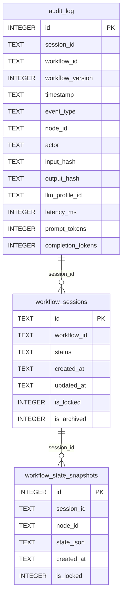
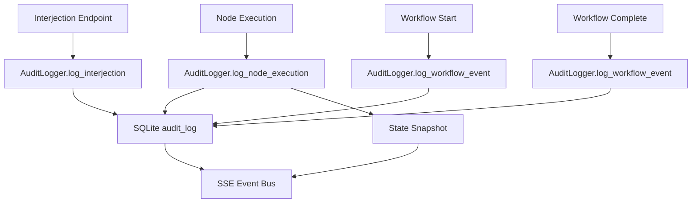
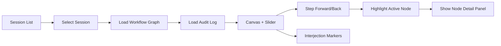
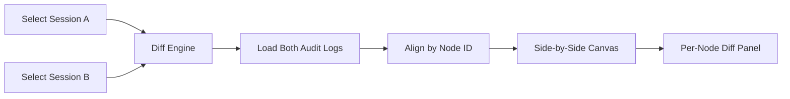
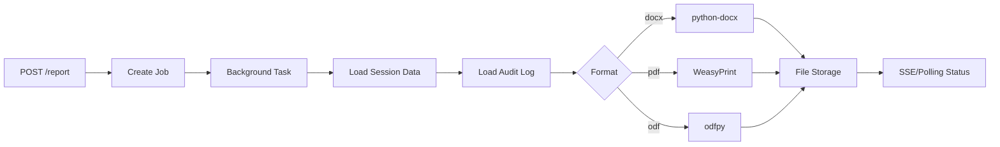
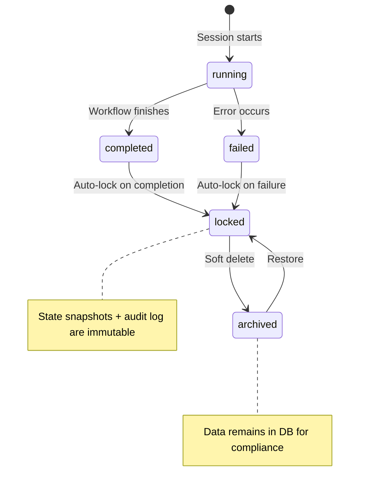
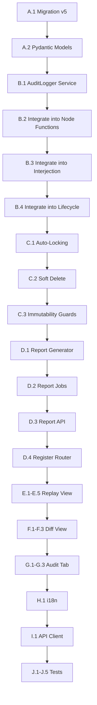

# Phase 7: Audit, Traceability & Reporting — Implementation Plan

## 1. Overview

### Goals
- Extend the SQLite schema with a comprehensive `audit_log` table for workflow execution traceability
- Implement an `AuditLogger` that hooks into every node execution and interjection endpoint
- Build a "Replay" view in the frontend that allows step-by-step playback of completed sessions on the original workflow graph
- Implement a "Diff-Mode" to compare two sessions of the same workflow side-by-side
- Extend report generation to support DOCX, PDF, and ODF export with full metadata and audit trail
- Enforce immutability: locked state snapshots, soft-delete only for sessions
- Add an "Audit" tab per session in the frontend with sortable/filterable audit log table

### Current State
- [`AuditService`](backend/persistence/audit.py:14) exists with `audit_events` table — append-only, stores `debate_id`, `round`, `agent`, `action`, `input_hash`, `output_hash`, `llm_model`, `tokens_used`
- [`TraceLogger`](src/core/trace_logger.py:10) writes JSONL files to `logs/` directory — stores step, agent, prompt/response previews, metadata
- [`SessionDB`](src/core/session_db.py:12) stores session metadata in `memory/debates.db` — has `delete_session()` with hard DELETE
- [`ReportGenerator`](src/tools/report_generator.py:15) generates DOCX via `python-docx` and PDF via `WeasyPrint` — no ODF support yet
- [`AuditView.svelte`](frontend/src/views/AuditView.svelte) exists — basic search by debate ID, displays events in [`AuditTrail.svelte`](frontend/src/components/AuditTrail.svelte) (placeholder)
- [`TimelinePanel.svelte`](frontend/src/components/workflow/panels/TimelinePanel.svelte) exists — shows round snapshots as horizontal timeline
- [`workflow/store.js`](frontend/src/lib/workflow/store.js) has `eventLog` writable store and `roundSnapshots` for history
- [`workflow/snapshot.js`](frontend/src/lib/workflow/snapshot.js) creates round snapshots at round boundaries
- [`workflow/events.js`](frontend/src/lib/workflow/events.js) defines event type JSDoc types
- Phase 2 plan defines `workflow_state_snapshots` table and `workflow_sessions` table (migration v4)
- Phase 2 plan defines SSE event types: `workflow.started`, `node.start`, `node.complete`, `node.error`, `interjection.received`, `consensus.reached`, `workflow.complete`
- Schema at version 3 ([`migrations.py`](backend/blueprints/migrations.py:20))
- Dependencies already in [`pyproject.toml`](pyproject.toml): `python-docx>=1.1.0`, `weasyprint>=61.0`, `odfpy>=1.4.1`

### Dependencies
- Phase 1 must be completed (structured `WorkflowDefinition` with nodes/edges)
- Phase 2 must be completed (`WorkflowState`, `WorkflowCompiler`, `ExecutionEngine`, `StateSnapshotStore`, `workflow_sessions` table, `workflow_state_snapshots` table)
- The `workflow_sessions` table from Phase 2 provides session metadata (workflow_id, status, timestamps)
- The `workflow_state_snapshots` table from Phase 2 provides per-node state snapshots
- The SSE event bus from Phase 2 provides real-time event streaming

---

## 2. Architecture

### 2.1 Audit Log Schema



### 2.2 AuditLogger Integration Points



### 2.3 Replay View Architecture



### 2.4 Diff Mode Architecture



### 2.5 Report Generation Pipeline



### 2.6 Immutability Model



---

## 3. Implementation Tasks

### Group A: Schema Extension & Migration

**A.1** Add migration v5 to [`backend/blueprints/migrations.py`](backend/blueprints/migrations.py:20)
- Create `audit_log` table:
  ```sql
  CREATE TABLE IF NOT EXISTS audit_log (
      id INTEGER PRIMARY KEY AUTOINCREMENT,
      session_id TEXT NOT NULL,
      workflow_id TEXT NOT NULL,
      workflow_version INTEGER NOT NULL DEFAULT 1,
      timestamp TEXT NOT NULL,
      event_type TEXT NOT NULL,
      node_id TEXT,
      actor TEXT NOT NULL DEFAULT 'system',
      input_hash TEXT NOT NULL DEFAULT '',
      output_hash TEXT NOT NULL DEFAULT '',
      llm_profile_id TEXT NOT NULL DEFAULT '',
      latency_ms INTEGER NOT NULL DEFAULT 0,
      prompt_tokens INTEGER NOT NULL DEFAULT 0,
      completion_tokens INTEGER NOT NULL DEFAULT 0
  );
  CREATE INDEX IF NOT EXISTS idx_audit_log_session ON audit_log (session_id);
  CREATE INDEX IF NOT EXISTS idx_audit_log_workflow ON audit_log (workflow_id);
  CREATE INDEX IF NOT EXISTS idx_audit_log_event_type ON audit_log (event_type);
  CREATE INDEX IF NOT EXISTS idx_audit_log_timestamp ON audit_log (timestamp);
  ```
- Add `is_locked INTEGER DEFAULT 0` and `is_archived INTEGER DEFAULT 0` columns to `workflow_sessions` table
- Add `is_locked INTEGER DEFAULT 0` column to `workflow_state_snapshots` table
- Bump `SCHEMA_VERSION` to 5

**A.2** Create Pydantic models for audit log entries in [`backend/models/schemas.py`](backend/models/schemas.py)
- `AuditLogEntry` model with all fields from the table
- `AuditLogQuery` model for filtering (session_id, workflow_id, event_type, date range)
- `ReportJobStatus` model (job_id, status, format, file_path, created_at, completed_at, error)

### Group B: AuditLogger Backend Service

**B.1** Create [`backend/workflow/audit_logger.py`](backend/workflow/audit_logger.py)
- `AuditLogger` class:
  - `__init__(self, db_path: Path)` — connects to SQLite
  - `log_node_execution(session_id, workflow_id, workflow_version, node_id, actor, input_data, output_data, llm_profile_id, latency_ms, prompt_tokens, completion_tokens)` — computes SHA-256 hashes of input/output, inserts into `audit_log`
  - `log_interjection(session_id, workflow_id, workflow_version, node_id, actor, content, metadata)` — logs interjection events
  - `log_workflow_event(session_id, workflow_id, workflow_version, event_type, actor, metadata)` — logs workflow lifecycle events (started, completed, failed, paused, resumed)
  - `get_audit_log(session_id, filters: AuditLogQuery) → list[dict]` — query with sorting and filtering
  - `get_audit_log_for_replay(session_id) → list[dict]` — ordered by timestamp for replay
  - `_compute_hash(data: Any) → str` — SHA-256 hash helper
- Thread-safe with `sqlite3.connect()` per call (same pattern as [`AuditService`](backend/persistence/audit.py:56))

**B.2** Integrate `AuditLogger` into [`backend/workflow/node_functions.py`](backend/workflow/node_functions.py) (from Phase 2)
- Wrap each node function with audit logging:
  - Before execution: record start time, compute input hash
  - After execution: compute output hash, record latency, write audit entry
  - On error: record error event
- Use decorator pattern: `@audit_decorator(audit_logger, node_id, actor)`

**B.3** Integrate `AuditLogger` into interjection endpoint
- In [`backend/api/routers/workflow_exec.py`](backend/api/routers/workflow_exec.py) (from Phase 2), add audit logging to `POST /{session_id}/interject`
- Log the interjection event with actor, content hash, metadata

**B.4** Integrate `AuditLogger` into workflow lifecycle
- In [`backend/workflow/workflow_runner.py`](backend/workflow/workflow_runner.py) (from Phase 2):
  - Log `workflow.started` at beginning
  - Log `workflow.completed` or `workflow.failed` at end
  - Log `workflow.paused` and `workflow.resumed` on state changes

### Group C: Immutability & Soft Delete

**C.1** Implement auto-locking in [`backend/workflow/workflow_runner.py`](backend/workflow/workflow_runner.py)
- When session status transitions to `completed` or `failed`:
  - Set `is_locked = 1` on `workflow_sessions` row
  - Set `is_locked = 1` on all related `workflow_state_snapshots` rows
  - Set `is_locked = 1` on all related `audit_log` rows (new column)
- Locked records cannot be modified or deleted

**C.2** Implement soft delete for sessions
- Modify `DELETE /api/v1/sessions/{id}` to set `is_archived = 1` instead of physical DELETE
- Add `is_archived` filter to `GET /api/v1/sessions` (exclude archived by default, include with `?include_archived=true`)
- Add `POST /api/v1/sessions/{id}/restore` to un-archive
- Apply same pattern to [`backend/api/routers/sessions.py`](backend/api/routers/sessions.py) for workflow sessions

**C.3** Add immutability guards
- Create [`backend/workflow/immutability.py`](backend/workflow/immutability.py):
  - `guard_locked(session_id)` — raises HTTPException 403 if session is locked
  - `guard_not_archived(session_id)` — raises HTTPException 404 if session is archived
- Apply guards to all mutation endpoints (interject, pause, resume, cancel)

### Group D: Report Generation Extension

**D.1** Extend [`src/tools/report_generator.py`](src/tools/report_generator.py) or create new [`backend/workflow/report_generator.py`](backend/workflow/report_generator.py)
- New `WorkflowReportGenerator` class:
  - `generate(session_id, fmt: Literal["docx", "pdf", "odf"]) → Path`
  - Loads session data from `workflow_sessions`
  - Loads audit log from `audit_log`
  - Loads state snapshots from `workflow_state_snapshots`
  - Template includes:
    - Workflow name/version, timestamp
    - Participant agents (names, roles, LLM profiles)
    - Full message history
    - Consensus result
    - Audit trail table (all audit_log entries)
- DOCX generation via `python-docx` (same pattern as existing [`ReportGenerator`](src/tools/report_generator.py:35))
- PDF generation via `WeasyPrint` (same pattern as existing [`ReportGenerator`](src/tools/report_generator.py:85))
- ODF generation via `odfpy` (new)

**D.2** Create async report job system in [`backend/workflow/report_jobs.py`](backend/workflow/report_jobs.py)
- `ReportJobStore` class:
  - `create_job(session_id, fmt) → job_id` — inserts into `report_jobs` table
  - `update_job(job_id, status, file_path, error)` — updates job status
  - `get_job(job_id) → dict` — returns job status
- `report_jobs` table (add to migration v5):
  ```sql
  CREATE TABLE IF NOT EXISTS report_jobs (
      id TEXT PRIMARY KEY,
      session_id TEXT NOT NULL,
      format TEXT NOT NULL,
      status TEXT NOT NULL DEFAULT 'pending',
      file_path TEXT,
      error TEXT,
      created_at TEXT NOT NULL,
      completed_at TEXT
  );
  CREATE INDEX IF NOT EXISTS idx_report_jobs_session ON report_jobs (session_id);
  ```

**D.3** Create report API endpoints in [`backend/api/routers/workflow_reports.py`](backend/api/routers/workflow_reports.py)
- `POST /api/v1/sessions/{id}/report` — creates async report job
  - Request body: `{format: "docx" | "pdf" | "odf"}`
  - Returns `{job_id, status: "pending"}`
  - Launches background task for report generation
- `GET /api/v1/reports/{job_id}/status` — returns job status
  - Returns `{job_id, status, format, file_path?, error?, created_at, completed_at?}`
- `GET /api/v1/reports/{job_id}/download` — downloads generated report
  - Returns FileResponse with appropriate media type
- SSE endpoint: `GET /api/v1/sessions/{id}/report/stream` — streams report generation progress

**D.4** Register new router in [`backend/main.py`](backend/main.py:123)
- `app.include_router(workflow_reports.router, prefix="/api/v1", tags=["reports"])`

### Group E: Replay View (Frontend)

**E.1** Create [`frontend/src/lib/workflow/auditApi.js`](frontend/src/lib/workflow/auditApi.js)
- API client functions:
  - `getAuditLog(sessionId, filters?) → Promise` — fetches audit log entries
  - `getWorkflowSessions(workflowId?, options?) → Promise` — lists completed sessions
  - `getSessionForReplay(sessionId) → Promise` — fetches session + workflow graph + audit log

**E.2** Create [`frontend/src/views/ReplayView.svelte`](frontend/src/views/ReplayView.svelte)
- Session selector: dropdown/list of completed sessions (fetched from API)
- Loads the workflow graph of the selected session's workflow version
- Renders the graph using existing [`WorkflowCanvas.svelte`](frontend/src/components/workflow/WorkflowCanvas.svelte) or [`BlueprintCanvas.svelte`](frontend/src/components/blueprint/BlueprintCanvas.svelte) in read-only mode
- Time slider (range input) at the bottom:
  - Min = first audit event timestamp, Max = last audit event timestamp
  - Steps correspond to audit log entries
  - Interjection events shown as vertical markers on the slider (rose color)
- On slider change:
  - Highlight the active node (the node being executed at that timestamp)
  - Show node detail panel with input, output, latency, token usage
  - Dim nodes not yet executed, brighten completed nodes
- Playback controls: Play/Pause, Step Forward, Step Back, Speed selector

**E.3** Create [`frontend/src/components/workflow/ReplayControls.svelte`](frontend/src/components/workflow/ReplayControls.svelte)
- Time slider with interjection markers
- Play/Pause button
- Step Forward/Back buttons
- Speed selector (0.5x, 1x, 2x, 4x)
- Current timestamp display
- Event counter (e.g., "Step 5 of 23")

**E.4** Create [`frontend/src/components/workflow/ReplayNodeDetail.svelte`](frontend/src/components/workflow/ReplayNodeDetail.svelte)
- Shows details for the currently highlighted node:
  - Node ID, type, actor (agent name)
  - Input hash, output hash
  - Input preview (from state snapshot)
  - Output preview (from state snapshot)
  - Latency (ms)
  - Token usage (prompt/completion)
  - LLM profile used
  - Timestamp

**E.5** Add route for Replay view in [`frontend/src/App.svelte`](frontend/src/App.svelte)
- Add `{:else if $route === 'replay'}` route
- Import `ReplayView`
- Support `#/replay` and `#/replay/{sessionId}`

### Group F: Diff Mode (Frontend)

**F.1** Create [`frontend/src/views/DiffView.svelte`](frontend/src/views/DiffView.svelte)
- Two session selectors (Session A and Session B) — filtered to same workflow
- Loads both audit logs
- Aligns entries by node_id
- Side-by-side canvas showing the workflow graph
- Per-node diff panel:
  - Shows outputs from Session A and Session B side by side
  - Highlights differences (text diff)
  - Shows latency comparison, token usage comparison
- Color coding: green for matching, yellow for minor differences, red for significant differences

**F.2** Create [`frontend/src/components/workflow/DiffNodeDetail.svelte`](frontend/src/components/workflow/DiffNodeDetail.svelte)
- Split panel showing Session A output (left) and Session B output (right)
- Text diff highlighting
- Metadata comparison table (latency, tokens, LLM profile)

**F.3** Add route for Diff view in [`frontend/src/App.svelte`](frontend/src/App.svelte)
- Add `{:else if $route === 'diff'}` route
- Import `DiffView`
- Support `#/diff` and `#/diff/{sessionA}/{sessionB}`

### Group G: Audit Tab (Frontend)

**G.1** Enhance [`frontend/src/components/AuditTrail.svelte`](frontend/src/components/AuditTrail.svelte)
- Replace placeholder with full-featured audit log table
- Columns: Timestamp, Event Type, Node ID, Actor, Latency, Prompt Tokens, Completion Tokens, Input Hash, Output Hash
- Sorting: click column headers to sort ascending/descending
- Filtering: dropdown for event_type, text search for actor/node_id
- Pagination: configurable page size (25, 50, 100)
- Row click: expand to show full details (input/output preview from state snapshot)

**G.2** Create [`frontend/src/components/workflow/SessionAuditTab.svelte`](frontend/src/components/workflow/SessionAuditTab.svelte)
- Tab component that wraps `AuditTrail` for a specific session
- Fetches audit log from API on mount
- Shows summary stats at top: total events, total tokens, total latency, event type distribution
- Export button: download audit log as CSV

**G.3** Integrate Audit Tab into session detail views
- In [`frontend/src/views/DebateView.svelte`](frontend/src/views/DebateView.svelte) or session detail component:
  - Add "Audit" tab alongside existing tabs
  - Render `SessionAuditTab` when selected

### Group H: i18n

**H.1** Update [`frontend/src/lib/i18n/loaders/en.js`](frontend/src/lib/i18n/loaders/en.js) and [`de.js`](frontend/src/lib/i18n/loaders/de.js)
- Add keys for:
  - `replay.title`, `.selectSession`, `.play`, `.pause`, `.stepForward`, `.stepBack`, `.speed`
  - `replay.nodeDetail.title`, `.input`, `.output`, `.latency`, `.tokens`, `.actor`, `.timestamp`
  - `replay.interjectionMarker`
  - `diff.title`, `.selectSessionA`, `.selectSessionB`, `.noDifferences`, `.differencesFound`
  - `diff.nodeDetail.sessionA`, `.sessionB`, `.latencyComparison`, `.tokenComparison`
  - `audit.tab.title`, `.columns.timestamp`, `.eventType`, `.nodeId`, `.actor`, `.latency`, `.promptTokens`, `.completionTokens`
  - `audit.filter.eventType`, `.filter.actor`, `.filter.search`, `.export.csv`
  - `audit.summary.totalEvents`, `.totalTokens`, `.totalLatency`
  - `report.title`, `.generate`, `.format`, `.status.pending`, `.status.completed`, `.status.failed`, `.download`
  - `session.softDelete`, `.restore`, `.archived`

### Group I: API Client Updates

**I.1** Update [`frontend/src/lib/api.js`](frontend/src/lib/api.js)
- Add functions:
  - `getAuditLog(sessionId, filters?) → Promise`
  - `generateReport(sessionId, format) → Promise`
  - `getReportStatus(jobId) → Promise`
  - `downloadReport(jobId) → Promise`
  - `softDeleteSession(sessionId) → Promise`
  - `restoreSession(sessionId) → Promise`
  - `getSessionsForReplay(workflowId?) → Promise`
  - `getSessionsForDiff(workflowId) → Promise`

### Group J: Tests

**J.1** Create [`tests/backend/test_audit_logger.py`](tests/backend/test_audit_logger.py)
- Test `log_node_execution()` inserts correct record with hashes
- Test `log_interjection()` inserts correct record
- Test `log_workflow_event()` inserts correct record
- Test `get_audit_log()` with filters (session_id, event_type, date range)
- Test `get_audit_log_for_replay()` returns ordered entries
- Test `_compute_hash()` produces consistent SHA-256 hashes
- Test concurrent writes (thread safety)

**J.2** Create [`tests/backend/test_immutability.py`](tests/backend/test_immutability.py)
- Test auto-lock on session completion: `is_locked = 1` on session, snapshots, audit log
- Test auto-lock on session failure
- Test soft delete: `is_archived = 1` instead of physical delete
- Test restore: `is_archived = 0`
- Test guard_locked raises 403 on mutation of locked session
- Test guard_not_archived raises 404 on archived session
- Test `include_archived` query parameter

**J.3** Create [`tests/backend/test_report_jobs.py`](tests/backend/test_report_jobs.py)
- Test `create_job()` returns job_id
- Test `update_job()` updates status correctly
- Test `get_job()` returns job details
- Test `POST /report` creates job and returns job_id
- Test `GET /report/{job_id}/status` returns correct status
- Test `GET /report/{job_id}/download` returns file
- Test DOCX generation with audit trail
- Test PDF generation with audit trail
- Test ODF generation with audit trail

**J.4** Create [`tests/backend/test_migration_v5.py`](tests/backend/test_migration_v5.py)
- Test migration v5 applies cleanly
- Test `audit_log` table created with correct schema
- Test `is_locked` and `is_archived` columns added to `workflow_sessions`
- Test `is_locked` column added to `workflow_state_snapshots`
- Test `report_jobs` table created
- Test migration is idempotent

**J.5** Run all tests
- `pytest tests/backend/test_audit_logger.py -v`
- `pytest tests/backend/test_immutability.py -v`
- `pytest tests/backend/test_report_jobs.py -v`
- `pytest tests/backend/test_migration_v5.py -v`
- `pytest tests/ -v` — full suite, verify no regressions

---

## 4. File Inventory

### New Files
| File | Purpose |
|---|---|
| `backend/workflow/audit_logger.py` | AuditLogger service — writes to audit_log table |
| `backend/workflow/immutability.py` | Immutability guards (locked, archived checks) |
| `backend/workflow/report_generator.py` | WorkflowReportGenerator — DOCX/PDF/ODF with audit trail |
| `backend/workflow/report_jobs.py` | ReportJobStore — async report job management |
| `backend/api/routers/workflow_reports.py` | FastAPI router for report generation endpoints |
| `frontend/src/lib/workflow/auditApi.js` | Frontend API client for audit/replay/diff |
| `frontend/src/views/ReplayView.svelte` | Replay view — step-by-step session playback |
| `frontend/src/views/DiffView.svelte` | Diff view — side-by-side session comparison |
| `frontend/src/components/workflow/ReplayControls.svelte` | Playback controls (slider, play/pause, speed) |
| `frontend/src/components/workflow/ReplayNodeDetail.svelte` | Node detail panel for replay mode |
| `frontend/src/components/workflow/DiffNodeDetail.svelte` | Node detail panel for diff mode |
| `frontend/src/components/workflow/SessionAuditTab.svelte` | Audit tab component for session detail |
| `tests/backend/test_audit_logger.py` | AuditLogger tests |
| `tests/backend/test_immutability.py` | Immutability guard tests |
| `tests/backend/test_report_jobs.py` | Report job and generation tests |
| `tests/backend/test_migration_v5.py` | Migration v5 tests |

### Modified Files
| File | Change |
|---|---|
| `backend/blueprints/migrations.py` | Add migration v5 (audit_log, report_jobs, is_locked, is_archived columns), bump SCHEMA_VERSION |
| `backend/workflow/node_functions.py` | Wrap node functions with audit logging decorator |
| `backend/workflow/workflow_runner.py` | Add audit logging for workflow lifecycle events, auto-lock on completion/failure |
| `backend/api/routers/workflow_exec.py` | Add audit logging to interjection endpoint, add immutability guards |
| `backend/api/routers/sessions.py` | Change hard DELETE to soft delete, add restore endpoint, add archived filter |
| `backend/main.py` | Register workflow_reports router |
| `frontend/src/App.svelte` | Add replay and diff routes |
| `frontend/src/components/AuditTrail.svelte` | Replace placeholder with full audit log table |
| `frontend/src/lib/api.js` | Add audit, report, and session management API functions |
| `frontend/src/lib/i18n/loaders/en.js` | Add i18n keys for replay, diff, audit, report |
| `frontend/src/lib/i18n/loaders/de.js` | Add i18n keys for replay, diff, audit, report |

---

## 5. Implementation Order



---

## 6. Acceptance Criteria

| # | Criterion | Task |
|---|-----------|------|
| AC1 | Every debate step is recorded in audit_log with timestamp, actor, and token usage | B.1, B.2, B.3, B.4 |
| AC2 | SHA-256 hashes of input/output are computed and stored for integrity verification | B.1 |
| AC3 | Replay allows step-by-step playback of a completed session on the original workflow graph | E.1-E.5 |
| AC4 | Replay slider shows interjection events as vertical markers | E.2, E.3 |
| AC5 | Replay highlights the active node and shows input/output/latency per step | E.2, E.4 |
| AC6 | Reports can be exported as ODF, DOCX, and PDF with all relevant metadata | D.1, D.2, D.3 |
| AC7 | Report template includes workflow name/version, timestamp, agents, message history, consensus, audit trail | D.1 |
| AC8 | Report generation runs asynchronously with SSE/polling status endpoint | D.2, D.3 |
| AC9 | Completed sessions and their logs are protected from modification (locked flag) | C.1, C.3 |
| AC10 | Session deletion is soft-delete only (is_archived flag), data remains in DB | C.2 |
| AC11 | Diff mode shows differences between two session runs per node | F.1-F.3 |
| AC12 | Audit tab displays raw audit log data as sortable/filterable table | G.1-G.3 |
| AC13 | All existing tests still pass | J.5 |
| AC14 | i18n for all new UI elements in en + de | H.1 |
