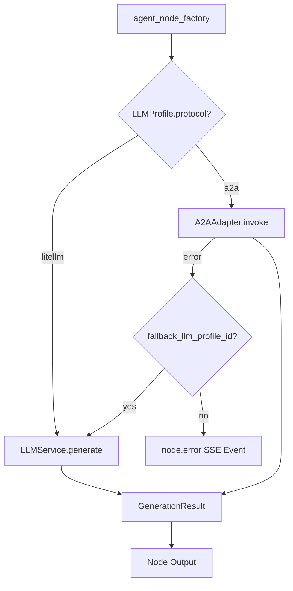
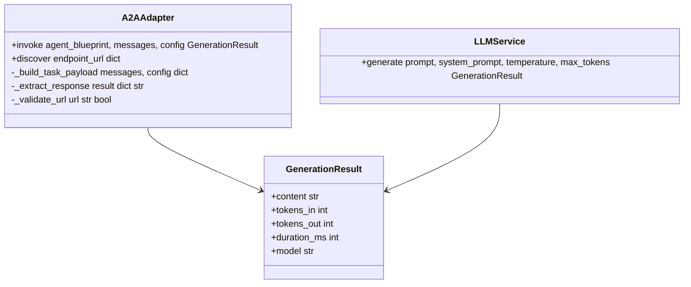
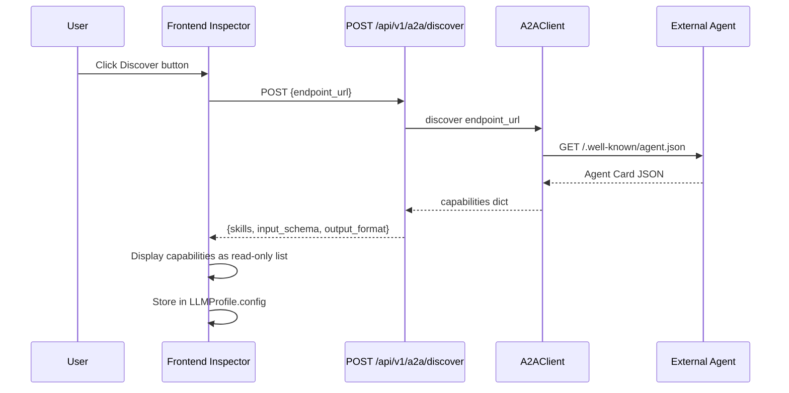
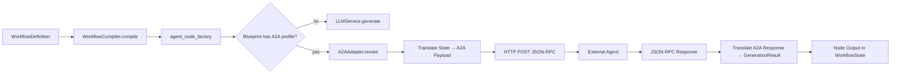
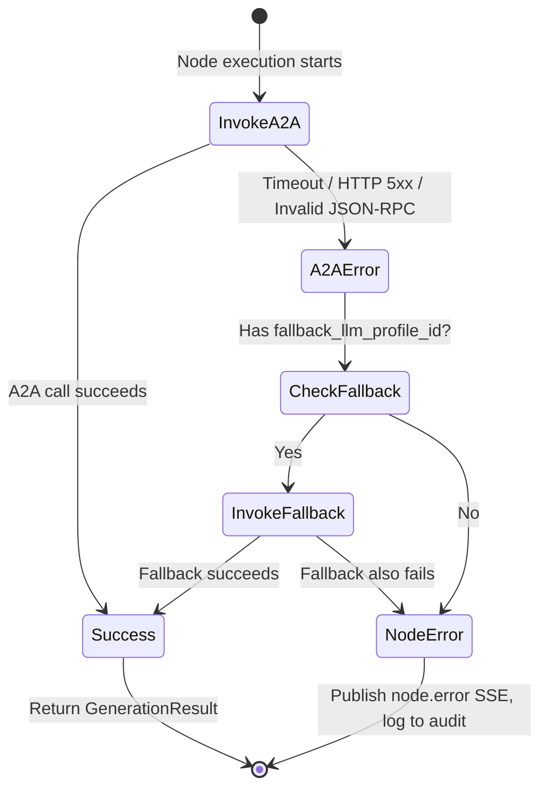
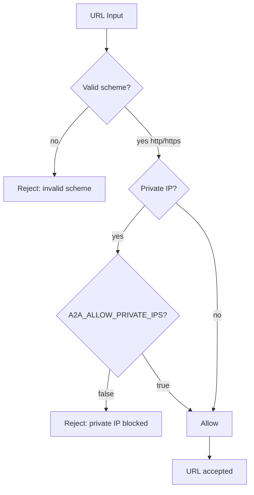
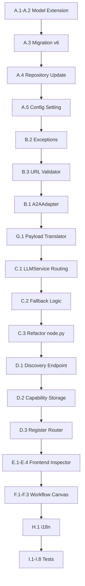

# Phase 8: A2A Integration & External Agents — Implementation Plan

## 1. Overview

### Goals
- Extend `LLMProfile` / `BlueprintLLMProfile` models with a `protocol` field (`litellm` | `a2a`)
- Create an `A2AAdapter` that provides the same interface as the LiteLLM caller, making A2A transparent to node execution
- Implement A2A Discovery in the Blueprint Canvas Inspector (Discover button → capabilities display)
- Add visual "Remote"/"A2A" badges on workflow nodes bound to A2A profiles
- Translate between local `WorkflowState`/node inputs and A2A Task payloads (bidirectional)
- Implement structured error handling with optional fallback to local LLM profiles
- Add URL validation and security guards for A2A endpoints
- Ensure the Workflow Compiler (Phase 2) executes A2A agents transparently without A2A-specific code in LangGraph logic

### Current State
- [`A2AClient`](backend/a2a/client.py:18) exists with `discover()`, `send_task()`, `get_task()`, `invoke_agent()`, `_poll_for_result()` — uses httpx, JSON-RPC 2.0
- [`A2AServer`](backend/a2a/server.py:20) handles incoming A2A tasks — creates Danwa debates, polls for completion
- [`TaskManager`](backend/a2a/task_manager.py:33) is SQLite-backed with `a2a_tasks` table
- [`router.py`](backend/a2a/router.py) exposes `GET /.well-known/agent.json` and `POST /a2a` JSON-RPC endpoint
- [`agent_card.py`](backend/a2a/agent_card.py) defines Danwa's Agent Card with skills, capabilities
- [`config.py`](backend/a2a/config.py) loads from [`config/a2a.json`](config/a2a.json) — currently `enabled: false`
- [`node.py`](backend/a2a/node.py) has `run_a2a_agent_node()` for LangGraph integration — but tightly coupled to old debate flow
- [`schemas.py`](backend/a2a/schemas.py) has Pydantic models: `A2ATextPart`, `A2AMessage`, `A2ATask`, `A2ATaskStatus`, `A2AResponse`
- [`LLMProfile`](backend/core/profiles.py:28) has `provider` field (LLMProvider enum) — NO `protocol` field
- [`BlueprintLLMProfile`](backend/blueprints/models.py:31) has `provider` literal — NO `protocol` field
- [`LLMService`](backend/services/llm_service.py:41) routes between local (direct HTTP) and cloud (litellm) — returns `GenerationResult`
- [`LLMProfileNode.svelte`](frontend/src/components/blueprint/nodes/LLMProfileNode.svelte) already has `hasA2A` derived from `data?.a2a_endpoint` and shows A2A badge
- [`LLMProfileForm.svelte`](frontend/src/components/blueprint/forms/LLMProfileForm.svelte) already has `a2a_endpoint` in draft state
- Phase 2 plan defines `agent_node_factory()` that resolves blueprints and calls [`LLMService.generate()`](backend/services/llm_service.py:65)
- Schema at version 3 ([`migrations.py`](backend/blueprints/migrations.py:20)) — Phase 7 will add v5

### Dependencies
- Phase 1 must be completed (structured `WorkflowDefinition`, `BlueprintLLMProfile` model)
- Phase 2 must be completed (`WorkflowCompiler`, `agent_node_factory()`, `LLMService` integration)
- Phase 7 should be completed (audit logging for A2A errors, immutability)
- Existing [`A2AClient`](backend/a2a/client.py:18) provides the HTTP/JSON-RPC foundation

---

## 2. Architecture

### 2.1 Protocol Routing in LLMService

### 2.2 A2AAdapter Interface

### 2.3 Discovery Flow

### 2.4 Workflow Integration

### 2.5 Error Handling & Fallback

### 2.6 URL Validation & Security

---

## 3. Implementation Tasks

### Group A: Model Extension

**A.1** Extend [`LLMProfile`](backend/core/profiles.py:28) with `protocol` field
- Add `protocol: Literal["litellm", "a2a"] = "litellm"` field
- Existing profiles without the field default to `"litellm"` (backward compatible)
- Add `a2a_endpoint: str | None = None` field (URL for A2A agent)
- Add `a2a_timeout: int = 120` field (timeout for A2A calls in seconds)
- Add `fallback_llm_profile_id: str | None = None` field (fallback profile for A2A failures)

**A.2** Extend [`BlueprintLLMProfile`](backend/blueprints/models.py:31) with matching fields
- Add `protocol: Literal["litellm", "a2a"] = "litellm"` field
- Add `a2a_endpoint: str | None = None` field
- Add `a2a_timeout: int = 120` field
- Add `fallback_llm_profile_id: str | None = None` field
- Add `a2a_config: dict = Field(default_factory=dict)` — stores discovered capabilities
- Update `from_legacy()` and `to_legacy()` methods to include new fields

**A.3** Add SQLite migration v6 to [`backend/blueprints/migrations.py`](backend/blueprints/migrations.py:20)
- Add columns to `blueprint_llm_profiles` table:
  - `protocol TEXT DEFAULT 'litellm'`
  - `a2a_endpoint TEXT`
  - `a2a_timeout INTEGER DEFAULT 120`
  - `fallback_llm_profile_id TEXT`
  - `a2a_config_json TEXT DEFAULT '{}'`
- Bump `SCHEMA_VERSION` to 6

**A.4** Update [`backend/blueprints/repository.py`](backend/blueprints/repository.py) serialization
- Serialize/deserialize new fields in `save_blueprint_llm_profile()` and `_row_to_blueprint_llm_profile()`

**A.5** Add `A2A_ALLOW_PRIVATE_IPS` setting to [`backend/core/config.py`](backend/core/config.py)
- `a2a_allow_private_ips: bool = False` — defaults to blocking private IPs
- Read from `DANWA_A2A_ALLOW_PRIVATE_IPS` environment variable

### Group B: A2AAdapter Service

**B.1** Create [`backend/a2a/adapter.py`](backend/a2a/adapter.py)
- `A2AAdapter` class:
  - `__init__(self, a2a_endpoint: str, timeout: int = 120, allow_private_ips: bool = False)`
  - `async invoke(messages: list[dict], config: dict) → GenerationResult`:
    1. Validate URL via `_validate_url()`
    2. Build A2A task payload from messages via `_build_task_payload()`
    3. Call `A2AClient.send_task()` with the payload
    4. If async, poll via `A2AClient._poll_for_result()`
    5. Extract response text via `_extract_response()`
    6. Return `GenerationResult` with content, estimated tokens, duration, model
  - `async discover(endpoint: str) → dict`:
    1. Validate URL
    2. Call `A2AClient.discover()`
    3. Return capabilities dict (skills, input_schema, output_format)
  - `_validate_url(url: str) → bool`:
    1. Check scheme is `http` or `https`
    2. Parse hostname, check if private IP (10.x, 172.16-31.x, 192.168.x, 127.x, ::1)
    3. If private and `allow_private_ips` is False, raise `A2AValidationError`
  - `_build_task_payload(messages: list[dict], config: dict) → str`:
    1. Convert messages array to a structured prompt string
    2. Include system prompt, user messages, context
  - `_extract_response(result: dict) → str`:
    1. Extract text from A2A task result artifacts
    2. Same logic as [`A2AClient._extract_text_from_result()`](backend/a2a/client.py:180)

**B.2** Create custom exceptions in [`backend/a2a/exceptions.py`](backend/a2a/exceptions.py)
- `A2AError(Exception)` — base class
- `A2ATimeoutError(A2AError)` — timeout during A2A call
- `A2AConnectionError(A2AError)` — HTTP connection failure
- `A2AProtocolError(A2AError)` — invalid JSON-RPC response
- `A2AValidationError(A2AError)` — URL validation failure
- `A2AAgentError(A2AError)` — external agent returned error
- Each exception carries structured data: `endpoint`, `task_id`, `error_code`, `message`

**B.3** Create [`backend/a2a/url_validator.py`](backend/a2a/url_validator.py)
- `validate_a2a_url(url: str, allow_private_ips: bool = False) → str`:
  - Validates URL scheme (http/https only)
  - Parses hostname using `urllib.parse.urlparse`
  - Checks against private IP ranges using `ipaddress.ip_address`
  - Blocks `file://`, `ftp://`, and other non-HTTP schemes
  - Returns cleaned URL or raises `A2AValidationError`
  - Supports IPv4 and IPv6

### Group C: LLMService Integration

**C.1** Modify [`LLMService.generate()`](backend/services/llm_service.py:65) to route by protocol
- Before the existing local/litellm routing, check `self._profile.protocol`:
  - If `"a2a"`: delegate to `A2AAdapter.invoke()`
  - If `"litellm"`: proceed with existing routing (local vs cloud)
- Import `A2AAdapter` lazily to avoid circular imports

**C.2** Add fallback logic to `LLMService`
- New method `generate_with_fallback()`:
  1. Try `generate()` with primary profile
  2. On `A2AError`: check if `fallback_llm_profile_id` is set
  3. If fallback exists: create new `LLMService` with fallback profile, call `generate()`
  4. If no fallback: re-raise the `A2AError`
- Update `agent_node_factory()` in [`backend/workflow/node_functions.py`](backend/workflow/node_functions.py) (from Phase 2) to use `generate_with_fallback()` when protocol is `a2a`

**C.3** Update [`backend/a2a/node.py`](backend/a2a/node.py) `run_a2a_agent_node()`
- Refactor to use `A2AAdapter` instead of directly using `A2AClient`
- Add fallback support
- Add structured error handling with `A2AError` hierarchy
- Publish `node.error` SSE event on failure (via [`publish_async()`](backend/api/events.py:60))
- Log errors to audit trail (via `AuditLogger` from Phase 7)

### Group D: A2A Discovery API

**D.1** Create discovery endpoint in [`backend/api/routers/a2a_discovery.py`](backend/api/routers/a2a_discovery.py)
- `POST /api/v1/a2a/discover`:
  - Request body: `{endpoint_url: str}`
  - Validates URL via `validate_a2a_url()`
  - Calls `A2AAdapter.discover(endpoint_url)`
  - Returns `{name, description, version, capabilities, skills, input_modes, output_modes}`
  - Error responses: 400 (invalid URL), 403 (private IP blocked), 502 (agent unreachable), 504 (timeout)

**D.2** Create capability storage endpoint
- `POST /api/v1/a2a/capabilities/{profile_id}`:
  - Request body: `{capabilities: dict}` (the discovered capabilities)
  - Stores in `BlueprintLLMProfile.a2a_config` field
  - Updates the blueprint LLM profile in the repository

**D.3** Register new router in [`backend/main.py`](backend/main.py:123)
- `app.include_router(a2a_discovery.router, prefix="/api/v1/a2a", tags=["a2a-discovery"])`

### Group E: Frontend — Inspector & Discovery

**E.1** Update [`LLMProfileForm.svelte`](frontend/src/components/blueprint/forms/LLMProfileForm.svelte)
- Add `protocol` selector: dropdown with options `litellm` (default) and `a2a`
- When `protocol === 'a2a'`:
  - Show `a2a_endpoint` URL input field
  - Show `a2a_timeout` number input (default 120)
  - Show `fallback_llm_profile_id` dropdown (list of available litellm profiles)
  - Show "Discover" button
  - Show discovered capabilities as read-only list (if available)
- Discover button:
  - Calls `POST /api/v1/a2a/discover` with the endpoint URL
  - On success: displays capabilities (skills, input/output modes) and stores in `a2a_config`
  - On error: shows error message (timeout, unreachable, invalid URL)
  - Loading state with spinner

**E.2** Update [`LLMProfileNode.svelte`](frontend/src/components/blueprint/nodes/LLMProfileNode.svelte)
- Enhance A2A badge:
  - Show "A2A" badge when `data?.protocol === 'a2a'`
  - Show "Remote" badge with different color/styling
  - Show discovered agent name if available (from `a2a_config.name`)
  - Tooltip with agent description on hover

**E.3** Create [`frontend/src/components/blueprint/A2ACapabilities.svelte`](frontend/src/components/blueprint/A2ACapabilities.svelte)
- Read-only display of discovered A2A capabilities:
  - Agent name and description
  - Skills list (id, name, description, tags)
  - Input modes (text, file, etc.)
  - Output modes (text, file, etc.)
  - Version
- Styled as a collapsible section in the Inspector

**E.4** Create [`frontend/src/lib/a2aApi.js`](frontend/src/lib/a2aApi.js)
- API client functions:
  - `discoverA2A(endpointUrl) → Promise` — calls `POST /api/v1/a2a/discover`
  - `saveA2ACapabilities(profileId, capabilities) → Promise` — stores capabilities

### Group F: Frontend — Workflow Canvas Integration

**F.1** Update workflow node components to show A2A badge
- In [`frontend/src/components/workflow/nodes/AgentNode.svelte`](frontend/src/components/workflow/nodes/AgentNode.svelte) (or equivalent):
  - When the linked `AgentBlueprint` has an A2A `LLMProfile`, show "Remote" badge
  - Badge color: cyan (#06b6d4) with satellite icon 🛰️
  - Tooltip: "External A2A Agent: {agent_name}"

**F.2** Update [`frontend/src/components/blueprint/nodes/WorkflowNode.svelte`](frontend/src/components/blueprint/nodes/WorkflowNode.svelte)
- For agent-type workflow nodes (strategist, critic, optimizer, moderator):
  - Check if linked `AgentBlueprint` → `LLMProfile` has `protocol === 'a2a'`
  - If yes, show "A2A" badge on the workflow node
  - Different visual treatment (e.g., dashed border for remote nodes)

**F.3** Update execution status display for A2A nodes
- In [`frontend/src/components/blueprint/ExecutionPanel.svelte`](frontend/src/components/blueprint/ExecutionPanel.svelte) (from Phase 2):
  - Show "Calling external agent..." status for A2A nodes during execution
  - Show A2A-specific error messages (timeout, connection failed)
  - Show fallback indicator when fallback LLM is used

### Group G: Payload Translation

**G.1** Create [`backend/a2a/payload_translator.py`](backend/a2a/payload_translator.py)
- `translate_to_a2a(messages: list[dict], context: str, role: str, round_num: int) → str`:
  - Converts local message format to A2A task message
  - Builds structured prompt with context, role, round number, previous outputs
  - Returns message string for `A2AClient.send_task()`
- `translate_from_a2a(result: dict) → dict`:
  - Converts A2A task result to local `GenerationResult` format
  - Extracts text from artifacts/parts
  - Estimates token count if not provided by external agent
  - Returns `{content, tokens_in, tokens_out, duration_ms, model}`

**G.2** Integrate translator into `A2AAdapter.invoke()`
- Use `translate_to_a2a()` for building the task payload
- Use `translate_from_a2a()` for extracting the response
- Ensure the adapter returns a standard `GenerationResult` regardless of external agent format

### Group H: i18n

**H.1** Update [`frontend/src/lib/i18n/loaders/en.js`](frontend/src/lib/i18n/loaders/en.js) and [`de.js`](frontend/src/lib/i18n/loaders/de.js)
- Add keys for:
  - `a2a.protocol.label`, `.litellm`, `.a2a`
  - `a2a.endpoint.label`, `.placeholder`
  - `a2a.timeout.label`
  - `a2a.fallback.label`, `.none`
  - `a2a.discover.button`, `.loading`, `.success`, `.error`
  - `a2a.capabilities.title`, `.skills`, `.inputModes`, `.outputModes`, `.version`
  - `a2a.badge.remote`, `.tooltip`
  - `a2a.error.timeout`, `.connectionFailed`, `.invalidUrl`, `.privateIpBlocked`, `.protocolError`
  - `a2a.fallback.activated`, `.profile`

### Group I: Tests

**I.1** Create [`tests/backend/test_a2a_adapter.py`](tests/backend/test_a2a_adapter.py)
- Test `A2AAdapter.invoke()` with mock A2A agent → returns `GenerationResult`
- Test `A2AAdapter.discover()` with mock agent card → returns capabilities
- Test `_validate_url()` with valid URLs → passes
- Test `_validate_url()` with private IPs and `allow_private_ips=False` → raises `A2AValidationError`
- Test `_validate_url()` with invalid schemes (file://, ftp://) → raises `A2AValidationError`
- Test `_build_task_payload()` converts messages correctly
- Test `_extract_response()` handles various A2A result formats

**I.2** Create [`tests/backend/test_a2a_url_validator.py`](tests/backend/test_a2a_url_validator.py)
- Test valid HTTP/HTTPS URLs → pass
- Test private IPv4 ranges (10.x, 172.16.x, 192.168.x, 127.x) → blocked by default
- Test private IPv6 (::1, fc00::) → blocked by default
- Test private IPs with `allow_private_ips=True` → pass
- Test invalid schemes (file://, ftp://, javascript:) → blocked
- Test malformed URLs → blocked
- Test public IPs and domains → pass

**I.3** Create [`tests/backend/test_a2a_exceptions.py`](tests/backend/test_a2a_exceptions.py)
- Test each exception type carries correct structured data
- Test exception hierarchy (all inherit from `A2AError`)

**I.4** Create [`tests/backend/test_a2a_discovery_api.py`](tests/backend/test_a2a_discovery_api.py)
- Test `POST /api/v1/a2a/discover` with valid endpoint → returns capabilities
- Test `POST /api/v1/a2a/discover` with invalid URL → 400
- Test `POST /api/v1/a2a/discover` with private IP → 403
- Test `POST /api/v1/a2a/discover` with unreachable endpoint → 502
- Test `POST /api/v1/a2a/discover` with timeout → 504
- Test `POST /api/v1/a2a/capabilities/{profile_id}` → stores capabilities

**I.5** Create [`tests/backend/test_a2a_fallback.py`](tests/backend/test_a2a_fallback.py)
- Test `generate_with_fallback()` with A2A failure + valid fallback → uses fallback
- Test `generate_with_fallback()` with A2A failure + no fallback → raises error
- Test `generate_with_fallback()` with A2A success → no fallback used
- Test fallback also fails → raises original A2A error

**I.6** Create [`tests/backend/test_a2a_payload_translator.py`](tests/backend/test_a2a_payload_translator.py)
- Test `translate_to_a2a()` produces correct message format
- Test `translate_from_a2a()` extracts content from various result formats
- Test roundtrip: local → A2A → local preserves content

**I.7** Create [`tests/backend/test_migration_v6.py`](tests/backend/test_migration_v6.py)
- Test migration v6 applies cleanly
- Test new columns added to `blueprint_llm_profiles`
- Test default values are correct
- Test migration is idempotent

**I.8** Run all tests
- `pytest tests/backend/test_a2a_adapter.py -v`
- `pytest tests/backend/test_a2a_url_validator.py -v`
- `pytest tests/backend/test_a2a_exceptions.py -v`
- `pytest tests/backend/test_a2a_discovery_api.py -v`
- `pytest tests/backend/test_a2a_fallback.py -v`
- `pytest tests/backend/test_a2a_payload_translator.py -v`
- `pytest tests/backend/test_migration_v6.py -v`
- `pytest tests/ -v` — full suite, verify no regressions

---

## 4. File Inventory

### New Files
| File | Purpose |
|---|---|
| `backend/a2a/adapter.py` | A2AAdapter — unified interface for A2A calls, same as LLMService |
| `backend/a2a/exceptions.py` | Structured A2A exception hierarchy |
| `backend/a2a/url_validator.py` | URL validation with private IP blocking |
| `backend/a2a/payload_translator.py` | Bidirectional translation between local and A2A formats |
| `backend/api/routers/a2a_discovery.py` | FastAPI router for A2A discovery and capability storage |
| `frontend/src/lib/a2aApi.js` | Frontend API client for A2A discovery |
| `frontend/src/components/blueprint/A2ACapabilities.svelte` | Read-only display of discovered A2A capabilities |
| `tests/backend/test_a2a_adapter.py` | A2AAdapter tests |
| `tests/backend/test_a2a_url_validator.py` | URL validation tests |
| `tests/backend/test_a2a_exceptions.py` | Exception hierarchy tests |
| `tests/backend/test_a2a_discovery_api.py` | Discovery API endpoint tests |
| `tests/backend/test_a2a_fallback.py` | Fallback mechanism tests |
| `tests/backend/test_a2a_payload_translator.py` | Payload translation tests |
| `tests/backend/test_migration_v6.py` | Migration v6 tests |

### Modified Files
| File | Change |
|---|---|
| `backend/core/profiles.py` | Add `protocol`, `a2a_endpoint`, `a2a_timeout`, `fallback_llm_profile_id` to `LLMProfile` |
| `backend/blueprints/models.py` | Add matching fields to `BlueprintLLMProfile`, update `from_legacy()`/`to_legacy()` |
| `backend/blueprints/migrations.py` | Add migration v6 (new columns on `blueprint_llm_profiles`), bump SCHEMA_VERSION |
| `backend/blueprints/repository.py` | Serialize/deserialize new A2A fields |
| `backend/core/config.py` | Add `a2a_allow_private_ips` setting |
| `backend/services/llm_service.py` | Route by `protocol` field, add `generate_with_fallback()` |
| `backend/a2a/node.py` | Refactor to use `A2AAdapter`, add fallback and structured errors |
| `backend/main.py` | Register `a2a_discovery` router |
| `frontend/src/components/blueprint/forms/LLMProfileForm.svelte` | Add protocol selector, A2A endpoint, Discover button, capabilities display |
| `frontend/src/components/blueprint/nodes/LLMProfileNode.svelte` | Enhance A2A badge with agent name |
| `frontend/src/components/blueprint/nodes/WorkflowNode.svelte` | Show A2A badge on agent nodes with remote profiles |
| `frontend/src/lib/i18n/loaders/en.js` | Add A2A i18n keys |
| `frontend/src/lib/i18n/loaders/de.js` | Add A2A i18n keys |

---

## 5. Implementation Order

---

## 6. Acceptance Criteria

| # | Criterion | Task |
|---|-----------|------|
| AC1 | `LLMProfile` and `BlueprintLLMProfile` have `protocol` field with `litellm`/`a2a` values | A.1, A.2 |
| AC2 | Existing profiles without `protocol` field default to `litellm` (backward compatible) | A.1, A.3 |
| AC3 | `A2AAdapter.invoke()` provides same interface as `LLMService.generate()` (returns `GenerationResult`) | B.1 |
| AC4 | A2A Discovery via `POST /api/v1/a2a/discover` returns agent capabilities | D.1 |
| AC5 | Frontend Inspector shows Discover button for A2A profiles and displays capabilities | E.1, E.3 |
| AC6 | Workflow nodes bound to A2A profiles show "Remote"/"A2A" badge | F.1, F.2 |
| AC7 | Workflow Compiler executes A2A agents transparently — no A2A-specific code in LangGraph logic | C.1, G.1 |
| AC8 | A2A errors (timeout, HTTP 5xx, invalid JSON-RPC) are caught and propagated as `node.error` SSE events | B.2, C.3 |
| AC9 | Fallback to local LLM profile works when A2A fails and `fallback_llm_profile_id` is configured | C.2, I.5 |
| AC10 | A2A URLs are validated; private IPs are blocked by default | B.3, A.5 |
| AC11 | `A2A_ALLOW_PRIVATE_IPS` config flag allows private IPs when set to true | A.5, B.3 |
| AC12 | A2A errors are logged to audit trail (Phase 7 integration) | C.3 |
| AC13 | All existing tests still pass | I.8 |
| AC14 | i18n for all new A2A UI elements in en + de | H.1 |

---

## 7. General Provisions (shared with Phases 1, 2, 7)

- **Modular code**: Well-structured, commented, maintainable
- **Pickleable state**: LangGraph state and nodes must be picklable for SQLite serialization — prefer Pydantic models
- **OpenAPI docs**: All new API endpoints must appear correctly in `/docs`
- **Store isolation**: Workflow-Mode and Blueprint-Mode must not interfere with each other's stores — use separate Svelte stores or contexts
- **i18n**: All new UI strings must be added to the custom loader (de/en) immediately
- **Tests**: Each phase ends with pytest/Playwright tests covering happy path and at least one error path
