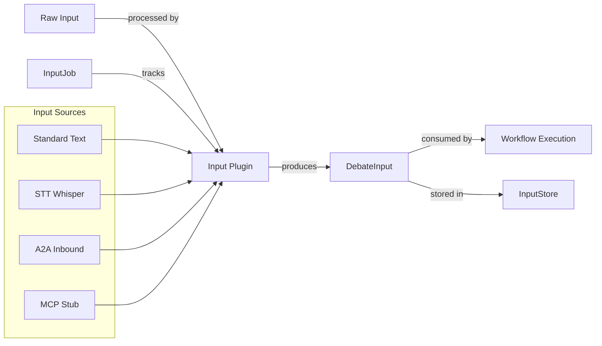

# Input Composer & Input-Plugin-Architektur — Implementation Plan

## Architecture Principle

> The Input Composer is the exact mirror of the Output Composer:
> - Workflow execution and input capture must not be mixed.
> - Each Input Plugin produces a standardized `DebateInput` artifact.
> - Workflow execution consumes **only** this artifact.
> - Input plugins are dynamically extensible via a central registry — including preparation for future external plugins (video renderer, etc.).

### System Context



### Symmetry with Output Composer

| Output Composer | Input Composer |
|----------------|---------------|
| `DebateArtifact` | `DebateInput` |
| `RenderJob` | `InputJob` |
| `OutputPlugin` ABC | `InputPlugin` ABC |
| `PluginRegistry` | `InputPluginRegistry` |
| `RenderEngineService` | `InputComposerService` |
| `ArtifactStore` | `InputStore` |
| `RenderJobStore` | `InputJobStore` |

---

## Phase A: Core Data Models

### A.1 — `backend/models/debate_input.py`

```python
class InputAttachment(BaseModel):
    id: str
    mime_type: str
    content_ref: str
    description: str = ""
    extracted_text: str | None = None

class DebateInput(BaseModel):
    session_id: str | None = None
    source_plugin_key: str
    source_metadata: dict = {}
    topic: str
    attachments: list[InputAttachment] = []
    context_overrides: dict = {}
    timestamp: datetime
    input_hash: str  # SHA-256 over topic + serialized attachments

    def compute_hash(self) -> str: ...
```

### A.2 — `backend/models/input_job.py`

```python
class InputJobStatus(StrEnum):
    QUEUED = "queued"
    PROCESSING = "processing"
    COMPLETED = "completed"
    FAILED = "failed"
    PENDING_APPROVAL = "pending_approval"

class InputJob(BaseModel):
    id: str
    status: InputJobStatus = InputJobStatus.QUEUED
    plugin_key: str
    config: dict = {}
    raw_input_data: dict = {}
    processed_input: DebateInput | None = None
    error_message: str | None = None
    created_at: datetime
    completed_at: datetime | None = None
```

---

## Phase B: Plugin Architecture

### B.1 — `backend/services/input/__init__.py`

### B.2 — `backend/services/input/base.py` — `InputPlugin` ABC

```python
class InputPlugin(ABC):
    plugin_key: ClassVar[str]
    plugin_name: ClassVar[str]
    config_schema: ClassVar[Type[BaseModel]]

    @abstractmethod
    async def capture(self, config: BaseModel) -> DebateInput: ...
    async def validate(self, config: BaseModel) -> bool: ...
    @classmethod
    def validate_config(cls, config: dict) -> BaseModel: ...
    @classmethod
    def config_json_schema(cls) -> dict: ...
    def get_ui_hints(self) -> dict: ...
```

### B.3 — `backend/services/input/registry.py` — `InputPluginRegistry`

Dedicated singleton (parallel to Output's `PluginRegistry`):
- `InputPluginRegistry.instance()`, `.register()`, `.get_plugin()`, `.list_plugins()`, `.has_plugin()`
- `@register_input_plugin` decorator

---

## Phase C: Plugin 0 — Standard Text Input

### C.1 — `backend/services/input/plugins/__init__.py`

### C.2 — `backend/services/input/plugins/standard_text.py`

- `StandardTextInputPlugin` with `plugin_key = "standard_text"`
- `config_schema`: `{ placeholder_text: str | None }`
- `capture()`: wraps topic text from request into `DebateInput`
- `get_ui_hints()`: `{ requires_microphone: false, supports_streaming: false }`

---

## Phase D: Plugin 1 — STT Input

### D.1 — Extend `BlueprintLLMProfile`

- Add `"stt"` to `protocol` Literal
- Add STT providers: `"whisper-local"`, `"whisper-api"`, `"azure-stt"`, `"google-stt"`

### D.2 — `backend/services/stt_service.py`

```python
class STTService:
    async def transcribe_chunk(self, audio_bytes: bytes, profile) -> str: ...
    async def transcribe_file(self, file_path: Path, profile) -> str: ...
```

- whisper-local: `faster-whisper` or `openai-whisper`, CPU fallback
- whisper-api / cloud: LiteLLM or direct API

### D.3 — `backend/services/input/plugins/stt_plugin.py`

- `STTInputPlugin` with `plugin_key = "stt"`
- `config_schema`: `{ llm_profile_id: str, stream_partial: bool, auto_submit: bool }`
- `validate()`: checks LLMProfile exists and `protocol == "stt"`
- `capture()`: provides transcription logic (frontend streams audio)

### D.4 — Audio Streaming Endpoint

- `POST /api/v1/input/stt/stream` — receives audio blobs
- Returns SSE with `event: partial` and `event: final`
- Final transcript → `DebateInput` → `InputJob`

### D.5 — Database: `stt_voices` table

---

## Phase E: Plugin 2 — A2A Inbound

### E.1 — `backend/services/input/plugins/a2a_inbound.py`

- `A2AInboundPlugin` with `plugin_key = "a2a_inbound"`
- `config_schema`: `{ allowed_agents: list[str], require_approval: bool }`

### E.2 — A2A Inbound Endpoint

- `POST /api/v1/a2a/inbound` — accepts A2A JSON-RPC 2.0
- Extracts topic from `message.parts[0].text`
- Creates `InputJob` (queued if `require_approval`)

### E.3 — Database: `a2a_inbound_tasks` table

### E.4 — Approval Workflow

- `POST /api/v1/input/a2a/{task_id}/approve`
- `POST /api/v1/input/a2a/{task_id}/reject`

---

## Phase F: Plugin 3 — MCP Stub

### F.1 — `backend/services/input/plugins/mcp_plugin.py`

- `MCPInputPlugin` with `plugin_key = "mcp"`
- `capture()`: raises `NotImplementedError`
- `get_ui_hints()`: `{ is_available: false, coming_soon: true }`

### F.2 — `backend/services/input/mcp_adapter.py` — MCPAdapter Protocol

### F.3 — Reserved API path: `POST /api/v1/mcp/tools/call`

---

## Phase G: Input Composer Service & Job Processing

### G.1 — `backend/services/input/input_job_store.py`

```python
class InputJobStore:
    def create_job(self, job: InputJob) -> None: ...
    def get_job(self, job_id: str) -> InputJob | None: ...
    def update_job(self, job_id: str, **fields) -> None: ...
    def list_jobs(self, ...) -> list[InputJob]: ...
    def delete_job(self, job_id: str) -> None: ...
```

### G.2 — `backend/services/input/input_store.py`

```python
class InputStore:
    def save(self, debate_input: DebateInput) -> None: ...
    def get(self, session_id: str) -> DebateInput | None: ...
    def delete(self, session_id: str) -> None: ...
```

### G.3 — `backend/services/input/input_engine.py`

```python
class InputComposerService:
    async def submit_input(
        self, plugin_key: str, config: dict, raw_data: Any
    ) -> InputJob:
        """a. Validate config, b. Create InputJob, c. Route by plugin type"""
        ...

    async def finalize_input(
        self, job_id: str, processed_data: DebateInput
    ) -> None:
        """a. Save processed_input, b. Set completed, c. Trigger workflow start"""
        ...
```

### G.4 — Workflow Orchestration Handoff

The `InputComposerService` is NOT responsible for workflow execution. It produces the `DebateInput` artifact only. A separate `WorkflowOrchestrator` (extension of the execution engine) subscribes to completed input jobs and starts the `WorkflowDefinition`:

```python
orchestrator.start_session(debate_input: DebateInput, workflow_id: str)
```

This creates the session, initializes `DebateState` with `debate_input.topic` and `debate_input.source_metadata`, and starts the LangGraph.

---

## Phase G2: Input Composer API

### G2.1 — `backend/api/routers/input_composer.py`

| Method | Path | Description |
|--------|------|-------------|
| GET | `/api/v1/input-plugins` | List all input plugins with config schemas + ui_hints |
| POST | `/api/v1/input/submit` | Submit input (standard_text direct, others create job) |
| GET | `/api/v1/input/jobs/{job_id}` | Get input job status |
| DELETE | `/api/v1/input/jobs/{job_id}` | Delete input job |
| POST | `/api/v1/input/stt/stream` | Audio streaming endpoint (SSE) |
| POST | `/api/v1/input/a2a/{task_id}/approve` | Approve A2A inbound request |
| POST | `/api/v1/input/a2a/{task_id}/reject` | Reject A2A inbound request |

### G2.2 — Register routers in `backend/main.py`

---

## Phase H: Frontend — Input Composer UI

### H.1 — Route + Sidebar

- Add `input` route in `App.svelte`
- Add nav entry in `Sidebar.svelte` with `🎤` icon
- i18n keys: `nav.input` → `Eingabe` / `Input`

### H.2 — `frontend/src/views/InputComposerView.svelte`

Main view with:
1. **Central textarea** — debate topic / case description (single source of truth)
2. **Plugin selector** — horizontal button strip (standard_text default, stt, a2a)
3. **STT integration** — microphone icon, MediaRecorder API, SSE partial/final
4. **A2A approval card** — toast/card for pending external agent requests
5. **Workflow template selector** — dropdown for WorkflowTemplate
6. **Start button** — validates text, sends `POST /api/v1/input/submit`

### H.3 — `frontend/src/components/input/`

- `PluginSelector.svelte` — horizontal button strip for plugin selection
- `STTMicrophoneButton.svelte` — mic icon, recording state, MediaRecorder
- `A2AApprovalCard.svelte` — approval/rejection for inbound requests
- `WorkflowTemplatePicker.svelte` — template selection dropdown

### H.4 — `frontend/src/lib/input/`

- `inputApi.js` — API client for input endpoints
- `inputJobStore.js` — Svelte 5 runes store for input job polling
- `sttStream.js` — MediaRecorder + SSE connection management

### H.5 — `WorkflowDefinition` extension

Add optional `input_config` field to `WorkflowDefinition`:
```python
input_config: dict | None = None
# { "default_input_plugin": str, "stt_profile_id": str|None, "a2a_inbound_enabled": bool }
```

---

## Phase I: Integration with LLM Profiles & Workflow Builder

### I.1 — STT Profiles in Blueprint Catalog

- `BlueprintLLMProfile` with `protocol: "stt"` are selectable in the Blueprint Canvas
- UI shows microphone icon for STT profiles
- InputNode in Workflow Builder can bind to an STT profile

### I.2 — Input Composer reads STT profile from workflow config or global default

---

## Phase J: External Plugin Preparation

### J.1 — `backend/services/input/plugin_manifest.py`

```python
class PluginManifest(BaseModel):
    manifest_version: str = "1.0"
    plugin_key: str
    plugin_type: Literal["input", "output", "both"]
    name: str
    description: str = ""
    author: str = ""
    version: str = "1.0.0"
    entrypoint: str  # Python module path or Docker image
    config_schema: dict = {}  # JSON Schema
    permissions: list[str] = []
```

### J.2 — `external_plugins/` directory

- Create `external_plugins/` in project root
- Document that only trusted sources should be loaded
- `DANWA_ALLOW_EXTERNAL_PLUGINS` config variable (default: `false`)

### J.3 — Example stub: `external_plugins/example_video_renderer/`

- `manifest.json` — PluginManifest
- `plugin.py` — stub OutputPlugin class (no functionality, template only)

---

## Phase K: Database Schema (Migration v12)

| Table | Columns |
|-------|---------|
| `input_jobs` | id (PK), plugin_key, config (JSON), raw_input_data (JSON), processed_input (JSON), status, error_message, created_at, completed_at |
| `a2a_inbound_tasks` | task_id (PK), agent_id, message_preview, input_job_id, status, created_at |
| `stt_voices` | model_id (PK), provider, language, device, is_available |
| `debate_inputs` | session_id (PK), data (JSON), created_at |

Extend existing tables:
- `blueprint_llm_profiles`: `protocol` column now accepts `"stt"`
- `workflow_definitions`: add `input_config` (JSON) column

---

## Phase L: Tests

| File | Tests |
|------|-------|
| `test_debate_input.py` | DebateInput, InputAttachment, hash computation |
| `test_input_job.py` | InputJob, InputJobStatus, status transitions |
| `test_input_plugin.py` | InputPluginRegistry, @register_input_plugin, config validation |
| `test_standard_text_plugin.py` | StandardTextInputPlugin capture, config, ui_hints |
| `test_stt_plugin.py` | STTInputPlugin validate, capture, STTService mock |
| `test_a2a_inbound_plugin.py` | A2AInboundPlugin, approval workflow |
| `test_input_engine.py` | InputComposerService submit/finalize, InputJobStore, InputStore |
| `test_input_composer_api.py` | All API endpoints |

---

## Akzeptanzkriterien

- `GET /api/v1/input-plugins` lists standard_text, stt, a2a_inbound, mcp (mcp as `is_available: false`)
- User can enter text, start STT via microphone, see live transcription in textarea
- STT works with local Whisper (CPU-capable) and is configurable via `LLMProfile` with `protocol: stt`
- A2A request at `POST /a2a` creates InputJob; `require_approval=true` shows approval card in frontend
- `DebateInput` is the only interface between Input Composer and Workflow Orchestrator
- pytest covers STT transcription (mock audio), A2A inbound parsing, InputJob lifecycle
- Playwright test: STT microphone button starts recording, textarea shows result, debate can be started

---

## Execution Order

1. Phase A — Core data models (debate_input.py, input_job.py)
2. Phase B — Plugin architecture (base.py, registry.py)
3. Phase K — Database migration v12
4. Phase G.1-2 — InputJobStore, InputStore
5. Phase C — Standard Text Input plugin
6. Phase D — STTInputPlugin + STTService + audio streaming endpoint
7. Phase E — A2AInboundPlugin + inbound endpoint + approval workflow
8. Phase F — MCP stub + adapter interface
9. Phase G.3-4 — InputComposerService + Workflow Orchestration handoff
10. Phase G2 — Input Composer API router
11. Phase H — Frontend (Input Composer UI, components, API client)
12. Phase I — STT profiles in Blueprint Catalog
13. Phase J — External plugin preparation (manifest, example stub)
14. Phase L — Tests
15. Verify — ruff, full test suite, frontend build
