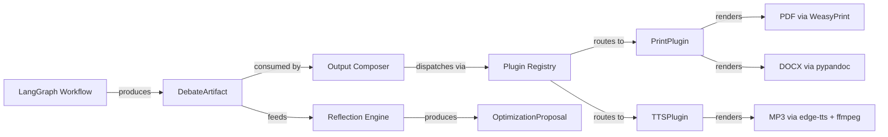

# Output Composer & Render Pipeline — Implementation Plan

## Architecture Principle

> The workflow execution (LangGraph) produces a standardized `DebateArtifact` upon completion. The Output Composer consumes **only** this artifact and transforms it via registered plugins into target formats. Never the other way around. Never during execution.

### System Context



### Existing Dependencies (already in `pyproject.toml`)

- `pydantic>=2.7.0` — data models
- `weasyprint>=61.0` — HTML → PDF
- `jinja2>=3.1.0` — HTML templating
- `python-docx>=1.1.0` — DOCX generation (fallback)
- `odfpy>=1.4.1` — ODF generation

### New Dependencies Required

- `pypandoc` — preferred for DOCX generation (universal document model via pandoc)
- `edge-tts` — Microsoft Edge TTS engine for podcast generation
- `ffmpeg` — system dependency for audio concatenation (must be installed on host)

---

## Phase A: Core Data Models

### A.1 — `backend/models/artifact.py`

Create Pydantic-V2 models: the **DebateArtifact** is the single source of truth between execution and rendering.

#### Inner Transcript Models (standalone classes, not dicts)

```python
class Turn(BaseModel):
    """A single agent turn in the debate transcript."""
    id: str
    round: int
    node_id: str
    agent_name: str
    role_type: str
    role_definition_id: str
    llm_profile_id: str
    content: str
    timestamp: datetime
    latency_ms: int
    token_usage: dict[str, int]  # {"prompt": N, "completion": N, "total": N}

class Injection(BaseModel):
    """A user or system injection into the debate."""
    id: str
    source: Literal["user", "system"]
    target_node_id: str
    content: str
    timestamp: datetime
    injected_at_round: int

class UserQuery(BaseModel):
    """A user query submitted during the debate."""
    id: str
    content: str
    timestamp: datetime
    response_turn_id: str | None = None

class MinorityVote(BaseModel):
    """A dissenting opinion from an agent."""
    id: str
    agent_name: str
    dissent_content: str
    target_turn_id: str
    timestamp: datetime
```

#### Top-Level Artifact

```python
class DebateArtifact(BaseModel):
    """Immutable output of a completed workflow execution.

    This is the sole interface between execution (LangGraph) and
    rendering (Output Composer / plugins).
    """
    session_id: str
    workflow_id: str
    workflow_version: int
    workflow_name: str
    topic: str
    tone_profile_snapshot: dict = Field(default_factory=dict)
    transcript: list[Turn] = Field(default_factory=list)
    interjections: list[Injection] = Field(default_factory=list)
    user_queries: list[UserQuery] = Field(default_factory=list)
    minority_votes: list[MinorityVote] = Field(default_factory=list)
    consensus_result: dict | None = None
    metadata: dict = Field(default_factory=dict)
    # metadata keys: token_usage, latencies, timestamps (start/end),
    #                agents (list of {name, blueprint_id, role_type, llm_profile_id})
```

---

### A.2 — `backend/models/render_job.py`

```python
class RenderJobStatus(StrEnum):
    QUEUED = "queued"
    RUNNING = "running"
    COMPLETED = "completed"
    FAILED = "failed"

class RenderJob(BaseModel):
    """Tracks the lifecycle of a single render job."""
    id: str = Field(default_factory=lambda: str(uuid.uuid4()))
    session_id: str                    # references a DebateArtifact
    status: RenderJobStatus = RenderJobStatus.QUEUED
    plugin_key: str                    # e.g. "print", "tts"
    config: dict = Field(default_factory=dict)  # plugin-specific config
    created_at: datetime = Field(default_factory=lambda: datetime.now(UTC))
    started_at: datetime | None = None
    completed_at: datetime | None = None
    error_message: str | None = None
    output_files: list[str] = Field(default_factory=list)
    artifact_snapshot_hash: str = ""   # SHA-256 of DebateArtifact JSON
```

---

## Phase B: Plugin Architecture (Backend)

### B.4 — `backend/services/output/base.py`

Abstract base class defining the plugin contract:

```python
class OutputPlugin(ABC):
    """Abstract base for all output rendering plugins.

    Plugins MUST be stateless — no instance state persisted between
    render calls. Each render() invocation is independent.
    """

    plugin_key: ClassVar[str]           # e.g. "print", "tts"
    plugin_name: ClassVar[str]          # e.g. "Print / PDF / DOCX"
    supported_formats: ClassVar[list[str]]  # e.g. ["pdf", "docx"]
    config_schema: ClassVar[Type[BaseModel]]

    @abstractmethod
    async def render(
        self,
        artifact: DebateArtifact,
        config: BaseModel,
        job_id: str,
        output_dir: Path,
    ) -> list[Path]:
        """Render the artifact to file(s). Returns list of output paths."""
        ...

    @classmethod
    def validate_config(cls, config: dict) -> BaseModel:
        """Validate raw config dict against config_schema."""
        return cls.config_schema.model_validate(config)
```

### B.5 — `backend/services/output/registry.py`

Singleton plugin registry with decorator-based registration:

```python
class PluginRegistry:
    """Singleton registry for output plugins."""

    _instance: PluginRegistry | None = None
    _plugins: dict[str, OutputPlugin]  # key → plugin instance

    @classmethod
    def instance(cls) -> PluginRegistry: ...

    def register(self, plugin_class: Type[OutputPlugin]) -> None:
        """Register a plugin class. Called by @register_plugin decorator."""
        ...

    def get_plugin(self, key: str) -> OutputPlugin:
        """Get plugin by key. Raises KeyError if unknown."""
        ...

    def list_plugins(self) -> list[OutputPlugin]:
        """Return all registered plugins."""
        ...

def register_plugin(cls: Type[OutputPlugin]) -> Type[OutputPlugin]:
    """Class decorator that registers an OutputPlugin with the registry."""
    PluginRegistry.instance().register(cls)
    return cls
```

### B.6 — Stateless Enforcement

- `OutputPlugin` ABC documents the stateless contract in its docstring
- No instance variables allowed to persist between `render()` calls
- The `PrintOutputPlugin` (Phase C) will use a fresh `PrintLayoutEngine` per render call
- The `TTSOutputPlugin` (Phase D) will use a fresh `TTSScriptEngine` per render call

---

## Phase C: Print Plugin (Full Implementation)

### C.1 — Plugin Registration: `backend/services/output/plugins/__init__.py` + `print_plugin.py`

```python
@register_plugin
class PrintOutputPlugin(OutputPlugin):
    plugin_key = "print"
    plugin_name = "Print / PDF / DOCX"
    supported_formats = ["pdf", "docx"]
    config_schema = PrintPluginConfig  # defined below
```

### C.2 — Plugin Config Schema

```python
class PrintTemplate(str, Enum):
    ACADEMIC_DEBATE = "academic_debate"
    MINIMAL = "minimal"

class PrintFormat(str, Enum):
    PDF = "pdf"
    DOCX = "docx"
    BOTH = "both"

class PageSize(str, Enum):
    A4 = "a4"
    LETTER = "letter"

class PrintPluginConfig(BaseModel):
    template_name: PrintTemplate = PrintTemplate.ACADEMIC_DEBATE
    include_audit_trail: bool = True
    include_minority_votes: bool = True
    primary_format: PrintFormat = PrintFormat.PDF
    page_size: PageSize = PageSize.A4
    language: str = Field(default="de", description="Locale: 'de' or 'en'")
```

### C.3 — Print Data Structures: `backend/services/output/plugins/print_models.py`

Internal semantic layout models:

```python
class MarginNoteType(str, Enum):
    INJECTION = "injection"
    META = "meta"
    DISSENT = "dissent"

class MarginNote(BaseModel):
    type: MarginNoteType
    content: str
    reference_id: str

class SectionType(str, Enum):
    HEADER = "header"
    TURN = "turn"
    INJECTION_SIDEBAR = "injection_sidebar"
    MINORITY_CALLOUT = "minority_callout"
    USER_QUERY_BLOCK = "user_query_block"
    CONSENSUS_SUMMARY = "consensus_summary"
    AUDIT_APPENDIX = "audit_appendix"

class PrintSection(BaseModel):
    type: SectionType
    title: str = ""
    content: str = ""
    agent_name: str = ""
    timestamp: datetime | None = None
    round: int | None = None
    margin_notes: list[MarginNote] = Field(default_factory=list)
    css_class: str = ""

class PrintMetadata(BaseModel):
    topic: str
    workflow_name: str
    participants: list[str]
    duration: str
    total_tokens: int

class PrintDocument(BaseModel):
    """Semantic layout representation before HTML rendering."""
    sections: list[PrintSection]
    metadata: PrintMetadata
```

### C.4 — Layout Engine: `backend/services/output/plugins/print_layout_engine.py`

Transforms `DebateArtifact` → `PrintDocument`:

```
academic_debate template rules:
  a) Each Turn → PrintSection(type=turn)
  b) Injections → MarginNote attached to matching Turn section (by target_node_id)
  c) UserQueries → standalone PrintSection(type=user_query_block) before the referenced round
  d) MinorityVotes → PrintSection(type=minority_callout) with visual emphasis
  e) consensus_result → PrintSection(type=consensus_summary) at the end
  f) If include_audit_trail: PrintSection(type=audit_appendix) with agent/latency/tokens table
```

### C.5 — HTML Generation: `templates/print/` (Jinja2)

Directory structure:
```
templates/
  print/
    academic_debate.html    # Main Jinja2 template
    minimal.html            # Minimal template
    _macros.html            # Shared Jinja2 macros
    css/
      academic_debate.css   # Print styles for academic layout
      minimal.css           # Print styles for minimal layout
    i18n/
      de.json               # German labels
      en.json               # English labels
```

**HTML Structure (academic_debate):**
- Semantic HTML5: `<article>`, `<aside>`, `<section>`, `<header>`
- Two-column CSS Grid layout:
  - Main column (70-75%): debate arguments
  - Sidebar column (25-30%): margin notes, metadata, injections
- CSS classes: `.debate-turn`, `.margin-note.injection`, `.minority-callout`, `.user-query-block`
- Each turn header: agent name, role, round number, timestamp
- Injections in sidebar: ⚡ icon, color-coded background

**Localization:**
- Jinja2 variable `{{ i18n.turn_label }}` etc.
- i18n dict loaded from `templates/print/i18n/{language}.json` based on `config.language`

### C.6 — Format Output

| Format | Engine | Output Path |
|--------|--------|-------------|
| PDF | WeasyPrint `HTML(string=html).write_pdf()` | `{output_dir}/{job_id}/debate.pdf` |
| DOCX | pypandoc `convert_text(html, 'docx')` → fallback `python-docx` | `{output_dir}/{job_id}/debate.docx` |

- If `primary_format = both`, generate both files
- All outputs in job-specific subdirectory: `{output_dir}/{job_id}/`

---

## Phase D: TTS / Podcast Plugin (Full Implementation)

### D.1 — Plugin Registration: `backend/services/output/plugins/tts_plugin.py`

```python
@register_plugin
class TTSOutputPlugin(OutputPlugin):
    plugin_key = "tts"
    plugin_name = "TTS Podcast / Interview"
    supported_formats = ["mp3", "wav"]
    config_schema = TTSPluginConfig  # defined below
```

### D.2 — Plugin Config Schema

```python
class TTSEngine(str, Enum):
    EDGE_TTS = "edge_tts"

class AudioFormat(str, Enum):
    MP3 = "mp3"
    WAV = "wav"

class TTSPluginConfig(BaseModel):
    engine: TTSEngine = TTSEngine.EDGE_TTS
    voice_mapping: dict[str, str] = Field(
        default_factory=dict,
        description="agent_id → voice_id mapping (e.g. {'strategist': 'de-DE-ConradNeural'})",
    )
    default_voice: str = "de-DE-KatjaNeural"
    segment_pause_ms: int = Field(default=800, ge=0, le=5000)
    turn_pause_ms: int = Field(default=300, ge=0, le=5000)
    intro_text: str | None = None
    outro_text: str | None = None
    output_format: AudioFormat = AudioFormat.MP3
    bitrate: str = Field(default="128k", pattern=r"^\d+k$")
```

### D.3 — TTS Data Structures: `backend/services/output/plugins/tts_models.py`

```python
class TTSSegment(BaseModel):
    """A single audio segment in the TTS script."""
    id: str
    speaker_name: str
    speaker_role: str
    voice_id: str
    text: str
    pause_after_ms: int = 0
    is_intro: bool = False
    is_outro: bool = False
    injection_reference: str | None = None  # ID of injection being referenced

class TTSScript(BaseModel):
    """Ordered list of segments forming a complete podcast episode."""
    segments: list[TTSSegment]
    metadata: dict = Field(default_factory=dict)
    # metadata keys: topic, total_segments, estimated_duration_ms
```

### D.4 — Script Engine: `backend/services/output/plugins/tts_script_engine.py`

Transforms `DebateArtifact` → `TTSScript`:

```
TTS Script rules:
  a) If intro_text is set → TTSSegment(is_intro=True) at the beginning
     with speaker_name="Narrator", voice_id=default_voice
  b) For each round (sorted by round number):
     - Injections for this round → TTSSegment with spoken hint
       (e.g. "Zwischenfrage:" or "Interjection:") + pause_after_ms=segment_pause_ms
     - UserQueries for this round → TTSSegment with spoken hint
       (e.g. "Nutzerfrage:" or "User question:") + pause_after_ms=segment_pause_ms
     - Turns for this round → TTSSegment with full content,
       voice resolved from voice_mapping[agent_id] or default_voice
     - Each turn followed by turn_pause_ms
  c) If outro_text is set → TTSSegment(is_outro=True) at the end
  d) MinorityVotes → NOT included in audio by default (optionally as
     "Minderheitsvotum" segments in a future extension)
```

### D.5 — Edge TTS Renderer: `backend/services/output/plugins/edge_tts_renderer.py`

```python
class EdgeTTSRenderer:
    """Renders TTSScript to audio files using edge-tts + ffmpeg."""

    async def render(
        self,
        script: TTSScript,
        job_id: str,
        output_dir: Path,
        output_format: AudioFormat = AudioFormat.MP3,
        bitrate: str = "128k",
    ) -> Path:
        """
        1. Create job output directory: {output_dir}/{job_id}/segments/
        2. For each segment in script.segments:
           - edge_tts.Communicate(segment.text, voice=segment.voice_id)
           - Save as {output_dir}/{job_id}/segments/{segment.id}.mp3
           - Generate silence file for pause_after_ms via ffmpeg anullsrc
        3. Generate concat_list.txt with all segment + silence files in order
        4. ffmpeg -f concat -safe 0 -i concat_list.txt -b:a {bitrate}
           {output_dir}/{job_id}/debate_podcast.{format}
        5. Clean up segment files (optional, configurable)
        6. Return path to final audio file
        """
        ...
```

**FFmpeg concat approach:**
- Each segment rendered to individual file
- Silence generated via `ffmpeg -f lavfi -i anullsrc=r=24000:cl=mono -t {pause_ms}ms`
- Concat demuxer file lists all segments + silences in order
- Final output via `ffmpeg -f concat -safe 0 -i concat_list.txt -b:a {bitrate}`

### D.6 — Voice Discovery (SQLite Cache)

```python
class VoiceStore:
    """SQLite cache for available TTS voices.

    Populated via edge-tts --list-voices (or edge_tts.list_voices())
    and cached in the tts_voices table.
    """

    def __init__(self, db_path: Path | str = _DEFAULT_DB_PATH): ...

    def ensure_populated(self) -> None:
        """Run edge_tts.list_voices() and cache results if table is empty."""
        ...

    def list_voices(
        self,
        language: str | None = None,
        gender: str | None = None,
    ) -> list[dict]:
        """Return cached voices, optionally filtered by language/gender."""
        ...
```

**SQLite table `tts_voices`:**
| Column | Type | Description |
|--------|------|-------------|
| voice_id | TEXT PK | e.g. `de-DE-ConradNeural` |
| name | TEXT | Display name |
| language | TEXT | e.g. `de-DE` |
| gender | TEXT | `Male` / `Female` |

---

## Phase E: Reflection / Meta-Workflow (Stub)

### E.1 — Data Model: `backend/models/optimization_proposal.py`

```python
class ProposalStatus(StrEnum):
    PENDING = "pending"
    APPROVED = "approved"
    REJECTED = "rejected"
    SUPERSEDED = "superseded"

class ProposalCreatedBy(StrEnum):
    META_AGENT = "meta_agent"
    USER = "user"

class OptimizationProposal(BaseModel):
    """A proposed workflow optimization generated by the meta-agent."""
    id: str = Field(default_factory=lambda: str(uuid.uuid4())[:8])
    target_workflow_id: str
    source_session_id: str | None = None
    proposed_nodes: list[dict] = Field(default_factory=list)   # Schema = WorkflowNode
    proposed_edges: list[dict] = Field(default_factory=list)   # Schema = WorkflowEdge
    rationale: str = ""
    risk_assessment: str = ""
    estimated_impact: str = ""
    status: ProposalStatus = ProposalStatus.PENDING
    created_by: ProposalCreatedBy = ProposalCreatedBy.META_AGENT
    approved_by: str | None = None
    approved_at: datetime | None = None
    parent_version_id: str = ""     # WorkflowDefinition.id of the version being improved
    new_version_id: str | None = None  # Set after approval → new WorkflowDefinition.id
    created_at: datetime = Field(default_factory=lambda: datetime.now(UTC))
```

### E.2 — SQLite Table: `optimization_proposals`

Created via migration in `backend/blueprints/migrations.py`:

| Column | Type | Constraints |
|--------|------|-------------|
| id | TEXT | PRIMARY KEY |
| target_workflow_id | TEXT | NOT NULL |
| source_session_id | TEXT | |
| proposed_nodes_json | TEXT | |
| proposed_edges_json | TEXT | |
| rationale | TEXT | |
| risk_assessment | TEXT | |
| estimated_impact | TEXT | |
| status | TEXT | DEFAULT 'pending' |
| created_by | TEXT | DEFAULT 'meta_agent' |
| approved_by | TEXT | |
| approved_at | TEXT | |
| parent_version_id | TEXT | |
| new_version_id | TEXT | |
| created_at | TEXT | NOT NULL |

### E.3 — Service Stub: `backend/services/meta_workflow.py`

```python
class MetaWorkflowService:
    """Stub for the meta-workflow reflection engine.

    In this phase, generate_proposal() produces a dummy proposal
    with static text. No LLM integration yet.
    """

    def __init__(self, repo: BlueprintRepository): ...

    async def generate_proposal(
        self,
        target_workflow_id: str,
        artifact: DebateArtifact | None = None,
    ) -> OptimizationProposal:
        """Generate an optimization proposal for a workflow.

        Checks that target_workflow_id exists and is not locked.
        Returns a dummy OptimizationProposal with static text.
        """
        ...
```

### E.4 — Repository: `backend/repositories/proposal_repo.py`

```python
class ProposalRepository:
    """SQLite-backed storage for OptimizationProposals."""

    def __init__(self, db_path: Path | str = _DEFAULT_DB_PATH): ...

    def save(self, proposal: OptimizationProposal) -> None: ...
    def get(self, proposal_id: str) -> OptimizationProposal | None: ...
    def list_proposals(
        self,
        status: ProposalStatus | None = None,
        workflow_id: str | None = None,
        limit: int = 50,
        offset: int = 0,
    ) -> list[OptimizationProposal]: ...
    def update_status(
        self,
        proposal_id: str,
        status: ProposalStatus,
        approved_by: str | None = None,
        new_version_id: str | None = None,
    ) -> None: ...
```

### E.5 — API Endpoints: `backend/api/routers/optimization_proposals.py`

| Method | Path | Description |
|--------|------|-------------|
| POST | `/api/v1/workflows/{id}/reflect` | Generate proposal via MetaWorkflowService |
| GET | `/api/v1/optimization-proposals` | List proposals (filterable by status) |
| GET | `/api/v1/optimization-proposals/{id}` | Get single proposal |
| POST | `/api/v1/optimization-proposals/{id}/approve` | Approve → creates new WorkflowDefinition version, sets `new_version_id` |
| POST | `/api/v1/optimization-proposals/{id}/reject` | Reject → sets status to rejected |

**Approve flow:**
1. Check `proposal.status == pending`
2. Increment `WorkflowDefinition.version`
3. Create new WorkflowDefinition with `parent_version_id = old.id`
4. Set `proposal.new_version_id = new_wf.id`, `proposal.approved_by`, `proposal.approved_at`
5. Audit log: `proposal_approved`

### E.6 — Audit Integration

Every proposal lifecycle event is logged to the `audit_log` table:

| event_type | actor | metadata |
|------------|-------|----------|
| `proposal_created` | `"meta_agent"` or `"user"` | `{proposal_id, target_workflow_id}` |
| `proposal_approved` | user who approved | `{proposal_id, new_version_id}` |
| `proposal_rejected` | user who rejected | `{proposal_id}` |

---

## Phase F: Render Engine & Job Processing

### F.1 — Render Engine Service: `backend/services/render_engine.py`

```python
class RenderEngineService:
    """Orchestrates render job lifecycle: validate, dispatch, track."""

    def __init__(
        self,
        artifact_store: ArtifactStore,
        job_store: RenderJobStore,
        registry: PluginRegistry,
        output_dir: Path,
    ): ...

    async def submit_job(
        self, session_id: str, plugin_key: str, config: dict
    ) -> RenderJob:
        """
        a. Load DebateArtifact for session_id from ArtifactStore
        b. Validate config against plugin.config_schema
        c. Create RenderJob with status=queued
        d. Create job output directory: {output_dir}/{job_id}/
        e. Return the RenderJob
        """

    async def execute_job(self, job_id: str) -> None:
        """
        Background task:
        1. Update status → running, set started_at
        2. Get plugin via registry.get_plugin(job.plugin_key)
        3. Call plugin.render(artifact, config, job_id, output_dir)
        4. Update status → completed, set output_files, completed_at
        5. On error: update status → failed, set error_message, completed_at
        """
```

### F.2 — Artifact Store: `backend/services/artifact_store.py`

Persists `DebateArtifact` to the `debate_artifacts` table. Used by RenderEngine to load artifacts and by the workflow runner to save them on completion.

```python
class ArtifactStore:
    """SQLite-backed storage for DebateArtifact objects."""

    def __init__(self, db_path: Path | str = _DEFAULT_DB_PATH): ...

    def save(self, artifact: DebateArtifact) -> None:
        """INSERT OR REPLACE into debate_artifacts."""

    def get(self, session_id: str) -> DebateArtifact | None:
        """Load artifact by session_id, or None if not found."""

    def delete(self, session_id: str) -> None:
        """Delete artifact by session_id."""
```

### F.3 — Render Job Store: `backend/services/render_job_store.py`

SQLite-backed store for `RenderJob` lifecycle tracking. Extends the pattern from `ReportJobStore`.

```python
class RenderJobStore:
    """SQLite-backed store for render jobs."""

    def __init__(self, db_path: Path | str = _DEFAULT_DB_PATH): ...

    def create_job(self, job: RenderJob) -> None: ...
    def get_job(self, job_id: str) -> RenderJob | None: ...
    def update_job(self, job_id: str, **fields) -> None: ...
    def list_jobs(
        self, session_id: str | None = None, limit: int = 50, offset: int = 0
    ) -> list[RenderJob]: ...
    def delete_job(self, job_id: str) -> None: ...
```

---

## Phase G: Output Composer API

### G.1 — Router: `backend/api/routers/output_composer.py`

| Method | Path | Description |
|--------|------|-------------|
| GET | `/api/v1/output-plugins` | List all registered plugins with key, name, formats, config_schema as JSON Schema |
| POST | `/api/v1/sessions/{session_id}/render` | Start a render job. Body: `{plugin_key, config}` |
| GET | `/api/v1/render-jobs/{job_id}` | Get job status and metadata |
| GET | `/api/v1/render-jobs/{job_id}/download?file_index=0` | Stream-download generated file with correct Content-Type |
| DELETE | `/api/v1/render-jobs/{job_id}` | Soft-delete job and its files |

**GET /api/v1/output-plugins response:**
```json
[
  {
    "plugin_key": "print",
    "plugin_name": "Print / PDF / DOCX",
    "supported_formats": ["pdf", "docx"],
    "config_schema": { /* JSON Schema from Pydantic model_json_schema() */ }
  },
  {
    "plugin_key": "tts",
    "plugin_name": "TTS Podcast / Interview",
    "supported_formats": ["mp3", "wav"],
    "config_schema": { /* JSON Schema */ }
  }
]
```

**Download Content-Type mapping:**
| Extension | Content-Type |
|-----------|-------------|
| `.pdf` | `application/pdf` |
| `.docx` | `application/vnd.openxmlformats-officedocument.wordprocessingml.document` |
| `.mp3` | `audio/mpeg` |
| `.wav` | `audio/wav` |

### G.2 — Workflow Completion Hook

Modify `backend/workflow/workflow_runner.py` — after `graph.ainvoke()` returns:
1. Build `DebateArtifact` from final `WorkflowState` / `DebateState`
2. Save to `ArtifactStore`
3. This makes the artifact available for rendering without touching session-state snapshots

```python
# In run_workflow_background(), after final_state is obtained:
from backend.services.artifact_store import ArtifactStore
artifact = _build_artifact_from_state(session_id, workflow_id, final_state)
ArtifactStore().save(artifact)
```

---

## Phase H: Frontend — Output Composer UI

### H.1 — New Route `output` in `frontend/src/App.svelte`

Add route alongside existing `dashboard`, `debate`, `blueprint`, etc.:
```svelte
{:else if $route === 'output'}
  <OutputComposerView />
```

### H.2 — Sidebar Entry in `frontend/src/components/Sidebar.svelte`

Add to `navItems`:
```js
{ id: 'output', label: t('nav.output'), icon: '🖨️' },
```

Add i18n key `nav.output` → `"Output"` / `"Ausgabe"` in the locale files.

### H.3 — `frontend/src/views/OutputComposerView.svelte`

Main view with three sections:

1. **Session selector** — dropdown of completed sessions (loaded from existing debate/session API)
2. **Plugin grid** — cards for each plugin from `GET /api/v1/output-plugins`
   - Each card shows: icon, name, supported formats
   - Click selects the plugin
3. **Config form** — dynamically rendered from `config_schema` (JSON Schema → Svelte form)
   - String → `<input type="text">`
   - Number → `<input type="number">`
   - Boolean → `<input type="checkbox">`
   - Enum → `<select>`
   - Object/Dict → key-value table (used for `voice_mapping` in TTS plugin)
4. **Generate button** → `POST /api/v1/sessions/{id}/render`
5. **Job status panel** — shows spinner while running, download buttons when completed, error message on failure

### H.4 — `frontend/src/components/output/PluginCard.svelte`

Card component for plugin selection grid.

### H.5 — `frontend/src/components/output/ConfigForm.svelte`

Dynamic JSON Schema → Svelte form renderer. Handles:
- Primitives (string, number, boolean)
- Enums (select dropdown)
- Objects/Dicts (key-value table with add/remove)
- Nested objects (recursive rendering)

### H.6 — `frontend/src/components/output/VoiceMappingEditor.svelte`

Specialized editor for TTS `voice_mapping` dict:
- Table with columns: Agent, Voice (dropdown from `GET /api/v1/tts-voices` endpoint)
- Add/remove rows
- Default voice shown for agents without mapping

### H.7 — `frontend/src/components/output/RenderJobStatus.svelte`

Displays job status with:
- Spinner for `running`
- Progress text
- Error message for `failed`
- Download buttons for each file in `output_files` for `completed`

### H.8 — `frontend/src/lib/output/composerApi.js`

API client functions:
```js
export async function listOutputPlugins() { ... }
export async function startRenderJob(sessionId, pluginKey, config) { ... }
export async function getRenderJobStatus(jobId) { ... }
export async function downloadRenderFile(jobId, fileIndex) { ... }
export async function deleteRenderJob(jobId) { ... }
export async function listTTSVoices(language, gender) { ... }
```

### H.9 — `frontend/src/lib/output/renderJobStore.js` (Svelte 5 Runes)

```js
// Polling store for active render jobs
export function createRenderJobTracker(jobId) {
  // Polls GET /api/v1/render-jobs/{jobId} every 2 seconds
  // Stops when status is terminal (completed or failed)
  // Returns reactive state: { status, outputFile, error, loading }
}
```

### H.10 — Reflection UI (Prepared)

- **Reflect button** in workflow editor toolbar (`frontend/src/components/blueprint/Toolbar.svelte`):
  - Only visible for saved, non-locked workflows
  - Opens confirmation dialog → `POST /api/v1/workflows/{id}/reflect`
- **Proposals sub-tab** in workflow view:
  - Lists proposals from `GET /api/v1/optimization-proposals`
  - Each card shows: rationale, risk assessment, status
  - Action buttons: Approve, Reject, View Diff
  - View Diff: textual diff between `parent_version_id` workflow and `proposed_nodes/proposed_edges`

---

## Phase I: Database Schema Extensions

### I.1 — New SQLite Tables

Added via migration in `backend/blueprints/migrations.py` (increment `SCHEMA_VERSION` to 11):

**`debate_artifacts`** — persists DebateArtifact at workflow completion
| Column | Type | Constraints |
|--------|------|-------------|
| session_id | TEXT | PRIMARY KEY |
| workflow_id | TEXT | NOT NULL |
| data | TEXT | NOT NULL — JSON-serialized DebateArtifact |
| created_at | TEXT | NOT NULL |

**`render_jobs`** — tracks render job lifecycle
| Column | Type | Constraints |
|--------|------|-------------|
| id | TEXT | PRIMARY KEY |
| session_id | TEXT | NOT NULL |
| plugin_key | TEXT | NOT NULL |
| config | TEXT | DEFAULT '{}' — JSON |
| status | TEXT | DEFAULT 'queued' |
| output_files | TEXT | DEFAULT '[]' — JSON array |
| error_message | TEXT | |
| artifact_snapshot_hash | TEXT | |
| created_at | TEXT | NOT NULL |
| started_at | TEXT | |
| completed_at | TEXT | |

**`tts_voices`** — cached voice catalog
| Column | Type | Constraints |
|--------|------|-------------|
| voice_id | TEXT | PRIMARY KEY |
| name | TEXT | |
| language | TEXT | |
| gender | TEXT | |
| provider | TEXT | DEFAULT 'edge_tts' |
| is_active | INTEGER | DEFAULT 1 |

**`optimization_proposals`** — as defined in Phase E.2

### I.2 — Artifact Persistence Hook

In `backend/workflow/workflow_runner.py`, after `graph.ainvoke()`:
```python
# Build and save DebateArtifact
from backend.services.artifact_store import ArtifactStore
artifact = _build_artifact_from_state(session_id, workflow_id, final_state)
ArtifactStore().save(artifact)
```

The Render Engine reads **only** from `debate_artifacts`, never directly from session state snapshots.

---

## Phase J: Filesystem & Resources

### J.1 — Configurable Output Directory

Environment variable `DANWA_OUTPUT_DIR` (default: `./data/outputs`).

```python
# backend/core/config.py — add to settings
output_dir: Path = Field(
    default_factory=lambda: Path(os.environ.get("DANWA_OUTPUT_DIR", "data/outputs"))
)
```

### J.2 — Job Directory Layout

```
{output_dir}/
  {job_id}/
    debate.pdf           # Print plugin output
    debate.docx          # Print plugin output
    debate_podcast.mp3   # TTS plugin output
    segments/            # TTS temporary segments (cleaned after concat)
      seg-001.mp3
      seg-002.mp3
      concat_list.txt
```

- All temp and final files in job-specific subdirectory
- Files persist until job is deleted
- TTS segment files cleaned up after successful concatenation (unless `keep_segments = true`)

### J.3 — Template Package Data

Jinja2 templates under `templates/print/` must be included as package data:

```toml
# pyproject.toml
[tool.setuptools.package-data]
backend = ["templates/print/**/*"]
```

Or use `importlib.resources` / `pkg_resources` to locate templates at runtime:
```python
from importlib.resources import files
template_dir = files("backend") / ".." / "templates" / "print"
```

### J.4 — TTS Segment Cleanup

After successful concatenation in `EdgeTTSRenderer`:
- Delete `{job_id}/segments/*.mp3`
- Delete `{job_id}/segments/concat_list.txt`
- Keep `{job_id}/segments/` directory only if `config.keep_segments = true`

---

## Phase K: Tests

### K.1 — `tests/backend/test_artifact.py`
- Validate DebateArtifact with all fields populated
- Validate with minimal required fields (defaults)
- Validate inner models independently
- Test SHA-256 hash computation on serialized artifact

### K.2 — `tests/backend/test_render_job.py`
- Validate RenderJob with defaults
- Validate RenderJobStatus enum
- Test status transitions (queued → running → completed/failed)

### K.3 — `tests/backend/test_output_plugin.py`
- Test PluginRegistry singleton pattern
- Test @register_plugin decorator
- Test get_plugin() raises on unknown key
- Test list_plugins() returns all registered

### K.4 — `tests/backend/test_print_plugin.py`
- Test PrintPluginConfig validation
- Test PrintLayoutEngine transforms DebateArtifact → PrintDocument
- Test academic_debate template rules (a-f)
- Test Jinja2 HTML rendering produces valid HTML
- Test i18n loading for de/en
- Test PDF generation via WeasyPrint
- Test DOCX generation (pypandoc or fallback)

### K.5 — `tests/backend/test_tts_plugin.py`
- Test TTSPluginConfig validation (voice_mapping, pauses, format)
- Test TTSScriptEngine transforms DebateArtifact → TTSScript
- Test segment ordering: intro → rounds → outro
- Test injection segments are inserted before their round's turns
- Test voice resolution: voice_mapping lookup → default_voice fallback
- Test EdgeTTSRenderer mock: segment files generated, concat_list.txt correct
- Test VoiceStore: list_voices filtering by language/gender

### K.6 — `tests/backend/test_optimization_proposals.py`
- Test OptimizationProposal model with all fields
- Test ProposalRepository save/get/list/update_status
- Test MetaWorkflowService.generate_proposal returns dummy proposal
- Test API: POST /workflows/{id}/reflect creates proposal
- Test API: POST /proposals/{id}/approve → new WorkflowDefinition version
- Test API: POST /proposals/{id}/approve rejects if status != pending
- Test API: POST /proposals/{id}/reject
- Test audit log entries for proposal lifecycle events

### K.7 — `tests/backend/test_render_engine.py`
- Test RenderEngineService.submit_job creates job with correct status
- Test execute_job calls plugin.render with correct arguments
- Test execute_job updates status on success and failure
- Test ArtifactStore save/get/delete round-trip
- Test RenderJobStore CRUD operations

### K.8 — `tests/backend/test_output_composer_api.py`
- Test GET /api/v1/output-plugins returns both plugins
- Test POST /sessions/{id}/render creates job and returns job_id
- Test GET /render-jobs/{id} returns correct status
- Test GET /render-jobs/{id}/download returns file with correct Content-Type
- Test DELETE /render-jobs/{id} removes job
- Test POST /sessions/{id}/render with invalid plugin_key → 400
- Test POST /sessions/{id}/render with invalid config → 422

---

## Dependency Changes

Add to `pyproject.toml`:
```toml
"pypandoc>=1.13",   # DOCX via pandoc (preferred)
"edge-tts>=6.1.0",  # Microsoft Edge TTS engine
```

System dependency (not in pyproject.toml):
```
ffmpeg  # Required for audio concatenation
```

---

## File Structure Summary

```
backend/
  models/
    artifact.py                    # NEW: DebateArtifact + Turn/Injection/UserQuery/MinorityVote
    render_job.py                  # NEW: RenderJob + RenderJobStatus
    optimization_proposal.py       # NEW: OptimizationProposal + ProposalStatus
  services/
    output/
      __init__.py                  # NEW: package init
      base.py                      # NEW: OutputPlugin ABC
      registry.py                  # NEW: PluginRegistry singleton
      plugins/
        __init__.py                # NEW: auto-imports plugins
        print_plugin.py            # NEW: PrintOutputPlugin
        print_models.py            # NEW: PrintDocument/Section/MarginNote/Metadata
        print_layout_engine.py     # NEW: Artifact → PrintDocument transformer
        tts_plugin.py              # NEW: TTSOutputPlugin
        tts_models.py              # NEW: TTSScript/TTSSegment
        tts_script_engine.py       # NEW: Artifact → TTSScript transformer
        edge_tts_renderer.py       # NEW: edge-tts + ffmpeg renderer
        voice_store.py             # NEW: SQLite cache for TTS voices
    meta_workflow.py               # NEW: MetaWorkflowService stub
    render_engine.py               # NEW: RenderEngineService
    artifact_store.py              # NEW: ArtifactStore — debate_artifacts table
    render_job_store.py            # NEW: RenderJobStore — render_jobs table
  repositories/
    proposal_repo.py               # NEW: ProposalRepository
  api/routers/
    output_composer.py             # NEW: Output Composer API (plugins, render, download)
    optimization_proposals.py      # NEW: Reflect + Proposals API
templates/
  print/
    academic_debate.html           # NEW: Jinja2 template
    minimal.html                   # NEW: Jinja2 template
    _macros.html                   # NEW: shared macros
    css/
      academic_debate.css          # NEW: print styles
      minimal.css                  # NEW: print styles
    i18n/
      de.json                      # NEW: German labels
      en.json                      # NEW: English labels
frontend/src/
  views/
    OutputComposerView.svelte      # NEW: Main output composer view
  components/
    output/
      PluginCard.svelte            # NEW: Plugin selection card
      ConfigForm.svelte            # NEW: Dynamic JSON Schema form
      VoiceMappingEditor.svelte    # NEW: TTS voice mapping editor
      RenderJobStatus.svelte       # NEW: Job status + download panel
  lib/
    output/
      composerApi.js               # NEW: API client functions
      renderJobStore.js            # NEW: Svelte 5 polling store
tests/
  backend/
    test_artifact.py               # NEW
    test_render_job.py             # NEW
    test_output_plugin.py          # NEW
    test_print_plugin.py           # NEW
    test_tts_plugin.py             # NEW
    test_optimization_proposals.py # NEW
    test_render_engine.py          # NEW
    test_output_composer_api.py    # NEW
plans/
  output-composer-render-pipeline.md  # THIS FILE
```

---

## Execution Order

1. Phase A.1 — Artifact models (`artifact.py`)
2. Phase A.2 — Render job model (`render_job.py`)
3. Phase B.4 — OutputPlugin ABC (`base.py`)
4. Phase B.5 — PluginRegistry (`registry.py`)
5. Phase B.6 — Stateless enforcement (documentation + verify)
6. Phase I.1 — Database migrations (all new tables)
7. Phase F.2 — ArtifactStore
8. Phase F.3 — RenderJobStore
9. Phase C.2 — PrintPluginConfig
10. Phase C.1 — PrintOutputPlugin skeleton
11. Phase C.3 — Print data structures (`print_models.py`)
12. Phase C.4 — Layout engine (`print_layout_engine.py`)
13. Phase C.5 — Jinja2 templates + CSS + i18n
14. Phase C.6 — Format output (PDF/DOCX)
15. Phase D.2 — TTSPluginConfig
16. Phase D.1 — TTSOutputPlugin skeleton
17. Phase D.3 — TTS data structures (`tts_models.py`)
18. Phase D.4 — Script engine (`tts_script_engine.py`)
19. Phase D.5 — Edge TTS renderer (`edge_tts_renderer.py`)
20. Phase D.6 — Voice store (`voice_store.py`)
21. Phase F.1 — RenderEngineService
22. Phase G.1 — Output Composer API router
23. Phase G.2 — Workflow completion hook
24. Phase E.1 — OptimizationProposal model
25. Phase E.2 — SQLite migration for `optimization_proposals`
26. Phase E.3 — MetaWorkflowService stub
27. Phase E.4 — ProposalRepository
28. Phase E.5 — API endpoints
29. Phase E.6 — Audit integration
30. Phase J — Filesystem & resources (output dir, template packaging)
31. Phase H.1-2 — Frontend route + sidebar
32. Phase H.3 — OutputComposerView
33. Phase H.4-6 — PluginCard, ConfigForm, VoiceMappingEditor
34. Phase H.7 — RenderJobStatus
35. Phase H.8-9 — API client + polling store
36. Phase H.10 — Reflection UI
37. Phase K — All tests
38. Verify — ruff, imports, full test pass, frontend build
