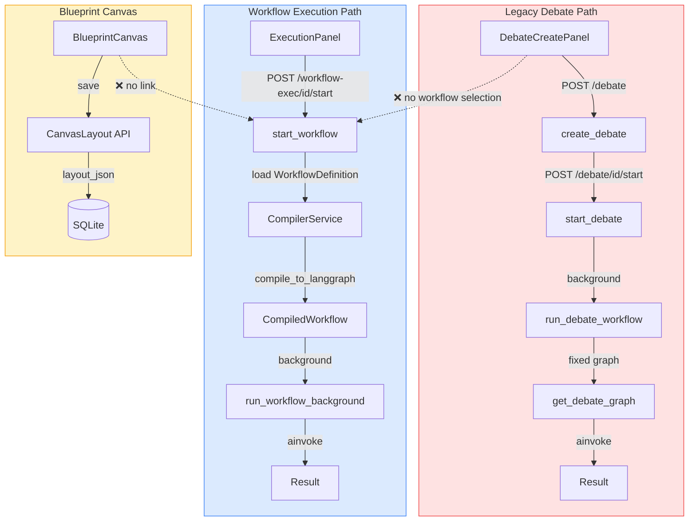
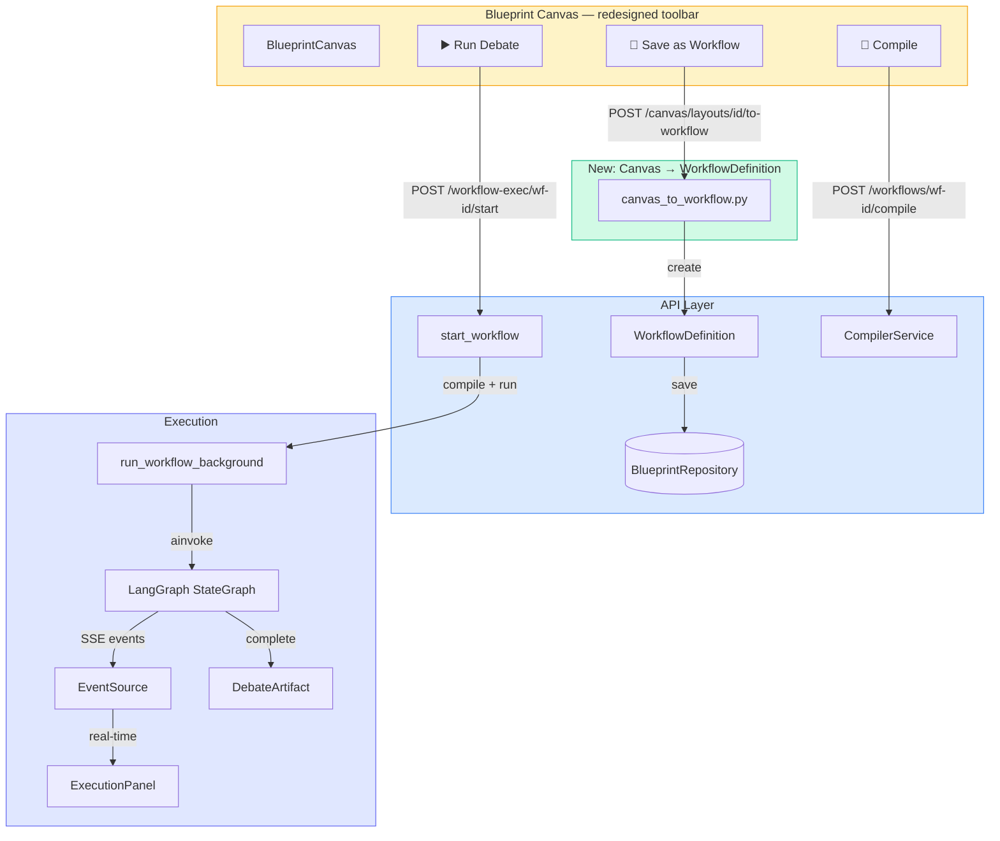
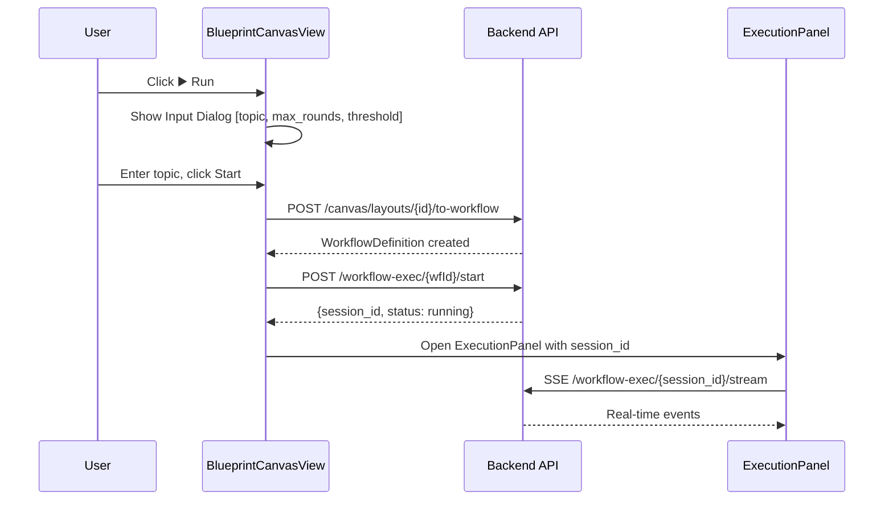
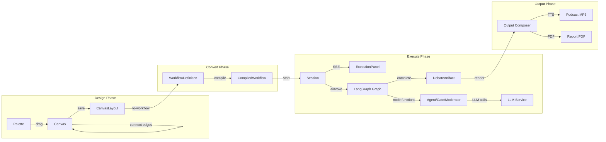

# Blueprint → Debate Pipeline: Architecture Gap Plan

## Problem

The Blueprint Canvas is a visual editor for designing debate workflows, but there is no connection
between a saved canvas layout and an executable debate. Users can drag nodes, connect edges, and
save layouts — but cannot run the result as a debate. The two execution paths are completely separate.

## Current State Analysis

### Two Parallel Execution Paths



### Data Model Gap

| CanvasLayout saves | WorkflowDefinition needs |
|---|---|
| `nodes[].id` | `nodes[].id` ✅ |
| `nodes[].type` | `nodes[].type` ✅ |
| `nodes[].blueprint_id` | `nodes[].agent_blueprint_id` (different key name) |
| `nodes[].x, y` | `nodes[].position = {x, y}` |
| — | `nodes[].label` |
| — | `nodes[].config` |
| `edges[].id, source, target, type` | `edges[].id, source, target, type` ✅ |
| — | `edges[].condition` (for conditional edges) |
| — | `entry_point` |
| — | `termination_conditions` |
| — | `input_config` |

### What Already Works

- [`WorkflowCompiler`](backend/workflow/workflow_compiler.py:77) — compiles `WorkflowDefinition` → LangGraph `StateGraph` ✅
- [`CompilerService.compile_to_langgraph()`](backend/blueprints/compiler.py:202) — validates + compiles ✅
- [`workflow_exec` router](backend/api/routers/workflow_exec.py:138) — `POST /{workflow_id}/start` ✅
- [`run_workflow_background()`](backend/workflow/workflow_runner.py:100) — executes compiled graph ✅
- [`ExecutionPanel`](frontend/src/components/blueprint/ExecutionPanel.svelte:1) — UI for controlling workflow execution ✅
- [`workflowSSE.js`](frontend/src/lib/workflowSSE.js:1) — SSE client for real-time events ✅
- [`WorkflowDefinition` CRUD API](backend/api/routers/workflow_definitions.py:1) ✅
- [`CanvasLayout` CRUD API](backend/api/routers/canvas.py:1) ✅
- All workflow node functions (agent_node_factory, gate_node_factory, etc.) ✅
- [`DebateArtifact`](backend/models/artifact.py) creation from workflow results ✅

### What's Missing

1. **Canvas → WorkflowDefinition converter** — backend service that transforms CanvasLayout JSON into a valid WorkflowDefinition
2. **"Save as Workflow" button** — frontend action on the canvas toolbar
3. **"Run Workflow" button** — frontend action to start execution from the canvas
4. **Input topic dialog** — UI to collect debate context/topic before starting execution
5. **Fix broken "Compile" button** — currently passes `layout_id` to the workflow compile endpoint which expects a `workflow_definition_id`

## Target Architecture



## Phases

### Phase 1: Canvas → WorkflowDefinition Converter (Backend)

**Goal:** Create a service that transforms a CanvasLayout's `layout_json` into a valid `WorkflowDefinition`.

#### 1.1 New module: `backend/blueprints/canvas_to_workflow.py`

```python
class CanvasToWorkflowConverter:
    """Converts a CanvasLayout into a WorkflowDefinition."""

    def __init__(self, repo: BlueprintRepository):
        self._repo = repo

    def convert(self, layout: CanvasLayout) -> WorkflowDefinition:
        """Convert canvas layout JSON to a WorkflowDefinition.

        Steps:
        1. Map canvas nodes to WorkflowNode objects
        2. Map canvas edges to WorkflowEdge objects
        3. Detect entry point (first node with no incoming edges)
        4. Extract termination conditions from workflow nodes
        5. Validate agent_blueprint_id references
        6. Return WorkflowDefinition
        """
```

**Key mappings:**
- Canvas `blueprint_id` → WorkflowNode `agent_blueprint_id`
- Canvas `edges[].type` (e.g. "sequential", "conditional") → WorkflowEdge `type`
- Entry point: node with no incoming `sequential`/`feedback` edges, or explicit `wf-input` node
- Termination: default `max_rounds=5`, `consensus_reached=0.9` from moderator node config

#### 1.2 New API endpoint: `POST /api/v1/canvas/layouts/{layout_id}/to-workflow`

Add to [`backend/api/routers/canvas.py`](backend/api/routers/canvas.py:1):

```python
@router.post("/layouts/{layout_id}/to-workflow", response_model=WorkflowDefinition)
def convert_layout_to_workflow(
    layout_id: str,
    body: dict | None = None,
    repo: BlueprintRepository = Depends(get_blueprint_repository),
) -> WorkflowDefinition:
    """Convert a canvas layout to a WorkflowDefinition and save it."""
```

Request body:
```json
{
  "name": "My Debate Workflow",
  "description": "Optional description",
  "max_rounds": 5,
  "consensus_threshold": 0.9
}
```

#### 1.3 Update `toLayoutJson()` in store

Current [`toLayoutJson()`](frontend/src/lib/blueprint/store.svelte.js:140) saves:
```js
{ id, type, x, y, blueprint_id }
```

Needs to also save:
```js
{ id, type, x, y, blueprint_id, label, config }
```

---

### Phase 2: "Save as Workflow" Button (Frontend)

**Goal:** Add a button to the canvas toolbar that converts the current layout to a WorkflowDefinition.

#### 2.1 Add API client function

In [`frontend/src/lib/blueprint/api.js`](frontend/src/lib/blueprint/api.js:1):

```js
export function convertLayoutToWorkflow(layoutId, body = {}) {
  return request(`/api/v1/canvas/layouts/${layoutId}/to-workflow`, {
    method: 'POST',
    body: JSON.stringify(body),
  });
}
```

#### 2.2 Add toolbar button in BlueprintCanvasView

In [`frontend/src/views/BlueprintCanvasView.svelte`](frontend/src/views/BlueprintCanvasView.svelte:249):

Add a "Save as Workflow" button next to the existing Compile/Clone buttons. This button:
1. Calls `convertLayoutToWorkflow(canvasStore.currentLayoutId)`
2. Shows the resulting WorkflowDefinition ID
3. Navigates to `blueprint/workflow/{wfId}` or shows success toast

#### 2.3 Wire format dialog

Before converting, show a dialog asking for:
- Workflow name (pre-filled from layout name)
- Max rounds (default 5)
- Consensus threshold (default 0.9)

---

### Phase 3: "Run Debate" Button (Frontend)

**Goal:** Add a "Run" button that starts executing the workflow directly from the canvas.

#### 3.1 Pre-conditions check

Before running, validate:
1. Layout must be saved (currentLayoutId exists)
2. Layout must have at least one agent node
3. Compile must succeed (no errors)

#### 3.2 Convert + Run flow



#### 3.3 Input Dialog Component

New component: [`frontend/src/components/blueprint/RunWorkflowDialog.svelte`](frontend/src/components/blueprint/RunWorkflowDialog.svelte)

Fields:
- Topic / Case description (textarea, required)
- Max rounds (number, default from canvas workflow nodes)
- Consensus threshold (number, default 0.9)
- Language (select: de/en)
- RAG document selection (optional, reuse existing pattern)

#### 3.4 ExecutionPanel integration

The existing [`ExecutionPanel`](frontend/src/components/blueprint/ExecutionPanel.svelte:1) already supports:
- `startWorkflow(workflowId, context, options)` via [`workflowExec.js`](frontend/src/lib/workflowExec.js:17)
- SSE streaming via [`createWorkflowSSE(sessionId, handlers)`](frontend/src/lib/workflowSSE.js)
- Pause/Resume/Cancel controls
- Interjection support

The ExecutionPanel just needs to be mounted in the BlueprintCanvasView and connected.

---

### Phase 4: Fix Existing Compile Button

**Goal:** The current "Compile" button in [`BlueprintCanvasView.svelte`](frontend/src/views/BlueprintCanvasView.svelte:211) passes `canvasStore.currentLayoutId` to `compileWorkflow()`, which expects a `workflow_definition_id`. This is broken.

#### 4.1 Fix: Convert first, then compile

Change `handleCompile()` to:
1. If a linked workflow definition exists (stored in canvasStore), compile it
2. Otherwise, convert layout to workflow first, then compile

#### 4.2 Store linked workflow ID

Add `currentWorkflowId` to [`BlueprintCanvasStore`](frontend/src/lib/blueprint/store.svelte.js:11). When a layout is converted to a workflow, store the workflow ID. When loading a layout that has a `workflow_id` in its metadata, load the linked workflow.

---

### Phase 5: DebateCreatePanel Workflow Selection (Optional)

**Goal:** Allow users to select a saved WorkflowDefinition from the DebateCreatePanel.

#### 5.1 Add workflow selector

In [`DebateCreatePanel.svelte`](frontend/src/components/debate/DebateCreatePanel.svelte:1):

Add a dropdown that lists available WorkflowDefinitions. When selected:
- Pre-fill max_rounds, consensus_threshold from the workflow
- Use the workflow's agent configurations instead of the default 4-agent setup
- Start debate via `workflow-exec` endpoint instead of legacy `debate` endpoint

---

## Data Flow: End-to-End



## Implementation Order

| # | Phase | Description | Dependencies |
|---|-------|-------------|--------------|
| 1 | Phase 1.1 | Create `canvas_to_workflow.py` converter | None |
| 2 | Phase 1.2 | Add `POST /canvas/layouts/{id}/to-workflow` endpoint | 1 |
| 3 | Phase 1.3 | Update `toLayoutJson()` to save label + config | None |
| 4 | Phase 4 | Fix Compile button (convert first) | 2 |
| 5 | Phase 2 | Add "Save as Workflow" button + API client | 2 |
| 6 | Phase 3.1 | Create `RunWorkflowDialog.svelte` | None |
| 7 | Phase 3.2 | Add "Run" button + ExecutionPanel integration | 2, 6 |
| 8 | Phase 5 | DebateCreatePanel workflow selector (optional) | 2 |

## Scope: What Changes, What Doesn't

### Changes
- **New file:** `backend/blueprints/canvas_to_workflow.py` — converter service
- **Modified:** `backend/api/routers/canvas.py` — add to-workflow endpoint
- **Modified:** `frontend/src/lib/blueprint/api.js` — add convertLayoutToWorkflow
- **Modified:** `frontend/src/lib/blueprint/store.svelte.js` — toLayoutJson saves more data, add currentWorkflowId
- **Modified:** `frontend/src/views/BlueprintCanvasView.svelte` — add Run/Save-as-Workflow buttons, input dialog, ExecutionPanel
- **New file:** `frontend/src/components/blueprint/RunWorkflowDialog.svelte` — input dialog
- **Modified:** `frontend/src/lib/i18n/loaders/en.js` + `de.js` — new i18n keys

### Doesn't Change
- `WorkflowDefinition` model — already has all needed fields
- `WorkflowCompiler` — already compiles WorkflowDefinition → LangGraph
- `workflow_exec` router — already starts workflow executions
- `ExecutionPanel` — already controls workflow execution
- `workflow_runner.py` — already executes compiled graphs
- `node_functions.py` — all node factories already work
- `debate_workflow.py` — legacy path stays for backward compatibility
- `DebateRequest` model — unchanged
- All existing canvas nodes and edges — unchanged

## Edge Cases

1. **Canvas with no workflow nodes** — only asset nodes (blueprints, LLM profiles). Converter should reject with a clear error.
2. **Canvas with disconnected subgraphs** — converter should warn but still create the workflow.
3. **Missing agent_blueprint_id** — workflow nodes without a linked blueprint. Converter should error.
4. **Circular edges (feedback loops)** — valid in workflows. Converter should preserve them.
5. **Multiple entry points** — if no single entry point exists, use the first `wf-input` node or the leftmost node.
6. **Layout already has a linked workflow** — re-conversion should update the existing workflow, not create a duplicate.

## Risks

1. **Converter complexity** — mapping canvas node types to WorkflowNode types requires careful handling of each node type's config fields.
2. **Orphaned workflow definitions** — each "Save as Workflow" creates a new WF. Need cleanup strategy.
3. **State divergence** — canvas layout and workflow definition can drift apart after initial conversion. Mitigation: always re-convert before running.
4. **Legacy debate path** — keeping two execution paths increases maintenance burden. Long-term: unify under workflow-exec.
