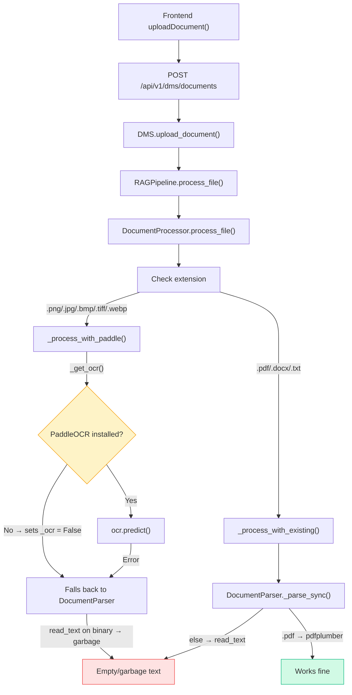
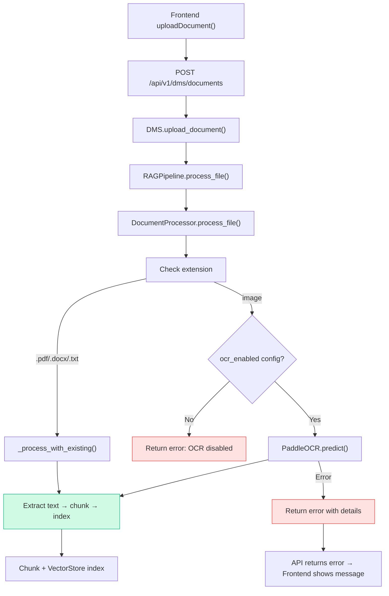
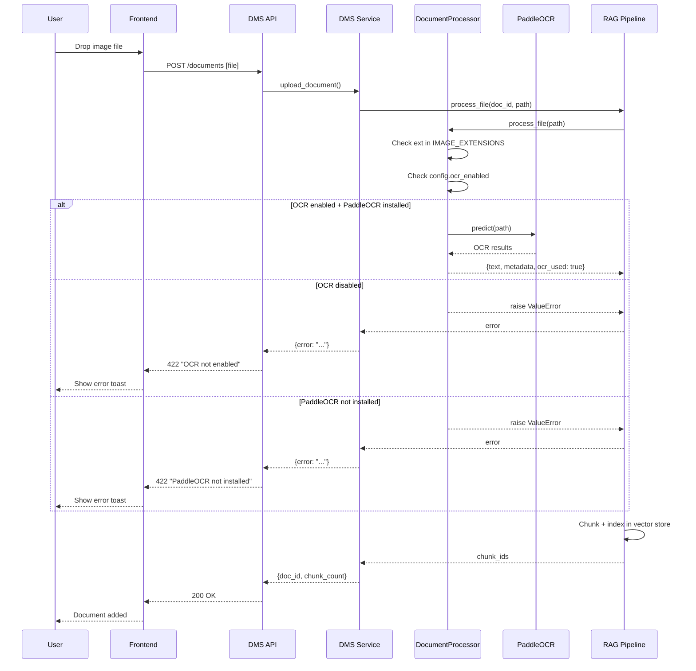

# PaddleOCR Integration — Fix Image Upload in DMS

## Problem

Dropping an image file (.png, .jpg, etc.) into "Dokumente" → Dokumentenverwaltung results in a silent failure. The upload "succeeds" but produces zero usable text because:

1. **PaddleOCR is not installed** — `pip install paddleocr` has never been run
2. **DocumentParser fallback is broken for images** — `path.read_text(encoding="utf-8", errors="ignore")` reads binary image data as text, producing garbage
3. **`ocr_enabled` config is never checked** — `DocumentProcessor` ignores the flag
4. **No user feedback** — the API returns 200 OK even when no text was extracted

## Current Pipeline



## Target Pipeline



## Phases

### Phase 1: Install PaddleOCR Dependencies

**Goal:** Make PaddleOCR available in the runtime environment.

#### 1.1 Add to main dependencies in `pyproject.toml`

Currently PaddleOCR is only in `[project.optional-dependencies] dms`. Move to main dependencies:

```toml
dependencies = [
    ...existing...
    "paddlepaddle>=3.0",
    "paddleocr>=3.5.0",
]
```

Alternative: Keep as optional but document `pip install debate-agent[dms]` in README.

#### 1.2 Install in venv

```bash
.venv/bin/pip install paddlepaddle>=3.0 paddleocr>=3.5.0
```

**Note:** PaddlePaddle + PaddleOCR is ~2GB. Consider:
- Keeping as optional dependency (`[dms]` extra)
- Adding a health check endpoint that reports OCR availability
- Using `paddlepaddle-cpu` to avoid CUDA dependency

### Phase 2: Wire Config to DocumentProcessor

**Goal:** Pass DMS config through to `DocumentProcessor` so `ocr_enabled` and `ocr_device` are respected.

#### 2.1 Pass config in `DMS.__init__()`

File: [`backend/services/dms/service.py`](backend/services/dms/service.py:34)

```python
class DMS:
    def __init__(self, db_path, chroma_path, config=None):
        self.config = config or {}
        self.document_processor = DocumentProcessor(config=self.config)
        ...
```

#### 2.2 Pass config in `get_dms_for_project()`

File: [`backend/services/dms/service.py`](backend/services/dms/service.py:245)

```python
def get_dms_for_project(project_id, project_store=None):
    ...
    config = load_dms_config()  # loads from settings.yaml
    dms = DMS(db_path=..., chroma_path=..., config=config)
    ...
```

#### 2.3 Respect `ocr_enabled` in DocumentProcessor

File: [`backend/services/dms/document_processor.py`](backend/services/dms/document_processor.py:26)

```python
async def process_file(self, file_path: str) -> dict[str, Any]:
    ext = Path(file_path).suffix.lower()
    if ext in IMAGE_EXTENSIONS:
        if not self.config.get("ocr_enabled", False):
            raise ValueError(
                f"Image file '{Path(file_path).name}' requires OCR but "
                "ocr_enabled=False in DMS config. Enable OCR in config/settings.yaml."
            )
        return await self._process_with_paddle(file_path)
    return await self._process_with_existing(file_path)
```

### Phase 3: Fix Silent Failures

**Goal:** Surface errors to the user instead of silently succeeding with empty text.

#### 3.1 RAGPipeline: Warn on empty text

File: [`backend/services/dms/rag_pipeline.py`](backend/services/dms/rag_pipeline.py:88)

Already warns but returns `[]`. Add error propagation:

```python
async def process_file(self, doc_id: str, file_path: str) -> list[str]:
    result = await self.document_processor.process_file(file_path)
    text = result.get("text", "")
    if not text:
        logger.warning("No text extracted from file %s", file_path)
        # Still return [] — document exists but has no chunks
        return []
    return self.process_document(doc_id, text)
```

#### 3.2 DMS.upload_document(): Return rich result

File: [`backend/services/dms/service.py`](backend/services/dms/service.py:63)

Change return type from `str` to `dict` with status info:

```python
def upload_document(self, project_id, file_path, original_filename="") -> dict:
    ...
    try:
        result = asyncio.run(self.rag_pipeline.process_file(doc_id, file_path))
    except ValueError as e:
        # OCR not available for image
        return {"doc_id": doc_id, "error": str(e), "chunk_count": 0}
    except Exception as e:
        return {"doc_id": doc_id, "error": str(e), "chunk_count": 0}

    return {"doc_id": doc_id, "error": None, "chunk_count": len(result)}
```

#### 3.3 API endpoint: Return error to frontend

File: [`backend/api/routers/dms.py`](backend/api/routers/dms.py:50)

```python
@router.post("/documents")
async def upload_document(...):
    ...
    result = dms.upload_document(project_id, tmp_path, original_filename=original_filename)
    if not result.get("doc_id"):
        raise HTTPException(status_code=500, detail="Failed to upload document")
    if result.get("error"):
        raise HTTPException(status_code=422, detail=result["error"])
    return {"status": "ok", "document_id": result["doc_id"], "filename": original_filename}
```

#### 3.4 Frontend: Show upload error

File: [`frontend/src/views/DocumentsView.svelte`](frontend/src/views/DocumentsView.svelte:86)

The existing `try/catch` in `handleUpload` already catches errors and shows `t('documents.uploadError')`. The 422 response will trigger the existing error path. May need to parse the detail message.

### Phase 4: Add OCR Status Health Check

**Goal:** Let the frontend know whether OCR is available so it can warn users before they try to upload images.

#### 4.1 Backend: `GET /api/v1/dms/ocr-status`

File: `backend/api/routers/dms.py`

```python
@router.get("/ocr-status")
async def ocr_status():
    try:
        import paddleocr
        return {"available": True, "engine": "paddleocr"}
    except ImportError:
        return {"available": False, "engine": None}
```

#### 4.2 Frontend: Show OCR availability badge

In `DocumentsView.svelte`, fetch `/dms/ocr-status` on mount and show a badge:
- ✅ "OCR available" — images supported
- ⚠️ "OCR not available — image upload disabled" — gray out image files in drop zone

### Phase 5: Tests

**Goal:** Add backend tests for OCR integration, config wiring, and error handling.

#### 5.1 New test: `tests/backend/test_dms_ocr.py`

- `test_image_upload_when_ocr_disabled_returns_422` — config `ocr_enabled=False`, upload .png → 422
- `test_image_upload_when_ocr_enabled_succeeds` — mock PaddleOCR, config `ocr_enabled=True` → 200 + text extracted
- `test_image_upload_when_paddleocr_not_installed` — mock ImportError → 422 with helpful message
- `test_ocr_status_endpoint` — mock import → returns available/true
- `test_ocr_status_endpoint_unavailable` — no paddleocr → returns available/false
- `test_config_flows_to_document_processor` — verify `ocr_device` from config reaches PaddleOCR init

#### 5.2 Update existing tests

- [`tests/test_dms_document_processor.py`](tests/test_dms_document_processor.py) — already tests PaddleOCR with mocks, update imports to `backend.services.dms.document_processor`
- [`tests/test_paddleocr_integration.py`](tests/test_paddleocr_integration.py) — already exists with mocks, update imports

## Data Flow Summary



## Files Changed

| File | Change |
|------|--------|
| `pyproject.toml` | Add `paddlepaddle>=3.0`, `paddleocr>=3.5.0` to deps or keep in `[dms]` extra |
| `backend/services/dms/document_processor.py` | Add `ocr_enabled` check, raise `ValueError` for images when OCR disabled |
| `backend/services/dms/service.py` | Pass config to `DocumentProcessor`, change `upload_document()` return type |
| `backend/services/dms/config.py` | No change (already has `ocr_enabled: False`) |
| `backend/api/routers/dms.py` | Handle `ValueError` from upload, add `GET /ocr-status` endpoint |
| `frontend/src/views/DocumentsView.svelte` | Show OCR availability badge, parse 422 error detail |
| `tests/backend/test_dms_ocr.py` | New: OCR integration tests |
| `plans/paddleocr-integration.md` | This plan file |

## Implementation Order

1. **Phase 2** (config wiring) — no dependency on PaddleOCR installation, fixes the silent failure
2. **Phase 3** (error propagation) — makes the failure visible to users
3. **Phase 1** (install PaddleOCR) — can be done in parallel, but Phase 2+3 should land first
4. **Phase 4** (health check) — nice-to-have, low priority
5. **Phase 5** (tests) — should be written alongside each phase

## Edge Cases

| Case | Current Behavior | Target Behavior |
|------|-----------------|-----------------|
| Image + PaddleOCR installed | Silent garbage text | OCR extracts text correctly |
| Image + PaddleOCR NOT installed | Silent garbage text | 422 error: "PaddleOCR not installed" |
| Image + `ocr_enabled=False` | Silent garbage text | 422 error: "OCR disabled in config" |
| PDF + pdfplumber missing | Falls back to pypdf | Same (already works) |
| Corrupted image file | PaddleOCR error → DocumentParser garbage | 422 error with details |
| Very large image (>50MB) | Silent failure | 413 error (check `max_file_size_mb`) |

## Risks

| Risk | Mitigation |
|------|------------|
| PaddlePaddle is ~2GB | Keep as optional `[dms]` extra, document install |
| PaddleOCR slow on CPU | Config `ocr_device: cpu` already exists, add timeout |
| Breaking existing upload flow | Phase 2+3 are additive — only image uploads affected |
| Tests need PaddleOCR mock | Already done in existing test files, just update imports |
