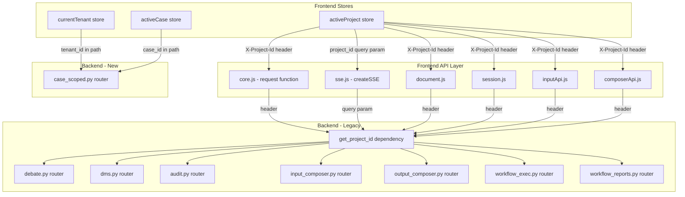

# Migration Plan: Legacy Project → Tenant/Case/Tag Architecture

## Current State

The codebase has two parallel systems:

| Layer | Legacy (Project-based) | New (Tenant/Case/Tag) |
|-------|----------------------|----------------------|
| **Frontend store** | `activeProject` → `{id, name}` | `currentTenant` → `{id, name}` + `activeCase` |
| **API routing** | `X-Project-Id` header | Path-based `/tenants/{tid}/cases/{cid}/` |
| **Backend resolver** | `get_project_id()` from header | Path params in case_scoped.py |
| **Data store** | `ProjectStore` → `data/projects/` | `CaseStore` → `data/tenants/{tid}/cases/` |
| **Debate CRUD** | `debate.py` (deprecated) | `case_scoped.py` |
| **DMS** | `dms.py` (header-scoped) | `case_scoped.py` (path-scoped) |

The legacy system is fully functional and still used by 7+ backend routers. The new case-scoped system covers debates and DMS but NOT: workflows, reports, audit, input composer, output composer.

## Dependency Graph



## Migration Strategy: Parallel Paths

The key insight: we do NOT need to remove the legacy system immediately. We can introduce a **dual-path** approach where:

1. New views use tenant/case path-based APIs
2. Legacy views that haven't been migrated continue to work via `X-Project-Id` header
3. The backend maps `project_id ≈ case_id` internally (they share the same directory structure)

This is safe because the migration script already mapped: `project_id → case_id` (1:1), stored in `data/tenants/{tid}/cases/{cid}/`.

## Phases

### Phase 1: Frontend — `activeProject` → `currentTenant` + `activeCase`

**Goal:** Eliminate the `activeProject` store and replace it with `currentTenant` + `activeCase`.

**1a. Dual-store bridge** (low risk)

Add a new store `activeCase` alongside `activeProject` in [`stores.js`](frontend/src/lib/stores.js:62):

```js
/** Active case within the current tenant — persisted to localStorage. Stores { id, title, tenant_id }. */
export const activeCase = persisted('danwa.activeCase', null);
```

When `currentTenant` changes (in [`TenantSelector.svelte`](frontend/src/components/TenantSelector.svelte:3)), also set `activeCase` to the default case for that tenant.

**1b. Update `core.js` request function** (medium risk)

Change [`core.js`](frontend/src/lib/api/core.js:89) to send `X-Case-Id` from `activeCase` instead of `X-Project-Id` from `activeProject`:

```js
const caseId = get(activeCase)?.id;
const headers = {
  ...DEFAULT_HEADERS,
  ...(token ? { Authorization: `Bearer ${token}` } : {}),
  ...(caseId ? { 'X-Case-Id': caseId } : {}),
  ...options.headers,
};
```

**1c. Update backend `get_project_id`** (medium risk)

Extend [`get_project_id()`](backend/api/deps.py:128) to also accept `X-Case-Id` header:

```python
async def get_project_id(
    x_project_id: str = Header(default="", alias="X-Project-Id"),
    x_case_id: str = Header(default="", alias="X-Case-Id"),
) -> str:
    return x_case_id or x_project_id or "_default"
```

Since `project_id ≈ case_id` (same UUIDs from migration), this is backward-compatible.

**1d. Replace `ProjectSelector` with `CaseSelector`** (medium risk)

Create a new [`CaseSelector.svelte`](frontend/src/components/CaseSelector.svelte) that:
- Uses `getCases(tenantId)` instead of `getProjects()`
- Sets `activeCase` instead of `activeProject`
- Shows case title + tags instead of project name
- Auto-selects the first case when tenant changes

**Files affected:**
- `frontend/src/lib/stores.js` — add `activeCase` store
- `frontend/src/lib/api/core.js` — `X-Case-Id` header
- `frontend/src/lib/sse.js` — `case_id` query param
- `backend/api/deps.py` — `get_project_id()` accepts `X-Case-Id`
- `frontend/src/components/CaseSelector.svelte` — new file
- `frontend/src/components/ProjectSelector.svelte` — deprecate or redirect

### Phase 2: Frontend Views — Migrate remaining components

**2a. MvpDebateView** (medium risk)

[`MvpDebateView.svelte`](frontend/src/views/MvpDebateView.svelte:597) passes `$activeProject?.id` to workflow start. Change to `$activeCase?.id`.

The backend [`workflow_exec.py`](backend/api/routers/workflow_exec.py:237) uses `get_project_id` which will read `X-Case-Id` from the header after Phase 1c.

**2b. DebateReviewPanel** (low risk)

[`DebateReviewPanel.svelte`](frontend/src/components/debate/DebateReviewPanel.svelte:163) shows `Active Project` label. Change to `Active Case` with `$activeCase?.title`.

**2c. DebateCreatePanel** (low risk)

[`DebateCreatePanel.svelte`](frontend/src/components/debate/DebateCreatePanel.svelte:20) derives `projectId` from `activeProject`. Change to use `activeCase`.

**2d. DocumentsView** (medium risk)

[`DocumentsView.svelte`](frontend/src/views/DocumentsView.svelte:52) uses `activeProject` for document operations. These use legacy DMS endpoints. Options:
- Switch to case-scoped DMS endpoints (`/tenants/{tid}/cases/{cid}/dms/`)
- Or keep using legacy endpoints with `X-Case-Id` header (Phase 1c makes this work)

**Files affected:**
- `frontend/src/views/MvpDebateView.svelte`
- `frontend/src/components/debate/DebateReviewPanel.svelte`
- `frontend/src/components/debate/DebateCreatePanel.svelte`
- `frontend/src/views/DocumentsView.svelte`

### Phase 3: Frontend — Remove `activeProject` and `ProjectSelector`

**3a. Remove ProjectSelector from sidebar** (low risk)

The sidebar already has Case/Tag management in TenantSettings. Remove `ProjectSelector` from the header/sidebar.

**3b. Remove `activeProject` store** (high risk — final cutover)

After all views are migrated, remove `activeProject` from `stores.js` and all remaining references.

**3c. Remove or archive `ProjectsView.svelte`** (low risk)

Legacy project CRUD is replaced by Case/Tag CRUD in TenantSettings.

**Files affected:**
- `frontend/src/lib/stores.js` — remove `activeProject`
- `frontend/src/components/ProjectSelector.svelte` — delete
- `frontend/src/views/ProjectsView.svelte` — delete or archive
- `frontend/src/components/ProjectSettings.svelte` — delete or archive

### Phase 4: Backend — Migrate legacy routers to tenant/case path-based

**4a. Create tenant-scoped wrappers for remaining routers**

The following backend routers still use `get_project_id` from headers:
- `debate.py` — deprecated, replaced by `case_scoped.py` ✅
- `dms.py` — has case-scoped equivalents ✅
- `audit.py` — needs tenant/case-scoped variant
- `input_composer.py` — needs tenant/case-scoped variant
- `output_composer.py` — needs tenant/case-scoped variant
- `workflow_exec.py` — needs tenant/case-scoped variant
- `workflow_reports.py` — needs tenant/case-scoped variant

For each, add endpoints in `case_scoped.py`:
```
GET /tenants/{tid}/cases/{cid}/audit/{debate_id}     # already exists
POST /tenants/{tid}/cases/{cid}/workflows/{wid}/start # already exists
GET /tenants/{tid}/cases/{cid}/workflows/{sid}/state  # already exists
```

**4b. Deprecate legacy routers**

Add `X-Deprecation` headers (like debate.py already has) to:
- `dms.py`
- `audit.py`
- `input_composer.py`
- `output_composer.py`

**4c. Remove `get_project_id` dependency** (final cutover)

After all frontend calls use path-based endpoints, remove the `X-Project-Id` header parsing from `deps.py`.

### Phase 5: Backend — Remove `ProjectStore` and `Project` model

**5a. Remove `ProjectStore`** — Replaced by `CaseStore`
**5b. Remove `Project` model** — Replaced by `Case` model
**5c. Remove `ProjectsView` router** — `backend/api/routers/projects.py` (if exists)
**5d. Clean up `data/projects/` directory** — Already copied to `data/tenants/` by migration script

## Risk Assessment

| Phase | Risk | Reason |
|-------|------|--------|
| 1a | Low | Additive — new store alongside existing |
| 1b | Medium | Changes all API request headers |
| 1c | Medium | Changes backend dependency resolution |
| 1d | Medium | New component replaces old in UI |
| 2a-d | Low-Medium | Individual view changes, well-scoped |
| 3a-c | Medium-High | Removing legacy path — no fallback |
| 4a | Medium | New backend endpoints |
| 4b | Low | Deprecation headers only |
| 4c | High | Removes core dependency |
| 5a-d | Low | Cleanup after everything works |

## Recommended Execution Order

```
Phase 1a → 1c → 1b → 1d   (backend first, then frontend)
Phase 2a → 2b → 2c → 2d   (incremental view migration)
Phase 3a → 3b → 3c         (final frontend cutover)
Phase 4a → 4b → 4c         (backend cleanup)
Phase 5a → 5b → 5c → 5d   (model removal)
```

Phase 1c should come BEFORE 1b so the backend can already accept the new header before the frontend starts sending it.

## Testing Strategy

- **Phase 1:** Verify both old and new header work simultaneously
- **Phase 2:** Test each view individually with the new stores
- **Phase 3:** Full regression test — all views must work without `activeProject`
- **Phase 4:** Integration tests for new backend endpoints
- **Phase 5:** Verify no remaining references to `Project` model
