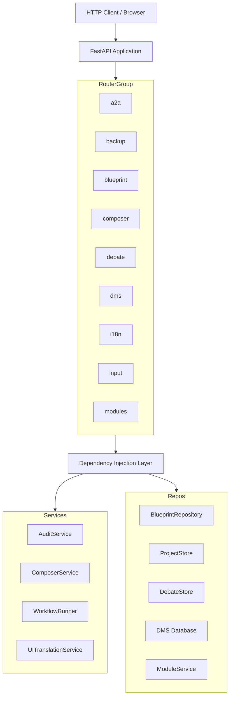

# API Endpoints — backend

# API Endpoints — Backend

This module provides the REST API layer for the application. Every external interaction — from managing blueprints and debates to configuring backups and importing modules — flows through these endpoints. The API is built with FastAPI, follows standard REST conventions, and uses consistent patterns for errors, pagination, and dependency injection.

---

## Base URL Convention

All endpoints are prefixed with `/api/v1`. Example: `POST /api/v1/debate`.

---

## Router Overview

| Prefix | API Group | Test File |
|---|---|---|
| `/api/v1/a2a/` | A2A Discovery & Agent-to-Agent | `test_a2a_discovery_api.py` |
| `/api/v1/config/backup` | Backup & Restore | `test_backup_api.py` |
| `/api/v1/blueprints/` | Blueprint Canvas — LLM profiles, prompts, roles, workflows | `test_blueprint_api.py` |
| `/api/v1/canvas/layouts` | Canvas Layouts | `test_blueprint_api.py` |
| `/api/v1/bundle-composer/` | Bundle Composer — prompt assembly & export | `test_bundle_composer_api.py` |
| `/api/v1/debate/` | Debate lifecycle | `test_debate_api.py` |
| `/api/v1/dms/` | Document Management System & RAG | `test_dms_api.py` |
| `/api/v1/i18n/` | Internationalization & translation | `test_i18n_api.py` |
| `/api/v1/input/` | Input submission & workflow launch | `test_input_composer_api.py` |
| `/api/v1/input-plugins` | Input plugin registry | `test_input_composer_api.py` |
| `/api/v1/mcp/` | Model Context Protocol (stub) | `test_input_composer_api.py` |
| `/api/v1/modules/` | Module lifecycle (install, update, uninstall) | `test_module_api.py` |

---

## A2A Discovery — `/api/v1/a2a/`

Endpoints for discovering and validating remote A2A endpoints.

| Method | Path | Status Codes | Description |
|---|---|---|---|
| `POST` | `/discover` | 200 / 400 / 403 / 502 | Validate an A2A agent endpoint |
| `POST` | `/capabilities/{profile_id}` | 200 / 404 | Store capabilities for an agent profile |

The `/discover` endpoint performs validation on the supplied `endpoint_url`:
- Returns **400** if the URL is malformed or uses a `file://` scheme
- Returns **403** if the URL resolves to a private IP
- Returns **502/504** if the endpoint is unreachable

---

## Backup & Restore — `/api/v1/config/backup`

Full CRUD for system backups, plus settings management.

| Method | Path | Status Codes | Description |
|---|---|---|---|
| `POST` | `/backup` | 200 | Create a new backup (`trigger`: `manual` or `shutdown`) |
| `GET` | `/backups` | 200 | List all backups |
| `GET` | `/backups/{backup_id}` | 200 / 404 | Get backup metadata |
| `GET` | `/backups/{backup_id}/files` | 200 | List files inside a backup |
| `POST` | `/backups/{backup_id}/verify` | 200 | Verify backup integrity |
| `POST` | `/backups/{backup_id}/restore` | 200 | Restore from backup |
| `DELETE` | `/backups/{backup_id}` | 200 | Delete a backup |
| `GET` | `/backup-settings` | 200 | Get current backup settings |
| `PUT` | `/backup-settings` | 200 | Update backup settings |

Backup settings include:
- `backup_enabled` (boolean)
- `backup_auto_on_shutdown` (boolean)
- `backup_retention_count` (integer)

The backup lifecycle follows: **create → list → (verify → restore) → delete**. All operations are idempotent where possible. Backups are stored as ZIP archives and include system data, project files, and configuration.

---

## Blueprint Canvas — `/api/v1/blueprints/`

This is the largest API group, providing full CRUD for the blueprint system that powers agent configuration.

### LLM Profiles — `/api/v1/blueprints/llm-profiles`

| Method | Path | Status Codes | Description |
|---|---|---|---|
| `GET` | `/llm-profiles` | 200 | List all LLM profiles (supports `?limit=` & `?offset=`) |
| `POST` | `/llm-profiles` | 201 / 409 | Create a new LLM profile |
| `GET` | `/llm-profiles/{id}` | 200 / 404 | Get a single LLM profile |
| `PUT` | `/llm-profiles/{id}` | 200 / 404 | Update an LLM profile |
| `DELETE` | `/llm-profiles/{id}` | 200 / 404 | Delete an LLM profile |

A profile includes `provider`, `model`, `max_tokens`, and `temperature` (validated: 0.0–2.0).

### Prompt Templates — `/api/v1/blueprints/prompt-templates`

| Method | Path | Status Codes | Description |
|---|---|---|---|
| `GET` | `/prompt-templates` | 200 | List (filter by `?role=`, `?variant=`, pagination) |
| `POST` | `/prompt-templates` | 201 / 409 | Create a prompt template |
| `GET` | `/prompt-templates/{id}` | 200 / 404 | Get a template |
| `PUT` | `/prompt-templates/{id}` | 200 / 404 | Update |
| `DELETE` | `/prompt-templates/{id}` | 200 / 404 | Delete |

A `content_hash` is auto-computed on creation. The `role` field maps to a `role_type_id`.

### Role Definitions — `/api/v1/blueprints/role-definitions`

| Method | Path | Status Codes | Description |
|---|---|---|---|
| `GET` | `/role-definitions` | 200 | List (`?role=`, pagination) |
| `POST` | `/role-definitions` | 201 / 409 | Create |
| `GET` | `/role-definitions/{id}` | 200 / 404 | Get |
| `PUT` | `/role-definitions/{id}` | 200 / 404 | Update |
| `DELETE` | `/role-definitions/{id}` | 200 / 404 | Delete |

Includes `consensus_threshold` (validated: 0.0–1.0).

### Role Types — `/api/v1/blueprints/role-types`

| Method | Path | Status Codes | Description |
|---|---|---|---|
| `GET` | `/role-types` | 200 | List (`?active_only=true`, pagination) |
| `POST` | `/role-types` | 201 / 409 | Create |
| `GET` | `/role-types/{id}` | 200 / 404 | Get |
| `PUT` | `/role-types/{id}` | 200 / 404 | Update |
| `DELETE` | `/role-types/{id}` | 200 / 404 | Delete |

Default role types (6+) are seeded by migration v14. Includes icon, color, `default_max_rounds`, and `default_consensus_threshold`.

### Agent Blueprints — `/api/v1/blueprints/agent-blueprints`

| Method | Path | Status Codes | Description |
|---|---|---|---|
| `GET` | `/agent-blueprints` | 200 | List (`?active_only=true`, defaults to active) |
| `POST` | `/agent-blueprints` | 201 / 409 | Create (requires existing LLM profile + role definition) |
| `GET` | `/agent-blueprints/{id}` | 200 / 404 | Get |
| `PUT` | `/agent-blueprints/{id}` | 200 / 404 | Update |
| `DELETE` | `/agent-blueprints/{id}` | 200 / 404 | Delete |

References foreign keys: `llm_profile_id` and `role_definition_id`.

### Workflow Definitions — `/api/v1/blueprints/workflows`

| Method | Path | Status Codes | Description |
|---|---|---|---|
| `GET` | `/workflows` | 200 | List (pagination) |
| `POST` | `/workflows` | 201 / 409 / 422 | Create |
| `GET` | `/workflows/{id}` | 200 / 404 | Get |
| `PUT` | `/workflows/{id}` | 200 / 404 | Update |
| `DELETE` | `/workflows/{id}` | 200 / 404 | Delete |
| `POST` | `/workflows/{id}/compile` | 200 / 404 | Compile and validate a workflow |

Workflow definitions include `execution_order`, `conditional_edges`, `interjection_points`, and `node_blueprint_map`. The **compile** endpoint validates:
- All referenced blueprints exist in the catalog
- Every node in `execution_order` has a blueprint mapping
- Edge sources/targets and interjection points reference valid node IDs
- Inactive blueprints produce warnings (not errors)

### Import — `/api/v1/blueprints/import`

| Method | Path | Status Codes | Description |
|---|---|---|---|
| `POST` | `/import` | 200 | Import blueprints from module source |

Supports `?dry_run=true`. This endpoint is idempotent — running it twice creates no duplicates.

### Canvas Layouts — `/api/v1/canvas/layouts`

| Method | Path | Status Codes | Description |
|---|---|---|---|
| `GET` | `/layouts` | 200 | List (`?project_id=`, pagination) |
| `POST` | `/layouts` | 201 / 409 | Create |
| `GET` | `/layouts/{id}` | 200 / 404 | Get |
| `PUT` | `/layouts/{id}` | 200 | Update (nodes, edges, viewport) |
| `DELETE` | `/layouts/{id}` | 200 / 404 | Delete |

Layouts store a node-edge graph with blueprint references (e.g., `"blueprint_id": "test-bp"` on nodes and edge types like `"uses_llm"`).

---

## Bundle Composer — `/api/v1/bundle-composer/`

Assembles reusable prompt bundles (agent core + argumentation pattern + tone + modifier) and manages their lifecycle.

| Method | Path | Status Codes | Description |
|---|---|---|---|
| `GET` | `/components` | 200 | List available components (agent cores, patterns, tones, modifiers, LLM profiles) |
| `POST` | `/preview` | 200 | Preview an assembled prompt from a composition |
| `POST` | `/bundles` | 201 / 422 | Create a new bundle |
| `GET` | `/bundles` | 200 | List all bundles |
| `GET` | `/bundles/{id}` | 200 / 404 | Get a bundle |
| `PUT` | `/bundles/{id}` | 200 / 404 | Update a bundle |
| `POST` | `/bundles/{id}/export` | 200 / 404 | Export a bundle (JSON or `?to_directory=true`) |
| `POST` | `/import` | 201 / 422 | Import a bundle from directory |

A **composition** consists of:
- `agent_core_id` (required)
- `argumentation_pattern_id` (optional, e.g., `socratic`, `hegelian`)
- `tone_profile_id` (optional, e.g., `academic`, `neutral`)
- `prompt_modifier_id` (optional, e.g., `concise`, `detailed`)

On creation, the `role_type_id` is derived from the selected agent core. The `POST /preview` endpoint returns the assembled prompt text without persisting it.

---

## Debate — `/api/v1/debate/`

Manages the debate lifecycle from creation through execution to streaming.

| Method | Path | Status Codes | Description |
|---|---|---|---|
| `POST` | `/debate` | 201 / 422 | Create a debate (returns `debate_id`, status `pending`) |
| `GET` | `/debate/{debate_id}` | 200 / 404 | Get debate state and rounds |
| `POST` | `/debate/{debate_id}/start` | 200 / 404 / 409 | Start debate execution |
| `GET` | `/debate/{debate_id}/stream` | 200 / 422 | SSE event stream for real-time updates |

Key behavior:
- **Create** accepts `case.text`, `max_rounds`, `consensus_threshold`, and `agent_profile[]`
- **Start** returns immediately with `status=running`; actual execution happens via a background task
- The background task polls agent profiles (which may fail in test environments without real LLMs, resulting in `failed` status)
- Audit events are created during execution
- The **SSE stream** requires `?project_id=` as a query parameter (because `EventSource` in browsers cannot send custom headers)
- Starting an already-running debate returns **409**
- Empty case text or missing `case` returns **422**

---

## Document Management System — `/api/v1/dms/`

Manages document uploads, deletion, and RAG (Retrieval-Augmented Generation) context.

### Documents — `/api/v1/dms/documents`

| Method | Path | Status Codes | Description |
|---|---|---|---|
| `GET` | `/documents` | 200 | List all documents |
| `POST` | `/documents` | 200 | Upload a document (multipart) |
| `DELETE` | `/documents/{document_id}` | 200 | Delete a document (idempotent) |

### RAG Context — `/api/v1/dms/`

| Method | Path | Status Codes | Description |
|---|---|---|---|
| `POST` | `/documents/{document_id}/rag` | 200 | Add document to manual RAG context |
| `DELETE` | `/documents/{document_id}/rag` | 200 / 400 | Remove document from manual RAG context |
| `GET` | `/rag/manual` | 200 | List document IDs in manual RAG context |
| `GET` | `/rag/search` | 200 | Search RAG context (`?query=&k=`, returns `results`) |

Removing a document that is not in the RAG context returns **400**. The `rag/search` endpoint respects the `k` parameter for result count limits.

---

## Internationalization — `/api/v1/i18n/`

Full CRUD for UI translations with locale management, fallback chains, and coverage statistics.

| Method | Path | Status Codes | Description |
|---|---|---|---|
| `GET` | `/locales` | 200 | List supported locales (code, name, is_rtl, plural_tags) |
| `GET` | `/{locale}` | 200 | Get translations (`?keys=a,b` for filtering) |
| `GET` | `/{locale}/{key}` | 200 | Get a single translation (fallback: en → key-as-value) |
| `POST` | `/{locale}` | 200 | Bulk-import translations |
| `PUT` | `/{locale}/{key}` | 200 | Set/update a single translation |
| `DELETE` | `/{locale}/{key}` | 200 / 404 | Delete a translation |
| `GET` | `/stats` | 200 | Translation counts per locale |
| `GET` | `/coverage` | 200 | Coverage percentages per locale |

The fallback chain is:
1. Translation for requested locale
2. Translation for `en` (English)
3. The key itself as the value

The `/locales` endpoint reports at least 10 supported locales including RTL languages (Arabic, Hebrew, etc.). Stats and coverage support a `?namespace=` filter.

---

## Input Composer — `/api/v1/input/` and `/api/v1/input-plugins/`

Handles input submission through a plugin architecture, job tracking, and workflow launching.

### Plugins — `/api/v1/input-plugins`

| Method | Path | Status Codes | Description |
|---|---|---|---|
| `GET` | `/input-plugins` | 200 | List registered input plugins with config schemas |

Registered plugins include `standard_text`, `stt` (speech-to-text), `a2a_inbound` (agent-to-agent), and `mcp`. The `mcp` plugin returns `is_available: false` and `coming_soon: true`.

### Input Submission — `/api/v1/input/`

| Method | Path | Status Codes | Description |
|---|---|---|---|
| `POST` | `/submit` | 202 / 400 | Submit input via a plugin |
| `GET` | `/jobs` | 200 | List jobs (`?status=`, `?plugin_key=`) |
| `GET` | `/jobs/{job_id}` | 200 / 404 | Get job status and processed input |
| `DELETE` | `/jobs/{job_id}` | 200 / 404 | Delete a job |
| `POST` | `/launch` | 200 / 404 / 422 | Launch a workflow from a completed job |

- `standard_text` completes immediately (`status: completed`)
- `stt` returns `status: processing`
- `a2a_inbound` can require approval (`pending_approval` → approve/reject)
- Unknown plugin keys return **400**

### A2A Approval — `/api/v1/input/a2a/`

| Method | Path | Status Codes | Description |
|---|---|---|---|
| `POST` | `/a2a/{job_id}/approve` | 200 / 404 | Approve pending A2A input |
| `POST` | `/a2a/{job_id}/reject` | 200 / 404 | Reject pending A2A input |

### MCP — `/api/v1/mcp/`

| Method | Path | Status Codes | Description |
|---|---|---|---|
| `POST` | `/tools/call` | 501 | Stub — returns 501 Not Implemented |

### Workflow Launch — `POST /api/v1/input/launch`

Requires a completed job (`job_id`) and optionally a `workflow_id`. If no `workflow_id` is given, the system may auto-select a workflow. Returns `session_id`, `status: running`, and the launched `workflow_id`.

---

## Module Management — `/api/v1/modules/`

Manages the full lifecycle of downloadable modules (argumentation patterns, prompt sets, etc.).

| Method | Path | Status Codes | Description |
|---|---|---|---|
| `GET` | `/modules/` | 200 | List installed modules |
| `GET` | `/modules/available` | 200 | List available modules (remote registry) |
| `GET` | `/modules/{module_id}` | 200 / 404 | Get module metadata |
| `POST` | `/modules/install` | 201 / 404 | Install a module |
| `POST` | `/modules/{module_id}/uninstall` | 200 / 404 | Uninstall a module |
| `PUT` | `/modules/{module_id}` | 200 / 404 | Update a module to latest version |

Module installation reads from a local `modules_dir` and stores metadata in a SQLite database. Each module has:
- `manifest.json` with `schema_version`, `module_id`, `version`, `type`, `checksum`, and file list
- Content files (e.g., `readme.md`) with individual checksums
- The install endpoint verifies checksums and prevents duplicate installations

---

## Architecture & Patterns

### Common Patterns

**Error Handling** — All endpoints use FastAPI exception handlers for three standard responses:
- **404** — Resource not found (`{"detail": "not found"}`)
- **409** — Resource already exists (`{"detail": "already exists"}`)
- **422** — Validation failure (Pydantic schema validation)

**Pagination** — List endpoints consistently support `?limit=` and `?offset=` query parameters. Example: `GET /api/v1/blueprints/llm-profiles?limit=2&offset=4`.

**Dependency Injection** — The test suite overrides FastAPI dependencies (`get_settings`, `get_audit_service`, `get_blueprint_repository`, etc.) for isolation. In production, these provide real database connections and service instances.

**Concurrency** — The debate `/start` endpoint uses background tasks so the HTTP response returns immediately while processing continues asynchronously. The SSE stream provides real-time progress for long-running debates.

**Idempotency** — Several operations are designed to be safe to retry:
- Blueprint import (`POST /import`) creates no duplicates on re-run
- Document deletion (`DELETE /dms/documents/{id}`) always returns 200
- Module installation checks for existing versions before installing

### Project Isolation

Multiple endpoints use a `project_id` dependency (either injected or as a query parameter). This ensures data isolation between projects — debates, layouts, and workflows are scoped to their owning project. The SSE stream endpoint for debates requires `?project_id=` specifically because browser `EventSource` cannot send HTTP headers, making query parameters the only viable mechanism for scoping.