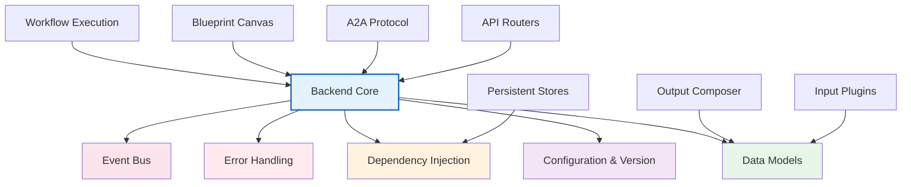

# Backend Core

# Backend Core Module

The Backend Core module provides the foundational infrastructure for the Danwa Debate Engine: configuration, dependency injection, error handling, real-time event streaming, and the base data models used by all upstream services. Every other backend component — workflow execution, blueprints, A2A protocol, the API layer — depends on these primitives.

## Configuration & Version Management

### `backend/core/config.py`

Central configuration via `Settings`, a **pydantic-settings** model that reads from environment variables (prefix `DANWA_`) and a `.env` file.

```python
settings = Settings()
```

**`Settings`** fields include:

| Field | Default | Description |
|-------|---------|-------------|
| `app_name` | `"Debate-Agent"` | Application title |
| `app_version` | dynamic | Read from `/version` file |
| `debug` | `False` | Debug mode |
| `host` / `port` | `0.0.0.0:8000` | Server binding |
| `db_path` | `data/audit.db` | SQLite database location |
| `default_max_rounds` | `3` | Debate round limit |
| `default_consensus_threshold` | `0.8` | Consensus threshold |
| `cors_origins` | `["http://localhost:5173", ...]` | Allowed CORS origins |
| `backup_enabled` | `True` | Backup subsystem on/off |
| `service_llm_profile_id` | `None` | LLM profile for background tasks |

**`_get_version()`** reads the last non-comment line from the `/version` file in the project root. This is the single source of truth for versioning and is used by `Settings`, `backend/__init__.py`, and all downstream version reporting.

**`is_service_llm_eligible(profile)`** validates an LLM profile for system tasks:
- Must be a text profile.
- Must have `service_eligible = True`.
- Context window must be >= `service_llm_min_context` (default 4096).
- Model name must not match any pattern in `service_llm_blacklist`.

### `backend/__init__.py`

Exposes `__version__` by calling `_get_version()`. This is the programmatic entry point for version introspection.

## Core Data Models

The models in `backend/models/` are Pydantic v2 schemas shared by the entire backend. They define the **contracts** between components — inputs, artifacts, profiles, and job tracking.

### Profiles (`backend/core/profiles.py`)

| Model | Purpose |
|-------|---------|
| `LLMProfile` | Configuration for an LLM endpoint (provider, model, API key env var, temperature, cost tracking, A2A support, service eligibility) |
| `AgentPersona` | A debate agent persona (system prompt, role, behaviour constraints, tags) |
| `PromptVariant` | A named set of prompt templates with inheritance |
| `ActiveConfiguration` | Snapshot of a running debate’s LLM profile, personas, and prompt variant |

`LLMProvider` is a `StrEnum` with values `openrouter`, `openai`, `anthropic`, `local`, `ollama`, `opencode-zen`, `opencode-go`, `xiaomi`, `deepseek`, `cloudflare`.

Each profile has topic-specific fields like `protocol` (`litellm` or `a2a`), `a2a_endpoint`, and `fallback_llm_profile_id` for multi-agent routing.

### DebateArtifact (`backend/models/artifact.py`)

Immutable output of a completed workflow. Contains:
- `transcript: list[Turn]`
- `interjections: list[Injection]`
- `user_queries: list[UserQuery]`
- `minority_votes: list[MinorityVote]`
- `consensus_result: dict | None`
- `metadata: dict` (token usage, timestamps, agent list)

`artifact_hash()` returns a deterministic SHA-256 digest over the full JSON payload. This is the **sole interface** between execution (LangGraph) and rendering (Output Composer / plugins).

### DebateInput (`backend/models/debate_input.py`)

Standardised input artifact produced by Input Plugins. Fields:
- `source_plugin_key` (e.g. `"standard_text"`, `"stt"`, `"a2a_inbound"`)
- `topic`, `attachments`, `context_overrides`
- `input_hash` (SHA-256, auto-computed via `compute_hash()`)

This is the **only** input accepted by workflow executors.

### Job Models

| Model | State Enum | Purpose |
|-------|------------|---------|
| `InputJob` | `InputJobStatus` (`queued`, `processing`, `completed`, `failed`, `pending_approval`) | Tracks lifecycle of input processing |
| `RenderJob` | `RenderJobStatus` (`queued`, `running`, `completed`, `failed`) | Tracks output rendering jobs |

Both hold plugin-specific config and error messages.

### OptimizationProposal (`backend/models/optimization_proposal.py`)

Generated by the meta-workflow reflection engine. Tracks proposed workflow changes with rationale, risk assessment, and approval workflow. States: `pending`, `approved`, `rejected`, `superseded`.

### Project (`backend/models/project.py`)

Top-level organisation entity. Contains:
- `ProjectConfig` with optional overrides for language, debate defaults, search mode, and profile maps.
- A project is the scope for debates, documents, and configurations. System projects (`is_system = True`) are not deletable.

### Schemas (`backend/models/schemas.py`)

API request/response models, enums for legacy roles (`AgentRole`), debate status, search mode, and audit log entries. Includes models for OOB (out-of-band) input routing and A2A agent configuration.

## Dependency Injection (`backend/api/deps.py`)

FastAPI dependencies that provide shared singletons and project-scoped stores:

| Function | Returns | Remarks |
|----------|---------|---------|
| `get_settings()` | `Settings` | LRU-cached singleton |
| `get_user_language()` | `str` | Reads UI language from `config/settings.yaml` |
| `get_audit_service()` | `AuditService` | LRU-cached |
| `get_debate_store()` | `DebateStore` | Global store (migration only) |
| `get_project_store()` | `ProjectStore` | LRU-cached |
| `get_debate_store_for_project(project_id, project_store)` | `DebateStore` | Project-scoped |
| `get_profile_service_for_project(project_id, project_store)` | `ProfileService` | Merges project config |
| `get_blueprint_repository()` | `BlueprintRepository` | LRU-cached |
| `get_project_id` (header) | `str` | Extracts `X-Project-Id` header |

```python
# Example usage in a router endpoint
@router.get("/debates")
async def list_debates(
    project_id: str = Depends(get_project_id),
    store: ProjectStore = Depends(get_project_store),
    audit: AuditService = Depends(get_audit_service),
):
    ...
```

## Error Handling (`backend/api/errors.py`)

Custom exceptions with automatic HTTP status mapping:

| Exception | HTTP Status |
|-----------|-------------|
| `BlueprintNotFoundError(entity, entity_id)` | 404 |
| `BlueprintConflictError(entity, entity_id)` | 409 |
| `BlueprintValidationError(detail)` | 422 |

`register_error_handlers(app)` installs FastAPI exception handlers that return JSON `{"detail": ...}` responses. These are used extensively in the Blueprint Canvas and workflow modules.

## Event Bus (`backend/api/events.py`)

In-memory publish/subscribe mechanism for real-time server-sent events (SSE). Supports sync and async publication.

```python
# Subscriber (SSE endpoint)
q = subscribe(debate_id)
async for event_type, payload in iterate_queue(q):
    yield f"event: {event_type}\ndata: {payload}\n\n"

# Publisher (workflow node)
publish(debate_id, "node_completed", {"node_id": "n1", "output": ...})
await publish_async(debate_id, "node_completed", {...})  # from async nodes
```

Key points:
- Each debate ID has a list of `asyncio.Queue` subscribers.
- `publish()` uses `loop.call_soon_threadsafe` for thread safety when called from sync code.
- `unsubscribe()` cleans up after the SSE client disconnects.
- Used by workflow runners, HITL nodes, and A2A agent nodes.

## Architecture & Integration

The Backend Core is the bottom layer of the dependency stack. All higher-level modules depend on it for configuration, data contracts, and runtime infrastructure.



**Integration points** visible in the codebase:

- `create_app()` in `backend/main.py` calls `register_error_handlers`, `get_settings`, and mounts routers that inject core dependencies.
- `lifespan()` in `main.py` uses `get_settings` and calls `_load_yaml_settings` before invoking migrations and seed scripts.
- `is_service_llm_eligible` is imported by A2A resolution, assistant service, and LLM profile endpoints.
- The `DebateArtifact` model is consumed by Output Composer plugins (`backend/plugins/output/`).
- `DebateInput` is the input contract for workflow executors.
- `ProjectStore` and `DebateStore` use the `Settings.db_path` and project directory structure defined in core.
- HITL and workflow nodes publish events via `publish_async`.
- The `get_user_language()` dependency is used by the assistant service to load prompts in the correct language.

## Key Design Decisions

1. **Single version source of truth** – The `/version` file at the project root is read by `config.py`, `__init__.py`, `agent_card.py`, and tested against `pyproject.toml` and `package.json`.

2. **Pydantic v2 everywhere** – All data contracts are typed Pydantic models with validators, ensuring runtime type safety and automatic serialisation.

3. **Dependency injection via FastAPI** – Shared services (stores, repositories, settings) are injected rather than global, making testing straightforward with `dependency_overrides`.

4. **In-memory event bus** – Low-latency SSE without external message broker; sufficient for single-instance deployments.

5. **Immutable artifacts** – `DebateArtifact` and `DebateInput` are designed as immutable value objects with hashes for integrity verification.

6. **Project-scoped isolation** – Most stores are project-aware, using `get_debate_store_for_project` and `get_profile_service_for_project` to enforce boundaries without multi-tenant infrastructure.