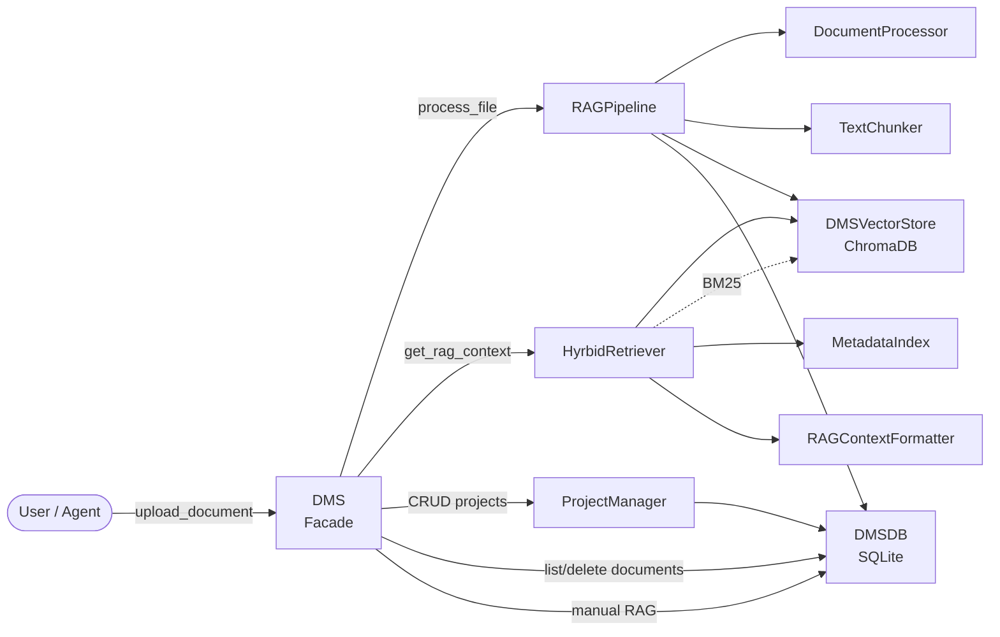

# Document Management — dms

# Document Management System (DMS) Module

## Overview

The DMS module manages the lifecycle of documents – ingestion, chunking, embedding, storage, and retrieval – to provide context for Retrieval-Augmented Generation (RAG). It acts as a central document store that can be used by agents, memory systems, and any component that needs to ground LLM responses in a user’s documents.

The module supports:

- File processing (PDF, DOCX, text, images with OCR)  
- Text chunking with configurable overlap and token‑aware boundaries  
- Hybrid search: dense vector similarity (ChromaDB) + BM25 keyword search, fused with Reciprocal Rank Fusion (RRF) and optional Cross‑Encoder re‑ranking  
- Project‑level document organisation  
- Manual or automatic RAG context selection  

## Architecture

The following diagram shows the main components and their relationships during document upload and retrieval.



The **RAGPipeline** orchestrates the processing of a single file, and the **HybridRetriever** handles all retrieval queries. Document metadata is kept in SQLite while chunk embeddings live in ChromaDB.

## Core Components

### 1. `DMS` – Main Facade

`src/dms/dms.py`

The top‑level entry point for all document management operations. It initialises every subordinate component (project manager, document processor, chunker, vector store, hybrid retriever, RAG pipeline) and exposes a simple API for the rest of the application.

Key methods:

- `create_project(name, description)` → Project ID  
- `delete_project(project_id)` → bool  
- `list_projects()` → list of project dicts  
- `upload_document(project_id, file_path)` → document ID  
- `delete_document(document_id)` → bool  
- `list_documents(project_id=None)` → list of document dicts  
- `get_rag_context(query, project_id, k)` → list of chunk dicts with relevance scores  
- `add_to_rag_context(document_id)` , `remove_from_rag_context(document_id)` – manual RAG context management  
- `list_manual_rag_documents()` → list of document IDs  
- `get_manual_rag_context(k)` → chunks for manually selected documents  
- `auto_retrieve_for_topic(topic, project_id, k)` → formatted chunks with source info  

### 2. `DMSDB` – SQLite Database Layer

`src/dms/database.py`

Manages persistence of projects, documents, chunks, and RAG context. Uses four tables:

| Table              | Purpose                                    |
|--------------------|--------------------------------------------|
| `projects`         | Project ID, name, description, metadata    |
| `documents`        | File metadata, upload date, OCR flag       |
| `document_chunks`  | Per‑chunk text, embedding reference, page  |
| `rag_context`      | Manual session ↔ document mapping          |

The `row_factory` is set to `sqlite3.Row`, so all queries return dict‑like rows. Referential integrity is enforced with foreign keys.

### 3. `DocumentProcessor` – File Processing and OCR

`src/dms/document_processor.py`

Extracts text from files. For most formats (PDF, DOCX, TXT, etc.) it delegates to `DocumentParser` (a separate utility). For image files (`.png`, `.jpg`, `.bmp`, `.tiff`, `.webp`) it can use **PaddleOCR** if enabled in configuration.

The OCR initialisation is performed on demand in a synchronous context (`_initialize_ocr_sync`) to avoid threading conflicts with PaddleX. The method `_extract_ocr_text` handles both the old and new response formats of PaddleOCR.

### 4. `TextChunker` – Token‑Aware Text Splitting

`src/dms/chunker.py`

Splits text into overlapping chunks using OpenAI’s `cl100k_base` tokeniser (via `tiktoken`). Default chunk size is 512 tokens with an overlap of 51 tokens (approximately 10%). If the text fits in a single chunk, it is returned as‑is.

### 5. `DMSVectorStore` – ChromaDB Integration

`src/dms/vector_store.py`

Wraps a persistent ChromaDB collection for storing chunk embeddings. On initialisation it creates or retrieves the collection with cosine distance (`hnsw:space`). Key operations:

- `add_chunks(document_id, chunks, project_id)` – adds multiple chunk dicts with auto‑generated IDs (`{document_id}_chunk_{index}`).  
- `search(query, project_id, k)` – vector similarity search, optionally filtered by project. Returns chunks with a `relevance_score` (1 – distance).  
- `delete_document_chunks(document_id)` – removes all chunks of a document.  
- `count()` – current number of chunks in the collection.

### 6. `MetadataIndex` – ChromaDB Metadata Queries

`src/dms/metadata_index.py`

Provides higher‑level lookups into ChromaDB using the metadata stored alongside each chunk:

- `get_chunks_by_project(project_id)`  
- `get_chunks_by_document(document_id)`  
- `get_chunks_by_date_range(start_date, end_date)`  

Each method calls `collection.get()` with a `where` filter and enriches results with document‑level info (file name, upload date) fetched from `DMSDB`.

### 7. `HybridRetriever` – BM25 + Vector + RRF + Re‑ranking

`src/dms/hybrid_retriever.py`

The core retrieval engine. Given a query and optional project filter:

1. **BM25 retrieval** – tokenises query and corpus (from `MetadataIndex` or `DMSVectorStore.collection.get()`) and scores with `rank_bm25`. Returns top 20.  
2. **Vector search** – `DMSVectorStore.search()` with `k=20`.  
3. **RRF fusion** – combines BM25 and vector result ranks using `RRF(k=60)`.  
4. **Optional Cross‑Encoder re‑ranking** – if `sentence-transformers` is installed, it loads `cross-encoder/ms-marco-MiniLM-L-6-v2` and re‑scores the top `k` items.  

The final list of chunks includes a `score` (from RRF or Cross‑Encoder) and a `source: "hybrid"` marker.

### 8. `RAGPipeline` – End‑to‑End Document Processing

`src/dms/rag_pipeline.py`

Coordinates the processing of a single file from extraction to storage.

- `process_file(doc_id, file_path)` – async method that calls `DocumentProcessor.process_file()`, then `process_document()`.  
- `process_document(doc_id, text)` – synchronous path that chunks the text, adds chunks to the vector store, and stores chunk records in the SQLite database.  

Both methods return a list of chunk IDs.

### 9. `RAGContextFormatter` – Chunk Formatting for LLM Context

`src/dms/rag_context_formatter.py`

Takes a list of chunk dicts (as produced by `HybridRetriever` or `MetadataIndex`) and formats them into a single string suitable for prompting. Each chunk is wrapped as `[Document N from <filename>]: <text>`. The total context is capped at `max_chars` (default 4000).

### 10. `ProjectManager` – Project CRUD

`src/dms/project_manager.py`

Thin wrapper around `DMSDB` providing `create_project`, `get_project`, `list_projects`, `update_project`, `delete_project`. Validates existence before updates.

### 11. `DMSMemory` – High‑Level RAG Interface

`src/dms/dms_memory.py`

Designed to be used by an agent’s memory system. It wraps a `DMS` instance and a `RAGContextFormatter` to provide a simple `get_context(query, project_id, k)` → formatted string. Also exposes `add_document_context` and `remove_document_context` for manual RAG control.

### 12. `load_dms_config` – Configuration Loading

`src/dms/config.py`

Loads DMS configuration from `config/settings.yaml` (or a custom path) and merges it with `DEFAULT_DMS_CONFIG`. Validates `chunk_size > 0`, `chunk_overlap < chunk_size`, and `max_file_size_mb > 0`. Used by the initialisation of `DMS`.

## Configuration

All DMS‑specific settings reside under the `dms` key in the YAML file. Default values:

```yaml
dms:
  enabled: true
  storage_path: "dms_storage"
  chunk_size: 512
  chunk_overlap: 51
  embedding_model: "intfloat/multilingual-e5-small"
  ocr_enabled: false
  ocr_device: "cpu"
  max_file_size_mb: 50
  chroma_collection: "document_chunks"
  memory_dir: "memory"
```

## Data Flow Examples

### Document Upload

1. `DMS.upload_document(project_id, file_path)`  
2. Creates a document entry in `DMSDB`  
3. Calls `RAGPipeline.process_file(doc_id, file_path)`  
4. `DocumentProcessor.process_file` extracts text (using OCR for images if enabled)  
5. `TextChunker.chunk` splits text into overlapping token chunks  
6. `DMSVectorStore.add_chunks` embeds and stores in ChromaDB  
7. `DMSDB.add_chunk` saves chunk metadata (text, index, page) in SQLite  

### Retrieval for RAG

1. `DMS.get_rag_context(query, project_id, k)`  
2. `HybridRetriever.retrieve(query, project_id, k)`  
3. Fetches all chunks for the project (or entire store) from ChromaDB  
4. Computes BM25 scores and vector scores  
5. Fuses with RRF, optionally re‑ranks with CrossEncoder  
6. Returns top‑k chunks with scores  
7. `DMSMemory.get_context` (or caller) formats via `RAGContextFormatter`  

## Integration with the Rest of the Codebase

- **DMS** is instantiated by `DMSMemory`, which is the primary interface for agent memory.  
- **DMS** is also used directly by test suites and can be imported from `src.dms`.  
- The **DocumentProcessor** relies on `src.tools.doc_parser.DocumentParser` for non‑OCR parsing.  
- **Configuration** is shared through the application‑wide YAML settings file.  
- The module exports all key classes in `__init__.py` for convenient imports:  
  `from src.dms import DMS, DMSDB, load_dms_config, TextChunker, MetadataIndex, HybridRetriever, RAGPipeline, RAGContextFormatter, DMSMemory`