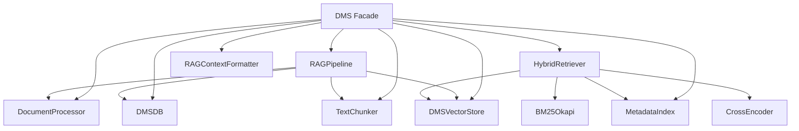

# Document Management — services

# Document Management — Services (`backend/services/dms/`)

## Overview

The DMS (Document Management System) module is the core document ingestion, storage, and retrieval engine for the application. It handles everything from file upload and OCR-based text extraction through chunking, vector embedding, and hybrid (BM25 + vector + cross-encoder) search. Every project in the system gets its own scoped DMS instance, with dedicated SQLite and ChromaDB databases.

The module is organized into several focused components that can be used independently, but most operations are coordinated through the `DMS` facade class.

---

## Architecture



The diagram shows the main components and their dependencies. The `DMS` facade exposes high-level operations like `upload_document`, `get_rag_context`, and `delete_document`. Internally it delegates to the appropriate specialized objects.

---

## Key Components

### `DMS` — service facade (`service.py`)

Orchestrates all DMS operations. Each instance is scoped to a single project directory (database path + Chroma path). The factory function `get_dms_for_project()` creates or retrieves a cached instance per project.

**Important responsibilities**:
- Creating the document database entry (via `DMSDB`)
- Deciding whether an async event loop is already running (e.g., inside FastAPI) and choosing the correct execution strategy for the `RAGPipeline.process_file` call
- Managing manual RAG document selection (`_manual_rag_docs` set)
- Exposing methods that combine internal components: `upload_document`, `delete_document`, `list_documents`, `get_document`, `get_rag_context`, `add_to_rag_context`, `remove_from_rag_context`, `get_manual_rag_context`, `auto_retrieve_for_topic`, `format_rag_context`

```python
def upload_document(
    self,
    project_id: str,
    file_path: str,
    original_filename: str = "",
) -> dict[str, Any]
```
Returns `{"doc_id": ..., "error": ...|None, "chunk_count": int}`.

**Factory:**
```python
def get_dms_for_project(project_id: str, project_store=None) -> DMS
```
Retrieves the project from the `ProjectStore`, creates the `dms/` subdirectory inside the project directory, loads DMS config (including OCR settings), creates the `DMS` instance, ensures the project exists in the DMS database, and caches the instance.

---

### `DMSDB` — SQLite storage (`database.py`)

Stores projects, documents, document chunks, and RAG context in a local SQLite database. Accepts an explicit `db_path` (defaults to `memory/dms.db`).

**Tables:**
- `projects` — project metadata
- `documents` — file-level metadata (filename, file type, size, page/word/char counts, OCR usage)
- `document_chunks` — individual chunks with embedding ID, page number, and JSON metadata
- `rag_context` — links a session (or project) to a set of documents for manual RAG

**Optional migration:** `_migrate_documents_table()` adds missing columns (`original_filename`, `file_size`) to existing tables if they were created by an earlier schema version.

---

### `DMSVectorStore` — ChromaDB vector store (`vector_store.py`)

Persistent vector store based on ChromaDB. It uses cosine distance (`hnsw:space: cosine`) and persists to a given directory. The `add_chunks()` method generates chunk IDs like `{document_id}_chunk_{chunk_index}` and stores metadata (document_id, project_id, chunk_index, page). The `search()` method can optionally filter by `project_id` via Chroma's `where` clause, and returns results sorted by descending `relevance_score` (computed as `1.0 - distance`).

---

### `TextChunker` — token-based splitting (`chunker.py`)

Uses `tiktoken` with the `cl100k_base` encoding to split text into overlapping chunks of a configurable token size (default 512) and overlap (default 51). If the text fits in a single chunk, it is returned as-is.

```python
chunker = TextChunker(chunk_size=512, overlap=51)
chunks = chunker.chunk("long text ...")
```

---

### `DocumentProcessor` — file parsing & OCR (`document_processor.py`)

Handles file processing with automatic OCR fallback. It uses the project’s `DocumentParser` for text files, and for image extensions (`.png`, `.jpg`, `.jpeg`, `.bmp`, `.tiff`, `.tif`, `.webp`) it attempts OCR.

**OCR engine initialization:**
1. **PaddleOCR** (GPU/CPU via `ocr_device` config) — primary engine
2. **Tesseract** (via `pytesseract`) — fallback

If neither is available and OCR is enabled, a warning is logged; image processing falls back to text extraction (effectively no OCR). If OCR is disabled in config, image files raise `ValueError` with a clear message.

The processor also performs a version compatibility check for PaddlePaddle 3.3+ (advisory warning about PIR/OneDNN issues) and attempts to recover from PaddleX/paddlex initialization conflicts.

---

### `RAGPipeline` — indexing pipeline (`rag_pipeline.py`)

Combines `DocumentProcessor`, `TextChunker`, `DMSVectorStore`, and `DMSDB` to turn a file or raw text into indexed chunks.

- `process_document(doc_id, text)`: looks up document in DB, chunks text, adds chunks to vector store, stores chunk metadata in `document_chunks` table.
- `process_file(doc_id, file_path)`: calls `DocumentProcessor.process_file()` to extract text, then calls `process_document`.

Both log warnings and return empty lists on failure (missing document, empty text, chunking errors).

---

### `HybridRetriever` — search engine (`hybrid_retriever.py`)

Combines BM25 keyword search with vector similarity search using Reciprocal Rank Fusion (RRF), with optional cross-encoder re-ranking.

**Steps:**
1. Fetches all chunks for the given project (from `MetadataIndex` or directly from ChromaDB)
2. Runs BM25 (`rank_bm25`) on the full chunk corpus
3. Runs vector search via `DMSVectorStore.search`
4. Combines the two ranked lists using RRF with `rrf_k = 60`
5. If `sentence_transformers.CrossEncoder` is available, re-ranks the top `k` results using the model `cross-encoder/ms-marco-MiniLM-L-6-v2`
6. Returns up to `k` results with scores and source metadata

---

### `MetadataIndex` — ChromaDB metadata queries (`metadata_index.py`)

A thin wrapper around `DMSVectorStore.collection.get()` that provides `get_chunks_by_project`, `get_chunks_by_document`, and `get_chunks_by_date_range`. It returns chunks with a standardized metadata structure (project_id, document_id, chunk_index, file_name, upload_date).

---

### `RAGContextFormatter` — LLM prompt formatting (`rag_context_formatter.py`)

Formats a list of chunk dicts into a single string suitable for inclusion in an LLM prompt. Each chunk is prefixed with `[Document {n} from {file_name}]:`. The combined string is truncated to `max_chars` (default 50,000, roughly 12,500 tokens) with a trailing `...`.

```python
formatter = RAGContextFormatter()
context = formatter.format(chunks, max_chars=50_000)
```

---

### Configuration (`config.py`)

**`DEFAULT_DMS_CONFIG`** provides sensible defaults:
- `chunk_size`: 512, `chunk_overlap`: 51
- `embedding_model`: `intfloat/multilingual-e5-small`
- `ocr_enabled`: `True`, `ocr_device`: `"cpu"`
- `max_file_size_mb`: 50
- `chroma_collection`: `"document_chunks"`
- `storage_path`: `"dms_storage"`
- `memory_dir`: `"memory"`

**`load_dms_config(path)`** merges a user-supplied YAML file (under a `dms:` key) with the defaults, then validates `chunk_size > 0`, `chunk_overlap < chunk_size`, and `max_file_size_mb > 0`. Returns the merged dict.

---

## Lifecycle & Scoping

**Per-project instances** are managed by the global `_dms_cache` dictionary inside `service.py`. The factory function `get_dms_for_project()` is called from both the DMS API router (`api/routers/dms.py`) and the debate router. It:

1. Checks the cache.
2. Loads the project from `ProjectStore`.
3. Creates `{project_dir}/dms/` directory.
4. Loads DMS config (including OCR settings).
5. Instantiates `DMS` with `dms.db` and `chroma_db` subdirectories.
6. If the project does not yet exist in the DMS database (for FK constraints), it inserts a minimal project row.
7. Caches the instance.

The cache ensures that all components (document processor, vector store, etc.) are reused for the same project across requests.

---

## Document Upload Flow

```
upload_document(project_id, file_path)
    │
    ├─ 1. Check file exists, get size/type
    ├─ 2. Create DB entry via DMSDB.add_document()
    │
    └─ 3. RAGPipeline.process_file(doc_id, file_path)
            │
            ├─ DocumentProcessor.process_file()
            │     (text file → parse, image → OCR)
            │
            ├─ TextChunker.chunk() with chunk_size/overlap
            │
            ├─ DMSVectorStore.add_chunks()
            │
            └─ DMSDB.add_chunk() for each chunk
```

The upload method handles both running inside and outside an async loop (FastAPI endpoints run in an async context). If a loop is detected, the pipeline is run in a `ThreadPoolExecutor` with a 5-minute timeout. Otherwise `asyncio.run()` is used.

---

## Retrieval Pipeline

```
get_rag_context(query, project_id, k)
    │
    └─ HybridRetriever.retrieve(query, project_id, k)
            │
            ├─ _fetch_chunks (get all project chunks)
            │
            ├─ _bm25_retrieve (top 20 with BM25)
            ├─ vector_store.search (top 20 with cosine similarity)
            │
            ├─ RRF combine (rrf_k=60)
            │
            ├─ Optional CrossEncoder re-ranking
            │
            └─ Return top k results with scores
```

---

## Error Handling Patterns

- All major failure points are wrapped in `try/except` blocks that log the error and return a safe fallback (empty list, `False`, or a dict with `"error"`).
- OCR-related `ValueError`s are preserved and surfaced to the API caller (e.g., when `ocr_enabled` is `False` for an image).
- Document processing timeouts raise a user-friendly error message.
- Chunking failures or empty texts are logged and return empty lists; the document entry itself is still created.

---

## Connections to Other Modules

| External Module | Purpose |
|----------------|---------|
| `backend/api/routers/dms.py` | HTTP endpoints that use `get_dms_for_project()` and call DMS methods |
| `backend/api/deps.py` | `get_project_store()` dependency injection used by the factory |
| `backend/services/doc_parser.py` | `DocumentParser` (used by `DocumentProcessor` for non‑image files) |
| `tests/backend/test_dms_ocr.py` | Tests that exercise the OCR code paths |
| `backend/api/routers/debate.py` | Retrieves RAG context via the DMS facade |

---

## Key Design Decisions

1. **Facade pattern** — `DMS` hides the complexity of the individual services. New features can be added by composing existing components.
2. **Per‑project isolation** — Each project has its own SQLite database and ChromaDB directory, preventing cross‑project data leaks and simplifying cleanup.
3. **Synchronous OCR initialization** — `DocumentProcessor` initializes OCR engines during construction (not lazily), so failures are caught early. The `_get_ocr` method provides a fallback for async contexts.
4. **Hybrid retrieval with RRF** — BM25 + vector search provides better coverage than either alone. The cross‑encoder re‑ranks the top results for precision.
5. **Manual RAG context** — A simple in‑memory set (`_manual_rag_docs`) allows users to hand‑pick which documents contribute to a query, independent of the automatic retrieval.
6. **Graceful degradation** — If an OCR engine fails, the system falls back to text extraction (or to the next OCR engine). Missing embeddings, empty DBs, and corrupt files all produce logged warnings and safe defaults.