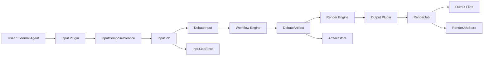
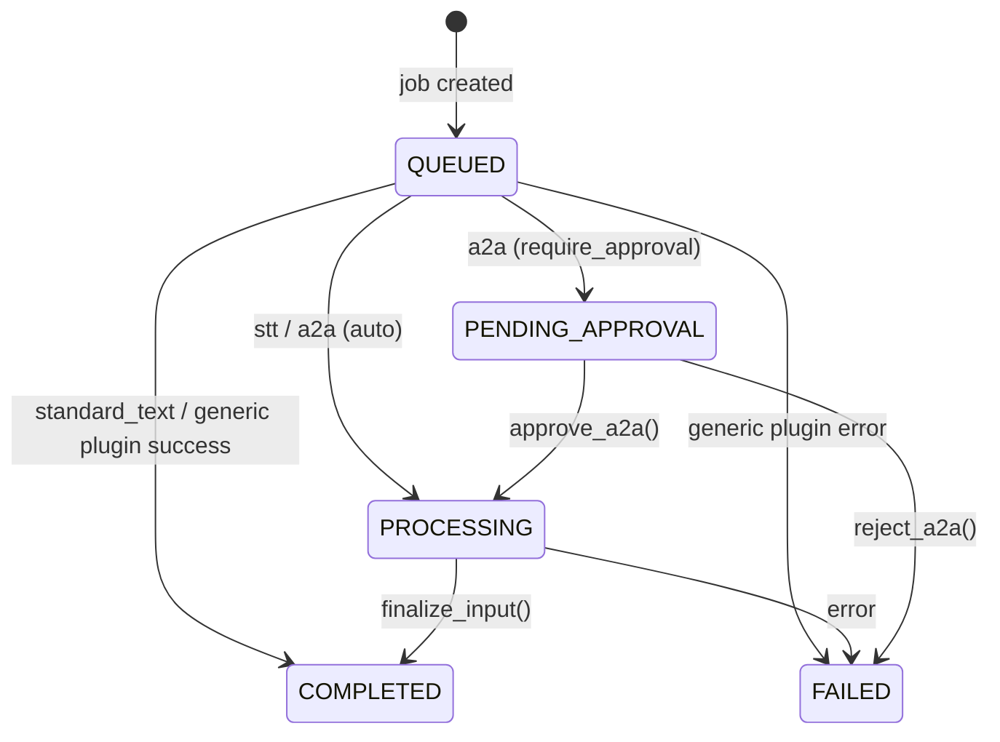
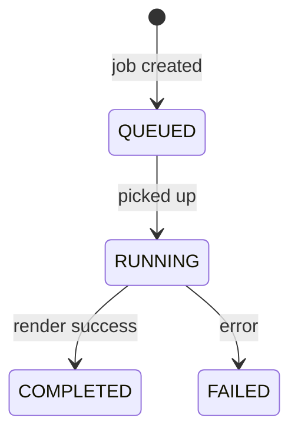

# Input/Output Pipeline

# Input/Output Pipeline Module

## Overview

The Input/Output Pipeline module provides the end-to-end mechanism for feeding raw material into a debate workflow and rendering the resulting conversation into publishable artifacts. It is divided into two independent but structurally symmetric subsystems:

1. **Input Pipeline** – plugin-based capture of input from sources such as direct text input, speech-to-text, A2A agent requests, and future MCP tool calls. Each plugin transforms its native input into a standardised `DebateInput` artifact that the workflow engine can consume.
2. **Output Pipeline** – plugin-based rendering of the completed `DebateArtifact` into output formats such as PDF, DOCX, audio (TTS), or Markdown. Each plugin implements a `render()` method that produces concrete output files.

Both pipelines share a common pattern: a plugin registry, a service layer that manages job lifecycles, and SQLite-backed stores for persistence. The module is designed to be extensible; new input or output plugins can be added without touching the core service logic.

## Architecture



The input pipeline ends when a `DebateInput` is produced and the corresponding `InputJob` reaches `COMPLETED`. The workflow engine (outside this module) picks up that artifact, runs the debate, and produces a `DebateArtifact`. The output pipeline then takes that artifact, submits a `RenderJob`, and the selected output plugin generates the final output files.

## Input Pipeline

### Plugin Architecture

All input plugins inherit from `InputPlugin` (`backend/services/input/base.py`). The contract requires three class variables and one abstract method:

- **`plugin_key`** – unique string identifier (e.g. `"standard_text"`).
- **`plugin_name`** – human-readable name for UI.
- **`config_schema`** – a Pydantic model used for runtime validation.
- **`capture(config) -> DebateInput`** – the core transformation method.

Plugins **must be stateless** – no instance state may be persisted between `capture()` calls. The optional `validate(config)` method can check external dependencies (e.g. STT profile availability). The class methods `validate_config()` and `config_json_schema()` provide validation and schema introspection.

#### Registration

Plugins self-register via the `@register_input_plugin` class decorator defined in `backend/services/input/registry.py`. The decorator calls `InputPluginRegistry.register()`. The registry is a singleton populated at import time when the `plugins` subpackage is imported (`backend/services/input/plugins/__init__.py`).

```python
@register_input_plugin
class StandardTextInputPlugin(InputPlugin):
    plugin_key: ClassVar[str] = "standard_text"
    ...
```

#### Built-in Plugins

| Plugin | Key | Description |
|--------|-----|-------------|
| `StandardTextInputPlugin` | `standard_text` | Default. Takes a topic string from the API request and wraps it into a `DebateInput`. |
| `STTInputPlugin` | `stt` | Speech-to-text. Audio is streamed via a dedicated SSE endpoint; the plugin validates that the referenced LLMProfile has `protocol='stt'`. |
| `A2AInboundPlugin` | `a2a_inbound` | Handles incoming A2A agent requests. Can require user approval before processing. |
| `MCPInputPlugin` | `mcp` | Stub for future MCP (Model Context Protocol) integration. Currently raises `NotImplementedError` and reports `is_available: false`. |

### InputComposerService

`InputComposerService` (`backend/services/input/input_engine.py`) is the bridge between the API layer and the plugins. It manages `InputJob` lifecycle and produces `DebateInput` artifacts.

#### Submission Flow

1. **`submit_input(plugin_key, config, raw_data) -> InputJob`**  
   Resolves the plugin class from the registry, validates the config, and creates an `InputJob`. The job is then routed based on `plugin_key`:

   - `"standard_text"` – processed immediately; the `DebateInput` is built from `raw_data["topic"]` and the job is set to `COMPLETED`.
   - `"stt"` – set to `PROCESSING` (transcription happens asynchronously).
   - `"a2a_inbound"` – either `PENDING_APPROVAL` or `PROCESSING`, depending on `config["require_approval"]`.
   - Other keys – the plugin’s `capture()` method is called synchronously; errors are caught and set the job to `FAILED`.

2. **`finalize_input(job_id, processed_data)`**  
   Called after an async process (STT transcription, A2A approval) completes. Updates the job to `COMPLETED` with the final `DebateInput`.

3. **`approve_a2a(job_id)` / `reject_a2a(job_id)`**  
   Allows a user to approve or reject an A2A inbound request.

#### Routing Details



### Persistence

#### InputJobStore

`InputJobStore` (`backend/services/input/input_job_store.py`) is a SQLite-backed store for `InputJob` objects. It uses the `input_jobs` table (created by migration v12). Key operations:

- `create_job(job)`
- `get_job(job_id)`
- `update_job(job_id, status, processed_input, ...)`
- `list_jobs(plugin_key, status, limit, offset)`
- `delete_job(job_id)`

The store runs migrations from `backend.blueprints.migrations` on instantiation, following the same pattern as `BlueprintRepository`.

#### InputStore

`InputStore` (`backend/services/input/input_store.py`) persists `DebateInput` objects in the `debate_inputs` table. It is a separate store from `InputJobStore`; `DebateInput` objects are saved after a job completes and may be retrieved later (e.g., to resume a session).

- `save(debate_input)`
- `get(session_id)`
- `delete(session_id)`
- `exists(session_id)`

### Future Integration Points

#### MCPAdapter Protocol

`MCPAdapter` (`backend/services/input/mcp_adapter.py`) is a structural subtyping Protocol for future MCP server/client integration. When implemented, it will handle external tool calls that submit `DebateInput` requests. The MCP input plugin (`MCPInputPlugin`) is the placeholder for this functionality.

#### PluginManifest

`PluginManifest` (`backend/services/input/plugin_manifest.py`) defines the schema for `manifest.json` files that external plugins must provide. The manifest includes fields like `plugin_key`, `plugin_type` (input/output/both), `entrypoint`, and `config_schema`. This will be used when loading plugins from the `external_plugins/` directory.

## Output Pipeline

### Plugin Architecture

Output plugins inherit from `OutputPlugin` (defined in `backend/services/output/base.py` – not shown in full, but derived from tests). The contract mirrors the input side:

- `plugin_key`, `plugin_name`, `config_schema` – same semantics.
- `supported_formats: ClassVar[list[str]]` – e.g. `["pdf", "docx"]`.
- **`render(artifact, config, job_id, output_dir) -> list[str]`** – returns a list of paths to the generated files.

The singleton `PluginRegistry` and `@register_plugin` decorator work identically to their input counterparts (`backend/services/output/registry.py`).

### Built-in Plugins

#### Print Output Plugin

`PrintOutputPlugin` (key `"print"`) renders a `DebateArtifact` into a printable document. It supports multiple output formats: `pdf`, `docx`, `odt`, `md`, and `ALL`.

**Configuration** (`PrintPluginConfig`):
- `template_name` – `ACADEMIC_DEBATE` (default) or `MINIMAL`.
- `include_audit_trail`, `include_minority_votes` – booleans.
- `primary_format` – the desired format or `ALL`.
- `language` – default `"de"`.

**Layout Engine** (`PrintLayoutEngine`):
Transforms a `DebateArtifact` into a `PrintDocument` with a list of `Section` objects. Each section has a `SectionType`:

| SectionType | Source | Description |
|-------------|--------|-------------|
| `TURN` | Transcript turn | The turn content, with agent name. |
| `USER_QUERY_BLOCK` | User queries | User questions, placed after the turn they relate to. |
| `MINORITY_CALLOUT` | Minority votes | Dissenting opinions, displayed as highlighted callouts. |
| `CONSENSUS_SUMMARY` | Consensus result | The final debate summary. |
| `AUDIT_APPENDIX` | Metadata | Plugin run history, config snapshots, etc. |

The engine also attaches `MarginNote` objects to turns when injections (interjections) are present. These appear as marginalia in the printed document.

#### TTS Output Plugin

`TTSOutputPlugin` (key `"tts"`) renders a `DebateArtifact` into an audio script and then synthesises speech. Supported formats: `mp3`, `wav`.

**Configuration** (`TTSPluginConfig`):
- `engine` – `TTSEngine.EDGE_TTS` (default) or others.
- `default_voice` – e.g. `"de-DE-KatjaNeural"`.
- `voice_mapping` – per-agent voice overrides.
- `segment_pause_ms`, `turn_pause_ms` – timing control.
- `intro_text`, `outro_text` – optional spoken bookends.
- `output_format` and `bitrate`.

**Script Engine** (`TTSScriptEngine`):
Converts a `DebateArtifact` into an `AudioScript` composed of `Segment` objects. Each segment contains:
- The text to speak.
- The voice ID (resolved from `voice_mapping` or fallback to default).
- Metadata flags (`is_intro`, `is_outro`, `injection_reference`).

Injections are framed as "Zwischenfrage..." (interjection). User queries become separate segments.

### Artifact Store and Render Job Store

#### ArtifactStore

Stores `DebateArtifact` objects in the `debate_artifacts` table. Operations: `save`, `get`, `exists`, `delete`.

#### RenderJobStore

Stores `RenderJob` objects in the `render_jobs` table. A `RenderJob` tracks the rendering lifecycle:



Fields include `session_id`, `plugin_key`, `status`, `output_files`, and `error_message`. Methods mirror `InputJobStore`.

### RenderEngineService

While the full implementation is not shown in the provided code, the test suite (`test_render_engine.py`) and the established pattern indicate that a `RenderEngineService` exists. It orchestrates rendering:
- Accepts a `DebateArtifact` and output plugin choice.
- Creates a `RenderJob`.
- Calls the plugin’s `render()` method with the artifact and config.
- Updates the job with output paths or error information.

## Key Connections to Other Modules

| Module | Interaction |
|--------|-------------|
| **API Routers** (`backend/api/routers/input_composer.py`) | Calls `InputComposerService.submit_input()`, `approve_a2a()`, `reject_a2a()`, and `InputJobStore` methods for listing/delete/status. |
| **Workflow Orchestrator** | Ingests `DebateInput` from completed `InputJob` (subscribed via event or polling). Not part of this module. |
| **Blueprint Repository** | `STTInputPlugin.validate()` uses `BlueprintRepository.get_llm_profile()` to check that the referenced profile exists and has `protocol='stt'`. |
| **Migrations** (`backend/blueprints/migrations`) | Both `InputJobStore` and `InputStore` call `run_migrations()` on init to ensure tables exist. |
| **Debate Artifact** (`backend/models/artifact.py`) | The output pipeline consumes `DebateArtifact` produced by the workflow engine. |
| **Debate Input** (`backend/models/debate_input.py`) | The input pipeline produces `DebateInput` consumed by the workflow engine. |

## Testing

The module includes comprehensive tests in `tests/backend/`:

- `test_input_engine.py` – tests `InputComposerService`, `InputJobStore`, `InputStore`.
- `test_input_plugin.py` – tests `InputPluginRegistry`, the decorator, and the plugin contract.
- `test_output_plugin.py` – tests `PluginRegistry` and `OutputPlugin` contract.
- `test_print_plugin.py` – tests `PrintLayoutEngine`, `PrintPluginConfig`, and `PrintOutputPlugin` properties.
- `test_tts_plugin.py` – tests `TTSScriptEngine`, `TTSPluginConfig`, and `TTSOutputPlugin`.
- `test_render_engine.py` – tests `ArtifactStore`, `RenderJobStore`.

Tests use `tmp_path` fixtures to isolate the SQLite database and reset the registry singletons between runs.