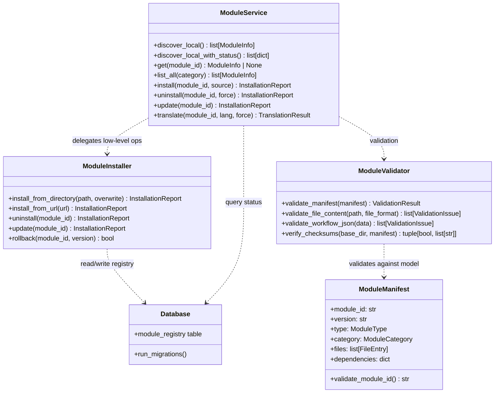

# Module Management — backend

# Module Management — Backend

## Overview

The Module Management subsystem handles the lifecycle of installable content modules in the DanWa application. Modules contain structured content (prompts, workflows, argumentation patterns) packaged with a manifest and versioned files. The system provides:

- **Installation** from local directories, ZIP archives (via URL)
- **Uninstallation** with rollback capability
- **Version management** (update, same-version overwrite, rollback to prior)
- **Local discovery** and status enumeration
- **Validation** of manifests, file content, checksums, and workflow DAGs
- **Translation** marking (infrastructure placeholder for multi-language support)
- **Dependency tracking** (declared but not strictly enforced at install time)

## Key Components

The module is organized into three service classes and a set of Pydantic models, backed by a SQLite database.



## Detailed Component Descriptions

### 1. ModuleInstaller (`backend/modules/installer.py`)

The installer handles the atomic operations of moving files into the modules directory and recording state in the database.

**Key Methods**

| Method | Description |
|--------|-------------|
| `install_from_directory(source_dir, overwrite=False)` | Copies files from `source_dir` into the target `modules_dir`. Validates the manifest, computes and checksums every file, creates DB entries for the module and each file. Returns an `InstallationReport` with status (`ok`, `skipped`, `error`), `module_id`, `version`, `files_installed`, and `db_entries_created`. |
| `install_from_url(url)` | Downloads a ZIP file, extracts to a temporary directory, then calls `install_from_directory`. Returns error report on network failure or invalid archive. |
| `uninstall(module_id)` | Removes the module directory and its DB records. Idempotent — returns `ok` even if the module does not exist. Reports `files_removed` and `db_entries_removed`. |
| `update(module_id)` | Re-installs the module from its current directory (expected to already contain the newer version). Returns error if the module is not installed. |
| `rollback(module_id, version)` | Placeholder — returns `False` when the target version is not snapshotted. |

**Behavioural Details**

- **Source ≠ Target**: Files are copied from a source directory to the managed `modules_dir`. When source equals the managed directory (in-place update), no backup directory is created (`test_source_equals_target_no_backup`).
- **Overwrite**: `overwrite=False` skips installation if the module version already exists in the DB. `overwrite=True` allows re-installing the same version.
- **Checksum Verification**: Every file listed in the manifest must match its SHA-256 checksum. A mismatch raises an error report.
- **Error Reports**: Missing or malformed `manifest.json` returns an error report with descriptive messages.

### 2. ModuleService (`backend/modules/service.py`)

The service layer provides a higher‑level API for discovery, listing, and lifecycle orchestration. It wraps `ModuleInstaller` and `ModuleValidator`.

**Key Methods**

| Method | Description |
|--------|-------------|
| `discover_local()` | Scans `modules_dir` for subdirectories containing a valid `manifest.json`. Returns a list of `ModuleInfo` objects. Skips hidden directories (dot‑prefixed) and directories without a manifest. |
| `discover_local_with_status()` | Enriches local discovery with database state (installed, enabled, on_disk, DB‑only modules). Merges disk data with the `module_registry` table. |
| `get(module_id)` | Returns a single `ModuleInfo` or `None`. |
| `list_all(category=None)` | Lists installed modules, optionally filtered by `ModuleCategory`. Returns empty list for a non‑existent category. |
| `install(module_id, source="local")` | Expects the module directory to already exist inside `modules_dir`. Registers it in the database. Raises `FileNotFoundError` if the directory is missing. |
| `uninstall(module_id, force=False)` | Removes module files and DB entries. With `force=True`, skips dependency checks. |
| `update(module_id)` | Calls the installer’s update after ensuring the module exists. |
| `translate(module_id, target_language, force=False)` | Marks files for translation in the database. Returns a `TranslationResult` with counts of translated/skipped files. When `force=True`, cached results are overridden. |

**Discovery Rules**

- Only directories containing a `manifest.json` file are considered modules.
- Hidden directories (names starting with `.`) are excluded.
- A directory whose `manifest.json` cannot be parsed as JSON is silently skipped (no error raised).

### 3. ModuleValidator (`backend/modules/validation.py`)

Validates manifests and file content before installation, and workflow DAGs for structural correctness.

**Manifest Validation (`validate_manifest`)**

The validator checks:

- **Required fields**: `module_id`, `name`, `version`, `type`, `category`, `files`.
- **Module ID format**: Must match `^[a-z0-9][a-z0-9.-]*$` and satisfy additional Pydantic rules (see Models section).
- **Version format**: Strict semver `X.Y.Z`.
- **Type and Category**: Must be valid `ModuleType` and `ModuleCategory` enum values (e.g., `argumentation-pattern`, `custom` for type; `prompts`, `general` for category).
- **Files**: List must be non‑empty and contain no duplicate paths.
- **Warnings**:
  - Non‑standard file format (e.g., `plaintext`) → warning.
  - Schema version other than `1.0.0` → warning.
- **Result**: Returns a `ValidationResult` with boolean `valid`, list of `ValidationIssue` (each with `field`, `message`, `severity`), and `file_count`.

**File Content Validation (`validate_file_content`)**

| Format | Checks |
|--------|--------|
| Markdown | Non‑empty, minimum content length, placeholder detection (TODO, FIXME) |
| YAML | Parsable YAML |
| JSON | Parsable JSON |
| General | File existence, empty file error |

**Workflow DAG Validation (`validate_workflow_json`)**

Validates the structure of workflow definition JSON:

- Requires `name` (non‑empty string).
- Requires `nodes` (non‑empty array).
- Each edge must reference existing source/target node IDs.
- Detects cycles using DFS (self‑loops, direct cycles, indirect cycles).

**Checksum Verification (`verify_checksums`)**

Computes SHA‑256 checksum of each file listed in the manifest and compares it against the stored value. Returns a tuple `(ok: bool, errors: list[str])`.

### 4. Models (`backend/modules/models.py`)

Key Pydantic models used across the subsystem:

- **`ModuleManifest`**: The parsed manifest document. Includes a custom `module_id` validator that enforces:
  - Prefix `danwa-` is always valid.
  - Third‑party modules must contain at least one hyphen (e.g., `my-module`) and have a minimum length (prevents overly short IDs).
- **`ModuleInfo`**: Returned by discovery. Fields: `module_id`, `version`, `type`, `category`, `installed`, `file_count`.
- **`TranslationResult`**: Returned by `translate()`. Fields: `module_id`, `target_language`, `status`, `files_translated`, `files_skipped`.
- **`ValidationResult` / `ValidationIssue`**: Result of manifest validation with `valid` flag, `issues` list, and `file_count`.
- **`InstallationReport`**: Returned by installer methods. Contains `status`, `module_id`, `version`, `files_installed`, `db_entries_created`, `errors` list.

### 5. Database

The state is stored in a SQLite database with the schema managed by `backend/blueprints/migrations.run_migrations`. The central table is `module_registry`:

```sql
CREATE TABLE module_registry (
    id TEXT PRIMARY KEY,
    name TEXT,           -- JSON object for multi-language names
    description TEXT,
    type TEXT,
    category TEXT,
    version TEXT,
    author_json TEXT,    -- JSON
    license TEXT,
    checksum TEXT,
    installed_at TEXT,
    updated_at TEXT,
    enabled INTEGER,
    source_schema TEXT,
    tags_json TEXT,      -- JSON array
    dependencies TEXT    -- JSON object
);
```

The database stores both installed modules and DB‑only modules (modules that exist in the registry but whose files have been removed). The `discover_local_with_status()` method merges on‑disk modules with this registry.

## Lifecycle Flows

### Complete Lifecycle (as tested in `test_module_lifecycle.py`)

```
Create module v1.0.0 → Install → List includes module → Update to v2.0.0 → Uninstall → Module removed from list → Reinstall v1.0.0
```

### Installation Flow (local)

1. Source directory with `manifest.json` is placed inside `modules_dir` (or provided to `install_from_directory`).
2. `ModuleService.install()` is called.
3. `ModuleValidator.validate_manifest()` checks structural correctness.
4. `ModuleInstaller.install_from_directory()` copies files, verifies checksums, and inserts records into `module_registry`.
5. Returns `InstallationReport`.

### Installation Flow (URL)

1. `ModuleInstaller.install_from_url()` downloads and extracts a ZIP.
2. Proceeds as local installation on the extracted directory.

## Security Constraints

- **Executable files**: Manifest validation rejects files with executable formats (e.g., Python scripts). The validator checks manifest file types and flags any that are executable.
- **Binary files**: Binary file types (e.g., `.bin`) produce validation errors.
- **Manifest integrity**: Checksums ensure files are not tampered with between validation and installation.

## Parallel Installation

Multiple modules can be installed in sequence; the service and installer are stateless with respect to other modules. The `install()` method can be called repeatedly for different module IDs without conflict.

## Dependency Management

Dependencies are declared in the manifest as a dictionary (`{"danwa-base": ">=1.0.0"}`). During installation, dependencies are **not strictly enforced** — the install proceeds and the dependency information is stored in the database. Future versions may enforce required dependencies.

## Error Handling

- **Missing manifest**: Error report with `"Manifest not found"`.
- **Invalid JSON**: Error report with `"Failed to parse"`.
- **Checksum mismatch**: Error report with details of the mismatched file.
- **Non‑existent module**: `FileNotFoundError` raised by `service.install()`; `uninstall()` returns `ok` (idempotent).
- **Corrupt manifest on disk**: Silently skipped during discovery.

## Integration Points

- **Blueprints**: The `migrations` module (`backend/blueprints/migrations.py`) is called to initialize the database schema.
- **API Layer**: The `ModuleService` methods are designed to be called from Flask or FastAPI route handlers (e.g., `GET /modules`, `POST /modules/install`).
- **Translation Pipeline**: `translate()` currently marks files as pending; it interfaces with a future translation engine through the database.

## Testing Structure

The test suite is organized by component:

| Test File | Focus |
|-----------|-------|
| `test_module_installer.py` | Install, uninstall, update, rollback, backup protection |
| `test_module_service.py` | Discovery, listing, install/uninstall via service, translation, error handling |
| `test_module_lifecycle.py` | End‑to‑end lifecycle, dependency management, parallel install, security validation |
| `test_module_validator.py` | Manifest validation (schema, checksums, workflow DAGs) |

All tests use temporary directories and a fresh SQLite database per fixture to ensure isolation.