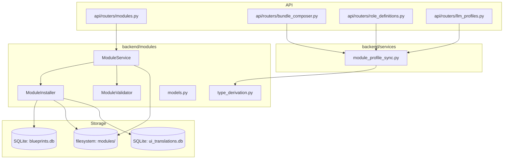

# Module Management — modules

# Module Management — `backend/modules`

This package provides the Danwa module system: installation, validation, discovery, and lifecycle management for modular extensions. Modules are self-contained directories with a `manifest.json` (v1 or v2 schema) and can be profiles (single-file) or bundles (multi-file).

## Core Data Models (`models.py`)

All module-related entities are modelled with Pydantic.

### Module Type & Category

```python
class ModuleType(StrEnum):
    ARGUMENTATION_PATTERN = "argumentation-pattern"
    AGENT_PERSONA = "agent-persona"
    LLM_PROFILE = "llm-profile"
    WORKFLOW_TEMPLATE = "workflow-template"
    TONE_PROFILE = "tone-profile"
    # …

class ModuleCategory(StrEnum):
    PROMPTS = "prompts"
    AGENTS = "agents"
    LLM_PROFILES = "llm-profiles"
    WORKFLOWS = "workflows"
    # …
```

Type and category are ordinarily derived from the parent directory name or the `module_id` prefix (see [Type Derivation](#type-derivation)), but can be overridden in the manifest.

### `ModuleManifest`

The manifest schema supports two format versions:

- **v1 (legacy)**: uses `files[]` — a list of file entries with path, format, checksum, and metadata.
- **v2 (current)**: uses `profile_file` + `profile_format` — a single profile file (YAML, JSON, or Markdown). The `files[]` list is optional during migration.

```python
class ModuleManifest(BaseModel):
    schema_version: str = "2.0.0"          # "1.0.0" or "2.0.0"
    module_id: str                          # e.g. "my-agent" (must match ^[a-z][a-z0-9.-]*$)
    name: dict[str, str]                    # language-keyed, e.g. {"en": "My Agent"}
    description: dict[str, str]
    version: str                            # semver X.Y.Z
    type: ModuleType | None                 # derived if omitted
    category: ModuleCategory | None         # derived if omitted
    author: dict[str, str]
    license: str = "CC-BY-4.0"
    dependencies: dict[str, str]            # module_id -> version constraint
    tags: list[str]
    language: str = "en"
    checksum: str
    profile_file: str | None                # v2
    profile_format: Literal["yaml", "json", "markdown"] | None
    files: list[ModuleFile]                 # v1
```

When `module_id` is submitted, underscores are replaced with hyphens and a validation ensures there is at least one hyphen (to distinguish third-party modules from internal ones).

### Report Models

- `InstallationReport` — status (`ok`/`error`/`partial`/`skipped`), file & DB counts, warnings, errors.
- `UninstallationReport` — status, file/DB removal counts, `blocked_by` list.
- `ValidationResult` / `ValidationIssue` — validation outcome with severity (`error`, `warning`, `info`).
- `TranslationResult` — result of automated translation (number of files translated, quality scores).

### Profile Data Models

Pydantic models for profile content (used when parsing profile files):

- `RoleTypeProfile`, `ToneProfileData`, `LLMProfileData`, `AgentPersonaData`, `WorkflowTemplateData`, `LanguagePackData`.

These are not directly used by the installer/service but can be loaded by downstream consumers (e.g., `get_profile()` returns a dict that can be validated against one of these).

## Type Derivation (`type_derivation.py`)

Because modules can live in categorised subdirectories (e.g. `modules/agent-profiles/`), type and category are often derived from the directory name. The module provides three mapping tables and three primary functions.

### Mappings

- `_DIR_TO_TYPE` – e.g. `"llm-profiles"` → `ModuleType.LLM_PROFILE`
- `_DIR_TO_CATEGORY` – e.g. `"workflows"` → `ModuleCategory.WORKFLOWS`
- `_PREFIX_TO_TYPE` – matches start of `module_id`, e.g. `"agent-"` → `ModuleType.AGENT_PERSONA`
- `_MANIFEST_TYPE_ALIASES` – legacy alias resolution, e.g. `"agent-core"` → `ModuleType.AGENT_PERSONA`

### Key Functions

```python
def parent_dir_name(module_dir: Path, modules_dir: Path) -> str
```
Returns the immediate parent directory of a module relative to the modules root. For `modules/llm-profiles/my-llm/` this returns `"llm-profiles"`.

```python
def derive_module_type(parent_dir_name: str, module_id: str) -> ModuleType
```
First checks `_DIR_TO_TYPE`; then tries `_PREFIX_TO_TYPE` against `module_id`; falls back to `ModuleType.AGENT_PERSONA`.

```python
def derive_module_category(parent_dir_name: str) -> ModuleCategory
```
Looks up `_DIR_TO_CATEGORY`; falls back to `ModuleCategory.AGENTS`.

```python
def resolve_manifest_type(manifest_type: str) -> ModuleType | None
```
Used by external consumers (e.g. `module_profile_sync.py`) to resolve manifest type strings, including aliases.

## Validation (`validation.py`)

`ModuleValidator` performs manifest schema checks, content validation, checksum verification, and workflow graph analysis.

### Manifest Validation (`validate_manifest`)

Checks that:
- `module_id` satisfies the regex `^[a-z][a-z0-9.-]*$`.
- Required fields are present (`name`, `version`, `type`, `category`).
- `version` follows `X.Y.Z` semver.
- `type` and `category` are valid enum values.
- At least one file definition exists (`files[]` or `profile_file` for v2).
- No duplicate file paths.
- File formats are one of `"markdown"`, `"yaml"`, `"json"`.

Returns a `ValidationResult` with `valid` flag computed from `severity == "error"` issues.

### Content Validation (`validate_file_content`)

Checks a single file for:
- Existence and non-empty.
- Format-specific rules: Markdown minimum length, placeholder patterns (`TODO`, `FIXME`, etc.), missing heading; YAML/JSON parseability.

### Checksum Verification (`verify_checksums`)

Computes SHA-256 of each file in `files[]` and compares against the `checksum` field in the manifest entry. Returns `(ok, errors)`.

### Workflow Validation (`validate_workflow_json`)

Validates a workflow template dict for:
- Required `name`, `nodes`, `edges`.
- Node references in edges exist.
- No cycles (DFS-based cycle detection in `_has_cycle()`).

## Installation Pipeline (`installer.py`)

`ModuleInstaller` is the low-level engine for installing, uninstalling, updating, and rolling back modules. It works with the filesystem and SQLite (`module_registry` and `module_translation_cache` tables).

### Database Connection

```python
def _get_db(self) -> sqlite3.Connection
```
Returns a fresh connection with WAL mode, foreign keys enabled, and runs migrations. Used for all DB operations to avoid locking issues.

### Installation Flow

`install_from_directory(module_dir, overwrite=False) → InstallationReport`

1. Reads and parses `manifest.json`.
2. Validates manifest via `ModuleValidator.validate_manifest()`.
3. Validates file checksums (warns if mismatched and `overwrite=True`, otherwise errors).
4. Checks if a module with the same ID is already registered in the DB.
   - If same version and `overwrite=False`: reports `"skipped"`.
   - If different version and `overwrite=False`: errors (use `overwrite=True` to replace).
5. If not an in‑place install (source path == target path), backs up the existing module directory to `<module_id>.bak.<version>`.
6. Copies all files from `files[]` into `<modules_dir>/<module_id>/`.
7. Registers the module in `module_registry` via `_register_in_db()`.
8. For language‑pack modules (`ModuleType.LANGUAGE_PACK`), also registers UI strings in `ui_translations.db` via `_register_ui_strings_in_db()`.
9. Copies `manifest.json` into the target directory (cross‑directory only).

`install_from_url(url) → InstallationReport`

Downloads a ZIP, extracts it, finds `manifest.json`, and delegates to `install_from_directory()`.

### Uninstallation Flow

`uninstall(module_id, force=False) → UninstallationReport`

1. Unless `force=True`, checks for dependent modules via `_check_dependents()` (queries `module_registry.dependencies` JSON).
2. Deletes the module directory and any backup directories (`<module_id>.bak.*`).
3. Removes entries from `module_translation_cache` and `module_registry`.
4. Removes UI strings from `ui_translations.db` (language‑pack modules).

### Update & Rollback

- `update(module_id)`: re‑installs from the existing directory with `overwrite=True`. Currently only supports local re‑install; remote update requires a registry URL.
- `rollback(module_id, version)`: moves a backup directory (`<module_id>.bak.<version>`) back to the live location, then re‑registers the module in the DB.

## Module Service (`service.py`)

`ModuleService` is the high‑level facade used by API routers and other backend services. It composes `ModuleInstaller` and `ModuleValidator`, and adds discovery, status queries, profile CRUD, and translation stubs.

### Module Discovery

`discover_local() → list[ModuleInfo]`

Scans `modules/` for directories containing `manifest.json`. Searches one level of subdirectories (category folders). Returns `ModuleInfo` objects with metadata, file count, and optionally a `profile_preview` (parsed profile file content).

`discover_local_with_status() → list[dict]`

Combines `discover_local()` with registry state from `_get_db_status_map()`. For each module, adds `installed`, `enabled`, `installed_at`, etc. Also includes modules that exist in the DB but have no filesystem presence (legacy ghost entries).

`discover_remote(registry_url, force_refresh) → list[dict]`

Fetches a remote registry (JSON), caches it for `registry_cache_ttl` (default 24h). Returns the `"modules"` list.

`check_updates(registry_url) → list[dict]`

Compares local versions with remote versions and returns differences.

### Profile Operations

`get_profile(module_id) → dict | None`

Loads `manifest.json`, reads the profile file (`profile_file`), parses it according to `profile_format` (YAML/JSON/Markdown), and returns the parsed dict.

`update_profile(module_id, profile_data) → bool`

Updates the profile file and syncs certain fields (`name`, `description`, `version`, `tags`, `language`) back to `manifest.json`. Recomputes the manifest’s `checksum` field from the profile file content.

`duplicate_module(module_id, new_id, new_name) → dict | None`

Copies the module directory, rewrites `manifest.json` and profile file with a new ID, then installs the copy.

### Module Lifecycle

`install(module_id, source="local", source_url=None)` and `uninstall(module_id, force=False)` and `update(module_id)` delegate to `ModuleInstaller`.

`_force_uninstall(module_id)` — bypasses dependency check, deletes files and DB entries directly.

### Translation Stub

`translate(module_id, target_lang, …) → TranslationResult`

Currently acts as a placeholder: checks `module_translation_cache` for existing translations, inserts a placeholder row for each untranslated file, and returns a report. No actual LLM‑based translation is performed yet.

## Integration Points

The module system is consumed by several places across the codebase:

| Consumer | Entry Point(s) | Usage |
|----------|----------------|-------|
| `api/routers/modules.py` | `ModuleService.list_all()`, `discover_local_with_status()`, `get()` | REST endpoints for listing, viewing, installing modules |
| `backend/services/module_profile_sync.py` | `derive_module_type()`, `parent_dir_name()`, `resolve_manifest_type()` | Syncing module profiles into the core profile registry |
| `api/routers/bundle_composer.py` | (via `module_profile_sync`) | Bundle import flow uses type derivation to locate tone profiles |
| `api/routers/role_definitions.py` | (via `module_profile_sync`) | Role type creation checks for existing modules |
| `api/routers/llm_profiles.py` | (via `module_profile_sync`) | LLM profile creation checks for existing modules |
| `tests/backend/test_module_installer.py` | `ModuleInstaller` methods | Unit tests for install/update/rollback |
| `tests/backend/test_module_service.py` | `ModuleService` methods | Unit tests for discovery and status |

The `ModuleService` is instantiated with default paths (`MODULES_DIR`, `DEFAULT_DB`) but can be configured via constructor arguments, allowing tests to use temporary directories.

## High-level Architecture



## Common Workflows

**Installing a local module**: API calls `ModuleService.install("my-module")` → `_resolve_module_dir()` → `ModuleInstaller.install_from_directory()` → validate → backup (if overwriting) → copy files → register DB → report.

**Discovering installed modules**: `ModuleService.discover_local_with_status()` → scans filesystem directories → reads manifests → enriches with DB status → returns list with `on_disk` flag.

**Updating a module’s profile**: `ModuleService.update_profile()` → loads manifest → reads profile file → updates manifest fields → writes profile file → recomputes checksum → rewrites manifest.

**Uninstalling with dependency check**: `ModuleService.uninstall()` → `ModuleInstaller._check_dependents()` → if blocked, return `UninstallationReport(status="blocked")` with `blocked_by` list → else delete files and DB rows.