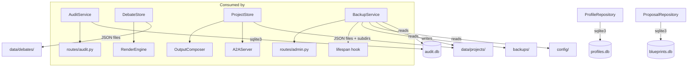

# Persistence Layer

# Persistence Layer

The persistence layer provides storage for all runtime data generated by the Danwa application: debates, projects, audit events, active configurations, and optimization proposals. It also supplies a full backup and restore system for disaster recovery.

The module consists of three distinct store types:

- **SQLite stores** — for append-only audit trails, configuration snapshots, and lightweight relational data  
- **JSON file stores** — for debate and project documents that are read and written as whole objects  
- **ZIP archive service** — for scheduled or on-demand point-in-time backups of the entire data directory

All stores are designed to be thread-safe and idempotent where possible.

---

## Stores

### `AuditService` — `backend/persistence/audit.py`

An append-only event log backed by SQLite. Every debate action, with its full input and output content and SHA-256 hashes, is recorded for reproducibility. No row is ever updated or deleted (the `delete_events` method exists only for debate-scoped cleanup and is not part of the normal append-only contract).

Key methods:

| Method | Purpose |
|---|---|
| `record(event, project_id)` | Insert a single `AuditEvent`. Uses `INSERT OR IGNORE`, so duplicate IDs are silently skipped. |
| `get_events(debate_id)` | All events for a debate, ordered by round and timestamp. |
| `get_events_by_project(project_id, limit, offset)` | Events filtered by project, newest first. |
| `count_events(debate_id)` / `count_events_by_project(project_id)` | Fast counts via SQL. |
| `delete_events(debate_id)` | Remove all events for a debate (returns number of deleted rows). |
| `update_debate_project(debate_id, new_project_id)` | Bulk-assign events to a different project. |

The service creates the `audit_events` table and associated indexes on first use. An online migration adds `input_content`, `output_content`, and `trace_log_path` columns if they are missing (Sprint 3 extension).

### `DebateStore` — `backend/persistence/debate_store.py`

Stores each debate as an individual JSON file in `data/debates/`. An in-memory dictionary (`_cache`) mirrors the on-disk state for fast access; writes go through a `threading.Lock` before persisting to disk.

Key methods:

| Method | Purpose |
|---|---|
| `put(debate_id, debate)` | Store (or overwrite) a debate. Writes immediately to disk. |
| `get(debate_id)` | Return the debate dict, or `None`. |
| `list_all(limit, offset)` | All debates sorted by `created_at` descending. |
| `count()` | Number of cached debates. |
| `delete(debate_id)` | Remove from cache and delete the JSON file. |
| `update(debate_id, **kwargs)` | Update fields in place and persist. |
| `move(debate_id, target_store)` | Transfer a debate to another `DebateStore` (e.g. when moving between projects). |

The store normalises data on load: it converts string `status` fields back to `DebateStatus` enum values and ISO datetime strings to `datetime` objects via `_normalize_debate`.

### `ProjectStore` — `backend/persistence/project_store.py`

Each project is a directory `data/projects/{project_id}/` containing a `project.json` and two sub-directories (`debates/`, `dms/`). A singleton `_default` system project exists for legacy data.

| Method | Purpose |
|---|---|
| `create(name, description, is_system, project_id)` | Persist a new `Project` and create its directory tree. |
| `get(project_id)` | Return a `Project` object or `None`. |
| `list_all()` | All projects sorted by `created_at` descending. |
| `update(project_id, **kwargs)` | Update name, description, or config (as `ProjectConfig` or plain dict). |
| `delete(project_id)` | Remove from cache and `rmtree` the project directory. Refuses to delete system projects. |
| `get_or_create_default()` | Ensure the `_default` project exists (used by migrations). |
| `get_project_dir(project_id)` | Return the filesystem path of a project’s directory. |

### `ProfileRepository` — `backend/repositories/profile_repo.py`

SQLite-backed repository for active debate configurations and their history. Two tables:

- `active_configurations` — one row per active debate, `INSERT OR REPLACE` keyed by `debate_id`
- `configuration_history` — append-only log of every saved configuration

`ActiveConfiguration` objects store the LLM profile ID, agent personas (JSON-serialised list), prompt variant ID, timestamps, and cost estimates.

### `ProposalRepository` — `backend/repositories/proposal_repo.py`

Stores `OptimizationProposal` objects in the `optimization_proposals` table (created by migration v11). Supports filtering by status and target workflow.

| Method | Purpose |
|---|---|
| `save(proposal)` | Insert a new proposal. |
| `get(proposal_id)` | Retrieve by ID. |
| `list_proposals(status, workflow_id, limit, offset)` | Filtered list, newest first. |
| `update_status(proposal_id, status, approved_by, new_version_id)` | Transition state (approve/reject). |

---

## Backup & Restore

### `BackupService` — `backend/persistence/backup.py`

Creates versioned ZIP archives of the projects database, configuration files, and selected data directories. Every backup contains:

- A `metadata.json` with app version, commit hash, timestamp, trigger reason, file list, and DB schema versions
- A `SHA-256SUMS` file with checksums for every archived file (excluding metadata and sums files)
- The actual data files

Key methods:

| Method | Purpose |
|---|---|
| `create_backup(trigger="manual")` | Build a ZIP archive, compute checksums, return a `BackupResult` with metadata. |
| `list_backups()` | Enumerate existing ZIP files and parse their metadata. |
| `get_backup_file_list(backup_id)` | List paths inside a backup without extracting. |
| `verify_backup(backup_id)` | Validate ZIP integrity, re-check SHA-256 of every file, ensure `metadata.json` is valid JSON. |
| `restore(backup_path)` | **Static method.** Extract a backup to the project root. Overwrites existing data; the application must be stopped. |

Exclusion patterns (`.git/`, `__pycache__/`, `logs/`, `.env`, etc.) are applied when walking directories to prevent sensitive or auxiliary files from being archived.

---

## Migration

`backend/migrations/migrate_projects.py` — `migrate_to_projects()`

Called during application startup (see `backend/main.py` `lifespan`). It:

1. Creates the `_default` system project if it does not exist
2. Copies legacy `data/debates/*.json` into `data/projects/_default/debates/`
3. Adds `project_id` columns to `audit_events` (in `audit.db`) and to `active_configurations` / `configuration_history` (in `profiles.db`)

All steps are idempotent — the migration checks for existing columns or files before making changes.

---

## Architecture overview

---

## Thread safety

- `DebateStore` and `ProjectStore` protect cache modifications with `threading.Lock`. All public mutating methods acquire the lock.
- SQLite stores (`AuditService`, `ProfileRepository`, `ProposalRepository`) create a new connection per call. SQLite’s default serialisation ensures safe concurrent reads; writes are isolated per connection.
- `BackupService` is stateless and does not require locking; concurrent backup creation is discouraged but not prevented.

---

## Configuration

The persistence layer reads settings from `backend.core.config.settings`:

| Setting | Default | Used by |
|---|---|---|
| `db_path` | `data/audit.db` | `AuditService` |
| `data_dir` | `data/` | `DebateStore`, `ProjectStore` |
| `backup_dir` | `backups/` | `BackupService` |

Individual stores also accept explicit paths at initialisation (e.g. `AuditService(db_path=Path("..."))`) for testing or custom deployments.

---

## Error handling

- Missing files or directories are logged at `DEBUG` level during backup and store initialisation.
- SQL `INSERT OR IGNORE` silences duplicate key violations in the audit and configuration stores.
- `ProjectStore.delete` refuses to remove a project marked `is_system` and logs a warning.
- `BackupService.restore` refuses to extract files that resolve outside the project root (path-traversal protection).