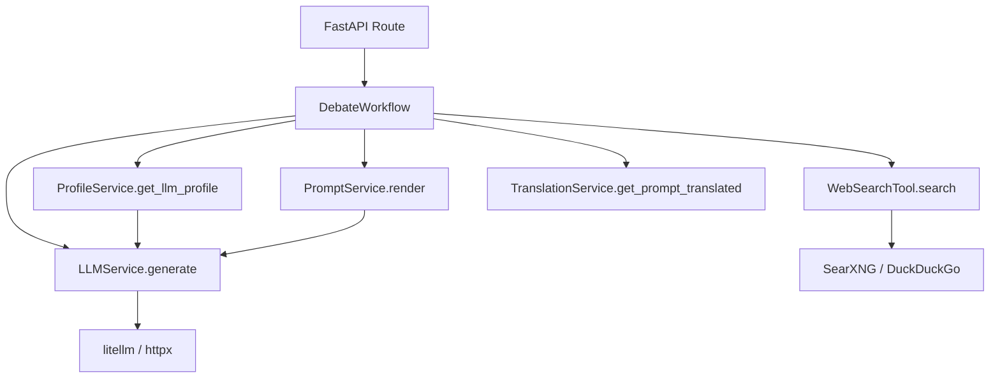

# Services Layer — backend

# Services Layer — Backend

## Overview

The services layer contains the business logic of the debate & argumentation application. It encapsulates interactions with LLMs, management of profiles (LLM providers, agent personas, prompt variants), translation of prompt assets via LLM, web search integration, and orchestration of the debate workflow. Services are consumed primarily by the FastAPI route handlers and by the LangGraph-based workflow engine.

## Architecture & Role

The services layer sits between the **API layer** (`backend.api.routers`) and the **core/data layer** (`backend.core`, `backend.models`). It coordinates calls to external services (OpenRouter, local OpenAI‑compatible endpoints, SearXNG, DuckDuckGo) and manages the application’s profile and translation persistence.

```
API Routers  ──►  Services Layer  ──►  Core Models / Data
                        │
                        ├── External LLMs (litellm, httpx)
                        ├── External Search (SearXNG, DuckDuckGo)
                        └── Local Filesystem (YAML profiles, prompt files, translation DB)
```

## Core Services

### `LLMService` (`backend/services/llm_service.py`)

Central service for generating text from LLMs. Supports both cloud providers (via `litellm.acompletion`) and local OpenAI‑compatible endpoints (via `httpx.AsyncClient`).

- **Initialization:** Takes a `profile_id` and a `ProfileService` instance. On init it fetches the corresponding `LLMProfile`; if no `profile_id` is given it uses the first available profile.
- **Key method:**
  - `generate(prompt, system_prompt=None, temperature=None, max_tokens=None) -> GenerationResult`  
    Dispatches either to `litellm.acompletion` (cloud/provider) or to a direct HTTP POST to `{api_base}/chat/completions` (local provider). Returns a `GenerationResult` containing content, token counts, model, and duration.
- **Helper methods:**
  - `estimate_cost(input_tokens, output_tokens) -> float`  
    Computes cost based on the profile’s `cost_per_1k_input` / `cost_per_1k_output`.
- **Dependencies:** `ProfileService` (to obtain the LLM profile), environment variables for API keys, `litellm` (asynchronous completion), `httpx` (for local calls).

### `ProfileService` (`backend/services/profile_service.py`)

Provides CRUD operations for LLM profiles, agent personas, and prompt variants. Data is stored as YAML files on disk.

- **LLM Profiles:** `list_llm_profiles()`, `get_llm_profile(id)`, `save_llm_profile(profile)`, `delete_llm_profile(id)`  
  Auto‑generates a short hex ID when no `id` is provided on save.
- **Agent Personas:** `list_agent_personas(role=None)`, `get_agent_persona(id)`, `save_agent_persona(persona)`, `delete_agent_persona(id)`
- **Prompt Variants:** `list_prompt_variants()`, `preview_prompt(variant, role)`, `delete_prompt_variant(id)`  
  Variants are sub‑directories under `prompts/`. The `default` variant cannot be deleted (guard in API router).
- **Cost estimation:** `estimate_debate_cost(llm_profile_id, num_agents, num_rounds) -> float`  
  Looks up the LLM profile’s cost rates and approximates total cost.
- **Dependencies:** Filesystem access to the profile directory, `yaml` for reading/writing.

### `PromptService` (`backend/services/prompt_service.py`)

Manages the loading, caching, and rendering of prompt files from the filesystem. Supports a fallback mechanism: if a variant does not contain a prompt for a given role, the default variant is used.

- `get_prompt(variant, role) -> dict` (contains `content` and `hash`)
- `render(variant, role, variables) -> str` – substitutes placeholders (`{variable}`).
- `list_available_roles(variant) -> list[str]`
- `clear_cache()`
- **Caching:** Loaded prompts are cached by variant+role; cache can be cleared programmatically.
- **Dependencies:** `ProfileService` (to list variants), filesystem under `prompts/`.

### `TranslationService` (`backend/services/translation_service.py`)

Handles translation of module prompt files from English to target languages using an LLM, with back‑translation quality assurance. Persists translation entries in an SQLite database.

- **Key public methods:**
  - `import_source_content(module_id, file_path, content) -> bool`  
    Stores source English text in the translation cache.
  - `get_translation(module_id, file_path, target_language) -> TranslationEntry | None`
  - `get_all_translations(module_id) -> list[TranslationEntry]`
  - `approve_translation(module_id, file_path, target_language, approved) -> bool`
  - `invalidate_translation(module_id, file_path=None, target_language=None) -> int`
  - `get_translation_statistics(module_id) -> dict`
  - `translate_module(module_id, target_language, force=False) -> TranslationResult`  
    Orchestrates LLM translation for all source files of a module. Unsupported languages return an error. English returns immediately (no work).
  - `get_prompt_translated(module_id, file_path, target_language, source_content) -> str | None` – on‑demand translation for a single file.
- **Internal helpers:**
  - `_compute_source_hash(content) -> str` (16‑character hex)
  - `_token_overlap_score(a, b) -> float` – fallback similarity metric for back‑translation comparison.
- **Supported languages:** Defined in `SUPPORTED_LANGUAGES` (contains `de`, `fr`, etc; `en` is the source, not a target).
- **Dependencies:** SQLite database at `data/blueprints.db` (or configured path), filesystem access to `modules/`, an LLM profile (via `LLMService`).

### `WebSearchTool` (`backend/services/web_search.py`)

Provides web search capabilities by first attempting SearXNG (a local meta‑search engine) and falling back to DuckDuckGo.

- **Interface:**
  - `search(query) -> list[WebSearchResult]`  
    Calls `_search_searxng()`; if results are empty, falls back to `_search_ddg()`.
  - `is_available() -> bool` – checks SearXNG `/healthz` endpoint.
  - `close()` – closes the underlying HTTP client.
- **Configuration:** URL, `max_results`, `region`, `timeout` are set at construction.
- **Dependencies:** `httpx.AsyncClient`, SearXNG instance (or DuckDuckGo fallback).

### Helper Functions (in `backend/services/web_search.py`)

- `extract_search_queries(text, role, max_queries=3) -> list[str]`  
  Extracts candidate search queries from agent output. For the `moderator` role, filters sentences containing claim‑related keywords.
- `extract_search_markers(content) -> list[str]`  
  Finds `[SEARCH: ...]` markers in agent responses.
- `format_search_results(results, language) -> str`  
  Converts a list of `WebSearchResult` into a human‑readable string (localised heading for “Web Research” / “Web‑Recherche”).

### Workflow Nodes (`backend/workflow/nodes.py`, `backend/workflow/debate_graph.py`)

Although part of the workflow subsystem, these act as service‑like components that are tightly integrated with the services layer.

- `initialize_node`, `run_agent_node`, `check_consensus_node`, `complete_node` – state‑transformation functions for the LangGraph debate state machine.
- `_append_search_instruction(prompt, search_mode, language) -> str`  
  Adds a search‑related instruction to agent prompts based on `SearchMode` (`off`, `optional`, `required`).
- `build_graph() -> CompiledGraph` – constructs the LangGraph with conditional edges (`should_continue_agents`, `should_continue_rounds`).

## Service Interaction Flow

The following diagram shows the typical data flow during a debate execution:



- The route handler calls the workflow with a `DebateRequest`.
- The workflow iterates over agent profiles, renders each agent’s prompt via `PromptService`, and calls `LLMService.generate` (which uses the LLM profile obtained from `ProfileService`).
- If a translation variant is active, `TranslationService.get_prompt_translated` may be called before rendering.
- When the search mode is `required` or `optional`, `WebSearchTool.search` fetches evidence, which is inserted into agent prompts.
- The workflow completes when consensus is reached or the maximum number of rounds is exhausted.

## Usage Patterns

- **Dependency injection:** Services are typically instantiated once per application and injected into route handlers or workflow objects. For example, `LLMService` receives a `ProfileService` instance.
- **Statelessness:** `PromptService` and `TranslationService` maintain an in‑memory cache, but the services are otherwise stateless (state is stored in the filesystem or DB).
- **Async nature:** All I/O‑bound methods (LLM calls, HTTP requests, DB access) are asynchronous; service methods return coroutines.
- **Configuration:** LLM profiles and agent personas are defined as YAML files; the profile directory path is set at `ProfileService` construction.

## Testing Strategy

Tests in `tests/backend/` validate each service in isolation using:

- **Mocking:** `litellm.acompletion` and `httpx.AsyncClient` are mocked to avoid real LLM calls.
- **Temporary filesystems:** `tmp_path` fixtures create isolated directories for profiles, prompts, and translation databases.
- **Minimal state:** Workflow tests use a helper `_make_state()` to construct the debate state dict without hitting the network.
- **Pydantic validation:** Request/response models are tested for correct field constraints (e.g., invalid IDs, missing parameters).