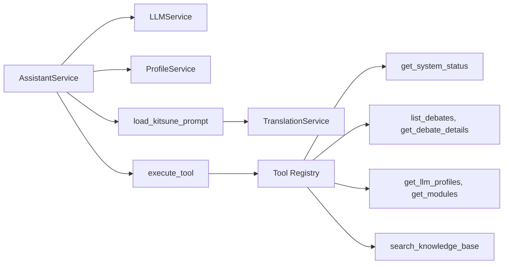
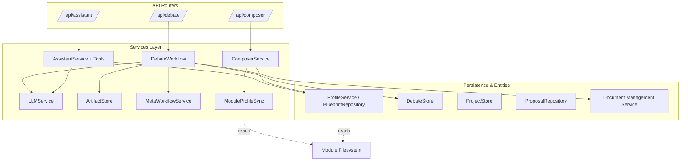

# Services Layer — services

# Services Layer — `backend/services/`

The services layer contains the business logic of the Danwa Debate Engine. It sits between the API routes (`backend/api/routers/`) and the persistence/blueprint layers, encapsulating all domain operations: LLM calls, prompt assembly, debate workflow orchestration, assistant interaction, document parsing, artifact storage, and module–blueprint synchronisation.

Services are stateless or maintain bounded state (e.g., `AssistantService` keeps chat sessions in memory). They depend on each other through explicit constructors (dependency injection via `ProfileService`, `BlueprintRepository`, etc.) and never import API routers directly.

---

## Core Services

### `LLMService` – LLM invocation with profile-based routing

`LLMService` is the single entry point for all LLM calls. It selects a profile, builds messages, and routes the request to the correct backend.

```python
# Profile attributes control the route:
#   provider = "openrouter"|"openai"|"anthropic"  →  litellm
#   provider = "ollama"|"local"|"opencode-*"      →  direct HTTP (OpenAI-compatible)
#   provider = "cloudflare"                        →  Workers AI API
#   protocol = "a2a"                              →  A2A protocol adapter
```

- **`generate(prompt, system_prompt, temperature, max_tokens, tools)`** – async call with optional function‑calling tools.
- **`generate_with_fallback(prompt, ...)`** – retries on `A2AError` using a configured fallback profile.
- **`generate_sync(prompt, ...)`** – synchronous wrapper that runs the async loop in a dedicated thread.
- **`estimate_cost(input_tokens, output_tokens)`** – returns USD estimate from the profile’s cost metadata.

**Dependencies:** `ProfileService` (to fetch `LLMProfile` objects).  
**Used by:** `AssistantService`, `debate_workflow`, `ComposerService` (indirectly through workflow), and background tasks.

**Routing detail:**  
- Cloud providers → `_generate_litellm` (uses `litellm.acompletion`).  
- Local providers → `_generate_local` (direct `httpx` call to `/v1/chat/completions`).  
- Cloudflare → `_generate_cloudflare` (Workers AI API).  
- A2A → `_generate_a2a` (A2A adapter).  

All methods return a `GenerationResult` dataclass with `content`, `tool_calls`, token usage, duration, and model name.

---

### `ComposerService` – Modular prompt assembly

`ComposerService` builds the final system prompt for an agent by concatenating four independent components:

| Component         | Files act as                                    | Loaded from                          |
|-------------------|-------------------------------------------------|--------------------------------------|
| Agent Core        | *“What you are”* – functional role definition   | `ProfileService.get_agent_persona()` |
| Arg. Pattern      | *“How you argue”* – argumentation methodology   | Module profiles via `ModuleProfileSync` |
| Tone Profile      | *“Your style”* – communication & emotionality   | Module profiles or DB `ToneProfile`  |
| Prompt Modifier   | *“Presentation”* – output formatting            | Module profiles via `ModuleProfileSync` |

- **`compose(composition: Composition) -> str`** – assembles the prompt with section headers.
- **Static listing methods** – `list_agent_cores()`, `list_argumentation_patterns()`, `list_tone_profiles()`, `list_prompt_modifiers()` – used by the frontend to populate dropdowns.

**Dependencies:** `ProfileService`, loaders from `module_profile_sync`.  
**Used by:** Debate workflow when initialising agent prompts.

---

### `AssistantService` & `assistant_tools` – Danwa Kitsune chat

The Danwa assistant provides a conversational interface to the system. It is powered by an LLM that receives a system prompt from `config/prompts/kitsune/kitsune.md` (with on‑demand translation via `TranslationService`) and can call registered **tools** to query live system state.



Key types:
- **`ChatSession`** – in‑memory chat session with message history.
- **`ChatMessage`** – single message (user, assistant, or tool).
- **`AssistantService`** – manages sessions, LLM profile selection, and the tool‑execution loop.

**Tool execution protocol:**  
1. User sends a message → LLM may respond with `tool_calls`.  
2. Each tool is executed via `execute_tool(name, arguments, **ctx)`.  
3. Tool results are injected as new messages with `role="tool"`.  
4. The loop repeats until the LLM produces a text answer (max 5 iterations).

Tool functions are registered with the `@tool(name, description, parameters)` decorator and must be async. All tools are **read‑only** in Phase 1.

**Dependencies:** `LLMService`, `ProfileService`, `BlueprintRepository`, `DebateStore`, `ModuleService` (optional).  
**Used by:** The `/api/assistant/` router.

---

### Debate Workflow Services – `debate_workflow`, `artifact_store`

`debate_workflow` contains the core orchestration logic extracted from the debate router. It handles:

- **Title generation** – `generate_debate_title()` calls the utility LLM with strict formatting rules.
- **RAG context resolution** – `resolve_rag_context()` combines document chunks, auto‑retrieved content, and previous debate results.
- **Agent profile building** – `build_agent_profile_from_bundles()` resolves `AgentBundle` IDs to concrete configurations.
- **LangGraph execution** – `run_debate_workflow()` builds the initial state, selects the appropriate graph (standard, A2A, or HITL), invokes it, processes the result, and saves a `DebateArtifact`.
- **Follow‑up & fork support** – `build_followup_case()`, `create_fork_debate()`, `on_debate_completed()` enable chaining debates.

`ArtifactStore` persists the `DebateArtifact` produced at workflow completion to an SQLite table (`debate_artifacts`). It provides `save()`, `get()`, `delete()`, `exists()`.

**Dependencies:** `LLMService`, `ProfileService`, `BlueprintRepository`, `DebateStore`, `ProjectStore`, `ArtifactStore`, `Document Management Service` (DMS).  
**Used by:** The `/api/debate/` router (as background tasks).

---

### `DocumentParser` – Text extraction from uploaded files

A simple async wrapper around synchronous parsing libraries:

| Extension | Library             |
|-----------|---------------------|
| `.pdf`    | `pdfplumber` / `pypdf` |
| `.docx`   | `python-docx`       |
| `.odt`    | `odfpy`             |
| `.txt`    | `pathlib.read_text` |

Enforces a `MAX_CONTEXT_CHARS = 25000` limit to protect against context overflow in later stages. Returns a dict with `text` and `metadata` (pages, word count, truncation flag).

**Used by:** The debate creation flow when the user upload a document.

---

### `MetaWorkflowService` – Optimization proposal stub

Placeholder for a future reflection engine. For now `generate_proposal()` validates the target workflow and creates an `OptimizationProposal` with static placeholder text.

**Dependencies:** `BlueprintRepository`, `ProposalRepository`.  
**Used by:** The meta‑workflow API (not yet wired).

---

### `ModuleProfileSync` – Bridge between modules and DB entities

This module provides list‑time functions that read enabled module profiles from the filesystem and merge them with database records. All module‑sourced entries are marked with `_source_module` and `_readonly=True`.

Key functions (used across `ComposerService`, `BlueprintRepository`):

- `get_agent_personas_from_modules()`
- `get_argumentation_patterns_from_modules()`
- `get_tone_profiles_from_modules()`
- `get_prompt_modifiers_from_modules()`
- `get_role_types_from_modules()`
- `get_workflow_templates_from_modules()`

Internal helpers `_get_enabled_modules()`, `_read_module_profile()`, `_derive_profile_format()`, `_mark_readonly()`, `_localized()` handle the low‑level file traversal and parsing.

**Dependencies:** The `modules/` directory structure, `ModuleType` enum, `derive_module_type`.  
**Used by:** `ComposerService`, `BlueprintRepository` (implicitly), import commands.

---

## Other Services (Referenced)

These services are part of the layer but not shown in the provided source excerpt:

| Service                | Responsibility                                                                    |
|------------------------|-----------------------------------------------------------------------------------|
| `ProfileService`       | CRUD for LLM profiles, agent personas, tone profiles. Backed by `BlueprintRepository` + file watcher. |
| `TranslationService`   | On‑demand translation of prompts and UI strings. Caches in `blueprints.db`.       |
| `RenderEngine`         | Converts `DebateArtifact` to final output (DOCX/PDF). Uses `RenderJobStore` to track jobs. |
| `RenderJobStore`       | SQLite store for render‑job state.                                                |
| `STTService`           | Speech‑to‑text for audio input in the assistant.                                  |
| `WebSearch`            | Extracts search queries from agent output, calls SearXNG or DuckDuckGo as fallback. |
| `TonePromptInjector`   | Formats a structured `ToneProfile` into natural‑language style instructions.      |

---

## Key Architectural Patterns

### 1. Profile‑Based LLM Routing
Every LLM call goes through `LLMService`, which inspects `LLMProfile.provider` and `profile.protocol` to decide the transport. This decouples the service from provider‑specific SDKs and makes adding a new provider a matter of adding a routing case.

### 2. Tool Registration (Assistant)
The `@tool` decorator in `assistant_tools.py` populates a global registry `TOOL_REGISTRY`. The LLM receives the definitions via the `tools` parameter; when it calls a tool, `execute_tool()` looks up the function and calls it with the supplied arguments and a context dict of service instances. This pattern makes it trivial to add new capabilities without modifying the LLM loop.

### 3. Read‑Only Module Sync
`ModuleProfileSync` avoids duplicating file‑based data into the database by reading profiles at list time. This keeps the filesystem as the single source of truth for module‑provided entities while still allowing DB‑only overrides.

### 4. Separate Orchestration from HTTP
`debate_workflow.py` extracts all business logic from the `debate` router. The router only parses the request, calls the workflow, and returns a `202 Accepted`. This separation allows the workflow to be tested independently and reused by other entry points (e.g., CLI or webhooks).

---

## Integration with Other Layers



The services layer depends on …

- … **persistence objects** (`DebateStore`, `ProjectStore`, `BlueprintRepository`, `ProposalRepository`, `DocumentStore`) for data access.
- … the **module filesystem** (`modules/`) via `ModuleProfileSync`.
- … external **LLM providers** through `LLMService`.

The API routers construct service instances with the required dependencies (often via `ProfileService` as the central entry point) and call their methods. Services never import routers – they remain focused on domain logic.