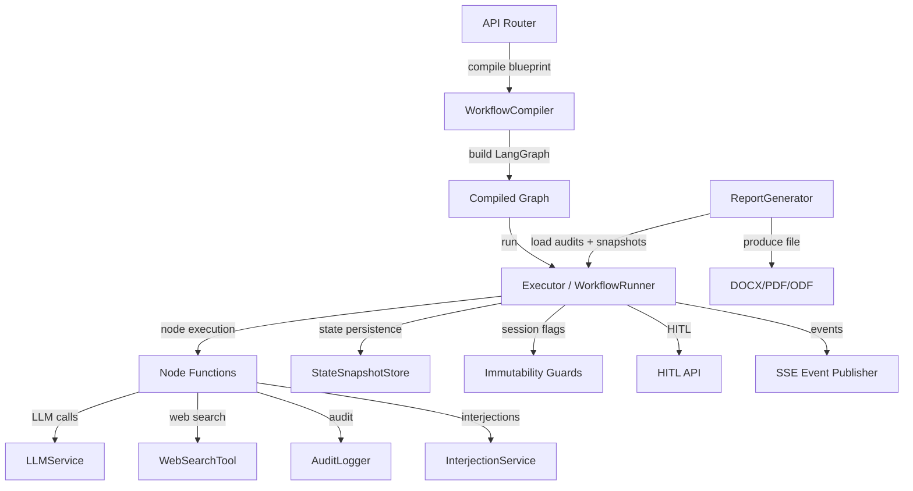

# Workflow Engine — workflow

# Workflow Engine — `workflow` Module

## Module Overview

The `backend.workflow` package implements the runtime execution engine for multi-agent debate and analysis workflows. It orchestrates a LangGraph state machine that sequences LLM-powered agent nodes, handles human-in-the-loop (HITL) interjections, records an immutable audit trail, and generates structured reports from completed sessions.

Workflows are defined declaratively via blueprints (see `backend.blueprints`) and compiled into executable LangGraph instances by the `WorkflowCompiler`. The engine supports:

- **Multi-agent rounds** with configurable roles, LLM profiles, and prompt templates.
- **Web search integration** in required (auto-inject) or optional (marker-based) modes.
- **Human‑in‑the‑loop** via interjection queues and HITL interrupt/resume flows.
- **Immutable audit logging** with full input/output content and SHA‑256 hashes.
- **Session lifecycle management** (pause, resume, cancel, archive) with concurrency guards.
- **State snapshots** for replay and debugging.
- **Report generation** in DOCX, PDF, and ODF formats.

---

## Architecture

The core data flow: a workflow request arrives via an API router, the blueprint is compiled into a LangGraph, the graph is executed node by node with state passing, and each step is audited, persisted, and streamed via SSE events.

---

## Key Components

### 1. State Management

**`WorkflowState`** (defined in `workflow_state.py`) is a mutable dict that flows through the LangGraph. It carries:

- `context`: the initial user case text.
- `current_draft`: accumulated agent output.
- `node_outputs`: list of per-node outputs.
- `current_round`, `max_rounds`, `threshold`: round control.
- `interjection_queue`: pending user inputs.
- `tone_profiles`, `rag_context`, `search_mode`, `language`: configuration.
- `is_paused`, `hitl_enabled`, etc.: runtime flags.

`DebateState` (legacy) is a subclass used by `debate_graph.py` — deprecated.

### 2. Graph Compilation & Execution

**`WorkflowCompiler`** (`workflow_compiler.py`) takes a blueprint (list of nodes and edges) and produces a compiled `StateGraph` by:

1. Resolving agent configurations from `AgentBundle` definitions.
2. Calling `_create_node_function` to generate async callables for each node type.
3. Building conditional edges via `route_conditional`.
4. Delegating cycle detection and topological sort to `backend.blueprints.compiler`.

The compilation process is invoked from API endpoints (`start_workflow`, `launch_workflow_from_input`) and is the recommended way to create workflows.

### 3. Node Functions

Node functions are the atomic execution units. They are created by factory functions in `node_functions.py`:

- **`agent_node_factory()`** — wraps an LLM call via `LLMService.generate()`. Resolves system prompts via the layered assembly pipeline (bundle prompt → argumentation pattern → tone profile injection → web search instructions). Injects interjections from the `InterjectionService` queue. Publishes SSE events for `node.start`, `node.complete`, and `llm.call_started`. Logs to `AuditLogger`.

- **`moderator_node_factory()`** — extends the agent node with consensus calculation and round management.

- **`gate_node_factory()`** — evaluates a condition expression (used for branching).

- **`tone_profile_node_factory()`** — loads a `ToneProfile` and writes it into `state["tone_profiles"]` for downstream agent nodes.

- **`interjection_node()`** — consumes the pending interjection queue or sets `is_paused=True` if empty.

- **`input_node`, `initialize_wf_node`, `complete_wf_node`** — simple lifecycle nodes.

The older `nodes.py` module contains complementary functions (e.g., `run_agent_node`, `check_consensus_node`) used by the legacy debate graph.

### 4. Audit Trail

**`AuditLogger`** (`audit_logger.py`) provides an append-only log of workflow events in the `audit_log` table (created by migration v6). Key methods:

- `log_node_execution()` — records full input/output content, SHA‑256 hashes, latency, token usage.
- `log_node_started()`, `log_node_failed()` — lifecycle events.
- `log_interjection()` — user interjection content.
- `log_workflow_event()` — generic lifecycle events.
- `get_audit_log_for_replay()` — returns all entries for a session ordered by timestamp.

A module-level singleton (`get_audit_logger()`) is used throughout the engine. An `audit_decorator` can wrap async node functions to automate event logging.

### 5. Interjection Service

**`InterjectionService`** (`interjection.py`) maintains in-memory, per-session queues of user inputs. Thread-safe via `asyncio.Lock`. API endpoints call `submit()`; workflow nodes call `consume()` to drain pending entries. The module-level `interjection_service` singleton is shared across the application.

### 6. Session Immutability

**`immutability.py`** provides guard functions that enforce session locking and archival:

- `guard_locked()` — raises HTTP 403 if `is_locked` is set.
- `guard_not_archived()` — raises HTTP 404 if `is_archived` is set.
- `guard_mutable()` — combines both.
- `lock_session()`, `archive_session()`, `restore_session()` — mutation utilities.

These are called by mutation endpoints (interject, pause, resume, cancel) to prevent modification of completed or deleted sessions.

### 7. State Snapshots

**`StateSnapshotStore`** (`state_snapshot.py`) persists runtime state to the `state_snapshots` table at each node execution. Supports `save()`, `get_latest()`, and `get_history()`. Used by report generation and debugging.

### 8. Report Generator

**`WorkflowReportGenerator`** (`report_generator.py`) produces structured reports from completed sessions. It loads audit entries and state snapshots, builds a transcript (including per-round agent outputs), and renders to DOCX, PDF, or ODF via `python-docx` and `WeasyPrint`.

Special handling for MVP debates: if the `debate_data` lacks a `rounds` key, it reconstructs rounds from `node_outputs` in the latest snapshot using `_build_mvp_rounds_from_snapshot()`.

### 9. Routing

**`workflow_routers.py`** (referenced but not fully shown) contains `route_conditional()` which produces the LangGraph conditional edge for gate nodes. It evaluates the condition expression against the current state and returns the target node ID.

### 10. HITL Integration

The `workflow.hitl` sub-package (referenced as `workflow/hitl/`) provides:

- `nodes.py`: `extension_request_node`, `hitl_check_node`, `hitl_agent_query_node`.
- `api.py`: `respond_to_query`, `inject_context`, `pause_debate`, `request_extension`, `extension_decision`, `get_hitl_status`, `list_interactions`.
- `agent_query.py`: `analyze_for_query`, `_detect_loop`.
- `round_manager.py`: `get_pending_context`.
- `security.py`: `scan_for_injection`.

This sub-package manages the human-in-the-loop flow: pausing for user input, routing queries, and resuming.

---

## Execution Flows

### Launching a Workflow

1. API endpoint (`start_workflow` / `launch_workflow_from_input`) receives a blueprint ID and optional parameters.
2. `compile_to_langgraph()` (in `backend.blueprints.compiler`) validates the graph structure and returns a serializable graph description.
3. `WorkflowCompiler.compile()` resolves each node’s configuration, creates node functions, builds the LangGraph `StateGraph`, and returns a compiled instance.
4. `WorkflowRunner.run_workflow_background()` executes the graph asynchronously, pumping the state through each node and handling pause/resume events.

### Node Execution Cycle

For a typical agent node:

1. SSE event `node.start` is published.
2. System prompt is resolved: bundle prompt → argumentation pattern → tone profile injection → web search instructions.
3. User prompt is built from context, draft, RAG context, and pending interjections.
4. If `search_mode == "required"`, auto-search queries are executed and results appended to the user prompt.
5. `LLMService.generate()` is called.
6. If `search_mode == "optional"`, the response is scanned for `[SEARCH: ...]` markers, each fulfilled and appended.
7. SSE events (`llm.call_started`, `node.complete`) are published.
8. `AuditLogger` records the execution with full input/output and hashes.
9. The state is updated with the new output, draft, and token counts.

### HITL Pause/Resume

1. An interjection or HITL pause is triggered, setting `is_paused=True`.
2. The executor stops processing nodes and awaits a resume signal.
3. The user submits input via the interjection API, which enqueues an `Interjection`.
4. The resume endpoint clears the pause event, and the executor continues, consuming the interjection at the next interjection node.

---

## Integration Points

| Module / Service | Connection |
|------------------|------------|
| `backend.api.events` | `publish_async()` for SSE streaming |
| `backend.services.llm_service` | `LLMService.generate()` |
| `backend.services.profile_service` | `ProfileService` for LLM profiles, agent personas |
| `backend.services.prompt_service` | `PromptService.assemble_prompt()`, `.render()` |
| `backend.services.web_search` | `WebSearchTool`, query extraction, result formatting |
| `backend.blueprints` | `AgentBundle`, `ToneProfile`, blueprint compilation |
| `backend.persistence.debate_store` | Session state persistence (get/put) |
| `backend.persistence.project_store` | Project directories for custom prompts |
| `backend.api.deps` | `get_debate_store_for_project()` |
| API routers | `workflow_exec.py`, `input_composer.py`, `workflow_reports.py` |

---

## Configuration & Extensibility

Workflows are defined in **blueprints** — YAML or Python data structures specifying nodes (types, roles, LLM profiles, prompt templates) and edges (sequences, conditionals, interjection points). The `WorkflowCompiler` resolves each node’s configuration at compile time, consulting the `ProfileService` for LLM profiles and the `PromptService` for language-aware prompt templates.

New node types can be added by creating a node factory function in `node_functions.py` and registering it in `_create_node_function`. Tone profiles are injected via a dedicated node or resolved inline.

---

## Concurrency & State Safety

- **Interjection service** uses `asyncio.Lock` per session — safe for concurrent API and node access.
- **AuditLogger** opens a new SQLite connection per write — thread-safe by design.
- **State snapshots** also use a fresh connection per operation.
- **Immutability guards** lock sessions at completion/failure to prevent mutations.
- The in-memory `InterjectionService` is the single source of truth for pending interjections; it is not persisted across restarts.

---

## Security Considerations

- `guard_locked()` and `guard_not_archived()` prevent modification of completed or deleted sessions.
- `scan_for_injection()` (in HITL security) validates user input before injection.
- The audit log is append-only — rows are never modified, ensuring an immutable record.
- `archive_session()` soft-deletes sessions; `restore_session()` re-enables them.
- Session IDs are UUIDs; no sensitive data is exposed in path parameters.

---

## Testing

Tests (visible in the call graph) cover:

- **Workflow compilation**: valid graphs, cycle detection, missing entry points, gate nodes.
- **State snapshots**: save, get_latest, history ordering.
- **Execution API**: pause, resume, cancel, state queries.
- **Debate graph**: full cycle runs, max round enforcement.

Tests use the module-level singletons (which can be reset via `reset_audit_logger()`) and in-memory SQLite for isolation.