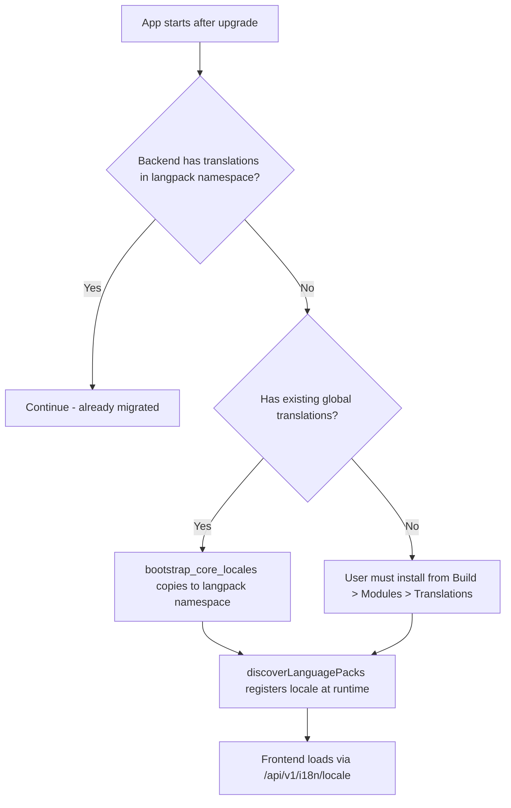
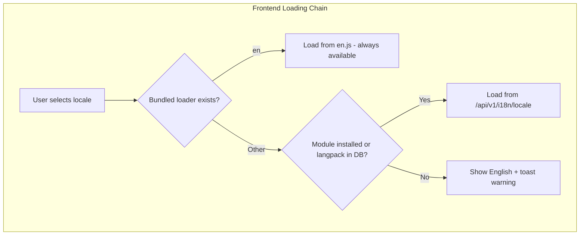

# Plan: Migrate Core Languages to Language-Pack Modules

**Date:** 2026-06-03  
**Status:** Draft — pending review  
**Goal:** Make all non-English UI languages optional language-pack modules. English remains the only bundled system language (SSOT).

---

## Current Architecture

### Frontend i18n
| File | Role |
|------|------|
| [`config.js`](frontend/src/lib/i18n/config.js) | `SUPPORTED_LOCALES` (14 langs), `DEFAULT_LOCALE = 'de'`, `LOCALE_NAMES`, `PLURAL_TAGS`, `RTL_LOCALES` |
| [`index.js`](frontend/src/lib/i18n/index.js) | 3-level fallback: locale → en → key. Eagerly imports `de.js` + `en.js`. `discoverLanguagePacks()` registers custom locales from modules. |
| [`loaders/*.js`](frontend/src/lib/i18n/loaders/) | 14 static JS files (~800–912 keys each). Auto-generated, not human-edited. |

### Backend i18n
| File | Role |
|------|------|
| [`ui_translation_service.py`](backend/services/ui_translation_service.py:90) | `DEFAULT_LOCALES` (12 langs). DB-backed (`ui_translations.db`). `_scan_bundled_loaders()` reads frontend loader files as fallback. `resolve()` fallback: locale → de → en → key. |
| [`ui_i18n.py`](backend/api/routers/ui_i18n.py) | REST API: `/locales`, `/{locale}`, `/export-as-pack`, bulk translate, etc. |
| [`installer.py`](backend/modules/installer.py:158) | `_register_ui_strings_in_db()` — installs language-pack modules into `ui_translations.db` with `namespace='langpack:{module_id}'`. |
| [`nodes.py`](backend/workflow/nodes.py:499) | `_LANGUAGE_INSTRUCTIONS` — per-locale debate language directives (e.g. "You MUST respond in German"). NOT UI strings. |

### Module System
| File | Role |
|------|------|
| [`models.py`](backend/modules/models.py:140) | `LanguagePackData` model: locale, source_locale, key_count, coverage, ui_strings_file. |
| [`type_derivation.py`](backend/modules/type_derivation.py:17) | `"ui-translations" → ModuleType.LANGUAGE_PACK` |
| Module manifest | `type: "language-pack"`, `category: "translations"`, `language: "de"`, `profile_file: "ui_strings.json"` |

### Existing Language Packs in danwa-modules repo
Custom locale packs already exist as modules (e.g. `lang-xx-custom`). The infrastructure for installing and loading language-pack modules is fully functional.

---

## Target Architecture

```
Core (bundled, always present):
  └── en.js  (SSOT, ~912 keys)

Optional (installable as modules):
  ├── lang-de  (Deutsch)
  ├── lang-fr  (Français)
  ├── lang-es  (Español)
  ├── lang-it  (Italiano)
  ├── lang-pt  (Português)
  ├── lang-ru  (Русский)
  ├── lang-zh  (中文)
  ├── lang-ja  (日本語)
  ├── lang-ko  (한국어)
  ├── lang-sv  (Svenska)
  ├── lang-el  (Ελληνικά)
  ├── lang-ar  (العربية)
  └── lang-he  (עברית)
```

English is always loaded from the bundled `en.js`. All other languages are loaded via the module system (`discoverLanguagePacks()` + backend `/api/v1/i18n/{locale}`).

---

## Changes Required

### Phase 1: Backend Bootstrap — Migrate Existing Translations to langpack Namespace

Language-pack modules already exist in the `danwa-modules` repo (per `schemas/module-manifest.json`). No new modules need to be created or published.

**Goal:** Ensure that existing translations in `ui_translations.db` are registered under `namespace='langpack:lang-{locale}'` — equivalent to a module installation via `install_from_repo()`.

#### 1a. Bootstrap on Startup

Add a one-time migration method to [`UITranslationService`](backend/services/ui_translation_service.py:146):

```python
def bootstrap_core_locales(self) -> dict[str, int]:
    """Migrate existing core translations to langpack namespace.

    For each non-English core locale that has translations under
    namespace='global', copy them to namespace='langpack:lang-{locale}'.
    This makes them equivalent to a module installation.

    Returns: {locale: count_of_migrated_keys}
    """
```

- Called once on first startup after upgrade (detect via a `schema_version` flag in DB or a migration marker).
- Scans `ui_translations.db` for locales under `namespace='global'` that match core locales (de, fr, es, it, pt, ru, zh, ja, ko, sv, el, ar, he).
- For each matching locale, copies translations to `namespace='langpack:lang-{locale}'`.
- Skips locales that already have `langpack:` entries (idempotent).
- Returns a summary dict for logging.

#### 1b. Fallback for Clean Installs

If `ui_translations.db` has NO existing translations for a core locale (fresh install, no prior bulk-translate), the user must install the language pack from **Build → Modules → Translations**. The frontend toast (Phase 4) directs them there.

#### 1c. Module Manifest Compliance

All `langpack:lang-{locale}` entries must follow [`schemas/module-manifest.json`](schemas/module-manifest.json):
- `type: "language-pack"`
- `category: "translations"`
- `language: "{locale}"`
- `profile_file: "ui_strings.json"`

### Phase 2: Frontend Changes

#### 2a. `frontend/src/lib/i18n/config.js`
```diff
- export const SUPPORTED_LOCALES = ['de', 'en', 'fr', 'es', 'it', 'pt', 'ru', 'zh', 'ja', 'ko', 'sv', 'el', 'ar', 'he'];
- export const DEFAULT_LOCALE = 'de';
+ export const SUPPORTED_LOCALES = ['en'];
+ export const DEFAULT_LOCALE = 'en';
```
- Keep `LOCALE_NAMES`, `RTL_LOCALES` — they're needed for `LanguageSwitcher`, `discoverLanguagePacks()`, and `Intl` formatters.
- **Remove `PLURAL_TAGS`** — dead code. The `tn()` function uses `Intl.PluralRules` (browser-native) which handles ALL locales automatically.
- Keep `customLocales`, `registerCustomLocale()`, `getLocaleName()`, `getAllLocales()` — unchanged.

#### 2b. `frontend/src/lib/i18n/index.js`
```diff
- import defaultDict from './loaders/de.js';
- import enDict from './loaders/en.js';
+ import enDict from './loaders/en.js';
  // ...
- translations.set('de', defaultDict);
- translations.set('en', enDict);
+ translations.set('en', enDict);
```
- Remove eager import of `de.js`.
- In `setLocale()`: change `SUPPORTED_LOCALES.includes(lang)` check — non-English locales are now treated as custom/module locales, loaded via `discoverLanguagePacks()`.
- In `t()`: fallback chain stays: `currentLocale → en → key`. (Currently `currentLocale → en → key` already.)
- In `loadLocale()`: bundled static loader is tried first (only `en.js` exists), then HTTP backend.

#### 2c. `frontend/src/lib/i18n/loaders/`
- **Delete** all non-English loaders: `de.js`, `fr.js`, `es.js`, `it.js`, `pt.js`, `ru.js`, `zh.js`, `ja.js`, `ko.js`, `sv.js`, `el.js`, `ar.js`, `he.js`
- **Keep** only `en.js`.

#### 2d. `frontend/src/lib/i18n/config.js` — `LOCALE_NAMES`
- Keep `LOCALE_NAMES` — needed for `LanguageSwitcher` dropdown labels and `discoverLanguagePacks()` name resolution.
- `RTL_LOCALES` — needed for HTML `dir` attribute.

### Phase 3: Backend Changes

#### 3a. `backend/services/ui_translation_service.py`
```diff
- DEFAULT_LOCALES = ["de", "en", "fr", "es", "it", "pt", "ru", "zh", "ja", "ko", "sv", "el"]
+ DEFAULT_LOCALES = ["en"]
```
- Keep `LOCALE_NAMES`, `RTL_LOCALES` — same reason as frontend.
- `_scan_bundled_loaders()`: still scans `frontend/src/lib/i18n/loaders/` — will only find `en.js` now.
- `resolve()` fallback: change from `locale → de → en → key` to `locale → en → key`. Remove `de` from the fallback chain.
- `resolve_bulk()`: same — remove `de` fallback step.
- `bulk_translate()` default target_locales: change from `[loc for loc in DEFAULT_LOCALES if loc not in ("de", "en")]` to dynamically discover installed language-pack locales.
- `bulk_translate_async()`: same change.
- `get_translation_stats()`: dynamically discover all locales (DB + language-pack modules + bundled `en`).

#### 3b. `backend/api/routers/ui_i18n.py`
- `get_supported_locales()`: dynamically build locale list from:
  1. `DEFAULT_LOCALES` (just `en`)
  2. Language-pack modules installed (from `ui_translations.db` with `namespace LIKE 'langpack:%'`)
  3. Custom registered locales
- `get_translations()`: already merges `langpack:*` namespaces — no change needed.

#### 3c. `backend/modules/installer.py`
- `_register_ui_strings_in_db()`: already functional for language-pack modules — no change needed.

#### 3d. `backend/workflow/nodes.py` — `_LANGUAGE_INSTRUCTIONS`
- **Keep as-is.** These are debate-level language directives ("You MUST respond in German"), not UI strings. They're used by the debate engine to instruct LLMs. They should remain bundled since they're part of the core debate engine logic.
- Fallback to English is already implemented: `_LANGUAGE_INSTRUCTIONS.get(language, _LANGUAGE_INSTRUCTIONS["en"])`.

### Phase 4: Migration & First-Run Experience

#### 4a. Auto-Install on Upgrade
When a user upgrades from a version with bundled languages to the new version:
- Their `localStorage.locale` may be set to `de` (or another non-English language).
- On first load, `setLocale('de')` will be called.
- `discoverLanguagePacks()` runs on app startup — if `lang-de` module is installed, it registers `de` as a custom locale.
- If `lang-de` is NOT installed, the user sees English with a one-time toast: *"German UI is not installed. Install the 'lang-de' language pack from Build → Modules → Translations, or switch to English."*

#### 4b. Backend Bootstrap
- On first startup after upgrade, if `ui_translations.db` has existing German strings (from previous bulk-translate runs), they remain in the DB — no data loss.
- The backend `/api/v1/i18n/de` endpoint still returns translations from DB (if they exist) + language-pack namespaces.
- The frontend HTTP fallback in `loadLocale()` will fetch from the backend, so even without the module installed, previously translated strings still work via the backend.

### Phase 5: Cleanup

- Remove `_scan_bundled_loaders()` dependency for non-English locales in `ui_translation_service.py`.
- Update Translation Dashboard: all languages now appear as modules in the "Translations" tab.
- Update the `/locales` endpoint to reflect the new architecture.

### Phase 6: PLURAL_TAGS Cleanup

**Finding:** `PLURAL_TAGS` in both `config.js` (frontend) and `ui_translation_service.py` (backend) is effectively dead code:
- **Frontend:** Never imported or used anywhere. The `tn()` function uses `Intl.PluralRules` (browser-native) which handles ALL locales automatically.
- **Backend:** Used only by the `/locales` endpoint to return `plural_tags` metadata, but the frontend never consumes this field.

**Action:**
1. **Frontend `config.js`**: Remove `PLURAL_TAGS` entirely.
2. **Backend `ui_translation_service.py`**: Keep `PLURAL_TAGS` as a broad static dict (it's small metadata), but add fallback `['one', 'other']` for unknown locales in the `/locales` endpoint. No need to bundle plural rules with modules.

---

## Mermaid: Migration Flow





---

## Risk Assessment

| Risk | Impact | Mitigation |
|------|--------|------------|
| Users with `locale=de` lose UI language on upgrade | Medium | Backend bootstrap copies existing translations to langpack namespace. Toast directs to install module for clean installs. |
| Clean install with no prior translations | Low | User installs language pack from Build → Modules → Translations. English always works as fallback. |
| `_scan_bundled_loaders()` breaks for non-English | Low | Only `en.js` remains — function still works, just returns only `en`. |
| Debate language instructions lost | None | `_LANGUAGE_INSTRUCTIONS` stays bundled — not UI strings. |
| `PLURAL_TAGS` incomplete for module locales | None | Removed from frontend (dead code — `Intl.PluralRules` handles all locales). Backend keeps as read-only metadata with `['one','other']` fallback. |

---

## Open Questions

1. **`DEFAULT_LOCALE = 'en'`** — confirmed. New users see English by default.
2. **Existing translations in DB** → migrated to `langpack:lang-{locale}` namespace via bootstrap. No data loss.
3. **`PLURAL_TAGS`** — dead code. Frontend uses `Intl.PluralRules` natively. Removed from `config.js` (Phase 6). Backend keeps as read-only metadata with `['one','other']` fallback for unknown locales.
4. **danwa-modules repo** — language-pack modules already exist. No creation or publishing needed.
