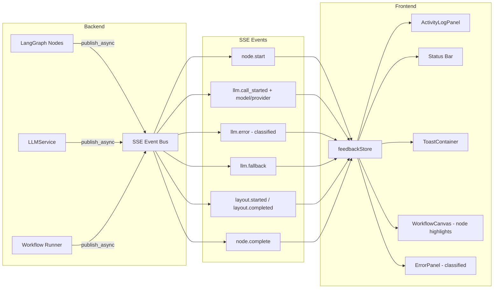
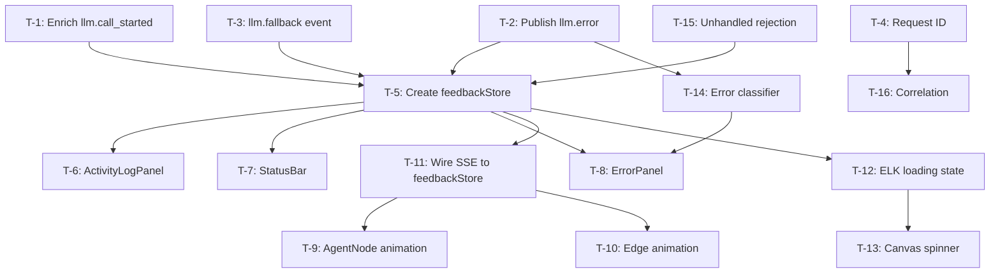

# Unified Feedback System — Implementation Plan

**Date:** 2026-06-08
**Status:** Draft

---

## 1. Gap Analysis — What Already Exists vs What's Missing

### Already Implemented
| Component | Status | Location |
|-----------|--------|----------|
| SSE event bus | ✅ | `backend/api/events.py` |
| Workflow SSE endpoint `/{session_id}/stream` | ✅ | `backend/api/routers/workflow_exec.py` |
| `workflow.started`, `workflow.complete`, `workflow.cancelled` events | ✅ | `workflow_runner.py` |
| `node.start`, `node.complete`, `llm.call_started` events | ✅ | `nodes/agent_nodes.py` |
| SSE client with reconnection | ✅ | `frontend/src/lib/sse.js`, `workflowSSE.js` |
| Toast notification system | ✅ | `stores.js:toasts`, `ToastContainer.svelte` |
| Runtime reducer (active node tracking) | ✅ | `workflow/runtimeReducer.js` |
| Activity strip with dots/timer/tokens | ✅ | `DebateActivityStrip.svelte` |
| Workflow store with `runtimeActiveNodeId` | ✅ | `workflow/store.svelte.js` |
| HITL events | ✅ | Full HITL event chain |

### Gaps Identified

| # | Gap | Severity | Current Behavior |
|---|-----|----------|------------------|
| G-1 | `llm.call_started` missing model/provider name | High | Only sends `llm_profile_id`; frontend can't display "Calling GPT-4o…" |
| G-2 | LLM errors not published as SSE events | High | Caught silently in agent_nodes, sets content to error string, no frontend notification |
| G-3 | No error classification | High | All errors show as generic text; no distinction between rate limit / timeout / content filter / network |
| G-4 | ELK.js has no loading/error feedback | Medium | `runLayout()` is async but no spinner, no error message, no "graph too complex" handling |
| G-5 | Workflow canvas has no execution animation | Medium | AgentNode components use `isActive` CSS but no spinner, no pulse, no edge animation |
| G-6 | No collapsible activity log panel | Medium | DebateActivityLog is minimal and debate-specific; no workflow activity log |
| G-7 | No status bar in workflow canvas area | Medium | No persistent "LLM thinking… / Layout computing…" indicator |
| G-8 | No retry/fallback status events | Medium | `generate_with_fallback()` logs but doesn't emit SSE event |
| G-9 | No request ID correlation | Low | Backend logs and SSE events have no shared correlation ID |

---

## 2. Architecture Overview



---

## 3. Implementation Tasks

### Phase 1 — Backend Event Enrichment (High Impact, Low Risk)

#### T-1: Enrich `llm.call_started` event with model and provider
- **File:** `backend/workflow/nodes/agent_nodes.py` (~line 296)
- **Change:** Add `model`, `provider` to the `llm.call_started` event payload by reading from `llm_service.profile`
- **Before:** `{"llm_profile_id": "..."}`
- **After:** `{"llm_profile_id": "...", "model": "gpt-4o", "provider": "openrouter"}`

#### T-2: Publish structured `llm.error` SSE event on LLM failure
- **File:** `backend/workflow/nodes/agent_nodes.py` (~line 338)
- **Change:** After catching the LLM exception, classify it and publish an `llm.error` event:
  ```python
  error_class = _classify_llm_error(exc)
  await publish_async(session_id, "llm.error", {
      "node_id": node_id, "role": role, "round": current_round,
      "error_class": error_class,  # "rate_limit" | "timeout" | "content_filter" | "network" | "unknown"
      "message": _user_friendly_message(error_class),
      "raw_error": str(exc)[:500],
  })
  ```
- **New helper:** `_classify_llm_error(exc)` in `agent_nodes.py`:
  - Check for HTTP 429 → `"rate_limit"`
  - Check for `asyncio.TimeoutError` / httpx timeout → `"timeout"`
  - Check for "content_filter" / "content_policy" in error → `"content_filter"`
  - Check for httpx `ConnectError` → `"network"`
  - Default → `"unknown"`

#### T-3: Publish `llm.fallback` event when fallback model is used
- **File:** `backend/services/llm_service.py` `generate_with_fallback()` (~line 270)
- **Problem:** `generate_with_fallback()` doesn't have access to `session_id` (it's a service, not a node)
- **Solution:** Add an optional `session_id` parameter to `generate_with_fallback()` and publish the event there. Alternatively, add a callback parameter `on_fallback=None` that the caller (agent_node) can provide.
- **Preferred approach:** Add `on_fallback: Callable | None = None` parameter. In agent_nodes, pass a lambda that publishes the SSE event.

#### T-4: Add request ID to all backend logs and SSE events
- **File:** `backend/workflow/workflow_runner.py`
- **Change:** Generate a `request_id` (UUID) at workflow start, include in `workflow.started` event, and set it as a logging context variable so all node logs are correlated.
- **New field in workflow.started:** `"request_id": "uuid"`

---

### Phase 2 — Frontend Feedback Store & Activity Log (High Impact)

#### T-5: Create `frontend/src/lib/stores/feedback.svelte.js`
- A new Svelte 5 `$state`-based feedback store that unifies all feedback signals:
  ```javascript
  class FeedbackStore {
    // Activity log (append-only)
    activityLog = $state([]);  // { id, timestamp, type, source, message, details?, level }
    
    // Current status message
    statusMessage = $state(null);  // { text, type, since }
    
    // Classified errors
    activeErrors = $state([]);  // { id, errorClass, message, rawError, dismissible }
    
    // LLM streaming state
    llmState = $state('idle');  // 'idle' | 'calling' | 'streaming' | 'error'
    llmModel = $state(null);
    llmProvider = $state(null);
    
    // Layout state
    layoutState = $state('idle');  // 'idle' | 'computing' | 'error'
    
    // Actions
    logActivity(type, source, message, details?, level?) { ... }
    setStatus(text, type) { ... }
    clearStatus() { ... }
    reportError(errorClass, message, rawError?) { ... }
    dismissError(id) { ... }
    clearAll() { ... }
    exportLog() { ... }  // Returns JSON string
  }
  export const feedbackStore = new FeedbackStore();
  ```

#### T-6: Create `frontend/src/components/feedback/ActivityLogPanel.svelte`
- Collapsible panel (default collapsed) at the bottom of views
- Shows timestamped activity entries with color-coded levels
- Filter by type (LLM, workflow, system, error)
- "Export" button (copies JSON to clipboard)
- "Clear" button
- Auto-scrolls to latest entry
- Keyboard shortcut to toggle (e.g., `Ctrl+Shift+L`)

#### T-7: Create `frontend/src/components/feedback/StatusBar.svelte`
- Thin persistent bar below the canvas/header
- Shows current status: "LLM thinking… (GPT-4o)" / "Layout computing…" / "Workflow idle"
- Non-intrusive — only appears when something is happening
- Shows elapsed time for current operation

#### T-8: Create `frontend/src/components/feedback/ErrorPanel.svelte`
- Structured error display (not just a toast)
- Shows error class with icon: 🌐 Network, ⏱ Rate Limit, 🛡 Content Filter, ⚠ Unknown
- "Copy error details" button
- "Dismiss" button
- For rate limits: shows "Retrying with backup model…"
- Replaces or supplements the generic `error` store for workflow errors

---

### Phase 3 — Workflow Canvas Execution Feedback (Medium Impact)

#### T-9: Enhance AgentNode with execution animation
- **File:** `frontend/src/components/workflow/nodes/AgentNode.svelte`
- Add:
  - Spinning indicator when `data.isActive === true`
  - Pulse animation border
  - Progress dots for sub-phases (resolving profile → LLM calling → processing)
  - Model name display when available
  - Error badge when status is 'failed'

#### T-10: Add edge animation for execution flow
- **File:** `frontend/src/components/workflow/edges/FlowEdge.svelte`
- Animated dashed stroke when the edge's source node is the active node
- Transition from gray to colored when the edge carries data

#### T-11: Wire workflow SSE events to feedbackStore
- **File:** `frontend/src/views/MvpDebateView.svelte` or wherever workflow SSE is consumed
- On `llm.call_started`: set `feedbackStore.llmState = 'calling'`, set model/provider
- On `llm.error`: set `feedbackStore.llmState = 'error'`, call `reportError()`
- On `node.complete`: clear LLM state, log activity
- On `node.start`: log activity
- On `workflow.complete`/`workflow.cancelled`: clear all feedback state

---

### Phase 4 — ELK.js & Layout Feedback (Medium Impact)

#### T-12: Add loading state to ELK layout
- **File:** `frontend/src/lib/workflow/layout.js`
- Wrap `runLayout()` with status updates:
  - Before: set `feedbackStore.layoutState = 'computing'`
  - After: set `feedbackStore.layoutState = 'idle'`
  - On error: set `feedbackStore.layoutState = 'error'`, log error, show toast

#### T-13: Show layout spinner in WorkflowCanvas
- **File:** `frontend/src/components/workflow/WorkflowCanvas.svelte`
- Overlay a spinner/message when `feedbackStore.layoutState === 'computing'`
- Show "Graph too complex — simplifying layout" on error with fallback layout

---

### Phase 5 — Error Handling & Classification (Medium Impact)

#### T-14: Classify errors in frontend
- **File:** `frontend/src/lib/feedback/classifier.js` (new)
- Pure function: `classifyError(event) → { errorClass, userMessage, icon, actionable }`
- Maps backend error classes to user-friendly messages
- Maps network errors (EventSource close, fetch failures) to "Connection lost — retrying…"

#### T-15: Global unhandled promise rejection handler
- **File:** `frontend/src/main.js`
- Add `window.addEventListener('unhandledrejection', ...)` that reports to feedbackStore
- Prevents silent failures

---

### Phase 6 — Logging & Correlation (Low Priority)

#### T-16: Request ID correlation
- Frontend includes `request_id` in all SSE reconnection requests
- Activity log entries are tagged with `request_id`
- Export includes request_id for debugging

---

## 4. Implementation Order



## 5. Files Modified/Created

| File | Action | Phase |
|------|--------|-------|
| `backend/workflow/nodes/agent_nodes.py` | Modify | 1 |
| `backend/services/llm_service.py` | Modify | 1 |
| `backend/workflow/workflow_runner.py` | Modify | 1 |
| `frontend/src/lib/stores/feedback.svelte.js` | **Create** | 2 |
| `frontend/src/components/feedback/ActivityLogPanel.svelte` | **Create** | 2 |
| `frontend/src/components/feedback/StatusBar.svelte` | **Create** | 2 |
| `frontend/src/components/feedback/ErrorPanel.svelte` | **Create** | 2 |
| `frontend/src/components/workflow/nodes/AgentNode.svelte` | Modify | 3 |
| `frontend/src/components/workflow/edges/FlowEdge.svelte` | Modify | 3 |
| `frontend/src/views/MvpDebateView.svelte` | Modify | 3 |
| `frontend/src/lib/workflow/layout.js` | Modify | 4 |
| `frontend/src/components/workflow/WorkflowCanvas.svelte` | Modify | 4 |
| `frontend/src/lib/feedback/classifier.js` | **Create** | 5 |
| `frontend/src/main.js` | Modify | 5 |
| `frontend/src/views/DebateView.svelte` | Modify | 3 |

## 6. SSE Event Contract

### New Events

| Event Name | Payload | Source |
|-----------|---------|--------|
| `llm.error` | `{ node_id, role, round, error_class, message, raw_error }` | agent_nodes.py |
| `llm.fallback` | `{ node_id, role, round, from_profile, to_profile }` | llm_service.py (via callback) |

### Enriched Events

| Event Name | New Fields |
|-----------|-----------|
| `llm.call_started` | `model`, `provider` (in addition to existing `llm_profile_id`) |
| `workflow.started` | `request_id` |
| `node.start` | `request_id` |

### Error Classification

| `error_class` | Icon | User Message |
|---------------|------|-------------|
| `rate_limit` | ⏱ | "Model is busy — switching to backup model…" |
| `timeout` | ⌛ | "LLM response took too long — retrying…" |
| `content_filter` | 🛡 | "Response was filtered — adjusting and retrying…" |
| `network` | 🌐 | "Connection issue — retrying…" |
| `unknown` | ⚠ | "Something went wrong — please try again" |

## 7. Acceptance Criteria Mapping

| Criterion | Covered By |
|-----------|-----------|
| Real-time node execution steps in UI | T-5, T-6, T-9, T-11 |
| LLM responses stream token-by-token | **Not in scope** (existing streaming not present; would require LiteLLM streaming integration — future work) |
| Delay > 1s triggers non-blocking indicator | T-7 (StatusBar), T-9 (node spinner) |
| All errors produce clear, actionable message | T-2, T-8, T-14 |
| Activity log can be cleared/exported | T-6 |
| Performance impact < 5% | All changes are event-driven, no polling |

## 8. Out of Scope (Explicitly Deferred)

1. **Token-by-token streaming from LiteLLM** — Requires backend streaming support and SSE chunked events. Significant work; separate project.
2. **`/status/{request_id}` polling endpoint** — SSE already provides real-time push; polling is redundant.
3. **Backend WebSocket migration** — SSE is sufficient for unidirectional server→client events.
4. **ELK.js layout failure simplification** — "Graph too complex" message is included, but automatic graph simplification is a separate feature.
