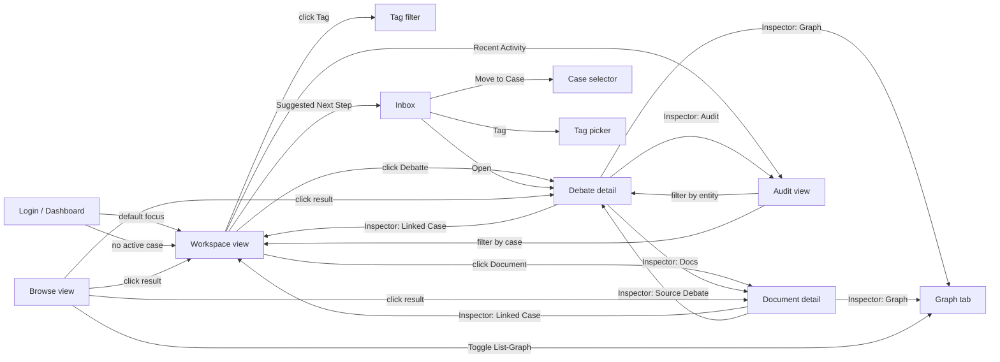
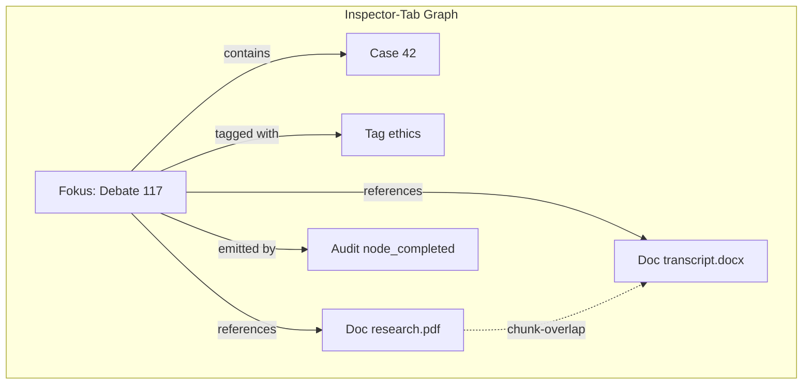

# UI-Konzept: Case-Space — ein kohärentes Arbeitsmodell

> Status: Alternativentwurf (ersetzt / ergänzt [`plans/2026-06-09_ui-concept.md`](2026-06-09_ui-concept.md))
> Autor: opencode | Datum: 2026-06-14
> Scope: Frontend-Architektur + UX, mit optionalem Knowledge-Graph (Anhang A)
> Voraussetzung: bestehende Datenmodelle `tenant`, `case`, `tag`, `document`, `debate`, `audit_event` bleiben unverändert

---

## 1. Diagnose: Warum das aktuelle UI fragmentiert wirkt

Das technische Datenmodell ist sauber, aber das UI erzählt dem Benutzer keine Geschichte. Die heutigen Views sind **Sammlungen gleichberechtigter Listen**, nicht **Schritte einer Aufgabe**:

- **Sechs separate Hauptseiten** (Tenants, Cases, Tags, Documents, Archive, Audit) — der Benutzer muss mentale Verknüpfungen herstellen, die im Datenmodell schon vorhanden sind
- **Kein Default-Kontext**: Beim Login landet der Benutzer auf einem leeren Dashboard, ohne Hinweis "du hast 3 offene Cases, 2 unverknüpfte Dokumente, 1 laufende Debatte"
- **Reihenfolge der Schritte ist dem Benutzer überlassen** — er kann eine Debatte anlegen, bevor ein Case existiert, Dokumente ins DMS laden, die zu keinem Case gehören, und Tags vergeben, die zu keinem Entity-Bezug passen
- **Audit Trail ist von Debate-IDs abhängig**, die der Benutzer aus dem Kopf kennen muss
- **Drag-and-Drop-Move nur via Archive-Umweg** — nicht offensichtlich
- **Sidebar ist technisch sortiert** (RUN, BUILD, CONFIG, ADMIN, EVOLVE), nicht workflow-orientiert

Das Problem ist also nicht "fehlende Views", sondern **fehlende Hierarchie und fehlende Orientierung**. Der bestehende Entwurf im Nachbarplan löst die Hierarchie (Baum-Explorer) richtig, lässt aber die **Orientierung** (Wizard / Kontext-Bootstrapping) und **die Rolle des DMS** weiterhin offen.

## 2. Leitprinzipien

1. **Der Case ist die Heimat**, nicht eine von vielen Entitäten. Alles, was ein Benutzer tut, hängt an *einem* Case — sichtbar oder implizit.
2. **Kontext vor Auswahl.** Beim Wechsel in eine beliebige View ist immer ein aktiver Case gesetzt (Tenant-Selector bleibt, Case-Selector wird Pflicht).
3. **Progressive Führung, kein Blockier-Wizard.** Der Benutzer darf jederzeit frei arbeiten; das System schlägt *kontextuell* die richtigen nächsten Schritte vor, erzwingt sie aber nicht.
4. **Dokumente sind Eingangsmaterial**, nicht Archiv. Der DMS-Pfad ist sichtbar in jeder Case-Ansicht; Dokumente ohne Case-Bezug sind eine *Aufgabe* (Inbox), kein Dauerzustand.
5. **Audit Trail ist Beweismittel, nicht Konfiguration.** Sichtbar in jeder Detail-Ansicht, nie versteckt.
6. **Beziehungen sichtbar machen, nicht erzwingen.** Der Knowledge Graph (Anhang A) erscheint nur dort, wo der Benutzer nach Verbindungen sucht, nicht in den aufgabenorientierten Hauptflächen.
7. **Technische Struktur bleibt erkennbar** für Power-User (Sidebar mit BUILD/ADMIN bleibt; alle bestehenden Views bleiben erreichbar).

## 3. Top-Level: Drei Sichten, nicht sechs

Statt sechs fragmentierter Hauptseiten gibt es genau **drei Einstiegspunkte**, plus die unverändert technische Sidebar:

| Sicht | Zweck | Wer sieht sie zuerst |
|-------|-------|----------------------|
| **Workspace** | Mein aktueller Arbeits-Case, mit allem darin | Default nach Login |
| **Inbox** | Unverknüpfte Dokumente, ungetaggte Entities, zugeteilte Aufgaben | Wer DMS-Daten einsammelt |
| **Browse** | Suche, Filter, Tag-Wolke, globale Übersicht; optional Graph-Modus | Wer explorieren will |

Die Detail-/Editor-Views (Debate, Blueprint, Module etc.) bleiben technische Spezialseiten — werden aber aus dem **Workspace** heraus aufgerufen, nicht aus einer eigenen Sidebar-Kategorie.

**Inspector und Browse bieten jeweils einen optionalen Graph-Modus** (siehe Anhang A): Workspace und Inbox bleiben graph-frei, weil dort Aufgaben im Vordergrund stehen. Ein Klick auf einen Graph-Knoten navigiert in den bestehenden Inspector, nicht in eine eigene Detail-Ansicht.

### 3.1 Layout

```
┌──────────────────────────────────────────────────────────────────────────┐
│ Header: Tenant ▾ │ Case ▾ │ 🔍 Global Search │ 🌐 DE │ 👤 user         │
├──────────┬───────────────────────────────────────────┬──────────────────┤
│ Sidebar  │                                           │ Inspector        │
│          │   Main Panel                              │                  │
│ 🏠 Work  │   (kontextspezifisch)                     │  Properties      │
│ 📥 Inbox │                                           │  Tags            │
│ 🔎 Brow. │                                           │  Linked          │
│          │                                           │  History         │
│ ── RUN ──│                                           │  Quick Actions   │
│ 💬 Deb.  │                                           │  [Graph-Tab]     │
│ 📄 Docs  │                                           │                  │
│ 🏷 Tags  │                                           │                  │
│ 📚 Arch. │                                           │                  │
│ ── BUILD │                                           │                  │
│ 🧩 Modls │                                           │                  │
│ ── CONF. │                                           │                  │
│ 📋 Audit │                                           │                  │
| ⚙️ Conf. |                                           |                  |
| ── ADMIN |                                           |                  |
| 👥 Users |                                           |                  |
| 🖥 Hlth  |                                           |                  |
└──────────┴───────────────────────────────────────────┴──────────────────┘
Statusbar: Case: AI-Ethik │ 12 Debatten │ 5 Docs │ 8 Tags │ Tenant: Acme
```

**Wesentliche Vereinfachung gegenüber dem Status quo**: Die Sidebar hat jetzt **drei prominente Einträge oben (Workspace/Inbox/Browse)**, danach die gewohnte technische Gliederung. Der Benutzer wird mit den drei neuen Konzepten begrüßt, findet aber seine alten Werkzeuge an gewohnter Stelle.

## 4. Der Workspace — Hauptansicht

Der Workspace ist die **Heimat** für einen ausgewählten Case. Hier versammelt sich alles, was zu diesem Case gehört: Debatten, Dokumente, Audit-Highlights, Tag-Vorschläge, beteiligte Personen.

### 4.1 Layout (Workspace-Ansicht)

```
┌─ Workspace · Case: „AI Ethics Research" ───────────────────────────────┐
│ Tags: [ethics] [research] [+ add] │ Status: ● active │ Members: 3       │
│ Description: Research on AI ethical frameworks...                       │
├──────────────────────────────────────────────────────────────────────────┤
│ ┌─ This Case ────────────────┐ ┌─ Suggested Next Steps ───────────────┐│
│ │ 📋 Debates (12)            │ │ ⚠ 2 documents are not yet linked    ││
│ │   Teaching AI...    done   │ │    [Open Inbox]                     ││
│ │   Climate Policy   run     │ │ ⚠ 1 debate has no tags              ││
│ │   [+ New Debate]           │ │ 🟡 Last audit event 4d ago          ││
│ │                            │ │    [Browse history]                 ││
│ │ 📄 Documents (5)           │ │                                     ││
│ │   research.pdf  indexed    │ │                                     ││
│ │   transcript.docx indexed  │ │                                     ││
│ │   [+ Upload Document]      │ │                                     ││
│ │                            │ │                                     ││
│ │ 🏷 Shared Tags (8)         │ │                                     ││
│ │   ethics, research, ...    │ │                                     ││
│ └────────────────────────────┘ └─────────────────────────────────────┘│
│ ┌─ Recent Activity ────────────────────────────────────────────────────┐│
│ │ 14:32  📋 "Teaching AI..." completed by moderator                    ││
│ │ 14:30  📄 research.pdf indexed                                      ││
│ │ 2d ago 👤 jane added tag "urgent" to "Climate Policy"               ││
│ └─────────────────────────────────────────────────────────────────────┘│
└──────────────────────────────────────────────────────────────────────────┘
```

**Drei Karten im Workspace:**
- **This Case**: Listen aller direkten Bestandteile (Debatten, Dokumente, Tags) mit Schnellaktionen
- **Suggested Next Steps**: kontextuelle Hinweise aus dem Inbox-System (unverknüpfte Docs, fehlende Tags, inaktive Audits)
- **Recent Activity**: chronologische Mischung aus Audit-Events, Tag-Änderungen, Uploads

### 4.2 Header-Konzept (Tenant- und Case-Selector)

Der Case-Selector wird **Pflicht**, der Tenant-Selector bleibt **optional** für Admins/Mehr-Mandanten-Setups:

- Klick auf "Case ▾" öffnet Such-Combobox mit Live-Filter (Typeahead)
- Leerer Zustand ist erlaubt: zeigt Hinweis "Select a case to focus your workspace" — aber Sidebar bleibt nutzbar
- URL spiegelt die Auswahl: `?tenant=acme&case=ai-ethics` (Deep-Linking, Lesezeichen)
- Beim Login: letzter aktiver Case wird automatisch wiederhergestellt (aus `user.last_workspace`)

## 5. Die Inbox — Aufgabe statt Dauerzustand

Die Inbox sammelt **alles, was noch keine Heimat hat**, und ist der einzige Ort, an dem "unverknüpft" ein eigener Status ist:

### 5.1 Inhalt

- **Unlinked Documents** — Dokumente im DMS ohne `case_id`
- **Untagged Debates** — Debatten, denen noch keine Tags zugeordnet sind
- **Recently Completed** — Debatten, die in den letzten 7 Tagen abgeschlossen wurden (zur Sichtung / Nachbereitung)
- **My Mentions** — Audit-Events, in denen der aktuelle Benutzer erwähnt wurde
- **Suggested Cases** — vom LLM vorgeschlagene Case-Zuordnungen für Dokumente (optional, kann in P3 entfallen)

### 5.2 Verhalten

- Inbox-Items sind **aufgabenorientiert**: jeder Eintrag hat 1–3 vorgeschlagene Aktionen (z. B. "Move to Case ▾", "Tag with ▾", "Open")
- Bulk-Aktionen: Mehrere Items markieren, gemeinsam taggen / verschieben / archivieren
- Inbox-Leerstand ist ein **Erfolg**: Badge "All clear" statt "0 items" (positive Verstärkung)
- Badge im Sidebar-Eintrag zeigt Anzahl der Inbox-Items (`Inbox (3)`)

## 6. Browse — globale Übersicht

Browse ist für Power-User und Reviewer, die mehrere Cases oder Entities vergleichen wollen:

- Tag-Wolke (Größe = Anzahl Verwendungen, Farbe = Entity-Typ)
- Filterleiste: Tenant × Case × Tag × Status × Zeitraum
- Ergebnislisten: Debatten, Dokumente, Audit-Events, jeweils mit Kontext-Spalte ("Case: …")
- **Toggle "List / Graph"** — wechselt zwischen klassischer Tabellenansicht und einem tenant-weiten Knowledge-Graph (siehe Anhang A)
- Speichern von Filter-Kombinationen als "Saved View" (z. B. "Eigene Reviews, Q2 2026")

**Wichtig:** Browse ist **kein Pflicht-Einstieg** mehr. Der Default-Workflow ist Workspace → Inbox → Detail, nicht Browse → Liste.

## 7. Onboarding — progressive Führung statt Wizard

Anstelle eines blockierenden Wizards, der den Benutzer durch fünf Formulare zwingt, läuft die Führung **kontextuell im Hintergrund**:

### 7.1 Erstbenutzer (Tenant = leer, keine Cases)

Beim allerersten Login mit neuem Tenant zeigt das Dashboard eine **Welcome-Card** mit drei Karten:

```
┌─ Welcome to Danwa ─────────────────────────────────────────────┐
│ To get started:                                                │
│                                                                 │
│ 1. Create your first Case                                      │
│    Cases group related debates and documents.                   │
│    [Create Case]                                                │
│                                                                 │
│ 2. Upload reference documents (optional)                        │
│    PDFs, DOCX, TXT — they'll be searchable via RAG.             │
│    [Upload Documents]                                           │
│                                                                 │
│ 3. Start your first debate                                      │
│    Combine agents to explore a question in depth.               │
│    [Start Debate]                                               │
│                                                                 │
│ You can do these in any order. The Inbox will keep track.       │
└─────────────────────────────────────────────────────────────────┘
```

Drei Klick-Pfade, klare Sprache, **kein Modal-Wizard**. Die Welcome-Card verschwindet, sobald das erste echte Element erstellt wurde.

### 7.2 Strukturelle Disambiguierung beim Anlegen einer Debatte

Wenn der Benutzer "New Debate" klickt, **ohne** einen Case aktiv zu haben:

```
┌─ Start a new debate ───────────────────────────────────────────┐
│ Where should this debate live?                                 │
│                                                                 │
│ ○ Existing case:  [▾ AI Ethics Research               ]        │
│ ○ New case:       [ Case name ____________ ]                    │
│   Tags: [ethics] [+]                                            │
│                                                                 │
│ Topic / question:                                              │
│ [____________________________________________________]         │
│                                                                 │
│ [Cancel]                                       [Start debate]  │
└─────────────────────────────────────────────────────────────────┘
```

Drei Effekte:
1. **Disambiguierung passiert dort, wo sie nötig ist** — nicht beim Anlegen eines leeren Cases
2. **Tags werden sofort mit-vergeben** (ein Klick), keine separate Tagging-Phase
3. **Default = bestehender Case**, falls vorhanden — also 0 Klicks für den typischen Fall

### 7.3 Dokumenten-Upload mit Case-Bezug

Upload-Form (im Workspace oder Inbox) verlangt einen **Case-Selector als Pflichtfeld**. Wenn der Benutzer "kein bestimmter Case" wählt, landet das Dokument in der **Inbox** (siehe 5.1) und wartet auf Zuordnung — es geht **nicht** verloren.

### 7.4 Audit-Trail-Sichtbarkeit

Audit Trail ist in **drei Kontexten sichtbar**, nicht nur in einer versteckten View:

1. **Im Inspector** jeder Entität (Debatte, Case, Dokument) — letzte 5 Events inline
2. **In der Sidebar** als Top-Level-Menüpunkt (bleibt für globale Suche)
3. **Im Workspace** unter "Recent Activity" — wichtige Events auf einen Blick

Es gibt **keine manuelle Debate-ID-Eingabe mehr**: Klick auf "Show full audit" im Inspector öffnet die globale AuditView mit vorausgewähltem Filter.

## 8. Detail-Views und Inspector-Pattern

Alle Detail-Ansichten folgen demselben Muster:

- **Header**: Name, Status-Badge, Pfad-Breadcrumb (Tenant › Case › Entity)
- **Tabs**: Inhalt, Tags, Verknüpfungen, Audit, Aktionen
- **Right Inspector** (klappbar): Properties, verknüpfte Entities, Quick Actions, **Graph-Tab** (1-Hop-Subgraph der aktuellen Entität, siehe Anhang A)
- **Inline Audit**: in den "Audit"-Tab eingebettet, mit Phase-Spalte (gemäß [`plans/audit-trail-ux-improvement.md`](audit-trail-ux-improvement.md))

Die bestehenden Detail-Views (DebateView, MvpDebateView, BlueprintCanvasView) bleiben als **Vollbild-Modi** erreichbar (z. B. "Open in full editor" Button), werden aber nicht mehr erzwungen.

## 9. Tags — kontextuelle Filter, nicht Top-Level-Entität

Tags werden in diesem Konzept **eine Eigenschaft von Cases und Debatten**, keine eigene Hauptseite:

- **Tag-Picker** ist Component (existiert bereits als [`TagPicker.svelte`](../../frontend/src/components/TagPicker.svelte)) — überall einsetzbar
- **Tag-Wolke** in der Browse-Sicht
- **Kein separater Tag-Manager** mehr als Hauptseite — stattdessen eine kompakte Tag-Verwaltung **innerhalb** des Workspace-Settings (z. B. als "Manage tags" Modal aus dem Header)
- **Tag-Vorschläge** beim Erstellen einer Debatte/Dokuments: zeige Top-3-Tags des aktuellen Cases als Buttons

## 10. Beziehung zwischen den drei Sichten (Mermaid)



**Lesehilfe**: Die Pfeile zeigen die *typischen* Benutzer-Pfade. Workspace ist der zentrale Knoten, von dem aus jede andere Sicht erreicht wird; die Pfeile führen immer *zurück* in den passenden Kontext. Der **Graph-Tab** (Inspector) und der **List-Graph-Toggle** (Browse) sind grau dargestellte alternative Pfade — sie sind optional und werden nur dort aktiv, wo der Benutzer nach Beziehungen sucht.

## 11. Datenmodell und API-Auswirkungen

Das Konzept ist **bewusst datensparend**. Folgende API-Erweiterungen sind nötig (oder als Feature-Flag aktivierbar):

| Endpoint | Zweck | Aufwand |
|----------|-------|---------|
| `GET /api/workspace/summary?case_id=…` | Workspace-Daten in einem Call (Debatten, Docs, Tags, Recent Activity) | Mittel |
| `GET /api/inbox?tenant_id=…` | Inbox-Items des aktuellen Benutzers | Mittel |
| `GET /api/cases/search?q=…` | Typeahead-Suche für Case-Selector | Niedrig |
| `PATCH /api/cases/{id}` (existiert) | Tag-Bulk-Update | — |
| `GET /api/debates/{id}/audit-context` | Phase, Round, formatierter Content (gemäß `plans/audit-trail-ux-improvement.md`) | — |
| `GET /api/graph/local?…` | 1-Hop-Subgraph für Inspector (Anhang A) | Mittel |
| `GET /api/graph/global?…` | Tenant-Subgraph für Browse (Anhang A) | Mittel |
| `GET /api/graph/edges?…` | Edge-Details (Anhang A) | Niedrig |

**Keine Schema-Migrationen erforderlich.** Das Datenmodell kann alles abbilden; das Konzept organisiert nur den Zugriff.

## 12. Migration vom Status quo

Die bestehenden Views (CasesView, DocumentsView, TagManagerView, etc.) bleiben **erhalten** und werden:
- in Phase 1 als Legacy-Links in der Sidebar erreichbar
- in Phase 2 schrittweise durch Workspace/Inbox-Konzepte ersetzt
- in Phase 3 nur noch als "Power-User" / "Admin"-Views verlinkt

Diese Strategie respektiert den Wunsch des Auftraggebers, die **technische Struktur nicht vollständig aufzugeben**.

## 13. Phasenplan

| Phase | Inhalt | Lieferform |
|-------|--------|------------|
| **P1** | Workspace-Hauptansicht (This Case + Suggested Next Steps), Tenant/Case-Header-Selector, URL-State, Deep-Linking | Funktionierende View + Inspector |
| **P2** | Inbox (Unlinked Docs, Untagged Debates), bulk Move/Tag | Vollständige Inbox mit Aktionen |
| **P3** | Welcome-Card für Erstbenutzer, kontextuelle Tag-Vorschläge, Inline-Audit im Inspector | UX-Feinschliff |
| **P4** | Browse-Refactor, Saved Views, Tag-Wolke, **Graph-Toggle (List/Graph)** | Power-User-Tools |
| **P5** | Migration der Legacy-Views (CasesView, TagManagerView) zu Detail-Komponenten, **Inspector-Graph-Tab** | Aufräumen |

Jede Phase liefert ein in sich geschlossenes, benutzbares Inkrement. P1+P2 decken 80 % des Benutzer-Schmerzes. **P4** und **P5** enthalten den Knowledge Graph bewusst als additiv-on-top-Schritt — er ist nicht Voraussetzung für die anderen Phasen.

## 14. Was bewusst NICHT Teil dieses Konzepts ist

- **Globale Knowledge-Graph-Hauptseite** — der Graph erscheint nur als Inspector-Tab und Browse-Toggle, nicht als vierte Hauptsicht (siehe Anhang A für die Begründung)
- **LLM-gestützte Case-Vorschläge für Dokumente** — kann optional in P3+P4 ergänzt werden, ist aber kein Kernbestandteil
- **Globale Refactorings** am Datenmodell oder an der Backend-API — die Architektur erlaubt die UI-Änderung ohne Backend-Breaking-Changes

## 15. Bezug zu bestehenden Plänen

| Bestehender Plan | Verhältnis |
|------------------|-----------|
| [`2026-06-09_ui-concept.md`](2026-06-09_ui-concept.md) | Überschneidung bei Explorer-Idee; **dieser Plan ersetzt den Detail-Panel-Ansatz** durch ein stärkeres Workspace-Konzept und ergänzt die Inbox, die im Original fehlt. Der Knowledge Graph aus dem Original wird hier als additiver Inspector-Tab/Browse-Toggle (Anhang A) statt als eigene Hauptseite umgesetzt |
| [`audit-trail-ux-improvement.md`](audit-trail-ux-improvement.md) | Wird übernommen (Phase, Round, formatierter Content) — der Audit Trail wird zusätzlich im Inspector und in Recent Activity sichtbar |
| [`phase5-workflow-observability-ux.md`](phase5-workflow-observability-ux.md) | Komplementär — die Phase-Snapshots landen in der ExecutionPanel und in der Detail-Ansicht einer Debatte |
| [`2026-05-28_ui-multi-user.md`](2026-05-28_ui-multi-user.md) | Member-Anzeige im Workspace-Header übernimmt die Idee "wer arbeitet mit" |

## 16. Erfolgskriterien

- Ein Benutzer kann **ohne Handbuch** eine Debatte anlegen, ihr Dokumente zuordnen, sie taggen und das Audit-Trail dazu sehen — in **höchstens 5 Klicks** vom Login
- Die Anzahl der Seiten, die ein typischer Benutzer pro Sitzung besucht, sinkt um **mindestens 30 %** (Messung via bestehendes Feedback-Store / Activity-Log)
- Die **Inbox ist regelmäßig leer** (gesunde Inbox-Quote > 80 % der Arbeitstage)
- **Kein Pflicht-Wizard** — Benutzer können das System auch ohne Führung benutzen, ohne Nachteile
- **Graph-Akzeptanz**: Mindestens 20 % der Power-User-Sessions nutzen den Inspector-Graph-Tab oder den Browse-Graph-Modus (gemessen via `feedbackStore.logActivity('graph_view', …)`)

---

## Anhang A: Knowledge Graph Integration

### A.1 Passung ins Case-Space-Modell

Der Knowledge Graph ist **kein konzeptioneller Bruch** mit dem Case-Space-Ansatz — er ist eine **optionale Visualisierungsschicht**, die genau dort eingeblendet wird, wo der Benutzer nach Beziehungen sucht (Inspector, Browse), und unsichtbar bleibt, wo er Aufgaben erledigt (Workspace, Inbox).

Drei Einbau-Punkte:

| Kontext | Rolle des Graphen | Wann sichtbar |
|---------|-------------------|---------------|
| **Inspector (Tab "Graph")** | 1–2-Hop-Subgraph der aktuell fokussierten Entität | Beim Klick auf den Tab — Default collapsed |
| **Browse (Toggle "List / Graph")** | Tenant-weiter Subgraph, zoombar, filterbar | Bei aktiver Toggle-Stellung "Graph" |
| **Workspace / Inbox** | — (kein Graph, aufgabenorientierte Hauptflächen) | nie |

### A.2 Graph-Daten (kein neues Datenmodell)

Das Backend hat die Beziehungen bereits — der Graph ist eine **Visualisierungsschicht**. Knotentypen: `Tenant`, `Case`, `Debate`, `Document`, `Tag`, `User`, `AuditEvent`. Kanten mit semantischen Labels:

- `Case → Debate` ("enthält")
- `Case → Document` ("verknüpft mit")
- `Case → Tag` ("getaggt mit")
- `Debate → Document` ("referenziert")
- `Document ↔ Document` ("zitiert" / "chunk-overlap" — abgeleitet aus RAG-Embeddings)
- `Debate → Tag` ("getaggt mit")
- `AuditEvent → Debate` ("emittiert von")
- `User → Debate/Case` ("bearbeitet" / "Mitglied von")

### A.3 Zwei Graph-Modi

- **Local Graph (Inspector-Tab)** — 1–2 Hops ab der ausgewählten Entität, kompakt, fixed radius, gedacht zur **schnellen Beziehungsprüfung**
- **Global Graph (Browse-Toggle)** — Tenant-weit, mit Filtern, zoombar, Layout-Wahl (radial / hierarchy / force), gedacht zur **Exploration und Suche verborgener Muster**

### A.4 API

| Endpoint | Zweck |
|----------|-------|
| `GET /api/graph/local?entity_type=…&entity_id=…&hops=1` | Inspector-Subgraph |
| `GET /api/graph/global?tenant_id=…&filters=…` | Browse-Subgraph |
| `GET /api/graph/edges?src=…&tgt=…` | Edge-Details (Score, Pfad, Begründung) |

Antwort-Format (vereinfacht):

```json
{
  "nodes": [
    {"id": "case:42", "type": "Case", "label": "AI Ethics Research", "meta": {"status": "active"}},
    {"id": "debate:117", "type": "Debate", "label": "Teaching AI Human Values"}
  ],
  "edges": [
    {"src": "case:42", "tgt": "debate:117", "type": "contains", "weight": 1.0}
  ]
}
```

### A.5 Komponenten

- `frontend/src/components/graph/GraphView.svelte` — generischer Renderer, pluggable Layout, Theming-konform
- `frontend/src/components/graph/GraphLegend.svelte` — Legende Knoten-/Kanten-Typen, in der Svelte-i18n-Locale verfügbar
- `frontend/src/components/graph/GraphNode.svelte` — einzelner Knoten (mit Icon je Typ, Badge für "neue Kante")
- `frontend/src/components/graph/GraphEdge.svelte` — Kante mit Hover-Tooltip ("enthält seit 2d")
- `frontend/src/lib/stores/graphStore.svelte.js` — Cache + Filter-State (Spiegelung des `phaseSnapshotsStore`-Patterns aus [`plans/phase5-workflow-observability-ux.md`](phase5-workflow-observability-ux.md))

**Wiederverwendung**: Klick auf einen Graph-Knoten ruft die gleiche Inspector-Logik wie der Workspace — keine eigene Detail-Ansicht. Die bestehende [`TagPicker.svelte`](../../frontend/src/components/TagPicker.svelte) und [`CaseNavigator.svelte`](../../frontend/src/components/CaseNavigator.svelte) werden als "Node → Inspector"-Brücke benutzt.

### A.6 Layout-Bibliothek

Empfehlung: **Cytoscape.js** + `cytoscape-dagre` (hierarchisch) + `cytoscape-cose-bilkent` (force-directed). Beide sind Vite-kompatibel und unterstützen Svelte-Wrapper-Patterns. Alternativen: D3 force layout (pur, leichter, mehr Eigenbau), vis-network (älter, schnelle Ergebnisse).

Performance-Grenze: **≤ 200 Knoten interaktiv** in Cytoscape. Für größere Subgraphen muss serverseitiges Pre-Clustering eingeführt werden (Phase P5+).

### A.7 Erweiterungs-Hooks für Folgephasen

- **Ableitete Kanten** (Document-Ähnlichkeit via Embedding-Distanz) — der *eigentliche* Mehrwert über das Case-Space-Konzept hinaus
- **Zeit-Slider**: Knoten erscheinen animiert, wenn Debatten entstehen
- **"Suggested Link"**: gestrichelte Kanten, die der Benutzer bestätigen kann (semantisches Crowdsourcing)
- **Export als PNG/SVG** für Reports und externe Kommunikation

### A.8 Risiken

- **Performance**: 100 Cases × 12 Debatten × 5 Docs = 6000 Knoten — harte Subgraph-Begrenzung + serverseitiges Pre-Clustering nötig
- **Onboarding-Dilemma**: Ein Graph ohne Erklärung ist ein Labyrinth; Inspector-Tab mildert es nur
- **Datenqualität**: Ungebundene Inbox-Items "schwimmen" im Graph → Inbox muss zuerst stehen
- **i18n**: Knoten-Labels sind i18n-pflichtig — neue Vokabular-Ebene

### A.9 Phasen-Einordnung

- **P1–P3 (Workspace / Inbox / Welcome)**: unverändert, **kein Graph**
- **P4 (Browse-Refactor)**: ergänzt um Graph-Toggle — *low risk*, weil Browse bereits Filter-basiert
- **P5 (Legacy-Migration)**: ergänzt um Inspector-Tab "Graph" — *low risk*, weil additiv

Beide Erweiterungen sind additiv und blockieren nichts Bestehendes.

### A.10 Lokaler Subgraph — Mermaid-Skizze



Inspector-Tab zeigt **eine** Entität in der Mitte und alle direkten 1-Hop-Beziehungen als Strahlen. `chunk-overlap` (gestrichelt) ist die abgeleitete Kante aus RAG-Embeddings. Browse-Toggle rendert denselben Subgraph-Typ, aber tenant-weit und ohne Center-Fokus.
