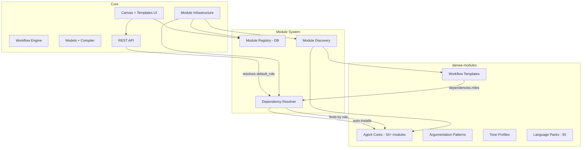

# Core vs Module Boundary — Architecture Plan

**Decision:** Option 2 — Dynamic role-based resolution. Agent cores remain in modules. Template defaults resolve by role at runtime. Modules will get a dependency resolver for auto-install. Workflow templates will eventually move to modules too.

## Problem

System templates in [`templates/*.json`](templates/) have `blueprint_ref` placeholders with `default` values hardcoded to module agent core IDs (e.g. `strategist-default-en`). If those modules aren't installed, instantiation fails with a 422 — the default ID is a dangling reference.

```
templates/*.json (core, seeded at startup)
    ↓ hardcoded default IDs
modules/agent-cores/* (optional, filesystem-discovered)
    → Dangling reference if module not installed
```

## Solution: Role-Based Default Resolution

### Step 1: Add `default_role` to TemplatePlaceholder

Templates specify a **role hint** instead of a hardcoded module ID:

**Before** (current):
```json
{
  "key": "strategist_blueprint_id",
  "type": "blueprint_ref",
  "default": "strategist-default-en",
  "description": "Agent Blueprint for the Strategist role"
}
```

**After** (proposed):
```json
{
  "key": "strategist_blueprint_id",
  "type": "blueprint_ref",
  "default_role": "strategist",
  "description": "Agent Blueprint for the Strategist role"
}
```

### Step 2: Resolution logic in instantiation

In [`workflow_templates.py`](backend/api/routers/workflow_templates.py:154):

1. If `body.placeholder_values` has an explicit value → use it
2. If placeholder has `default` (string) → use it (backward compat)
3. If placeholder has `default_role` (string) → resolve via `get_agent_personas_from_modules()` filtering by manifest `role` field, pick first match (preferring `default` tag)
4. If no resolution → return clear error: "No agent core found for role 'strategist'. Install a module providing this role."

### Step 3: Frontend dropdown enhancement

[`TemplateInstantiateModal.svelte`](frontend/src/components/blueprint/TemplateInstantiateModal.svelte:158):

- Pre-select the best-matching agent core for `default_role`
- If no agent core matches the role → show warning in dropdown: "No agent core for role 'strategist' — install one from Module Manager"
- Dropdown still shows ALL available blueprints (user can override)

## Module Dependency Resolver (Phase 2)

### Manifest dependency format

```json
{
  "module_id": "workflow-tpl-five-phase-debate",
  "type": "workflow-template",
  "dependencies": {
    "roles": [
      "analyst", "creative", "socratic-questioner",
      "strategist", "expert-reviewer", "steel-manner",
      "devils-advocate", "fact-checker", "troll",
      "mediator", "ethicist", "synthesizer",
      "moderator", "critic", "optimizer", "orchestrator"
    ]
  }
}
```

Dependencies reference **roles**, not module IDs. The resolver finds any installed module whose manifest `role` field matches.

### Resolver behavior

When installing a module via `ModuleService.install_from_repo()`:

1. Read `dependencies.roles` from manifest
2. For each role, check if an enabled module with that `role` exists
3. If missing → search repo index for modules tagged `"default"` with matching role
4. Auto-install default modules for missing roles
5. If no default available → warn: "Module X requires role 'troll' but no module providing it is installed"

## Implementation Plan

### Phase 1: Role-based defaults (immediate)

| Task | File |
|------|------|
| Add `default_role: str | None` field to `TemplatePlaceholder` | [`workflow_models.py`](backend/blueprints/workflow_models.py:380) |
| Update instantiation to resolve `default_role` dynamically | [`workflow_templates.py`](backend/api/routers/workflow_templates.py:191) |
| Update all 9 template JSON files: `default` → `default_role` | `templates/*.json` |
| Frontend: pre-select role match, show warning if none found | [`TemplateInstantiateModal.svelte`](frontend/src/components/blueprint/TemplateInstantiateModal.svelte:158) |

### Phase 2: Module dependency declarations (near-term)

| Task | File |
|------|------|
| Add `dependencies` field to `ModuleManifest` | [`models.py`](backend/modules/models.py:166) |
| Add dependency resolution to install flow | [`module_service.py`](backend/modules/service.py:275) |
| Update repo index generation to include dependency metadata | `danwa-modules/scripts/generate_index.py` |
| Update module manifests for workflow template modules | `danwa-modules/workflows/*/manifest.json` |

### Phase 3: Auto-install dependencies (medium-term)

| Task | File |
|------|------|
| Auto-install default agent cores when installing workflow template | [`module_service.py`](backend/modules/service.py) |
| Show dependency graph in Module Manager UI | [`ModuleManager.svelte`](frontend/src/components/ModuleManager.svelte) |
| Warn on uninstall if other modules depend on target | [`module_service.py`](backend/modules/service.py:501) |

### Phase 4: Templates as modules (future)

| Task | Description |
|------|-------------|
| Move `templates/*.json` to `danwa-modules/workflows/` | Templates become modules |
| Remove `scripts/seed_templates.py` | Seed from module system instead |
| Templates loaded via module discovery | Module infrastructure handles everything |
| Core contains only engine, models, and module infrastructure | Clean separation |

## Architecture Diagram


