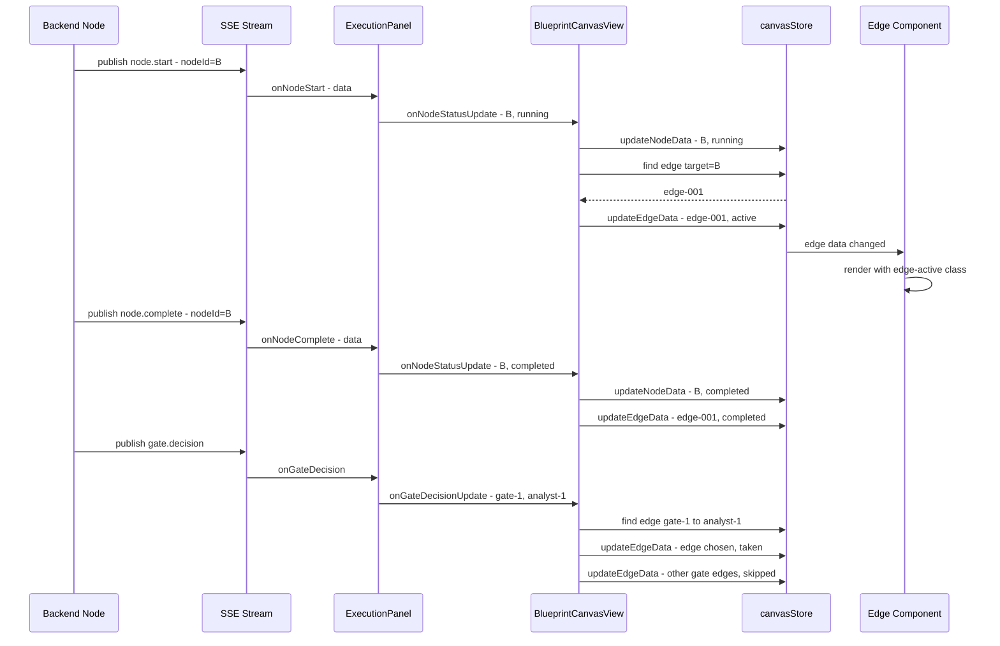

# Feature 3c: Edge Taken Highlighting in WorkflowPipeline

## Problem

During workflow execution, the canvas shows nodes updating their status (running/completed/failed) via the `executionStatus` data field, but edges remain visually static. Users cannot see which path the execution takes through the graph — especially critical at gate nodes where the branch decision determines the execution flow.

## Current Architecture

### SSE Events (already published by backend)
- `node.start` → `{node_id, node_type, role, round}`
- `node.complete` → `{node_id, node_type, role, round, content, duration_ms, status}`
- `gate.decision` → `{gate_node_id, condition, result, chosen_target, fallback_used, all_evaluations, round}`

### Data Flow (existing)
```
Backend node functions
  → publish_async(sessionId, "node.start", {...})
  → SSE stream
  → ExecutionPanel.svelte connectSSE()
  → onNodeStatusUpdate(nodeId, "running"|"completed"|"failed")
  → BlueprintCanvasView.svelte (currently only patches session status — does NOT update canvas)
```

### Gap
1. `onNodeStatusUpdate` in `BlueprintCanvasView.svelte` line 749 **ignores** the `status` param — only calls `patchActiveWorkflowSession()`. Canvas nodes never receive execution status.
2. No mechanism to highlight edges at all.
3. `canvasStore` has `updateNodeData()` but no `updateEdgeData()`.
4. Edge components (`SequentialEdge.svelte`, `ConditionalEdge.svelte`, etc.) use static CSS classes.

## Design

### Edge Execution States
| State | Visual | When |
|-------|--------|------|
| `idle` | Default styling | Before execution / no session |
| `active` | Blue animated dash-flow + glow | When the target node starts executing |
| `completed` | Green solid, slightly thicker | When the target node completes |
| `taken` | Emerald glow pulse | Gate decision: chosen branch |
| `skipped` | Gray, faded opacity 0.4 | Gate decision: branches not chosen |

### Data Flow (new)
```
ExecutionPanel SSE handler
  → onNodeStatusUpdate(nodeId, status)    [already exists, needs fixing]
  → onGateDecisionUpdate(gateNodeId, chosenTarget, allTargets)  [new]
  → BlueprintCanvasView handler
     → canvasStore.updateNodeData(nodeId, { executionStatus })     [fix wiring]
     → canvasStore.updateEdgeData(edgeId, { executionStatus })     [new method]
     → Find edges by source/target in canvasStore.edges
```

### Edge-to-State Mapping
- **node.start(nodeId=B)**: Find edge where `target === B`, set `executionStatus = 'active'`
- **node.complete(nodeId=B)**: Find edge where `target === B`, set `executionStatus = 'completed'`
- **gate.decision(gateNodeId=G, chosenTarget=T)**: Find edge `G→T`, set `executionStatus = 'taken'`. Find all other edges where `source === G`, set `executionStatus = 'skipped'`.

### Edge ID Convention
Edge IDs follow the pattern: `edge-${source}-${sourceHandle}-${target}-${targetHandle}-${edgeType}` (see `BlueprintCanvas.svelte` line 74). We match edges by source+target, not by ID, since the handle and type segments are implementation details.

## Implementation Steps

### 3c-1: Add `updateEdgeData()` to canvasStore
**File**: [`frontend/src/lib/blueprint/store.svelte.js`](frontend/src/lib/blueprint/store.svelte.js)

Add method analogous to `updateNodeData()`:
```js
updateEdgeData(edgeId, data) {
  this.edges = this.edges.map((e) =>
    e.id === edgeId ? { ...e, data: { ...e.data, ...data } } : e,
  );
}
```

Also add a bulk helper for resetting execution state:
```js
resetExecutionState() {
  this.nodes = this.nodes.map((n) => ({
    ...n,
    data: { ...n.data, executionStatus: undefined },
  }));
  this.edges = this.edges.map((e) => ({
    ...e,
    data: { ...e.data, executionStatus: undefined },
  }));
}
```

### 3c-2: Create `edgeStatus.js` helper
**New file**: [`frontend/src/lib/blueprint/edgeStatus.js`](frontend/src/lib/blueprint/edgeStatus.js)

```js
/**
 * Compute CSS class for edge execution status.
 * @param {object} data - Edge data object
 * @returns {string} CSS class name or empty string
 */
export function edgeStatusClass(data) {
  switch (data?.executionStatus) {
    case 'active': return 'edge-active';
    case 'completed': return 'edge-completed';
    case 'taken': return 'edge-taken';
    case 'skipped': return 'edge-skipped';
    default: return '';
  }
}
```

### 3c-3: Modify edge components
**Files**: All 8 edge components in [`frontend/src/components/blueprint/edges/`](frontend/src/components/blueprint/edges/)

Each edge component needs:
1. Import `edgeStatusClass` from the helper
2. Add reactive `statusClass` derived from `data`
3. Append `statusClass` to the `BaseEdge` class prop

Example for `SequentialEdge.svelte`:
```svelte
<script>
  import { BaseEdge, getBezierPath } from '@xyflow/svelte';
  import { edgeStatusClass } from '../../../lib/blueprint/edgeStatus.js';

  let { id, sourceX, sourceY, targetX, targetY, data = {} } = $props();
  let path = $derived(getBezierPath({ sourceX, sourceY, targetX, targetY })[0]);
  let statusClass = $derived(edgeStatusClass(data));
</script>

<BaseEdge {id} {path} class="blueprint-edge sequential-edge {statusClass}" />
```

Same pattern for: `ConditionalEdge`, `FeedbackEdge`, `InterjectionEdge`, `DecisionEdge`, `BuildsUponEdge`, `ValidatesEdge`, `InjectsConfigEdge`.

### 3c-4: Add shared edge execution CSS
**File**: [`frontend/src/components/blueprint/BlueprintCanvas.svelte`](frontend/src/components/blueprint/BlueprintCanvas.svelte)

Add global styles at the bottom:
```css
:global(.edge-active) {
  stroke: #3b82f6 !important;
  stroke-width: 3.5 !important;
  stroke-dasharray: 8 4 !important;
  animation: edge-flow-animation 1.5s linear infinite !important;
}
:global(.edge-completed) {
  stroke: #22c55e !important;
  stroke-width: 3 !important;
}
:global(.edge-taken) {
  stroke: #10b981 !important;
  stroke-width: 3.5 !important;
  animation: edge-glow 1.5s ease-in-out infinite !important;
}
:global(.edge-skipped) {
  stroke: #d1d5db !important;
  stroke-width: 1.5 !important;
  opacity: 0.4;
}

@keyframes edge-flow-animation {
  to { stroke-dashoffset: -24; }
}
@keyframes edge-glow {
  0%, 100% { filter: drop-shadow(0 0 2px #10b981); }
  50% { filter: drop-shadow(0 0 6px #10b981); }
}
```

### 3c-5: Fix `onNodeStatusUpdate` in BlueprintCanvasView
**File**: [`frontend/src/views/BlueprintCanvasView.svelte`](frontend/src/views/BlueprintCanvasView.svelte) (line 749)

Current (broken):
```js
onNodeStatusUpdate={(nodeId) => {
  patchActiveWorkflowSession('status', 'running');
}}
```

Fixed:
```js
onNodeStatusUpdate={(nodeId, status) => {
  // Update node visual state on canvas
  canvasStore.updateNodeData(nodeId, { executionStatus: status });
  // Highlight incoming edge
  const incomingEdge = canvasStore.edges.find((e) => e.target === nodeId);
  if (incomingEdge) {
    const edgeStatus = status === 'running' ? 'active' :
                       status === 'completed' ? 'completed' :
                       status === 'failed' ? 'completed' : undefined;
    if (edgeStatus) {
      canvasStore.updateEdgeData(incomingEdge.id, { executionStatus: edgeStatus });
    }
  }
  patchActiveWorkflowSession('status', 'running');
}}
```

### 3c-6: Add `onGateDecisionUpdate` callback
**File**: [`frontend/src/components/blueprint/ExecutionPanel.svelte`](frontend/src/components/blueprint/ExecutionPanel.svelte)

Add new prop:
```js
let { ..., onGateDecisionUpdate = () => {} } = $props();
```

In the `onGateDecision` SSE handler, add:
```js
onGateDecisionUpdate(data.gate_node_id, data.chosen_target);
```

**File**: [`frontend/src/views/BlueprintCanvasView.svelte`](frontend/src/views/BlueprintCanvasView.svelte)

Add prop to ExecutionPanel:
```js
onGateDecisionUpdate={(gateNodeId, chosenTarget) => {
  // Mark chosen edge as 'taken'
  const chosenEdge = canvasStore.edges.find(
    (e) => e.source === gateNodeId && e.target === chosenTarget
  );
  if (chosenEdge) {
    canvasStore.updateEdgeData(chosenEdge.id, { executionStatus: 'taken' });
  }
  // Mark other outgoing gate edges as 'skipped'
  for (const edge of canvasStore.edges) {
    if (edge.source === gateNodeId && edge.target !== chosenTarget) {
      canvasStore.updateEdgeData(edge.id, { executionStatus: 'skipped' });
    }
  }
}}
```

### 3c-7: Reset execution state on new session
**File**: [`frontend/src/components/blueprint/ExecutionPanel.svelte`](frontend/src/components/blueprint/ExecutionPanel.svelte)

Add new prop:
```js
let { ..., onExecutionReset = () => {} } = $props();
```

Call `onExecutionReset()` in `handleStart()` and when `initialSessionId` effect fires (line 162).

**File**: [`frontend/src/views/BlueprintCanvasView.svelte`](frontend/src/views/BlueprintCanvasView.svelte)

```js
onExecutionReset={() => canvasStore.resetExecutionState()}
```

## Architecture Diagram



## Files Modified

| File | Change |
|------|--------|
| `frontend/src/lib/blueprint/store.svelte.js` | Add `updateEdgeData()` + `resetExecutionState()` |
| `frontend/src/lib/blueprint/edgeStatus.js` | **New** — shared `edgeStatusClass()` helper |
| `frontend/src/components/blueprint/edges/SequentialEdge.svelte` | Dynamic execution status class |
| `frontend/src/components/blueprint/edges/ConditionalEdge.svelte` | Dynamic execution status class |
| `frontend/src/components/blueprint/edges/FeedbackEdge.svelte` | Dynamic execution status class |
| `frontend/src/components/blueprint/edges/InterjectionEdge.svelte` | Dynamic execution status class |
| `frontend/src/components/blueprint/edges/DecisionEdge.svelte` | Dynamic execution status class |
| `frontend/src/components/blueprint/edges/BuildsUponEdge.svelte` | Dynamic execution status class |
| `frontend/src/components/blueprint/edges/ValidatesEdge.svelte` | Dynamic execution status class |
| `frontend/src/components/blueprint/edges/InjectsConfigEdge.svelte` | Dynamic execution status class |
| `frontend/src/components/blueprint/BlueprintCanvas.svelte` | Add global edge execution CSS |
| `frontend/src/components/blueprint/ExecutionPanel.svelte` | Add `onGateDecisionUpdate` + `onExecutionReset` props |
| `frontend/src/views/BlueprintCanvasView.svelte` | Wire up edge status updates + reset |

## Risks

1. **Edge re-mapping on node.id mismatch**: The canvas node IDs (`node-001`) may not match the backend workflow node IDs used in SSE events. Need to verify the ID mapping is consistent between canvas layout and compiled workflow. If mismatched, a lookup table from workflow definition would be needed.

2. **Performance**: Updating edge data triggers SvelteFlow re-render. For 20+ edges this should be fine, but worth monitoring. The `$state` rune in canvasStore already handles this efficiently.

3. **CSS specificity**: Using `!important` on global styles to override per-component stroke colors. This is acceptable since execution state should always win over default styling.
