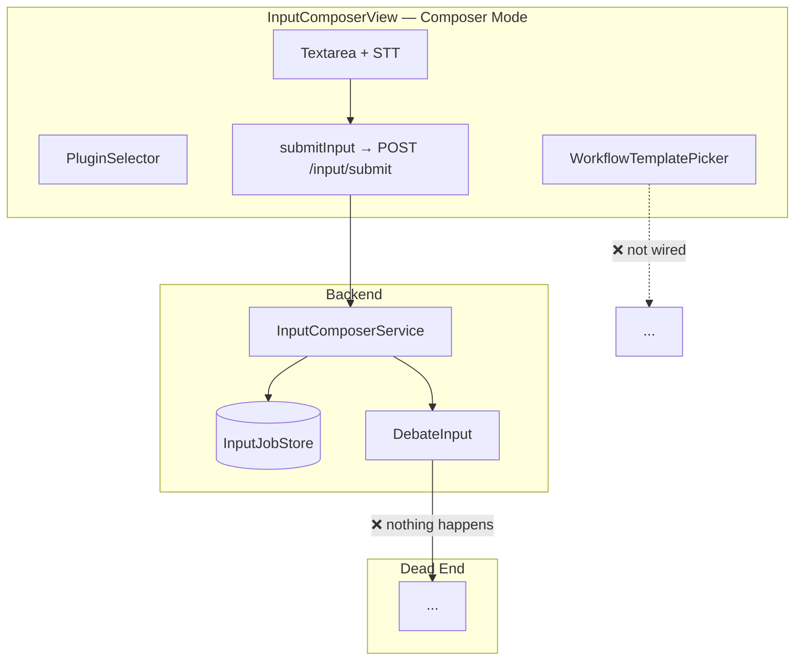
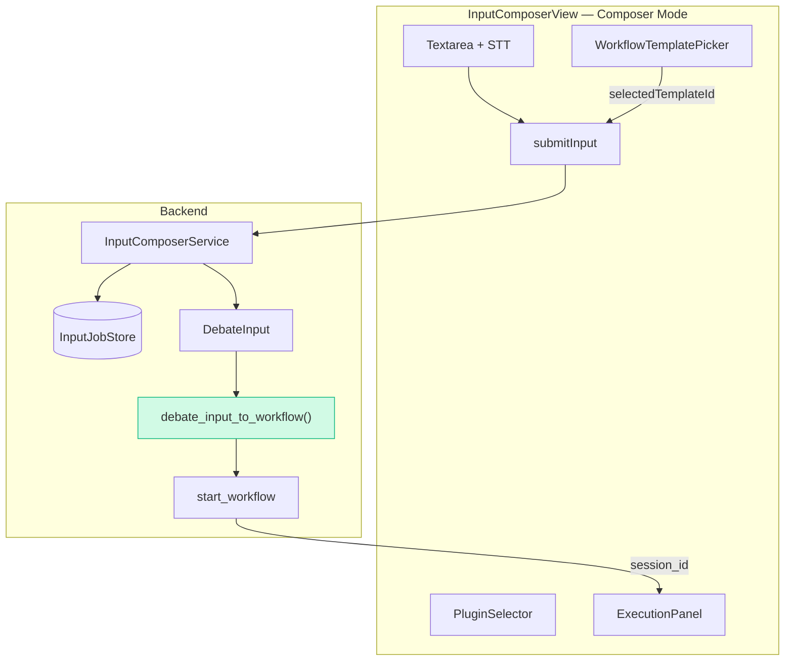
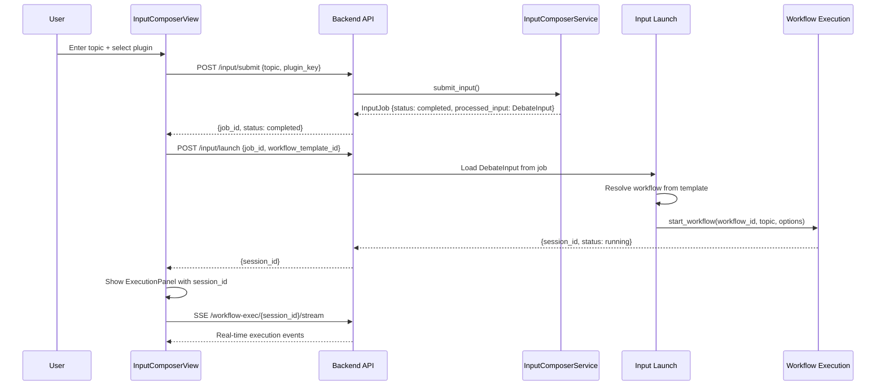

# Input Composer → Workflow Execution Bridge

## Problem

The Input Composer plugin architecture produces [`DebateInput`](backend/models/debate_input.py:31) artifacts
but has no code to start a workflow execution from them. The `InputComposerView` frontend has two modes:

- **Form mode** (`DebateCreatePanel`) — works via legacy `createDebate()` → `run_debate_workflow`
- **Composer mode** — submits input via `POST /input/submit` → `InputComposerService` → `DebateInput` → **dead end**

Additionally, the `WorkflowTemplatePicker` UI exists but is not wired to anything.

## Current State



### What Already Works

| Component | Status | File |
|-----------|--------|------|
| Input Composer Service | ✅ | [`input_engine.py`](backend/services/input/input_engine.py:25) |
| InputJobStore (SQLite) | ✅ | [`input_job_store.py`](backend/services/input/input_job_store.py:23) |
| DebateInput model | ✅ | [`debate_input.py`](backend/models/debate_input.py:31) |
| Standard Text plugin | ✅ | [`standard_text.py`](backend/services/input/plugins/standard_text.py:29) |
| STT plugin | ✅ | [`stt_plugin.py`](backend/services/input/plugins/stt_plugin.py) |
| A2A Inbound plugin | ✅ | [`a2a_inbound.py`](backend/services/input/plugins/a2a_inbound.py:33) |
| Workflow Execution API | ✅ | [`workflow_exec.py`](backend/api/routers/workflow_exec.py:138) `POST /{wf_id}/start` |
| PluginSelector UI | ✅ | [`PluginSelector.svelte`](frontend/src/components/input/PluginSelector.svelte:1) |
| STTMicrophoneButton | ✅ | [`STTMicrophoneButton.svelte`](frontend/src/components/input/STTMicrophoneButton.svelte:1) |
| WorkflowTemplatePicker | ✅ (UI only) | [`WorkflowTemplatePicker.svelte`](frontend/src/components/input/WorkflowTemplatePicker.svelte:1) |
| Input Job Tracker | ✅ | [`inputJobStore.js`](frontend/src/lib/input/inputJobStore.js:7) — polls `GET /input/jobs/{id}` |
| ExecutionPanel | ✅ | [`ExecutionPanel.svelte`](frontend/src/components/blueprint/ExecutionPanel.svelte:1) |

## Target Architecture



## Phases

### Phase 1: Backend — DebateInput → Workflow Bridge Service ✅ DONE

**Goal:** Create a service that takes a `DebateInput` + workflow template ID and starts a workflow execution.

**Status:** Implemented in [`POST /input/launch`](backend/api/routers/input_composer.py:360) endpoint.
Validates InputJob, resolves workflow, compiles via CompilerService, launches background task.

#### 1.1 New endpoint: `POST /api/v1/input/launch`

Add to [`backend/api/routers/input_composer.py`](backend/api/routers/input_composer.py:1):

```python
class LaunchWorkflowRequest(BaseModel):
    job_id: str  # InputJob ID (must be COMPLETED)
    workflow_template_id: str | None = None  # Optional: instantiate from template
    workflow_id: str | None = None  # Optional: use existing workflow definition
    max_rounds: int = 5
    consensus_threshold: float = 0.9
    language: str = "de"
    project_id: str = "default"
```

Flow:
1. Load `InputJob` from `InputJobStore`
2. Verify status is `COMPLETED` and `processed_input` (DebateInput) exists
3. Resolve `workflow_id`:
   - If `workflow_template_id` provided → instantiate template
   - If `workflow_id` provided → use directly
   - Otherwise → use the most recently created `WorkflowDefinition` (or first available)
4. Call `start_workflow()` logic with `DebateInput.topic` as context
5. Return `{ session_id, status }`

#### 1.2 Wire `InputComposerService` to auto-launch (optional)

After a `standard_text` job completes immediately, optionally auto-launch the workflow
if a `workflow_id` is provided in the request. This avoids the extra round-trip.

### Phase 2: Frontend — Wire InputComposerView to Workflow Execution ✅ DONE

**Goal:** After submitting input and getting a completed job, start the workflow and show the ExecutionPanel.

**Status:** Implemented. `InputComposerView.svelte` auto-launches after completed jobs,
polls for processing jobs, and mounts [`ExecutionPanel`](frontend/src/components/blueprint/ExecutionPanel.svelte:1).

#### 2.1 Wire `WorkflowTemplatePicker`

In [`InputComposerView.svelte`](frontend/src/views/InputComposerView.svelte:75):
- `selectedTemplateId` is already tracked
- When submitting, include the template ID in the request
- Or: resolve template → workflow_id before launching

#### 2.2 Add `launchWorkflow()` to [`inputApi.js`](frontend/src/lib/input/inputApi.js:1)

```js
export async function launchWorkflow(jobId, options = {}) {
  const res = await fetch(`${BASE}/input/launch`, {
    method: 'POST',
    headers: { 'Content-Type': 'application/json' },
    body: JSON.stringify({ job_id: jobId, ...options }),
  });
  if (!res.ok) throw new Error(`Launch failed: ${res.status}`);
  return res.json(); // { session_id, status }
}
```

#### 2.3 Modify `handleSubmit()` flow

Current flow:
```
submitInput() → activeJob → tracker (polls) → done
```

New flow:
```
submitInput() → activeJob
  if job.status === 'completed':
    launchWorkflow(job.id, { workflow_template_id, max_rounds, ... })
    → { session_id } → show ExecutionPanel
  if job.status === 'processing' || 'pending_approval':
    tracker (polls) → on complete → launchWorkflow → ExecutionPanel
```

#### 2.4 Mount ExecutionPanel

Add [`ExecutionPanel`](frontend/src/components/blueprint/ExecutionPanel.svelte:1) to `InputComposerView`:
```svelte
<ExecutionPanel
  sessionId={executionSessionId}
  visible={showExecutionPanel}
  onclose={() => { showExecutionPanel = false; }}
/>
```

### Phase 3: A2A Inbound — Pending Job Polling

**Goal:** Show pending A2A requests in the InputComposerView and allow approval/rejection.

#### 3.1 Backend: Add `GET /api/v1/input/jobs?status=pending_approval`

New endpoint to list jobs filtered by status. Currently only `GET /input/jobs/{job_id}` exists.

#### 3.2 Frontend: Poll for pending A2A jobs

In `InputComposerView`, when `inputMode === 'compose'`:
- Poll `GET /input/jobs?status=pending_approval` every 5 seconds
- Populate `pendingA2A` state → `A2AApprovalCard` renders
- On approve → `approveA2A(taskId)` → re-poll → if completed → `launchWorkflow()`

### Phase 4: Default Workflow Selection

**Goal:** When no template is selected, use a sensible default workflow.

#### 4.1 Backend: Add `GET /api/v1/blueprints/workflows/default`

Returns the first active `WorkflowDefinition`, or creates one from the default template.
This ensures the Input Composer always has a workflow to run.

#### 4.2 Frontend: Pre-select default workflow template

Load available workflow templates on mount (already done) and pre-select the first one
if none is explicitly chosen.

## Data Flow Summary


