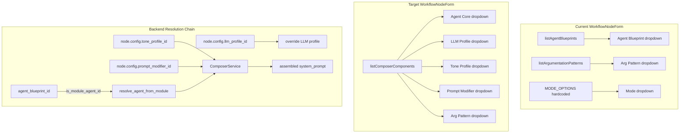
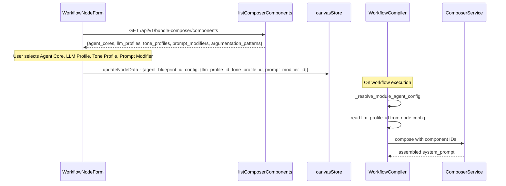

# Inspector Rewrite: Module Entities in WorkflowNodeForm

## Problem

After template instantiation, the Inspector panel's `WorkflowNodeForm` shows:
- **Agent Blueprint: -none-** — because it loads from DB blueprints only, not module agent-cores
- **Mode: hardcoded roles** — a legacy concept not part of the Danwa module architecture
- **Missing fields** — no LLM Profile, Tone Profile, or Prompt Modifier selectors

The canvas nodes already store `agent_blueprint_id` with module UUIDs (e.g. `ac-82a54c1a-...`), but the Inspector dropdown only lists DB `AgentBlueprint` records.

## Architecture Overview



## Data Flow



## Implementation Steps

### Step 1: Rewrite WorkflowNodeForm.svelte

**File**: `frontend/src/components/blueprint/forms/WorkflowNodeForm.svelte`

Changes:
1. Replace `listAgentBlueprints` import with `listComposerComponents`
2. Remove `MODE_OPTIONS` constant entirely
3. Remove `mode` state variable
4. Add state variables: `agentCoreId`, `llmProfileId`, `toneProfileId`, `promptModifierId`
5. Load components in `onMount` via `listComposerComponents()` — single API call returns all 5 categories
6. Add dropdowns for Agent Core, LLM Profile, Tone Profile, Prompt Modifier
7. Keep Argumentation Pattern dropdown (now sourced from components)
8. In `handleSave()`, persist:
   - `agent_blueprint_id` = selected agent-core ID (module UUID)
   - `config.llm_profile_id` = selected LLM profile ID
   - `config.tone_profile_id` = selected tone profile ID
   - `config.prompt_modifier_id` = selected prompt modifier ID
   - `config.argumentation_pattern` = selected pattern ID
   - Remove `mode` from saved data
9. In the `$effect` initializer, read existing values from `node.data.config` for pre-population

**Key design**: `agent_blueprint_id` stores the module agent-core UUID directly. The backend compiler already handles this via `is_module_agent_id()` → `resolve_agent_from_module()`.

### Step 2: Backend — Read composition IDs from node.config

**File**: `backend/workflow/workflow_compiler.py`

In `_resolve_module_agent_config()` (line 255):
1. After resolving the LLM profile (existing logic), also read `tone_profile_id` and `prompt_modifier_id` from `node.config`
2. Use `ComposerService.compose()` when any composition component ID is present in `node.config`
3. If a composed `system_prompt` is produced, use it instead of the module agent's default `system_prompt`
4. Store `tone_profile_id` and `prompt_modifier_id` in the `resolved_config` dict for downstream use

### Step 3: Backend — Use ComposerService in prompt assembly

**File**: `backend/workflow/node_functions.py`

In `_resolve_system_prompt()` (line 212):
1. Check `resolved_config` for composition component IDs (`agent_core_id`, `tone_profile_id`, `prompt_modifier_id`)
2. If composition IDs are present, use `ComposerService.compose()` as the primary prompt source
3. Fall back to existing PromptService pipeline if no composition IDs

### Step 4: Backend — Pass composition config through agent node factory

**File**: `backend/workflow/nodes/agent_nodes.py`

In `agent_node_factory()`:
1. Extract `tone_profile_id` and `prompt_modifier_id` from `resolved_config` (set by compiler)
2. Pass them to `_resolve_system_prompt()` via `resolved_config`

## Node Data Schema (after change)

```json
{
  "id": "analyst-1",
  "type": "wf-analyst",
  "label": "Analyst",
  "agent_blueprint_id": "ac-82a54c1a-cf1b-5d91-b7a8-bb198720f329",
  "config": {
    "llm_profile_id": "llm-27e9f4f7-7302-4d0b-8043-9b4edd8c882c",
    "tone_profile_id": "tp-a1b2c3d4-...",
    "prompt_modifier_id": "pm-e5f6g7h8-...",
    "argumentation_pattern": "pv-socratic-..."
  }
}
```

## Backward Compatibility

- **DB blueprints still work**: `WorkflowCompiler._resolve_agent_config()` tries DB lookup first, then falls back to module lookup
- **Existing workflows unaffected**: Nodes without composition IDs continue using the current PromptService pipeline
- **Mode field**: Nodes with `mode` set continue to work — the mode hint injection in `_resolve_system_prompt()` is preserved as fallback

## Files to Modify

| File | Change |
|------|--------|
| `frontend/src/components/blueprint/forms/WorkflowNodeForm.svelte` | Full rewrite — module entity dropdowns |
| `backend/workflow/workflow_compiler.py` | Read composition IDs from `node.config`, use ComposerService |
| `backend/workflow/node_functions.py` | Composition-aware prompt assembly |
| `backend/workflow/nodes/agent_nodes.py` | Pass composition config to prompt resolver |

## Verification

1. Open canvas with instantiated 5-phase debate template
2. Click an agent node → Inspector should show Agent Core, LLM Profile, Tone Profile, Prompt Modifier, Argumentation Pattern
3. Change an Agent Core → save → verify `agent_blueprint_id` updated
4. Change LLM Profile → save → verify `config.llm_profile_id` updated
5. Execute workflow → verify agents use the correct LLM and composed prompts
