# Phase 1 Implementation Details: Dual-Path Resolution

## Architecture Overview

```mermaid
flowchart TD
    subgraph Current - Broken
        A1[run_debate_workflow] -->|bundle_ids| B1[build_agent_profile_from_bundles]
        B1 -->|system_prompt in agent dict| C1[run_agent_node]
        C1 -->|IGNORES system_prompt| D1[_resolve_system_prompt]
        D1 -->|legacy path| E1[PromptService + Persona fallback]
    end

    subgraph After Phase 1
        A2[run_debate_workflow] -->|bundle_ids| B2[build_agent_profile_from_bundles]
        B2 -->|system_prompt in agent dict| C2[run_agent_node]
        C2 -->|checks agent.system_prompt first| F2{pre-resolved?}
        F2 -->|Yes - ComposerService output| G2[Use directly + append language/search]
        F2 -->|No| D2[_resolve_system_prompt]
        D2 --> H2{persona_id is module UUID?}
        H2 -->|Yes| I2[ComposerService.compose]
        H2 -->|No| J2[PromptService + Persona legacy]
    end
```



## Key Insight

When `bundle_ids` are provided, `build_agent_profile_from_bundles()` already resolves the system prompt via `BundleResolver` → `ComposerService.compose()` (Path C). The resolved prompt is stored in `agent["system_prompt"]`. But `run_agent_node()` ignores it and re-resolves via the legacy `_resolve_system_prompt()` path.

**The fix**: Check for pre-resolved prompts first, then fall through to legacy.

---

## P1.1 — Modify `run_agent_node()` in [`nodes.py`](backend/workflow/nodes.py:140)

### File: `backend/workflow/nodes.py`
### Location: Lines 232-243 (inside `run_agent_node()`)

**Current code:**
```python
# --- Resolve system prompt ---
project_dir = _get_project_dir(project_id)
system_prompt = _resolve_system_prompt(
    role,
    prompt_variant,
    persona_ids,
    state,
    language,
    search_mode,
    project_id=project_id,
    project_dir=project_dir,
)
```

**New code:**
```python
# --- Resolve system prompt ---
# Priority 0: Pre-resolved prompt from bundle resolution (ComposerService)
pre_resolved = agent.get("system_prompt")
if pre_resolved:
    logger.debug("Using bundle-resolved system_prompt for %s", role)
    system_prompt = _append_language_instruction(pre_resolved, language)
    system_prompt = _append_search_instruction(system_prompt, search_mode, language)
else:
    # Legacy path: PromptService template → Persona → Generic default
    project_dir = _get_project_dir(project_id)
    system_prompt = _resolve_system_prompt(
        role,
        prompt_variant,
        persona_ids,
        state,
        language,
        search_mode,
        project_id=project_id,
        project_dir=project_dir,
    )
```

### Also in `_resolve_system_prompt()` (lines 638-702) — add module-aware persona resolution

**Insert after step 1 (prompt service) and before step 2 (persona fallback), around line 675:**

```python
# 2. Try module-based agent core (if persona_id looks like a module ID)
if prompt is None:
    persona_id = persona_ids.get(role)
    if persona_id and _is_module_id(persona_id):
        try:
            from backend.services.composer_service import ComposerService, Composition
            composition = Composition(agent_core_id=persona_id)
            composed = ComposerService().compose(composition)
            if composed.strip():
                logger.debug("Using ComposerService for %s (module=%s)", role, persona_id)
                prompt = composed
                prompt = _append_language_instruction(prompt, language)
        except Exception as exc:
            logger.warning("ComposerService failed for %s (module=%s): %s", role, persona_id, exc)
```

**Add helper function near line 635:**
```python
def _is_module_id(value: str) -> bool:
    """Return True if value looks like a UUID module ID."""
    try:
        import uuid
        uuid.UUID(value)
        return True
    except (ValueError, AttributeError):
        return False
```

### Resulting `_resolve_system_prompt()` priority chain:
1. PromptService template (language-aware file-based prompts)
2. **NEW**: ComposerService via module ID (agent_core module)
3. Legacy persona system_prompt from ProfileService
4. Generic fallback

---

## P1.2 — Apply same changes to [`legacy_nodes.py`](backend/workflow/legacy_nodes.py:638)

### File: `backend/workflow/legacy_nodes.py`
Identical changes as P1.1 — same function, same lines. `legacy_nodes.py` is a copy of `nodes.py` for the legacy workflow graph.

---

## P1.3 — `run_debate_workflow()` already prefers bundles

### File: [`backend/services/debate_workflow.py`](backend/services/debate_workflow.py:331)

**No code change needed.** Lines 331-340 already check `fields.get("bundle_ids")` and override `agent_profile` with bundle-resolved configs. This already works correctly — the bundle-resolved profiles include `system_prompt`.

However, we should ensure that `bundle_ids` is also propagated into the initial state so `run_agent_node` can check for it:

**Add to initial_state (after line 351):**
```python
"bundle_ids": fields.get("bundle_ids", []),
```

This allows the node to know whether bundle resolution was used (for logging/debugging).

---

## P1.4 — Module-based `agent_persona_ids` resolution

This is already covered by the `_is_module_id()` check added in P1.1. When the frontend sends `agent_persona_ids: {"strategist": "uuid-of-agent-core-module"}`, the `_resolve_system_prompt()` function will detect the UUID and route to ComposerService.

**No additional code changes beyond P1.1.**

---

## P1.5-P1.7 — Tests

### Test scenarios:

1. **Bundle-only debate** (P1.6): Start debate with `bundle_ids: ["bundle-1"]`, no `agent_persona_ids`, no `prompt_variant`. Verify agents get system prompts from ComposerService.

2. **Legacy persona debate** (P1.7): Start debate with `agent_persona_ids: {"strategist": "persona-1"}`, no `bundle_ids`. Verify legacy PromptService path works.

3. **Module-based persona debate** (new): Start debate with `agent_persona_ids: {"strategist": "uuid-agent-core-id"}`, no `bundle_ids`. Verify ComposerService path is used.

4. **Fallback chain** (P1.5): Test that when PromptService template exists, it takes priority over ComposerService module.

---

## Files to Modify (Phase 1)

| File | Change | Risk |
|------|--------|------|
| `backend/workflow/nodes.py` | Add pre-resolved check + module-aware persona + `_is_module_id()` | Low — additive |
| `backend/workflow/legacy_nodes.py` | Same changes | Low — mirror of above |
| `backend/services/debate_workflow.py` | Add `bundle_ids` to initial_state | Trivial |
| `backend/workflow/state.py` | Add `bundle_ids: list[str]` to DebateState | Trivial |
| `tests/backend/test_dual_path_resolution.py` | New test file | N/A |

## Safety Guarantees

- **Backward compatible**: All existing debate flows work unchanged
- **Fallback chain preserved**: PromptService → ComposerService → Persona → Generic
- **No breaking changes**: Legacy types/APIs untouched in Phase 1
- **Existing tests should pass**: No behavior change for existing flows
