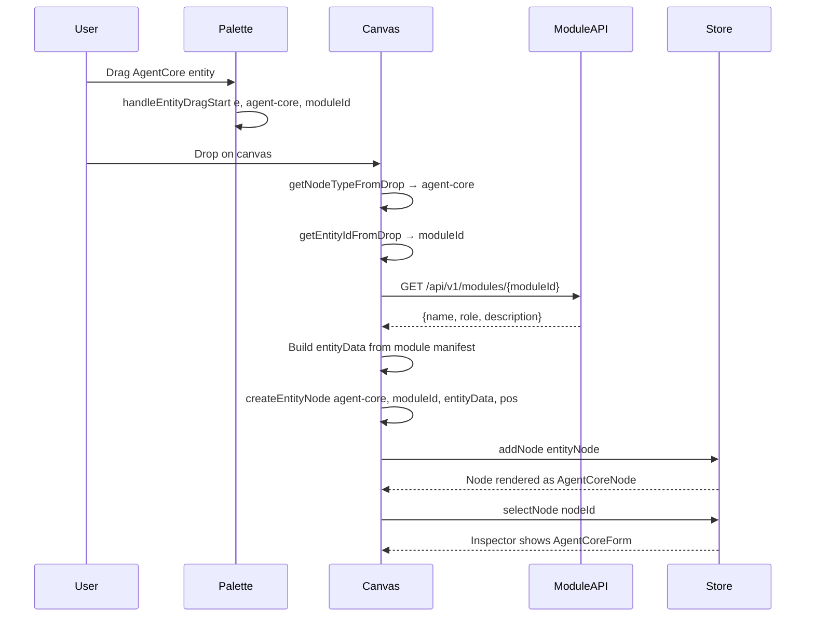
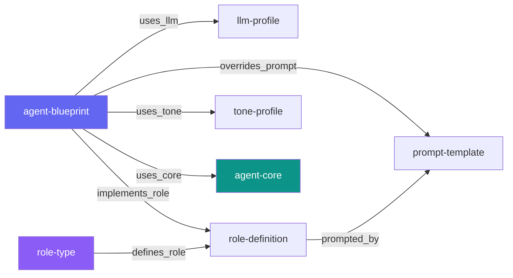

# P2.8–P2.10: Canvas Migration — Agent Core as First-Class Canvas Node

## Goal
Add `agent-core` modules as a new **asset node type** in the Blueprint Canvas, alongside the existing legacy types. Users can drag agent-core modules from the Palette, drop them onto the canvas, inspect them, and connect them to other nodes.

## Architecture Decisions

### Why agent-core as an asset node?
- **agent-core** modules provide the system prompt content — the most important piece of an agent's configuration
- In Blueprint Mode, the canvas visualizes agent **composition** (LLM + Role + Prompt + Tone)
- Agent-core modules are the module-based replacement for the legacy Persona/Prompt content
- Adding them as asset nodes lets users visually compose agents using the modern module system

### Node type: `agent-core` (asset category)
- Display: Module name, role badge, description
- Handles: LEFT (target) + RIGHT (source) — same pattern as `role-type`
- Connection: `agent-blueprint` → `agent-core` via new `uses_core` edge type
  - Meaning: "This agent blueprint uses this module-based core for its system prompt"

### Special handling: entity data comes from module API
- Unlike other asset nodes (LLM profiles, role definitions, etc.) which use the blueprint API, agent-core entity data comes from `/api/v1/modules/{id}`
- The `BlueprintCanvas.svelte` drop handler needs a new case in the switch
- The Palette loads agent-core modules via `getModules()` filtered by `category: 'agent-core'`

### Edit vs. View-only
- Agent-core modules are managed in the Modules view (ManageView → Modules tab)
- The Inspector form shows module details (read-only info) with a link to the Modules view
- No create/update/delete operations from the Canvas — modules are managed separately

---

## File-by-File Implementation

### P2.8: New AgentCoreNode + Registration

#### 1. NEW: `frontend/src/components/blueprint/nodes/AgentCoreNode.svelte`
Custom Svelte Flow node for agent-core modules.

**Visual design:**
- Icon: 🧬 (or the module's role-based icon from a lookup map)
- Header: "Agent Core" type label + module role badge
- Body: Module name, description (truncated)
- Color: Teal (#0d9488) — distinct from role-type violet, tone-profile amber
- Handles: LEFT target + RIGHT source (same as RoleTypeNode)

**Props:**
```js
let { data, selected = false } = $props();
let moduleName = $derived(data?.name || data?.module_name || 'Agent Core');
let moduleRole = $derived(data?.role || '');
let moduleDescription = $derived(data?.description || '');
let moduleId = $derived(data?.module_id || data?.blueprint_id || '');
let isDraft = $derived(!!data?.isDraft);
```

**Role icon lookup:**
```js
const ROLE_ICONS = {
  strategist: '🧠', critic: '🔍', optimizer: '⚡', moderator: '🎯',
  analyst: '📊', creative: '💡', 'fact-checker': '✅',
  'expert-reviewer': '🔬', mediator: '🤝', ethicist: '⚖️',
  synthesizer: '🔗', 'devils-advocate': '👿',
};
let nodeIcon = $derived(ROLE_ICONS[moduleRole] || '🧬');
```

#### 2. EDIT: `frontend/src/lib/blueprint/registerAll.js`
Register `agent-core` as a new asset node type.

**Add import:**
```js
import AgentCoreNode from '../../components/blueprint/nodes/AgentCoreNode.svelte';
```

**Add registration (after tone-profile, before workflow nodes):**
```js
registerNode({
  type: 'agent-core',
  component: AgentCoreNode,
  category: 'asset',
  schemaRef: null,   // Module — no blueprint schema
  icon: '🧬',
  labelKey: 'blueprint.palette.agentCore',
  defaultData: () => ({
    isDraft: true,
    module_id: null,
    name: '',
    role: '',
    description: '',
  }),
  active: true,
});
```

#### 3. NEW: `frontend/src/components/blueprint/edges/UsesCoreEdge.svelte`
Semantic edge for `agent-blueprint` → `agent-core` connections.

**Design:** Similar to existing semantic edges. Color: teal (#0d9488), solid style, label "Uses Core".

#### 4. EDIT: `frontend/src/lib/blueprint/registerAll.js`
Register the new edge type.

```js
import UsesCoreEdge from '../../components/blueprint/edges/UsesCoreEdge.svelte';

// In registerAllNodeTypes():
registerEdge({
  type: 'uses_core',
  component: UsesCoreEdge,
  category: 'semantic',
});
```

#### 5. EDIT: `frontend/src/lib/blueprint/dnd.js`
Add `agent-core` to `DEFAULT_NODE_DATA`:

```js
'agent-core': {
  name: 'Agent Core',
  module_id: null,
  role: '',
  description: '',
},
```

#### 6. EDIT: `frontend/src/lib/blueprint/layout.js`
Add `agent-core` to `NODE_DIMENSIONS`:

```js
'agent-core': { width: 200, height: 100 },
```

#### 7. EDIT: `frontend/src/lib/blueprint/store.svelte.js`
Add `'agent-core': 'agent-core'` to the `nodeTypeMap` in `loadFromLayout()` (line ~189-221).

---

### P2.9: Palette Integration

#### 8. EDIT: `frontend/src/components/blueprint/Palette.svelte`
Add agent-core modules to the Palette entity list.

**Add import:**
```js
import { getModules } from '../../lib/api/module.js';
```

**Add state:**
```js
let agentCores = $state([]);
```

**Update `loadEntities()`:**
Add `getModules()` call, filter by category `agent-core`:
```js
const [lp, rd, pt, ab, rt, tp, bundles, modules] = await Promise.all([
  listBlueprintLLMProfiles().catch(() => []),
  listRoleDefinitions().catch(() => []),
  listPromptTemplates().catch(() => []),
  listAgentBlueprints().catch(() => []),
  listRoleTypes().catch(() => []),
  listToneProfiles().catch(() => []),
  listAgentBundles().catch(() => []),
  getModules().catch(() => []),
]);
// ...
agentCores = (modules || []).filter(m => m.category === 'agent-core' && m.enabled !== false);
```

**Add PaletteEntityList in template:**
After the `agent-bundle` PaletteEntityList, before the workflow nodes section:
```svelte
<PaletteEntityList
  label={t('blueprint.palette.agentCores')}
  icon="🧬"
  nodeType="agent-core"
  entities={agentCores}
/>
```

#### 9. EDIT: `frontend/src/components/blueprint/BlueprintCanvas.svelte`
Add `agent-core` case to the entity drop handler switch statement (line ~181-203).

**Add import:**
```js
import { getModule } from '../../lib/api/module.js';
```

**Add case:**
```js
case 'agent-core':
  const moduleData = await getModule(entityId);
  entityData = {
    id: entityId,
    module_id: entityId,
    name: moduleData.name || moduleData.manifest?.name || '',
    role: moduleData.manifest?.role || '',
    description: moduleData.manifest?.description || '',
  };
  break;
```

Note: `getModule()` returns the full module info. We extract `name`, `role`, `description` from the manifest to match the node data shape.

#### 10. EDIT: `frontend/src/components/blueprint/PaletteEntityList.svelte`
Add metadata display for `agent-core` entities:

```svelte
{#if nodeType === 'agent-core' && entity.role}
  <span class="entity-meta">{entity.role}</span>
{/if}
```

---

### P2.10: Inspector Form + Validation

#### 11. NEW: `frontend/src/components/blueprint/forms/AgentCoreForm.svelte`
Inspector form for agent-core nodes — **read-only info panel** with module details.

**Sections:**
1. Header: 🧬 icon + "Agent Core" + draft badge
2. Module name (read-only)
3. Role badge (read-only)
4. Description (read-only, if present)
5. Module ID (monospace, small)
6. "Edit in Modules" link — navigates to ManageView → Modules tab
7. Delete button (removes from canvas only, does not uninstall module)

**Import:**
```js
import { canvasStore } from '../../../lib/blueprint/store.svelte.js';
import { getModule } from '../../../lib/api/module.js';
import { onMount } from 'svelte';

let { node, onsave, ondelete } = $props();
let moduleInfo = $state(null);
let loading = $state(false);
```

**On mount:** Fetch full module details via `getModule(moduleId)` for richer info (tags, version, etc.).

#### 12. EDIT: `frontend/src/components/blueprint/Inspector.svelte`
Add `agent-core` routing to the Inspector.

**Add import:**
```js
import AgentCoreForm from './forms/AgentCoreForm.svelte';
```

**Add routing (after the role-type block, before wf-tone-profile):**
```svelte
{:else if nodeType === 'agent-core'}
  <AgentCoreForm node={selectedNode} onsave={handleSave} ondelete={handleDelete} />
```

#### 13. EDIT: `frontend/src/lib/blueprint/validation.js`
Add connection rules for `agent-core`.

**Update `VALID_CONNECTIONS`:**
```js
'agent-blueprint': ['llm-profile', 'role-definition', 'prompt-template', 'tone-profile', 'agent-core'],
```

**Update `EDGE_TYPE_MAP`:**
```js
'agent-blueprint→agent-core': 'uses_core',
```

**Update `EDGE_STYLES`:**
```js
uses_core: { color: '#0d9488', style: 'solid', label: 'Uses Core' },
```

---

### i18n Keys

#### 14. Add i18n keys for the new node/form (backend translations or frontend locale files):
- `blueprint.palette.agentCore` — "Agent Core"
- `blueprint.palette.agentCores` — "Agent Cores"
- `blueprint.inspector.agentCore` — "Agent Core"
- `blueprint.edge.usesCore` — "Uses Core"

---

## Summary of All Changes

| # | File | Action | Purpose |
|---|------|--------|---------|
| 1 | `nodes/AgentCoreNode.svelte` | **NEW** | Canvas node component |
| 2 | `registerAll.js` | EDIT | Register node type |
| 3 | `edges/UsesCoreEdge.svelte` | **NEW** | Semantic edge component |
| 4 | `registerAll.js` | EDIT | Register edge type |
| 5 | `dnd.js` | EDIT | Default node data |
| 6 | `layout.js` | EDIT | Node dimensions for ELK |
| 7 | `store.svelte.js` | EDIT | nodeTypeMap for layout loading |
| 8 | `Palette.svelte` | EDIT | Load + display agent-core modules |
| 9 | `BlueprintCanvas.svelte` | EDIT | Handle entity drop for agent-core |
| 10 | `PaletteEntityList.svelte` | EDIT | Display role metadata |
| 11 | `forms/AgentCoreForm.svelte` | **NEW** | Inspector form (read-only) |
| 12 | `Inspector.svelte` | EDIT | Route to AgentCoreForm |
| 13 | `validation.js` | EDIT | Connection rules + edge styles |
| 14 | i18n | EDIT | New translation keys |

**Total: 3 new files, 8 edited files, 1 i18n update**

---

## Mermaid: Canvas Drop Flow



## Mermaid: Connection Rules



---

## Execution Order

1. Create `AgentCoreNode.svelte` + `UsesCoreEdge.svelte` (new components)
2. Register in `registerAll.js` (node + edge)
3. Add to `dnd.js`, `layout.js`, `store.svelte.js` (infrastructure)
4. Update `validation.js` (connection rules)
5. Update `Palette.svelte` + `PaletteEntityList.svelte` (load + display)
6. Update `BlueprintCanvas.svelte` (drop handler)
7. Create `AgentCoreForm.svelte` + update `Inspector.svelte` (inspector)
8. Add i18n keys
9. Test: drag-drop, connection, inspector, layout, save/load
