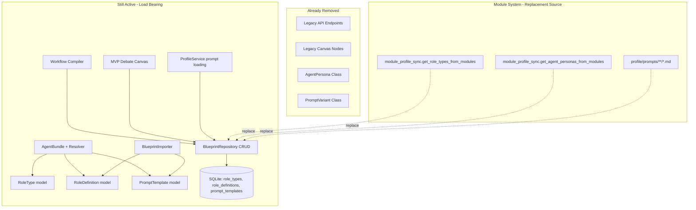

# Phase 3 Remaining: Implementation Details

## Context

Phases 1-3 (most of) are complete. The remaining items all share a common
root: **RoleType, RoleDefinition, and PromptTemplate** are still used by the
Bundle system, Workflow Compiler, MVP Debate Canvas, and ProfileService prompt
loading — but their API endpoints and Canvas UI have already been removed.

The key insight: these models are **not truly "legacy"** — they're load-bearing
internals. The correct strategy is to **keep the Pydantic models** but remove
the DB-backed CRUD infrastructure and YAML import layer, routing reads through
the module system instead.

## Dependency Map



## Remaining Items

### P3.3-P3.5: Keep models, remove repository CRUD and importer

**Strategy**: Keep `RoleType`, `RoleDefinition`, `PromptTemplate` Pydantic
models in `blueprints/models.py` — they're used by Bundle, Compiler, and
Workflow for type safety. Remove the CRUD repository methods and YAML importer.

**Step P3.3a: Remove `repo_roles.py` CRUD methods**
- Delete `backend/blueprints/repo_roles.py` entirely
- Remove `save_role_definition`, `get_role_definition`, `list_role_definitions`,
  `delete_role_definition`, `save_role_type`, `get_role_type`, `list_role_types`,
  `delete_role_type` from `BlueprintRepository`
- Impact: Workflow Compiler, MVP Canvas, Bundle Resolver, blueprint API

**Step P3.3b: Update Workflow Compiler to use module sources**
- `backend/workflow/workflow_compiler.py`: Replace `repo.get_role_type()` and
  `repo.get_role_definition()` with module-based lookups via
  `get_role_types_from_modules()` and `get_agent_personas_from_modules()`
- `backend/blueprints/compiler.py`: Same changes
- `backend/blueprints/resolver.py`: Replace `repo.get_role_type()`,
  `repo.get_role_definition()`, `repo.get_prompt_template()` with module lookups

**Step P3.3c: Update MVP Debate Canvas**
- `backend/blueprints/mvp_debate_canvas.py`: `_ensure_role_type()`,
  `_ensure_role_definition()`, `_ensure_prompt_template()` — remove or
  replace with no-op (these entities are no longer DB-managed)

**Step P3.4: Remove `repo_profiles.py` PromptTemplate CRUD**
- Keep `save_prompt_template`, `get_prompt_template`, `list_prompt_templates`
  in the repo for ProfileService prompt content cache (P3.12 handles removal)
- OR: If we remove ProfileService prompt loading too, delete all PromptTemplate
  repo methods

**Step P3.5: Remove BlueprintImporter**
- Delete `backend/blueprints/importer.py` entirely
- Remove `/api/v1/blueprints/import` endpoint from `blueprints.py`
- Remove `_yaml_to_role_definition`, `_save_role_definition`, `_md_to_prompt_template`,
  `_save_prompt_template`, `_role_definitions_equal` helpers

### P3.12: Replace PromptService with module-based prompt loading

**Current state**: PromptService loads prompts from:
1. `ProfileService.get_prompt_content()` (DB cache → filesystem)
2. Direct filesystem reads from `profiles/prompts/default/`

**Replacement**: Workflow nodes already have the ComposerService path (step 2
in `_resolve_system_prompt`). PromptService is the fallback (step 1).

**Step P3.12a: Route PromptService through modules**
- `backend/services/prompt_service.py`: Replace filesystem reads with
  module-based prompt loading from `profiles/prompts/**/*.md`
- Keep the same API (`render()`, `get_prompt()`, `assemble_prompt()`)
- Remove dependency on `ProfileService.get_prompt_content()` for DB cache

**Step P3.12b: Remove ProfileService prompt loading**
- Remove `_load_prompt_variants()`, `_load_prompt_variants_from_db()`,
  `_load_prompt_variants_from_yaml()`, `_seed_prompts_to_db()` from ProfileService
- Remove `_prompt_cache`, `_prompt_content_cache`
- Remove `get_prompt_content()` method
- ProfileService becomes LLM-profile-only service

**Step P3.12c: Remove PromptTemplate from ProfileService imports**
- Remove `from backend.blueprints.models import PromptTemplate` in
  `_seed_prompts_to_db`

### P3.13: Remove legacy DB tables

**Step P3.13a: Add migration V33**
- Add to `backend/blueprints/migrations.py`:
  ```sql
  DROP TABLE IF EXISTS prompt_templates;
  DROP TABLE IF EXISTS role_definitions;
  DROP TABLE IF EXISTS role_types;
  ```
- These tables are no longer read by any code after P3.3-P3.5 and P3.12

**Step P3.13b: Remove migration seed code**
- Remove V1 seed data for role_definitions/prompt_templates from migrations.py
- Keep the `CREATE TABLE IF NOT EXISTS` for backward-compatible upgrade path
  (tables get created then immediately dropped in V33)

### P3.18-P3.25: Remove legacy schema fields and seeds

**Step P3.18: Remove `AgentBundle` legacy FK references**
- `backend/blueprints/models.py`:
  - `AgentBundle.role_definition_id` → remove (was optional)
  - `AgentBundle.prompt_template_id` → remove (was optional)
  - Keep `role_type_id` (still used by module system)

**Step P3.19: Remove `AgentBlueprint` legacy FK references**
- `backend/blueprints/models.py`:
  - `AgentBlueprint.role_definition_id` → remove
  - `AgentBlueprint.prompt_template_id` → remove

**Step P3.20: Remove `persona_id` field**
- `backend/blueprints/models.py`: Remove `persona_id` from AgentBundle
- This was the legacy AgentPersona reference, now fully replaced

**Step P3.21: Update Bundle Resolver**
- `backend/blueprints/resolver.py`: Remove RoleDefinition/PromptTemplate
  resolution, use module-based role_type directly

**Step P3.22: Update Bundle I/O**
- `backend/blueprints/bundle_io.py`: Remove RoleDefinition/PromptTemplate
  serialization/deserialization from export/import

**Step P3.23: Remove `_seed_yaml_to_db` from ProfileService**
- Remove LLM profile YAML → DB seeding (one-time migration, already done)

**Step P3.24: Remove `blueprints/__init__.py` legacy exports**
- Remove `PromptTemplate`, `RoleDefinition`, `RoleType` from `__all__`

**Step P3.25: Clean up `models/schemas.py` legacy references**
- Remove `AgentRole` enum and docstring references to RoleType

### P3.26-P3.27: Tests and integration

**Step P3.26: Update existing tests**
- `tests/backend/test_dual_path_resolution.py`: Already updated
- Update any tests that reference RoleType/RoleDefinition/PromptTemplate

**Step P3.27: Final integration test**
- Run full test suite
- Verify frontend build
- Verify app startup with fresh DB
- Verify app startup with existing DB (migration path)

## Risk Assessment

| Item | Risk | Mitigation |
|------|------|-----------|
| P3.3a | HIGH | Workflow Compiler breaks if repo methods removed without replacement |
| P3.3b | MEDIUM | Module lookups may not have all data the repo had |
| P3.5 | LOW | Importer was only used by one endpoint (already removed) |
| P3.12 | MEDIUM | PromptService is critical for workflow execution |
| P3.13 | LOW | Tables can be dropped safely — no code reads them after P3.3-P3.5 |
| P3.18-P3.22 | MEDIUM | Bundle system changes need careful testing |

## Execution Order

1. **P3.3b + P3.3c** — Update compilers and MVP to use modules FIRST
2. **P3.3a** — Remove repo CRUD (now safe since nothing calls it)
3. **P3.5** — Remove importer
4. **P3.12** — Replace PromptService
5. **P3.4** — Remove PromptTemplate repo methods
6. **P3.13** — Drop DB tables
7. **P3.18-P3.25** — Schema field cleanup
8. **P3.26-P3.27** — Tests
