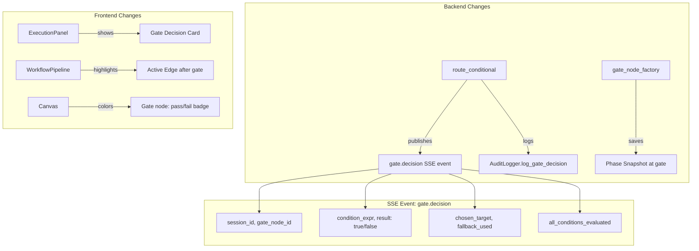

# Workflow Observability — Structured Gate Logging, State Checkpoints, Visual Trace

## Problem

The 5-phase debate workflow is structurally simple (linear pipeline with gates), but debugging failures requires manual log archaeology. When a gate evaluates `framing_complete → False` and loops 52 times, there's no structured record of the decision, no phase-level state comparison, and no visual indication of which path was taken.

## Current State

### What already exists:
- **SSE Events**: `publish_async(session_id, event_type, data)` — used by all node functions
- **Audit Logger**: `AuditLogger.log_node_execution()` — stores input/output per node in SQLite
- **State Snapshots**: `StateSnapshotStore.save()` — saves full state after each node execution
- **Frontend Pipeline**: `WorkflowPipeline.svelte` — renders nodes/edges with active/completed states
- **ExecutionPanel**: Shows `node.start`/`node.complete` events in real-time via SSE

### What's missing:
1. **Gate routing decisions** — `route_conditional()` evaluates conditions but only logs at Python `logger.info/warning` level. No SSE event, no audit record, no structured data.
2. **Phase-level state grouping** — Snapshots are per-node. No way to compare "state entering Phase 2" vs "state leaving Phase 2".
3. **Visual routing trace** — Frontend shows node status but not which edge a gate selected or why.

## Architecture



## Implementation

### Feature 1: Structured Gate Logging

**Backend: `workflow_routers.py` — `route_conditional()`**

Currently (line 51-73): evaluates conditions silently, logs only on failure/fallback.

Change: publish a `gate.decision` SSE event and write an audit log entry.

```python
# In route_conditional._router(state):
decisions = []
for target_node_id, expr in conditions.items():
    result = evaluate_condition(expr, dict(state))
    decisions.append({"condition": expr, "target": target_node_id, "result": result})
    if result:
        # Publish SSE: gate decided
        await publish_async(session_id, "gate.decision", {
            "gate_node_id": gate_node_id,  # NEW: pass to router
            "condition": expr,
            "result": True,
            "chosen_target": target_node_id,
            "all_evaluations": decisions,
            "fallback_used": False,
        })
        return target_node_id

# Fallback
await publish_async(session_id, "gate.decision", {
    "gate_node_id": gate_node_id,
    "condition": "(none matched)",
    "result": False,
    "chosen_target": fallback,
    "all_evaluations": decisions,
    "fallback_used": True,
})
return fallback
```

**Challenge**: `route_conditional()` is a pure function — it doesn't have `session_id` or `gate_node_id`. The factory needs to receive these.

**Solution**: Change the factory signature:

```python
def route_conditional(
    conditions: dict[str, str],
    gate_node_id: str = "",       # NEW
    session_id_key: str = "session_id",  # NEW
) -> Any:
```

The router function reads `session_id` from `state[session_id_key]`.

**Backend: `workflow_compiler.py` — pass gate_node_id to router**

In `_build_graph()`, when creating conditional edges for gate nodes, pass the gate's node_id:

```python
router = route_conditional(
    conditions=conditions,
    gate_node_id=source_node_id,  # NEW
)
```

**Backend: `audit_logger.py` — `log_gate_decision()`**

New method on `AuditLogger`:

```python
def log_gate_decision(
    self,
    session_id: str,
    workflow_id: str,
    workflow_version: int,
    gate_node_id: str,
    condition: str,
    result: bool,
    chosen_target: str,
    fallback_used: bool,
    all_evaluations: list[dict],
) -> None:
```

### Feature 2: State Checkpointing per Phase

**Concept**: Gate nodes are the natural phase boundaries. When a gate evaluates, save a labeled state snapshot tagged with the phase name.

**Backend: `workflow_runner.py` — checkpoint after each gate**

In the gate node output, add a `phase_label` field. The workflow runner (or a LangGraph callback) saves a phase-labeled snapshot.

**Simpler approach**: Enhance `gate_node_factory` in `moderator_nodes.py` to save a phase snapshot after evaluation:

```python
# In gate_node_factory._gate_node():
phase_label = node.config.get("phase_label", node_id)
snapshot_store.save(
    session_id=session_id,
    workflow_id=state.get("workflow_id", ""),
    node_id=f"phase:{node_id}",
    node_type="phase_checkpoint",
    round_number=current_round,
    state_dict=_serialize_state(dict(state)),
)
```

**Frontend**: The `TimelinePanel` already shows snapshots. Phase checkpoints will appear as named entries (e.g., "Phase: framing_complete") with the full state at that point.

**API**: Add a `GET /api/v1/workflow-exec/{session_id}/phase-snapshots` endpoint that returns only phase-level snapshots (filtered by `node_type="phase_checkpoint"`).

### Feature 3: Visual Trace (Frontend)

**3a: ExecutionPanel — Gate Decision Cards**

Currently `ExecutionPanel.svelte` renders `node.complete` events as generic cards. Add a new card type for `gate.decision`:

```svelte
{#if event.type === 'gate.decision'}
  <div class="gate-decision" class:passed={event.result} class:failed={!event.result}>
    <span class="gate-icon">{event.result ? '✅' : '❌'}</span>
    <span class="gate-condition">{event.condition}</span>
    <span class="gate-target">→ {event.chosen_target}</span>
    {#if event.fallback_used}
      <span class="gate-fallback">⚠️ fallback</span>
    {/if}
  </div>
{/if}
```

**3b: workflowSSE.js — Register gate.decision event**

Add `'gate.decision': 'onGateDecision'` to `eventHandlerMap` and `namedEvents` array.

**3c: ExecutionPanel — onGateDecision handler**

```javascript
onGateDecision: (data) => {
  gateDecisions = [...gateDecisions, {
    gateNodeId: data.gate_node_id,
    condition: data.condition,
    result: data.result,
    chosenTarget: data.chosen_target,
    fallbackUsed: data.fallback_used,
    allEvaluations: data.all_evaluations || [],
  }];
  onNodeStatusUpdate(data.gate_node_id, data.result ? 'completed' : 'failed');
},
```

**3d: WorkflowPipeline — Edge Highlighting**

The `WorkflowPipeline.svelte` already has `isEdgeActive()` which marks edges as active when their source is the current node. Extend to track the actual taken path:

```javascript
// Track the last gate decision's chosen target
let lastGateTarget = $state(null);

// Mark edge as "taken" if it matches the gate's chosen target
function isEdgeTaken(edge) {
  if (!lastGateTarget) return false;
  return edge.source === lastGateNodeId && edge.target === lastGateTarget;
}
```

Add a CSS class `.flow-edge.taken` with a distinct color (e.g., green highlight).

## Files to Modify

| File | Change |
|------|--------|
| `backend/workflow/workflow_routers.py` | `route_conditional()` — accept `gate_node_id`, publish `gate.decision` SSE |
| `backend/workflow/workflow_compiler.py` | Pass `gate_node_id` to `route_conditional()` factory |
| `backend/workflow/nodes/moderator_nodes.py` | `gate_node_factory` — save phase snapshot |
| `backend/workflow/audit_logger.py` | Add `log_gate_decision()` method |
| `frontend/src/lib/workflowSSE.js` | Register `gate.decision` event |
| `frontend/src/components/blueprint/ExecutionPanel.svelte` | Gate decision cards + handler |
| `frontend/src/components/workflow/WorkflowPipeline.svelte` | Edge "taken" highlighting |
| `frontend/src/components/workflow/pipeline/PipelineEdge.svelte` | `.taken` CSS class |

## New SSE Event Schema

```json
{
  "type": "gate.decision",
  "data": {
    "gate_node_id": "gate-1",
    "condition": "framing_complete",
    "result": true,
    "chosen_target": "strategist-1",
    "fallback_used": false,
    "all_evaluations": [
      {"condition": "framing_complete", "target": "strategist-1", "result": true}
    ],
    "round": 1,
    "session_id": "abc123"
  }
}
```

## Execution Order

1. **Feature 1** (Backend gate logging) — standalone, no frontend dependency
2. **Feature 2** (Phase snapshots) — standalone, uses existing snapshot infrastructure
3. **Feature 3** (Frontend visual trace) — depends on Feature 1's SSE event

## Verification

1. Execute 5-phase debate workflow
2. Check SSE stream for `gate.decision` events after each gate
3. Verify audit log contains gate decisions with condition + result
4. Check ExecutionPanel shows gate decision cards (pass/fail)
5. Verify TimelinePanel shows phase checkpoints
6. Verify pipeline edges highlight the actually taken path
