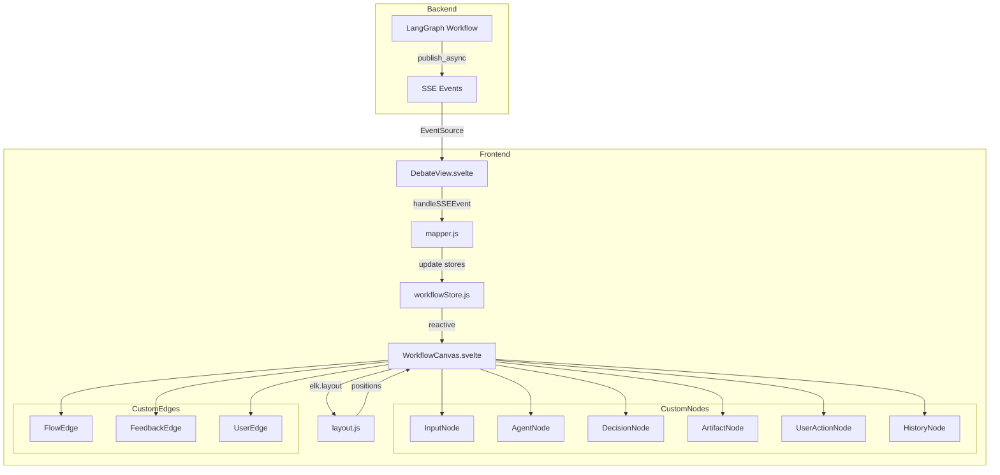
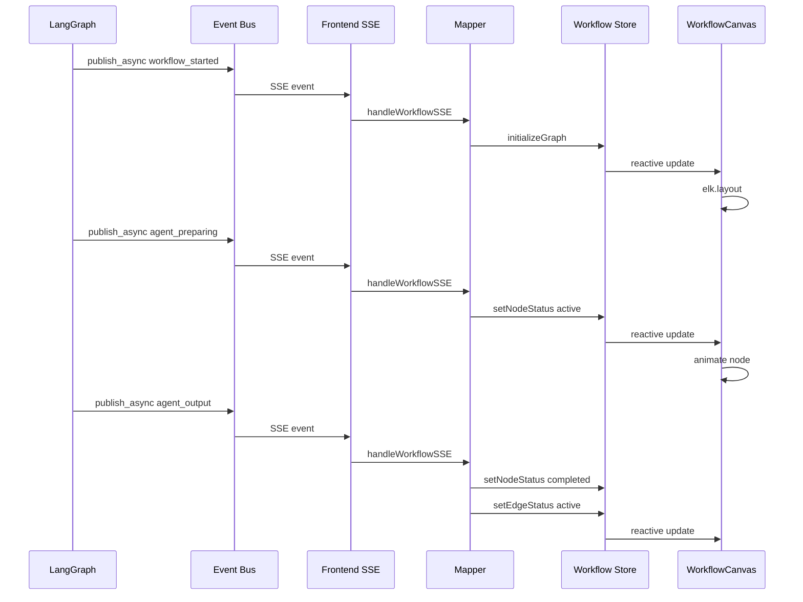
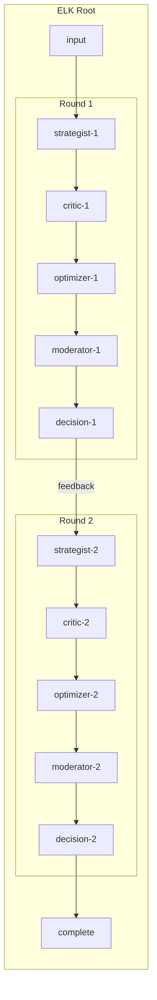

# Workflow Visualization — Implementation Plan

## Ziel

Interaktive, animierte Workflow-Visualisierung für laufende und abgeschlossene Debatten.
Zeigt den LangGraph-Workflow als gerichteten Graphen mit Echtzeit-Animation der Knoten- und Kanten-Zustände.

## Tech Stack

| Komponente | Technologie | Begründung |
|---|---|---|
| Graph-Renderer | `@xyflow/svelte` (Svelte Flow) | Svelte-Port von React Flow — konsistent mit bestehendem Svelte 4 Frontend |
| Layout-Engine | `elkjs` + `@xyflow/svelte` elk integration | ELK.js berechnet automatische Knotenpositionierung für nicht-lineare Workflows |
| State Management | Svelte Stores (existing) | Kein zustand nötig — Svelte Stores sind bereits das State-Management des Projekts |
| Animation | CSS Transitions + Svelte reactivity | Knoten/Kanten-Statuswechsel via CSS-Klassen, Svelte reaktiv aktualisiert den Graph |

## Bestehende Architektur — Ausgangspunkt

### LangGraph Workflow (backend/workflow/debate_graph.py)

```
initialize → run_agent ⟲ (next_agent / check_consensus)
                        → check_consensus ⟲ (next_round / complete)
                        → complete → END
```

### SSE Events (bereits vorhanden)

| Event | Daten | Trigger |
|---|---|---|
| `workflow_started` | `{type, message, debate_id}` | Workflow-Engine startet |
| `agent_preparing` | `{type, phase, role, round, agent_index, agent_total}` | Agent löst Profile/Prompts auf |
| `llm_call_started` | `{type, role, model, provider, round, agent_index, agent_total}` | LLM-API-Call beginnt |
| `agent_started` | `{role, round, profile, model, provider, agent_index, agent_total}` | Agent-Ausführung startet |
| `agent_output` | `{role, round, content, tokens, tokens_in, tokens_out, duration_ms, model, profile}` | Agent-Ausgabe fertig |
| `round_update` | `{round, consensus, total_tokens}` | Runde abgeschlossen |
| `web_search` | `{round, role, query, results}` | Web-Suche durchgeführt |
| `status_change` | `{status: completed|failed}` | Debatte beendet |

### Frontend-Architektur

- **Framework**: Svelte 4 + Vite + Tailwind CSS
- **Routing**: Hash-basiert in [`App.svelte`](frontend/src/App.svelte)
- **State**: Svelte Stores in [`stores.js`](frontend/src/lib/stores.js)
- **SSE**: [`sse.js`](frontend/src/lib/sse.js) — EventSource mit Reconnect
- **Aktuelle Workflow-Platzhalter**: [`WorkflowGraph.svelte`](frontend/src/components/WorkflowGraph.svelte) — nur Placeholder

## Graph-Datenmodell

### Knotentypen

| Typ | ID-Pattern | Beschreibung | Farbe |
|---|---|---|---|
| `input` | `input` | Eingabe-Knoten — Debatte-Text / Case | Blau |
| `agent` | `agent-{role}-{round}` | Agent-Ausführung (strategist, critic, optimizer, moderator) | Grün |
| `user_action` | `user-{action}` | Benutzer-Aktion (start, cancel) | Gelb |
| `decision` | `decision-{round}` | Konsens-Prüfung nach jeder Runde | Orange |
| `artifact` | `artifact-{round}` | Runden-Ergebnis / Draft | Lila |
| `history` | `history-{round}` | Abgeschlossene Runde (Timeline-Ansicht) | Grau |
| `round_container` | `round-{n}` | ELK-Container für Runde n (Gruppierung) | Transparent |

### Kantentypen

| Typ | Beschreibung | Style |
|---|---|---|
| `flow` | Normaler Workflow-Fluss | Durchgezogen, Pfeil |
| `feedback` | Konsens-Schleife — nächste Runde | Gestrichelt, Pfeil |
| `user_request` | Benutzer startet Debatte | Gestrichelt, blau |
| `user_response` | Benutzer antwortet (zukünftig) | Gestrichelt, gelb |
| `loopback` | Agent → Decision → nächster Agent | Gebogen, Pfeil |

### ELK.js Layout-Konfiguration

```javascript
const elkOptions = {
  'elk.algorithm': 'layered',
  'elk.direction': 'RIGHT',
  'elk.layered.spacing.nodeNodeBetweenLayers': '80',
  'elk.spacing.nodeNode': '40',
  'elk.layered.nodePlacement.strategy': 'BRANDES_KOEPF',
  'elk.layered.crossingMinimization.strategy': 'LAYER_SWEEP',
  'elk.partitioning.activate': 'true',  // für round_container
};
```

### ELK-Hierarchie

```
root
├── input-node
├── round-container-1
│   ├── agent-strategist-1
│   ├── agent-critic-1
│   ├── agent-optimizer-1
│   ├── agent-moderator-1
│   └── decision-1
├── round-container-2
│   ├── agent-strategist-2
│   ├── ...
│   └── decision-2
└── complete-node
```

## Nicht-lineare Workflow-Patterns

### 1. Agent → User (Blocking)

```
Agent schreibt → [Wartend auf User-Input] → User antwortet → Agent fährt fort
```

- Knoten `user_action` wird als "Wartend" dargestellt (pulsierend)
- Kante `user_request` zeigt vom Agent zum User-Knoten
- Kante `user_response` zeigt vom User-Knoten zum nächsten Agent

### 2. User → Agent (Out-of-Band)

```
User sendet Nachricht → Agent empfängt → Agent reagiert
```

- User-Knoten erscheint außerhalb des normalen Flusses
- Kante `user_request` verbindet mit dem aktiven Agent

### 3. Feedback Loops

```
Decision → [Konsens < Threshold] → nächster Agent → ... → Decision
```

- Kante `feedback` (gestrichelt) zeigt von Decision zurück zum ersten Agent der nächsten Runde
- Animation: Kante leuchtet auf wenn Schleife aktiv

### 4. Conditional Branching

```
Decision → [Konsens >= Threshold] → Complete
Decision → [Konsens < Threshold] → Next Round
```

- Decision-Knoten zeigt beide ausgehenden Kanten
- Aktive Kante wird hervorgehoben, inaktive ausgegraut

## State Management für Live-Animation

### Workflow Store (`frontend/src/lib/workflowStore.js`)

```javascript
import { writable, derived } from 'svelte/store';

// Knoten-Status: Map<nodeId, NodeState>
export const nodeStates = writable({});

// Kanten-Status: Map<edgeId, EdgeState>
export const edgeStates = writable({});

// Aktuelle Runde
export const currentRound = writable(0);

// Aktiver Agent
export const activeAgent = writable(null);

// Workflow-Phase
export const workflowPhase = writable(null);

// Abgeschlossene Outputs (für Timeline)
export const completedOutputs = writable([]);

// Abgeleitet: Svelte Flow kompatible Nodes
export const flowNodes = derived(
  [nodeStates, currentRound, activeAgent],
  ([$nodeStates, $currentRound, $activeAgent]) => {
    // Transformiere interne State zu Svelte Flow Nodes
    return Object.entries($nodeStates).map(([id, state]) => ({
      id,
      type: state.type,
      position: state.position || { x: 0, y: 0 },
      data: { ...state.data, status: state.status },
      className: getNodeClassName(state.status),
    }));
  }
);

// Abgeleitet: Svelte Flow kompatible Edges
export const flowEdges = derived(
  [edgeStates, activeAgent],
  ([$edgeStates, $activeAgent]) => {
    return Object.entries($edgeStates).map(([id, state]) => ({
      id,
      source: state.source,
      target: state.target,
      type: state.type || 'default',
      animated: state.status === 'active',
      className: getEdgeClassName(state.status),
    }));
  }
);
```

### Node-Status-Zustände

| Status | CSS-Klasse | Beschreibung |
|---|---|---|
| `idle` | `node-idle` | Noch nicht erreicht (grau) |
| `active` | `node-active` | Wird gerade ausgeführt (pulsierend, leuchtend) |
| `completed` | `node-completed` | Abgeschlossen (grün, Häkchen) |
| `error` | `node-error` | Fehler (rot) |
| `waiting` | `node-waitend` | Wartet auf Input (gelb, pulsierend) |

### Edge-Status-Zustände

| Status | CSS-Klasse | Beschreibung |
|---|---|---|
| `idle` | `edge-idle` | Noch nicht traversiert (grau) |
| `active` | `edge-active` | Gerade aktiv (animiert, leuchtend) |
| `completed` | `edge-completed` | Traversiert (grün) |

### SSE → Store Mapping

```javascript
function handleWorkflowSSE(event) {
  switch (event.type) {
    case 'workflow_started':
      // Setze alle Knoten auf idle, input auf active
      initializeGraph();
      break;

    case 'agent_preparing':
      // Setze Agent-Knoten auf active
      nodeStates.update(s => ({
        ...s,
        [`agent-${event.role}-${event.round}`]: {
          ...s[`agent-${event.role}-${event.round}`],
          status: 'active',
          data: { ...s[`agent-${event.role}-${event.round}`]?.data, phase: 'preparing' }
        }
      }));
      break;

    case 'llm_call_started':
      // Aktualisiere Agent-Phase auf 'llm_call'
      break;

    case 'agent_output':
      // Setze Agent-Knoten auf completed, aktiviere Kante zum nächsten
      // Speichere Output für Timeline
      break;

    case 'round_update':
      // Setze Decision-Knoten auf completed
      // Aktiviere Feedback-Kante wenn nächste Runde
      // Setze Artifact-Knoten für Runden-Ergebnis
      break;

    case 'status_change':
      // Setze complete-Knoten auf completed/error
      break;
  }
}
```

## Implementierungs-Schritte

### Phase 1: Dependencies & Projektstruktur

- [ ] 1.1: `@xyflow/svelte` und `elkjs` in `frontend/package.json` installieren
- [ ] 1.2: Verzeichnisstruktur erstellen:
  ```
  frontend/src/lib/workflow/
  ├── store.js          # Workflow State Store
  ├── layout.js         # ELK.js Layout-Engine
  ├── mapper.js         # SSE-Event → Graph-State Mapping
  └── types.js          # Shared Type-Konstanten
  frontend/src/components/workflow/
  ├── WorkflowCanvas.svelte      # Hauptkomponente — Svelte Flow Container
  ├── nodes/
  │   ├── InputNode.svelte       # Eingabe-Knoten
  │   ├── AgentNode.svelte       # Agent-Ausführung
  │   ├── DecisionNode.svelte    # Konsens-Prüfung
  │   ├── ArtifactNode.svelte    # Runden-Ergebnis
  │   ├── UserActionNode.svelte  # Benutzer-Aktion
  │   └── HistoryNode.svelte     # Abgeschlossene Runde
  ├── edges/
  │   ├── FlowEdge.svelte        # Normaler Fluss
  │   ├── FeedbackEdge.svelte    # Schleifen-Kante
  │   └── UserEdge.svelte        # Benutzer-Interaktion
  └── panels/
      ├── NodeDetailPanel.svelte # Detail-Ansicht bei Klick
      └── TimelinePanel.svelte   # Runden-Timeline
  ```

### Phase 2: Workflow State Store

- [ ] 2.1: [`workflowStore.js`](frontend/src/lib/workflow/store.js) erstellen — Svelte Stores für Knoten/Kanten-Status
- [ ] 2.2: [`mapper.js`](frontend/src/lib/workflow/mapper.js) erstellen — SSE-Event → Store-Update Mapping
- [ ] 2.3: [`types.js`](frontend/src/lib/workflow/types.js) erstellen — Konstanten für Knoten-/Kanten-Typen und Status

### Phase 3: ELK.js Layout-Engine

- [ ] 3.1: [`layout.js`](frontend/src/lib/workflow/layout.js) erstellen — ELK.js Wrapper
- [ ] 3.2: Graph-Hierarchie aufbauen (round_container als ELK-Parent-Nodes)
- [ ] 3.3: Layout-Berechnung mit `elk.layout()` — gibt Positionen zurück
- [ ] 3.4: Positionen in Svelte Flow Nodes übertragen

### Phase 4: Custom Nodes

- [ ] 4.1: [`InputNode.svelte`](frontend/src/components/workflow/nodes/InputNode.svelte) — Case-Text Eingabe
- [ ] 4.2: [`AgentNode.svelte`](frontend/src/components/workflow/nodes/AgentNode.svelte) — Agent mit Rolle, Profil, Status-Animation
- [ ] 4.3: [`DecisionNode.svelte`](frontend/src/components/workflow/nodes/DecisionNode.svelte) — Konsens-Score, Threshold-Indikator
- [ ] 4.4: [`ArtifactNode.svelte`](frontend/src/components/workflow/nodes/ArtifactNode.svelte) — Runden-Draft, Token-Zähler
- [ ] 4.5: [`UserActionNode.svelte`](frontend/src/components/workflow/nodes/UserActionNode.svelte) — Benutzer-Interaktion
- [ ] 4.6: [`HistoryNode.svelte`](frontend/src/components/workflow/nodes/HistoryNode.svelte) — Kompakte Darstellung abgeschlossener Runden

### Phase 5: Custom Edges

- [ ] 5.1: [`FlowEdge.svelte`](frontend/src/components/workflow/edges/FlowEdge.svelte) — Standard-Kante mit Animation
- [ ] 5.2: [`FeedbackEdge.svelte`](frontend/src/components/workflow/edges/FeedbackEdge.svelte) — Gestrichelte Schleifen-Kante
- [ ] 5.3: [`UserEdge.svelte`](frontend/src/components/workflow/edges/UserEdge.svelte) — Benutzer-Interaktions-Kante

### Phase 6: Hauptkomponente — WorkflowCanvas

- [ ] 6.1: [`WorkflowCanvas.svelte`](frontend/src/components/workflow/WorkflowCanvas.svelte) erstellen
  - Svelte Flow Container mit `@xyflow/svelte`
  - Custom Node/Edge Types registrieren
  - Store-Subscriptions für reaktive Updates
  - ELK-Layout bei Strukturänderung neu berechnen
  - FitView nach Layout-Berechnung
- [ ] 6.2: [`NodeDetailPanel.svelte`](frontend/src/components/workflow/panels/NodeDetailPanel.svelte) — Detail-Ansicht bei Knoten-Klick
- [ ] 6.3: [`TimelinePanel.svelte`](frontend/src/components/workflow/panels/TimelinePanel.svelte) — Runden-Timeline

### Phase 7: Integration in DebateView

- [ ] 7.1: [`WorkflowGraph.svelte`](frontend/src/components/WorkflowGraph.svelte) ersetzen — Wrapper um WorkflowCanvas
- [ ] 7.2: SSE-Event-Handler in [`DebateView.svelte`](frontend/src/views/DebateView.svelte) erweitern — Events an Workflow Store weiterleiten
- [ ] 7.3: Graph-Initialisierung bei Debate-Start (Knoten erstellen, Layout berechnen)
- [ ] 7.4: Graph-Reset bei neuem Debate-Start
- [ ] 7.5: Archiv-Modus — abgeschlossene Debate im read-only Modus anzeigen

### Phase 8: Styling & Animation

- [ ] 8.1: CSS-Animationen für Knoten-Status-Übergänge (idle → active → completed)
- [ ] 8.2: Kanten-Animation (animated dash für aktive Kanten)
- [ ] 8.3: Dark Mode Support (Tailwind dark: Klassen)
- [ ] 8.4: Responsive Layout — Mindestbreite, Zoom-Controls

### Phase 9: i18n

- [ ] 9.1: Neue i18n-Keys für Workflow-UI in [`en.js`](frontend/src/lib/i18n/loaders/en.js) und [`de.js`](frontend/src/lib/i18n/loaders/de.js)
- [ ] 9.2: Knoten-Beschriftungen, Status-Texte, Tooltips

### Phase 10: Testing

- [ ] 10.1: Unit-Tests für Workflow Store (Svelte Store Logic)
- [ ] 10.2: Unit-Tests für ELK Layout Engine
- [ ] 10.3: Unit-Tests für SSE → Store Mapper
- [ ] 10.4: E2E-Tests — Workflow-Graph sichtbar bei laufender Debate
- [ ] 10.5: Visual Regression Tests für Knoten-/Kanten-Rendering

## Mermaid: Komponenten-Architektur



## Mermaid: SSE-Event-Flow



## Mermaid: ELK-Hierarchie



## Performance-Überlegungen

- **ELK-Layout**: Nur bei Strukturänderung neu berechnen (neue Runde, neuer Agent), nicht bei Status-Updates
- **Svelte Reactivity**: Nur betroffene Knoten/Kanten aktualisieren, nicht gesamten Graph neu rendern
- **Debounce**: ELK-Layout-Berechnung debouncen wenn mehrere Events schnell hintereinander kommen
- **Virtualisierung**: Bei > 5 Runden: History-Nodes zu kompakten Timeline-Items zusammenfassen
- **requestAnimationFrame**: Animation-Updates über rAF schedulen

## Offene Fragen

- [ ] State-Management für Workflow-Engine — User liefert noch Details
- [ ] Soll der Graph auch für abgeschlossene Debatten im Archiv-Modus interaktiv sein (Zoom, Pan, Klick)?
- [ ] Maximale Rundenanzahl bevor Graph-Performance leidet?
- [ ] Soll der Graph exportierbar sein (PNG, SVG)?
