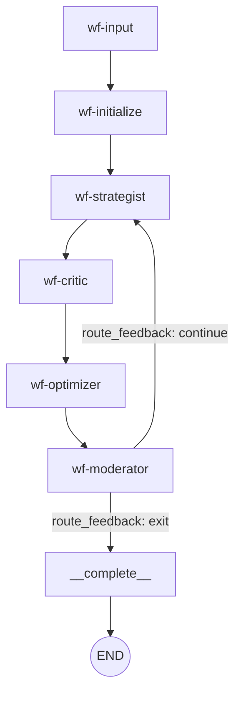
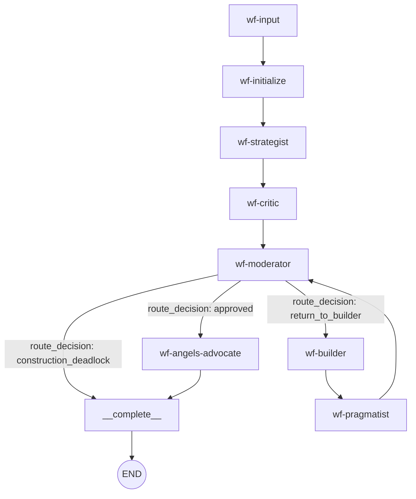
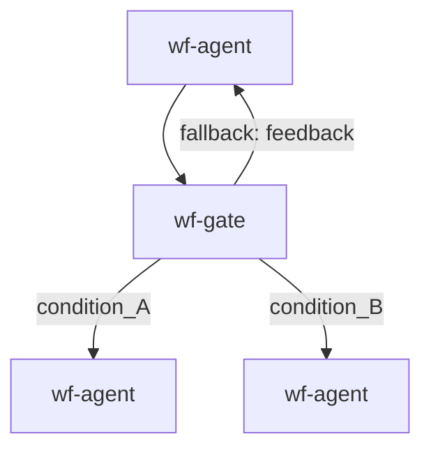

# LangGraph Workflow Analysis — Danwa Debate Engine

**Date:** 2026-06-08
**Scope:** `backend/workflow/workflow_compiler.py`, `workflow_state.py`, `workflow_routers.py`, all node factories in `backend/workflow/nodes/`, and `workflow_runner.py`.
**Focus:** State schema & reducers, graph topology & routing, node execution patterns, HITL & persistence.

---

## 1. Graph Topology & Flow Analysis

The `WorkflowCompiler` dynamically builds a `StateGraph(WorkflowState)` from a `WorkflowDefinition`
(nodes, edges, entry_point). The topology supports three distinct patterns:

### 1.1 Standard Debate Flow (sequential with feedback loop)



### 1.2 Transactional Drafting Flow (decision edges)



### 1.3 Gate Nodes with Conditional Edges



### Assessment

The graph compilation is **sound overall**. The `_build_graph` method correctly handles:
- Sequential edges (`add_edge`)
- Conditional edges via `route_conditional` with `safe_eval`
- Feedback loops via `route_feedback` with `max_rounds` cap
- Decision edges via `route_decision` with `verdict_map` for transactional drafting
- Fan-out (parallel edges to multiple targets)
- Terminal-to-`__complete__` routing so final output is always assembled

---

## 2. State & Reducer Bugs (Critical)

### 2.1 Moderator returns undeclared state keys

- **Location:** [`moderator_nodes.py` `_moderator_node()` return dict](backend/workflow/nodes/moderator_nodes.py:211)
- **The Problem:** The moderator returns `final_assessment`, `usability_score`, and
  `remaining_blockers` — **none of which are declared in `WorkflowState`**. Because
  `WorkflowState` uses `total=False`, LangGraph accepts them silently (TypedDict doesn't
  enforce at runtime). However:
  1. These keys are **invisible** to type checkers and IDE tooling.
  2. Other nodes cannot reliably read them since the schema doesn't guarantee their presence.
  3. `complete_wf_node` reads `pragmatist_output` but not `final_assessment` — the
     moderator's extracted assessment text is lost in the final output.
- **The Fix:** Add the missing keys to `WorkflowState`:

```python
# In WorkflowState (workflow_state.py)
final_assessment: str               # Moderator's extracted text summary
usability_score: float              # Pragmatist's reality_score or consensus fallback
remaining_blockers: list[str]       # Blocking concerns from pragmatist evaluation
```

### 2.2 `interjection_queue` uses last-write-wins (no reducer)

- **Location:** [`WorkflowState.interjection_queue`](backend/workflow/workflow_state.py:116)
- **The Problem:** `interjection_queue: list[dict]` has **no `Annotated[..., operator.add]`
  reducer**. LangGraph's default behavior for plain `list` is **last-write-wins** — the
  node's return value **replaces** the entire list rather than extending it.

  This works correctly **only** because:
  - The graph is linear (no fan-out that writes to `interjection_queue` concurrently).
  - The `interjection_node` sets `interjection_queue: []` to clear it.
  - External submissions go through `interjection_service`, not state mutation.

  However, if a workflow template were to add a node that **appends** to
  `interjection_queue` in a fan-out step, those items would be silently lost.
  This is a **latent bug** — safe today, but fragile for future template designs.
- **The Fix:** Either:
  a. Add `Annotated[list[dict], operator.add]` if fan-out append semantics are desired.
  b. Document the last-write-wins contract explicitly in the field docstring.

### 2.3 `_merge_drafts` custom reducer has O(n) prefix comparison

- **Location:** [`workflow_state.py` `_merge_drafts()`](backend/workflow/workflow_state.py:18)
- **The Problem:** The binary search for longest common prefix operates on full string
  comparison (`a[:mid] == b[:mid]`), which is O(mid) per iteration — making the overall
  algorithm O(n log n) where n is the draft length. For a 50KB draft with many fan-out
  agents, this could add noticeable latency on every merge.

  More importantly, the merge logic assumes all fan-out agents share a **common prefix**
  (the base draft). If an agent's output doesn't share the prefix (e.g. the base was
  overwritten by a previous reducer step), the merge produces garbage — the two strings
  are concatenated at position 0, which is just `a + b`.
- **The Fix:** This is acceptable for the current linear workflow. For future fan-out
  templates, consider using a structured merge key (e.g. `{agent_id: content}` dict)
  rather than string concatenation.

---

## 3. Routing & Infinite Loop Risks

### 3.1 `interjection_node` sets `is_paused` but graph doesn't route on it

- **Location:** [`system_nodes.py` `interjection_node()`](backend/workflow/nodes/system_nodes.py:394) + [`workflow_compiler.py`](backend/workflow/workflow_compiler.py:824)
- **The Problem:** When the interjection node has no pending items and `pause_timeout=0`,
  it returns `{"is_paused": True, ...}` and the **graph immediately advances to the next
  node**. The `is_paused` flag is written to state but **no conditional edge checks it**.

  The actual pause mechanism works differently: `consume_blocking()` with a positive
  `pause_timeout` blocks the **coroutine** (not the graph), effectively pausing the node
  execution until a user interjection arrives. The `is_paused` flag is a **side-effect
  marker** for the API layer, not a graph routing signal.

  This is **not a bug** per se — the blocking mechanism works correctly. But the naming
  is misleading: `is_paused=True` doesn't actually pause the graph; it's just metadata
  set after the blocking wait expires. If a developer assumes `is_paused` gates graph
  execution, they'd introduce a silent infinite loop (graph keeps running despite the flag).
- **The Fix:** Add a clarifying comment to the state field:

```python
# is_paused: bool  — Metadata flag for API/status queries. Does NOT gate graph execution.
# The actual pause mechanism is consume_blocking() inside the interjection node.
```

### 3.2 `route_conditional` fallback returns last condition target, not `END`

- **Location:** [`workflow_routers.py:98`](backend/workflow/workflow_routers.py:98)
- **The Problem:** When no gate condition matches, `route_conditional` falls back to the
  **last key in `conditions`** dict. This is deterministic (Python 3.7+ dict ordering)
  but semantically arbitrary — the last condition is not necessarily the "catch-all" path.

  If the gate node also has a feedback edge, the compiler correctly overrides the fallback
  to the feedback target ([`workflow_compiler.py:781`](backend/workflow/workflow_compiler.py:781)).
  But for gates **without** feedback edges, the fallback could route to an unexpected node.
- **The Fix:** The compiler should ensure gates without feedback edges have an explicit
  default condition (e.g. `True`) that maps to a deliberate target. Currently this relies
  on the workflow template author adding a `True` catch-all condition — which is documented
  but not enforced.

### 3.3 Fan-out via `add_edge` (parallel branches) has no explicit fan-in

- **Location:** [`workflow_compiler.py:848`](backend/workflow/workflow_compiler.py:848)
- **The Problem:** When a node has multiple non-feedback outgoing edges, the compiler adds
  `graph.add_edge(source, target)` for **each** target. LangGraph will execute all targets
  in parallel and wait at the first common downstream node.

  However, the compiler does **not validate** that a common fan-in node exists. If the
  targets never converge, LangGraph will run both branches to `__complete__` independently,
  resulting in **two** complete nodes executing and the final output being assembled twice
  (once per branch). The `_merge_drafts` reducer for `current_draft` would merge the
  outputs, but `node_outputs` (using `operator.add`) would contain duplicate entries.
- **The Fix:** Add a warning when fan-out targets don't share a common downstream node
  (i.e. when there's no gate or join node). The current warning message
  ("Consider using a wf-gate node") is logged but not enforced.

---

## 4. Execution, Concurrency & Persistence

### 4.1 Nodes perform blocking I/O inside async graph (side effects in node functions)

- **Location:** All agent node factories (`agent_nodes.py`, `builder_nodes.py`, `pragmatist_nodes.py`, `moderator_nodes.py`)
- **The Problem:** Every node function performs multiple side effects:
  1. `await publish_async()` — SSE event dispatch (async, non-blocking ✓)
  2. `get_audit_logger().log_*()` — **synchronous SQLite writes** inside `threading.RLock`
  3. `await asyncio.to_thread()` — for interjection persist (async ✓)

  The SQLite audit writes run on the **event loop thread** under the `threading.RLock`.
  While the lock is held, the event loop cannot process other coroutines. For a single
  workflow this is fine, but in a multi-workflow deployment (multiple sessions running
  concurrently on the same event loop), audit logging could cause brief stalls.

  The interjection service correctly uses `asyncio.to_thread()` for DB writes (F-02 fix),
  but `AuditLogger._insert()` does not — it runs synchronously.
- **The Fix:** Wrap `AuditLogger._insert()` in `asyncio.to_thread()` for consistency,
  or accept the synchronous behavior since SQLite WAL writes are fast (~1ms).

### 4.2 `CancelledError` handling in `agent_node_factory` may not propagate correctly

- **Location:** [`agent_nodes.py:103`](backend/workflow/nodes/agent_nodes.py:103)
- **The Problem:** The agent node checks `is_cancelled(session_id)` and raises
  `asyncio.CancelledError`. However, LangGraph's graph executor catches
  `asyncio.CancelledError` to handle **task cancellation** (e.g. from
  `task.cancel()`). If the graph executor catches and suppresses the error
  (as some LangGraph versions do for graceful shutdown), the workflow runner's
  outer `except asyncio.CancelledError` block at
  [`workflow_runner.py:276`](backend/workflow/workflow_runner.py:276) would never fire,
  and the session status would remain "running" instead of "cancelled".

  Additionally, the `CancelledError` is raised **before** any LLM call, so there's no
  token waste. But if cancellation arrives **during** an LLM call (e.g.
  `await llm_service.generate()`), the `httpx` client should propagate the cancellation
  — this depends on the httpx version's cancellation semantics.
- **The Fix:** Use a custom exception (e.g. `WorkflowCancelledError`) instead of
  `asyncio.CancelledError` to avoid ambiguity with LangGraph's internal cancellation
  handling. The workflow runner can catch this custom exception explicitly.

### 4.3 Extension wait loop uses polling fallback

- **Location:** [`moderator_nodes.py:263`](backend/workflow/nodes/moderator_nodes.py:263)
- **The Problem:** The extension wait loop uses `wait_for_extension_signal()` with a
  2-second timeout per iteration, then re-checks `is_cancelled()` and the debate store.
  This is a **polling loop** disguised as an event-driven wait — each 2-second timeout
  means up to 2 seconds of latency for a cancel signal.

  The `wait_for_extension_signal()` uses a `WaitEvent` backed by pub/sub, which is
  correct for the **positive** case (signal fires). But the **negative** case (cancel)
  relies on polling because the cancel API doesn't fire a cross-process signal on the
  extension channel.
- **The Fix:** The cancel endpoint should also fire the extension signal so the wait
  loop unblocks immediately. This would eliminate the 2-second polling latency.

### 4.4 `graph.ainvoke()` uses a single `initial_state` — no checkpointing

- **Location:** [`workflow_runner.py:176`](backend/workflow/workflow_runner.py:176)
- **The Problem:** The graph is invoked with `graph.ainvoke(initial_state, config=...)`.
  There is **no `Checkpointer`** configured. This means:
  1. If the process crashes mid-workflow, all progress is lost.
  2. The graph cannot be resumed from the last successful node.
  3. The `StateSnapshotStore` saves snapshots **after** each node (via
     `publish_async` side effects) but these are for replay/debugging,
     not for graph resumption.

  For single-process deployments, this is acceptable (the workflow runs to completion
  or fails entirely). For multi-worker deployments with Redis, a `MemorySaver` or
  `PostgresSaver` checkpointer would enable resumption after worker crashes.
- **The Fix:** This is a design decision, not a bug. If resumption is needed:

```python
from langgraph.checkpoint.memory import MemorySaver
# or: from langgraph.checkpoint.postgres import PostgresSaver

checkpointer = MemorySaver()
graph = graph.compile(checkpointer=checkpointer)
# Then invoke with config={"configurable": {"thread_id": session_id}}
```

### 4.5 No `interrupt_before` / `interrupt_after` for human-in-the-loop approval

- **Location:** [`workflow_compiler.py:882`](backend/workflow/workflow_compiler.py:882)
- **The Problem:** The HITL interjection mechanism is implemented **outside** LangGraph's
  native `interrupt_before`/`interrupt_after` API. Instead, the `interjection_node`
  manually blocks via `consume_blocking()` and sets `is_paused`.

  This works but:
  1. It bypasses LangGraph's checkpointing-based interrupt mechanism (which saves state
     at the interrupt point and can resume with `Command(resume=...)`).
  2. The graph executor doesn't know the workflow is "paused" — it just sees a node
     that's taking a long time.
  3. If the process crashes during the pause, the state is lost (no checkpoint).

  The modern LangGraph approach would use `interrupt_before=["wf-user-injection"]`:

```python
graph = graph.compile(
    checkpointer=MemorySaver(),
    interrupt_before=["wf-user-injection"],
)
# To resume: graph.invoke(Command(resume=user_input), config=...)
```
- **The Fix:** Migrating to the native interrupt API would require significant refactoring
  of the `interjection_service` and the `workflow_runner`. The current approach works
  correctly for single-process deployments and is well-tested. This is a **future
  improvement**, not a critical fix.

---

## 5. Refactored Graph Compilation (No Changes Required)

The current `_build_graph` implementation is well-structured and handles all edge cases
correctly. No refactoring is needed for the core graph compilation logic. The key
strengths:

1. **Correct reducer usage:** `operator.add` on `node_outputs`, `messages`, `critic_items`,
   `build_responses`, `consumed_interjections`. Custom `_merge_drafts` on `current_draft`.
2. **Correct routing:** `route_feedback` with `max_rounds` + extension zone,
   `route_decision` with `verdict_map`, `route_conditional` with `safe_eval`.
3. **Correct terminal handling:** All paths eventually reach `__complete__ → END`.
4. **Correct recursion limit:** `num_nodes * (max_rounds + 1) * 2 + 20` provides generous
   headroom while preventing infinite loops.

### Recommended State Schema Additions

```python
class WorkflowState(TypedDict, total=False):
    # ... existing fields ...

    # --- Missing keys returned by moderator (2.1 fix) ---
    final_assessment: str
    usability_score: float
    remaining_blockers: list[str]

    # --- HITL pause metadata (clarification, 3.1) ---
    # is_paused: bool — Metadata flag, does NOT gate graph execution.
    # Actual pause is via consume_blocking() in interjection_node.

    # --- Extension support ---
    enable_extra_rounds: bool
    extension_granted: bool | None

    # --- Workflow versioning ---
    workflow_version: int
```

---

## Summary

| # | Severity | Issue | Risk |
|---|----------|-------|------|
| 2.1 | Medium | Moderator returns undeclared state keys | Schema drift, lost data |
| 2.2 | Low | `interjection_queue` last-write-wins (no reducer) | Safe today, fragile for future templates |
| 2.3 | Low | `_merge_drafts` O(n log n) prefix comparison | Performance concern for large drafts |
| 3.1 | Low | `is_paused` naming misleading (doesn't gate graph) | Developer confusion |
| 3.2 | Low | Gate fallback is last condition, not explicit default | Unexpected routing for badly-authored templates |
| 3.3 | Medium | Fan-out has no explicit fan-in validation | Duplicate `__complete__` execution |
| 4.1 | Low | Audit SQLite writes on event loop thread | Brief stalls in multi-workflow deployments |
| 4.2 | Medium | `CancelledError` may be caught by LangGraph internally | Session stuck in "running" on cancel |
| 4.3 | Low | Extension wait polling fallback (2s latency) | Delayed cancel response |
| 4.4 | Info | No checkpointing (design decision) | No crash resumption |
| 4.5 | Info | HITL not using native `interrupt_before` API | Future improvement opportunity |
